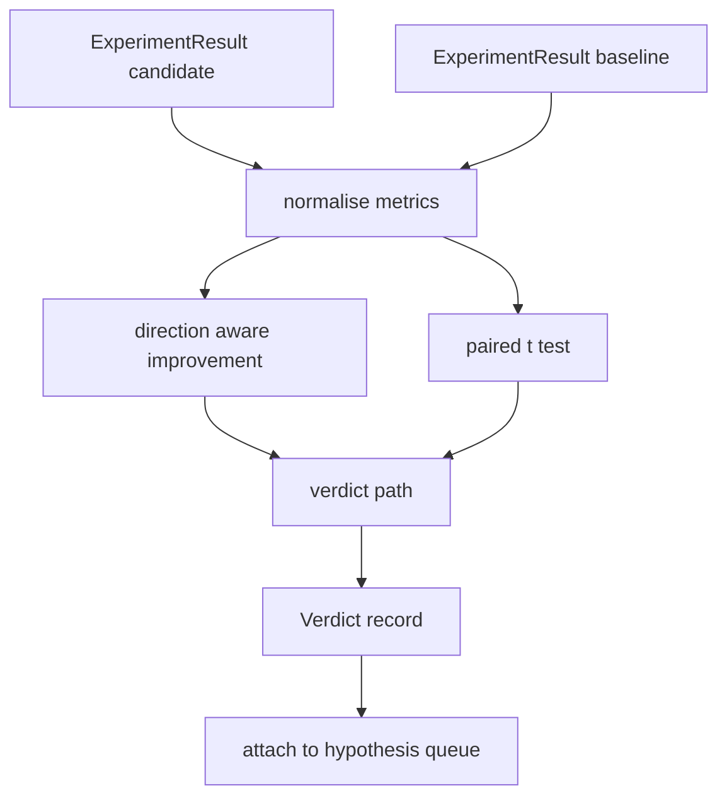

# Sonuç değerlendirici

> Koşucu sayı üretti. Değerlendirici bu sayıların bir gelişme, bir gerileme veya gürültü olup olmadığını belirler.

**Type:** Build
**Languages:** Python
**Prerequisites:** Phase 19 Track A lessons 20-29
**Time:** ~90 minutes

## Öğrenme Hedefleri
- Başvuruda belirlenen bir gelişme ve sabit bir eşiğin kullanılarak aday yarışını bir başlangıç çizgisi ile karşılaştırın.
- Tohum metrikleri başına t testi sıfırdan çalıştırın ve elde edilen p değerini okuyun.
- Kayıt ölçekli ölçümleri normalleştirin, böylece bir aşağı akıntı rapor onları doğrusal ölçülerle birleştirebilir.
- Orkestratörün 50 dersden sıraya bağlayabileceği bir hipotezi uygula.
- Her adımı saf tut, böylece aynı girişler her zaman aynı hüküm verir.

## Neden çift test

Koşucuya verilen tek bir sayı değişimin gerçek olup olmadığını söylemez. Aynı yapı farklı bir tohumla farklı bir karmaşıklık verir. Değişim gürültü olabilir. Doğru karşılaştırma eşleştirilmiştir: aynı tohumlar aynı verilerle, bir kez aday ile ve bir kez başlangıç çizgisi ile çalıştırılmıştır. Her tohum farklılık yaratır. Bu farklılıkların ortalaması da etkidir. Bu farklılıkların standart hatası gürültü zeminidir.

Ders sınavı sıfırdan uyguluyor.`scipy.stats`Matematik bir ekranda okuyacak kadar küçük.

```text
diffs    = [a_i - b_i for i in seeds]
mean     = sum(diffs) / n
variance = sum((d - mean) ** 2 for d in diffs) / (n - 1)
t_stat   = mean / sqrt(variance / n)
df       = n - 1
p_value  = two_sided_p(t_stat, df)
```

İki taraflı p değeri düzenli olmayan bir beta işlevi kullanır. Ders Lentz devamlı bölümü kullanan küçük bir uygulamayı gönderir. Tüm şey stdlib matematikinin altmış satırıdır.

## Yöneticiyi iyileştirmek

Bazı ölçümler yükselişleri (düzgünlik, geçiş) ile iyileşir.`direction`her metrikte bir alan.

```text
if direction == "higher_is_better":
    improvement = (candidate - baseline) / abs(baseline)
elif direction == "lower_is_better":
    improvement = (baseline - candidate) / abs(baseline)
```

Daha yüksek bir metrikte negatif bir gelişme daha iyi bir metrikte adayın daha kötü olduğu anlamına gelir.

Düz bir eşiği (`improvement_threshold=0.02`Bu durumda, bu değişimlerin, p değerinden bağımsız olarak "gürültü" olduğu belirlenir.

```figure
cg-paired-verdict
```

## Mimarlık



Değerlendirici üç bağımsız hesaplama yapar ve onları hüküm yolunda birleştirir. Her hesaplama paylaşılan bir durum olmayan saf bir fonksiyondur.

## Günlük normallendirme

Kafasızlık kayıplarda eksponensal bir artıştır. Kayıplarda 0,1 düşüş, kafasızlıkta çok daha büyük bir düşüştür. İki yapılandırma arasında doğrudan kafasızlığı karşılaştırmak iyidir, ancak tek bir raporda doğrusal ölçümlerle karıştırmak normallaşmayı gerektirir.

Ders , herhangi bir metrikin normalleşmesini sağlar .`scale`alanı `"log"`Bu, daha sonra log alanında uygulanır. 32'den 28'e düşen karmaşıklık düşüşü `log(28) - log(32) = -0.133`Daha düşük bir metrikte daha iyi bir metrik var, bu da yüzde iki eşiğinden çok daha üstündür.

```text
if scale == "log":
    a = log(candidate)
    b = log(baseline)
else:
    a = candidate
    b = baseline
```

Metrikler `scale="linear"`Default olarak, dönüşümü atlayın. Aynı kod yolu her ikisini de halleder.

## Tohum başına çiftli test

52 dersinden koşan kişi, her koşu için bir son metrik blob gönderir. Çiftli test için değerlendirici aday için bir tohum başına bir tohum ve temel çizgi için bir tohum başına bir tohum gerektirir. Orkestör, aynı deneyi her iki yapılandırma altında tohum listesi üzerinde yürütür ve değerlendiriciye iki liste verir.`ExperimentResult`Kayıtlar.

Değerlendirici onları tohumlar doğrultusunda çiftler (tohumlar `result.metrics["seed"]`Eğer iki liste arasında tohumlar eşleşmezse değerlendirici bir `PairingError`Orkestratör tekrar çalışmalı.

## Yargı şekli

```text
Verdict
  hypothesis_id          : int
  metric                 : str
  direction              : "higher_is_better" | "lower_is_better"
  scale                  : "linear" | "log"
  candidate_mean         : float
  baseline_mean          : float
  improvement            : float       (signed, fraction; see direction rules)
  p_value                : float | None  (None if n < 2)
  significance_threshold : float
  improvement_threshold  : float
  verdict                : "improved" | "regressed" | "noise" | "failed"
  rationale              : str
```

Yargı yolu küçük bir karar masasıdır:

```text
1. If any candidate result has terminal != "ok": verdict = "failed"
2. else if |improvement| < improvement_threshold:  verdict = "noise"
3. else if p_value is None or p_value > significance: verdict = "noise"
4. else if improvement > 0:                          verdict = "improved"
5. else:                                             verdict = "regressed"
```

Rasyonasyon, bir satırdaki insan okuyabilir cümle. Orkestratör hipotezin id'ine karşı kayda geçebilir.

## Şifreyi nasıl okuyabilirsiniz

`code/main.py`tanımlar `MetricSpec`- Evet .`Verdict`- Evet .`Evaluator`t testi saf stdlib matematikte uygulanır; numpy yalnızca ölçüm listesi ve hesaplama araçları ve değişkenlikleri okamak için kullanılır.

`code/tests/test_evaluator.py`En iyi yolu, geriye dönmüş yolu, gürültü yolu (küçük iyileşme), gürültü yolu ( düşük n), başarısız son yolu, günlük normalleştirilmiş yolu, bilinen bir referans değeri karşı t testi ve eşleştirme hatası kapsamaktadır.

## Bu boşluklar nerede

Ders elli bir, edebiyatın karar verdiği her şeyi filtreledi. 52 ders, deneyi aday ve temel çizgi yapılandırmaları altında tohumlar arasında çalıştı. 53 ders, bu koşuları okuyor ve hüküm yazıyor. Orkester dörtü bir araya dikiyor:

```text
for hypothesis in queue:
    literature = retrieval.search(hypothesis.text)
    if literature_settles(hypothesis, literature):
        attach(hypothesis, verdict="settled")
        continue
    candidates = runner.run_all(specs_for(hypothesis))
    baselines  = runner.run_all(baseline_specs_for(hypothesis))
    metric_spec = MetricSpec("perplexity", direction=LOWER, scale=LOG)
    verdict = evaluator.evaluate(hypothesis.id, metric_spec, candidates, baselines)
    attach(hypothesis, verdict)
```

Bu orkeströr bu derste değil; dört dersin her biri tanımladığı veri sınıflarından daha fazla yapışkanlık olmadan içine katılıyorlar.
