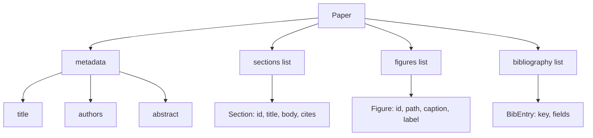
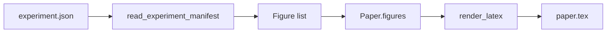
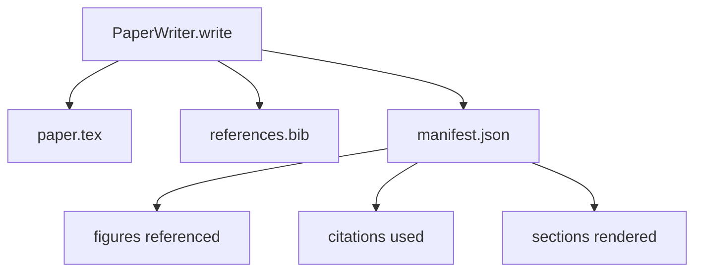

# Kağıt yazarı

> Bir LaTeX iskeleti, araştırmacı ile yazıcı arasında yapılan bir sözleşmedir. Sözleşme bozulursa belge bir şekilde oluşturulmaz ve başarısızlık gürültülüdür.

**Type:** Build
**Languages:** Python
**Prerequisites:** Phase 19 lessons 50-53
**Time:** ~90 minutes

## Öğrenme Hedefleri

- Araştırma makalesini, serbest bir belge değil, bilinen bir bölüm grafiği ile yapılandırılmış bir eser olarak değerlendirin.
- Bir proza yazılmadan önce soyut, bölümler, figür boşlukları ve bibliografi anahtarlarını açıklayan bir LaTeX iskeleti oluşturun.
- Deneme çıkışlarından (yollar ve başlıklar) belirleyici bir yuva mekanizması ile iskelete rakamlar enjekte edin.
- Her bölümü yapılandırılmış bir çizimden dolduran bir proza jeneratörü telleştirin böylece kemer model olmadan test edilebilir.
- Bir tane yayınlayın .`paper.tex`artı bir `references.bib`Ayrıca referans edilen her rakam ve kullanılan her alıntı listesi olan bir manifesto.

```figure
ch-paper-skeleton
```

## Neden önce iskelet?

Bir taslak, proz olarak başlayan bir proje, yapısal borç toplar. Giriş, ilgili çalışmada olması gereken üç paragraf büyür. Bir rakam tanımlanmadan önce referans edilir. Bibliografi aynı makale için üç anahtarla sonuçlanır. Yazar fark edince, yeniden yazma maliyeti yazma maliyetinden daha yüksektir.

Bir iskelet bunu tersine çevirir. Yapı öncesinde veriler olarak açıklanır. Bölümler isim ve sırayla slotlar. Sayılar kimlik ve başlıklı yuvarlaklar. Bibliografi anahtarları, işaret ettiği girişlerle birlikte yukarıda belirlenir. Prosa, bu boşluklara birer birer üretilir. Harnes, herhangi bir prozanın yazılmadan önce, her figürün bir boşluğu, her alıntıda bir giriş olduğunu ve her bölümün içeriği tablosunda göründüğünü doğrulayabilir.

Bu, daha önceki derslerin planlara, araç çağrısına ve izlere uyguladığı aynı disiplin.

## Kağıt şekli



Her alan basit Python verileri. Renderer, saf bir işlevi.`Paper`Harnes, görüntüleme öncesi kağıdı içtenlikle gözlemleyebilir: bölümleri sayın, kayıp rakam dosyalarını listeleyin, her seferinde kontrol edin.`\cite{key}`- Evet .`BibEntry`- Evet .

## Verim sözleşmesi

Renderer üç özellik sağlar.`\begin{figure}`Blok, formun sabit bir etiketle `fig:<id>`İkincisi, her bölüm bir `\section{}`Formanın sabit bir etiketle `sec:<id>`Üçüncü olarak, bibliografi bir `\bibliography`Kimin blokları`references.bib`Kağıt üzerinde açıklanan yazıları tam olarak içerir, ne daha fazla ne de daha az.

Bu kuralların herhangi birini çiğnemek, bir uyarı değil, bir gösterim hatasıdır.

## Deneyimlerden elde edilen rakam enjeksiyonu

Bu parçadaki önceki dersler JSON manifestoları olarak deney çıkışları üretti. Her manifesto yollar ve kısa başlıklarla birlikte eserlerin bir listesini taşıyor. Kağıt yazarı manifestoları okuyor ve üretir.`Figure`Kayıtlar.



Enjeksiyon belirleyici. Şekil kimlikleri deney adından ve monoton bir sayıcıdan türetilmiştir. Başlıklar manifestodan gelir. Yollar kağıtın çıkış dizine göre normallaştırılır, böylece LaTeX deney çıkışları diskte başka bir yerde oturduğunda bile bir dizi oluşturur.

## İftira eden proza jeneratörü

Ders model çağırmaz.`MockProseGenerator`Bu sayede, bir kısımın adı, bir kısımın adı ve bir kısımın adı ile iki kısımın içine eklenir.

Bu, yazarın her davranışını test etmek için yeterlidir. Gerçek bir uygulamada jeneratörü bir model çağrısı için değiştirir. Etrafındaki harness değişmez. Bu, proza jeneratörünü bir çağrılabilir olarak ilan etmenin değeri: test bir deterministik bir yerine, üretim bir model yerine, kalan boru hattı aynıdır.

## Açık çıkış

Yazar çıkış dizine üç dosya gönderir.



Manifesto aşağıdaki değerlendirici veya eleştirmen döngüsü tarafından okunan şeydir. LaTeX'i analiz etmez, manifestı okuyor. Bir sonraki ders, eleştirmen döngüsü, bu manifestı giriş olarak alır ve geri bildirim listesini üretir. Bu nedenle manifest sözleşmenin bir parçasıdır ve LaTeX değildir.

## Valideleme kapıları

Yazar herhangi bir dosya yazmadan önce dört kapıyı çalışır.

1. Her bir rakam kimliği kağıt içinde eşsiz.
2. Her bölümün.`cites`Bu alan, kağıda açıklanan bir bibliografi anahtarına atıfta bulunur.
3. Abstrakt boş değil.
4. Başlık boş değil.

Başarısız bir kapı yükselmektedir .`PaperValidationError`Bu nedenle, bu durumun nedenini açık bir şekilde belirlerken, bu durumun nedenini bir hata moduyla gösterir.

## Şifreyi nasıl okuyabilirsiniz

`code/main.py`tanımlar `Paper`- Evet .`Section`- Evet .`Figure`- Evet .`BibEntry`- Evet .`PaperValidationError`- Evet .`MockProseGenerator`- Evet .`PaperWriter`, ve bir `render_latex`Bu işlev.`write`Metod bir çıkış dizinini alır ve gönderir `paper.tex`- Evet .`references.bib`ve`manifest.json`- Ne ?`read_experiment_manifest`yardımcı bir deney manifest listesi dönüştürür `Figure`Kayıtlar.

`code/tests/test_paper_writer.py`kapaklar: bölgeleri olmayan iskelet render, iki bölüm ve iki rakamlı tam render, eksik sitasyon kapısı, ikili rakamlı kimlik kapısı, açıklama içeriği ve LaTeX-string sözleşmesi (her bölüm bir `\section{}`, her rakam bir `\begin{figure}`)

## Daha ileri gitmeye çalışıyorum .

Gerçek bir uygulamanın iki uzantısı gerekir.`Paper`form oluşturur ve blog yayınları için Markdown ve previews için HTML'e dönüştürür.`Paper`İkinci olarak, alıntı zenginleştirme: yazar, yerel bir DOI önbelleği vererek, bir alıntı anahtarından BibTeX girişlerini alır. Her ikisi de ek değer, her ikisi de iskelet sözleşmesine dokunmadan eklenebilir.

İsteğe göre, kısımlar, rakamlar ve alıntılar veriler olarak açıklanır, prozalar slotlara üretilir, manifestlar LaTeX ile birlikte yayılır.
