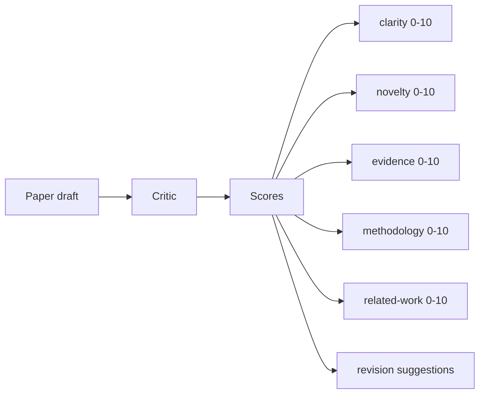
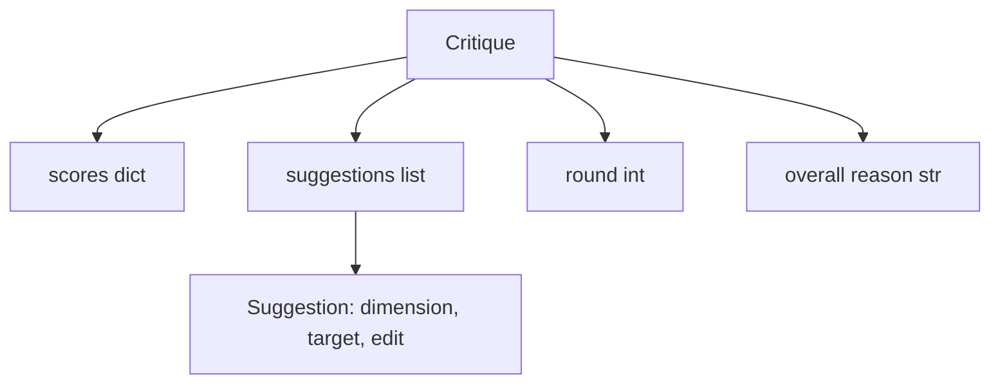
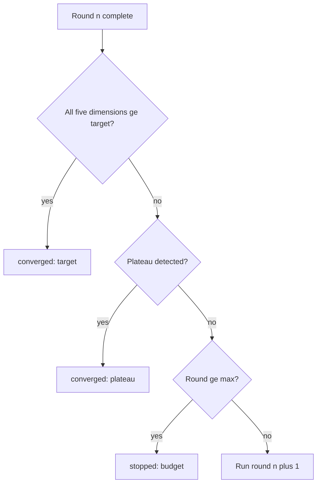
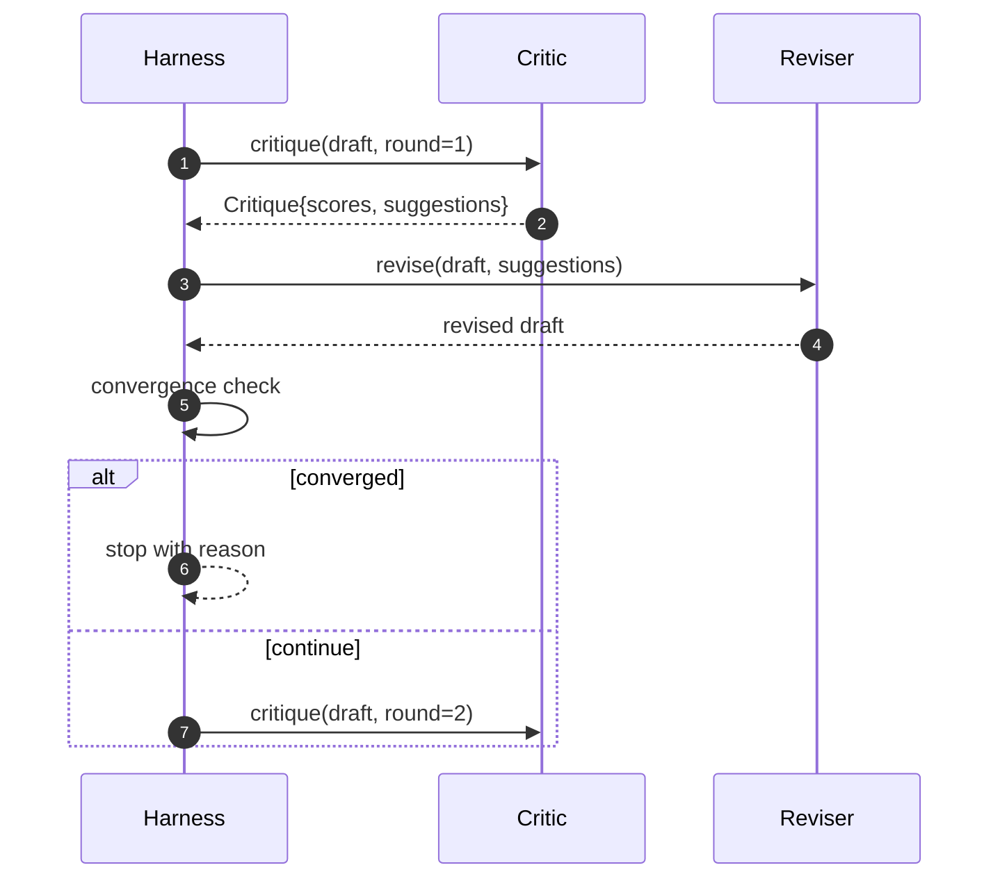

# Eleştirmenlik Çeliği

> İlk kez "iyi görünüyor" diyen eleştirmen kırılır. "İş ihtiyacı" diyen eleştirmen kırılır. İlginç eleştirmen, birbiriyle yakınlaşan bir eleştirmendir ve birbiriyle yakınlaşmayı tasarlamak zorundasınız.

**Type:** Build
**Languages:** Python
**Prerequisites:** Phase 19 lessons 50-53
**Time:** ~90 minutes

## Öğrenme Hedefleri

- Beş sabit boyut üzerinde bir kağıt taslakını değerlendirin: netlik, yenilik, kanıt, metodoloji, ilgili çalışma.
- Her tur eleştirisini serbest bir şekilde yeniden yazmak yerine yapılandırılmış bir revizyon dif olarak uygulayın.
- Rondlar arasında puanları karşılaştırarak birleştiğini tespit edin; platoda dur, hedef yerine getirildi veya bütçe bitmişti.
- Kaplamalar maksimum bir devre bütçesi ile düzenlenir, böylece uyumsuz bir eleştirmen sonsuza dek çalışmaz.
- Bir tur için bir iz çıkarın böylece ara çubuğu veya sonraki aşama puan trajektörünü görüntüleyebilir.

```figure
ch-critic-converge
```

## Neden beş sabit boyut

Özgür bir eleştirmen, bir paragraf önerileri geri veren bir modeldir. Bir sonraki turda yapılan revizyondan paragraf çevresel bağlam olarak değerlendirilir.

Beş boyut, harness'e bir anlaşma sağlar.



Bu, bir simgelik ve bir simgelik ve bir simgelik ve bir simgelik ve bir simgelik ve bir simgelik ve bir simgelik ve bir simgelik ve bir simgelik ve bir simgelik ve bir simgelik ve bir simgelik ve bir simgelik ve bir simgelik ve bir simgelik ve bir simgelik ve bir simgelik ve bir simgelik ve bir simgelik ve bir simgelik ve bir simgelik ve bir simgelik ve bir simgelik ve bir simgelik ve bir simgelik ve bir simgelik ve bir simgelik ve bir simgelik ve bir simgelik ve bir simgelik ve bir simgelik ve bir simgelik ve bir simgelik ve bir simgelik ve bir simgelik ve bir simgelik ve bir simgelik ve bir simgelik ve bir simgelik olarak bir simgelik olarak gösterir.

## Kritik şekli



Her öneride geliştirdiği boyut, hedeflediği bölüm ve bir `edit`Değiştiricinin uygulayabileceği talimat. Değiştiricinin de çağrılabilir olmasıdır. Ders, düzenleme talimatını bir ekleme-sektör işlevi olarak yorumlayan belirleyici bir düzenleyici gönderir. Bir model yönlendirilmiş düzenleyici aynı alanı bir istekle yorumlar. Sözleşme değişmez.

## Dönüşüm kuralları, sırayla

Kritik döngü, üç şarttan herhangi biri ateş ederken sona erer.



Hedef en sıkı durumdur: beş boyuttan her biri (yakınlık, yenilik, kanıt, metodoloji, ilgili_iş) isabet edilmelidir `>= target_score`(devayla `8.0`Bu nedenle, bu değerler, bir yuvarlakın ortalama değerini gösterir.`plateau_epsilon`(devayla `0.1`) iki sıradan tur için, döngü çıkışları ile `plateau`Bütçe, döngülere karşı sert bir sınırlama (devayolu)`5`) ve çıkışları ile `budget`- Evet .

Eğer üçüncü tur aynı tekrarla hedefe çarparsa ve aynı zamanda bir plato tetiklerse, sonuç `target`- Hayır .`plateau`- Evet .

## Neden plato tespit iki kez geçer ?

Bir yuvarlak plato gürültüdür. Gerçek bir eleştirmen sabit bir taslakta bile her tekrarlama için biraz farklı bir puan verir, çünkü belirleyici puanlama hala hangi önerilerin uygulanmasına ve hangi sırada uygulanmasına bağlıdır.

## Bu dersdeki belirleyici eleştirmen

Ders bir model çağırmaz. Gönderen eleştirmen, üç sinyali temel alarak bir taslak puanlayan bir eleştiricidir: ortalama bölüm vücut uzunluğu (belirlilik), rakam sayısı ve alıntı sayısı (deliller) ve bir`originality_tag`Bu nedenle, her puanı yukarı doğru nasıl itireceğini bilmektedir.

```text
clarity      grows when the average section body length increases
novelty      grows when originality_tag is set to "high"
evidence     grows when a section's figure_refs is non-empty
methodology  grows when a section titled "Method" exists with body
related-work grows when a section titled "Related Work" exists with body
```

Değiştiriciler her önermeyi hedeflenen bir ek olarak yorumlar. Birinci turdan sonra, harness puanın yükseldiğini gözlemleyebilir. Testler bu özelliği kullanarak döngünün boşluğu azaltdığını iddia eder.

## Tam döngü kontratı



Harness, yuvarlak sayıcı, izleme ve yakınlık kontrolüne sahip. Eleştirmen notu, düzenleyici farkı sahip. Üçün hiçbirisi diğerlerinin durumuna dokunmaz.

## İzleme çıkışı

Her turda bir iz olayı yayılır. Bu olayda, yuvarlak sayı, puan vektörü, önerme sayısı ve yakınlaşma hükmü bulunur. Tam iz son taslak ile birlikte geri gönderilmektedir. Aşağı akıntılı bir ara çubuğu yuvarlak puan çizelgesini gösterir. Bir sonraki ders, tekrarlama programcısı, dalın tutulmaya değer olup olmadığını belirlemek için izyi okuyor.

## Kötü eleştirmenlerden korunan bütçeler

Sunucuyu asla iyileştirmeyen öneriler getiren eleştirmen, bu döngüyü maksimum iterasyon tavanına kilitleyecektir.`budget`Kullanıcı, bir eleştirmen hata olarak okuyor, bir taslak hata değil.

## Şifreyi nasıl okuyabilirsiniz

`code/main.py`tanımlar `Critique`- Evet .`Suggestion`- Evet .`Critic`Protokol,`Reviser`Protokol,`CriticLoop`, ve bir `make_deterministic_critic_pair`Deterministik eleştirmen ve eşleşen bir revisör gönderir.`Paper`şekli dahil edilmiştir, böylece ders kendi başına duruyor.

`code/tests/test_critic_loop.py`kapsamlar: Birinci turdan sonra tek tonlu bir gelişme, ayarlanmış bir taslağdaki hedef yakınlığı, iki düz turdan sonra plato tespit edilmesi, öneriler iyileşmediğinde bütçe tüketimi, düzenleyici tarafından öneriler uygulanması ve iz şekli.

## Daha ileri gitmeye çalışıyorum .

Gerçek bir uygulamanın iki uzantısı gerekir. Birincisi, boyut ağırlıkları: bir atölyenin makalesi metodolojiden daha yüksek yenilik ağırlığı taşır; bir dergi tersini taşır. Dönüşüm kontrolü ağırlıklı bir ortalama olur. İkincisi, çift eleştirmenler: bir eleştirmen puanlar, ikinci eleştirmen önerileri eleştirmen görmeden önce yargılar. Her ikisi de ek değer, her ikisi de aynı üzerinde yazılır.`Critique`şekli.

Bahis puan vektörüdür. Eleştirme yapılandırıldıktan sonra, diğer her gelişme, yakınlaşma kuralı, ara çubuğu, çift eleştirmen, döngüyü değiştirmeden düşer.
