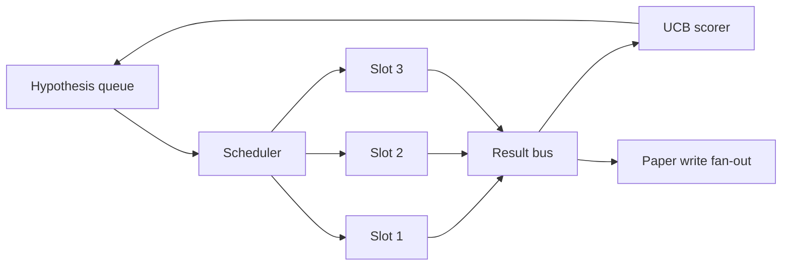
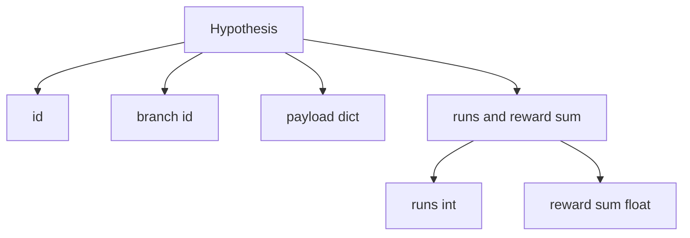
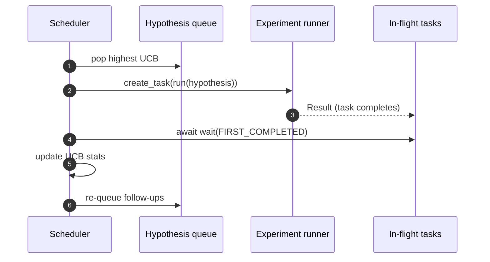

# İterasyon Programlayıcısı

> Bir programlamacı olmadan bir araştırma döngüsü, hayal kırıklıkları olan bir kuyruktur. Programlamacı, bu döngü neyi keşfetmeyi bırakmayı karar verdiği yerdir ve bu karar tüm oyunu oluşturur.

**Type:** Build
**Languages:** Python
**Prerequisites:** Phase 19 lessons 50-53
**Time:** ~90 minutes

## Öğrenme Hedefleri

- Araştırma iş akışını bir hipotez kuyruk olarak modelleyin ve sonuçları geriye doğru yayılan paralel deney boşluklarını besleyin.
- Asyncio ile aynı anda birden fazla deney çalıştırın böylece programcı tüm yuvaları meşgul edebilir.
- Her hipotez dalını UCB ile notlayın, böylece programcı keşiften vazgeçmeden düşük verimli dalları kesebilmelidir.
- Bitmiş sonuçları bir kağıt yazma aşamasına ve bir tekrar sıra aşamasına yayın, böylece yüksek verimlilikli bir dal takip hipotezleri doğurur.
- Bir tekrar izini, dal puanları, boşluk işgalı ve kesim kararlarıyla yüze çıkarın.

```figure
ch-ucb-scheduler
```

## Neden bir programlama, bir iş listesine değil

Bir düz iş listesinde görevler gönderme sırasıyla çalışmaktadır. Her iş bağımsız olduğunda bu iyidir. Araştırma bağımsız değildir: üç deneyden bir bulgu deneylerin önceliğini değiştirir dört ve beş. Sonuçları fan-in okuyan ve sırayı yeniden düzenleyen bir programcı, hesaplama birimine göre daha yararlı iş yapar.

İlginç bir tasarım seçeneği puanlama kuralıdır. Açgözlü bir puanlayıcı her zaman mevcut liderleri seçer ve asla keşfeder. Bir eşsiz puanlayıcı asla istismar etmez. UCB (yüksek güven bağlanması) orta yoldur: liderleri istismar ederken daha az denelenen dallar için kapasiteyi saklar.

## Sistem şekli



Satır hipotezler tutar. Bir slot serbest bırakıldığında programcı en yüksek UCB hipotezini seçer. Her slot asinkron bir deney yürütür. Bitmiş deneyler sonuçlarını otobüs üzerinde yayır. Otobüs, başlangıç dalı UCB istatistiklerini güncelleyebilir ve bir dalın verisi bir eşiği geçtiğinde kağıt yazma aşamasına doğru fanlar çıkarır.

## Hipotez şekli



`branch`UCB istatistiklerinin anahtarıdır. Çoklu hipotezler bir dalı paylaşabilir (branch araştırma yönüdür; hipotez içindeki bir deneme). `runs`Bu dal için tamamlanmış deneylerin sayımıdır.`reward_sum`UCB her ikisini de okuyor.

## UCB puanlaması

Bu derste kullanılan UCB formülü klasik UCB1'dir.

```text
ucb(branch) = mean_reward(branch) + c * sqrt( ln(total_runs) / runs(branch) )
```

`total_runs`Tüm dallarda tamamlanan tüm deneylerin sayımıdır.`c`- - - - - - - - - - - - - - - - - - - - - - - - - - - - - - - - - - - - - - - - - - - - - - - - - - - - - - - - - - - - - - - - - - - - - - - - - - - - - - - - - - - - - - - - - - - - - - - - - - - - - - - - - - - - - - - - - - - - - - - - - - - - - - - - - - - - - - - - - - - - - - - - - - - - - - - - - - - - - - - - - - - - - - - - - - - - - - - - - - - - - - - - - - - - - - - - - - - - - - - - - - - - - - - - - - - - - - - - - - - - - - - - - - - - - - - - - - - - - - - - - - - - - - - - - - - - - - - - - - - - - - - - - - - - - - - - - - - - - - - - - - - - - - - - - - - - - - - - - - - - - - - - - - - - - - - - - - - - - - - - - - - - - - - - - - - - - - - - - - - - - - - - - - - - - - - - - - - - - - - - - - - - - - - - - - - - - - - - - - - - - - - - - - - - - - - - - - - - - - - - - - - - - - - - - - - - - - - - - - - - - - - - - - - - - - - - - - - - - - - - - - - - - - - - - - - - - - - - - - - - - - - - - - - - - - - - - - - - - - - - - - - - - - - - - - - - - - - - - - - - - - - - - - - - - -`sqrt(2)`- Zıfır koşuşturma yapan bir dal .`+inf`Bu nedenle denemeden dallar her zaman önce planlanır. Yüksek ortalama ödül alan dallar diğer dallar yetişene kadar yüksek puanlar tutar; çok fazla ödül almadan çalışan bir dal daha az çalıştırılan alternatifler tarafından örtülür.

Kesme kapısı, seçiciden ayrıdır. Kesme, ortalama ödülünün mutlak bir zeminden aşağı düştüğünde bir dalı gelecekteki programlamadan çıkarır (devayla `0.2`) en az sonra `prune_after_runs`denemeler (devayla `3`Bu sırayı sınırlı tutar.

## Asyncio ile paralel boşluklar

Programlayıcı deneyleri `asyncio.create_task`Her görev deney koşucuyu (bir) çalıştırır.`async def`(a) bir `Result`. Ana döngü , uçuş görevlerinin sırasını bekliyor .`asyncio.wait(..., return_when=asyncio.FIRST_COMPLETED)`ve her tamamlama için puan güncelleştirmesini ateşler.



Üç slot aynı anda çalışır. Ana döngü hiçbir zaman tek bir deneyde engelleniyor. Programlayıcı, bir yuva serbest bırakıldığında, sırada boşluk ve hiçbir görev uçuşta olmadığı sürece yeni görevleri başlatmaya devam eder.

## Yayılma: Kağıt tetikleyicileri

Bir dalın ortalama ödülü geçerken`paper_threshold`(devayla `0.7`) ve bu şubenin henüz bir makale üretmediği için programcı bir `paper.trigger`Bu dersde tetikleyici bir liste olarak kaydedilir, böylece testler onu doğrulayabilir.

## Yayınlama: takip hipotezleri

Yüksek verimli bir sonuç geldiğinde, programcı kullanıcı tarafından sağlananı arayabilir `expander`Bu, aynı dalda bir veya daha fazla takip hipotezi üretmek için kullanılır.`Result`- ...`list[Hypothesis]`Ders, kağıt eşiğinden fazla ödül aldığı her sonuç için iki takip üretecek bir belirleyici genişleştirici gönderir.

## Bütçeler

İki bütçe programcıyı kaçak döngülerden korur.

```text
max_experiments    : total count of experiments run across all branches
max_seconds        : wall-clock cap (asyncio time)
```

Bir ateş olduğunda, programcı yeni görevlerin programlanmasını durdurur, uçuşta olanları bekler ve son izini geri gönderir.`stop_reason`- Evet .

## İzleme ve son rapor

Her planlama kararı (seçme, gönderme, sonuç, biçme, fan-out) bir olay yayar. Son rapor, her şube istatistiklerini, toplam koşular, toplam duvar saati ve ateşlenen kağıt tetikleyicilerini özetler.

## Şifreyi nasıl okuyabilirsiniz

`code/main.py`tanımlar `Hypothesis`- Evet .`Result`- Evet .`BranchStats`- Evet .`IterationScheduler`, ve bir `make_deterministic_runner`Bir asyncio deneyi koşucunu öngörülebilir ödüllerle geri dönen fabrika.`delay_ms`(devayla `5ms`) bu yüzden eşzamanlılık gözlemlenebilir.

`code/tests/test_scheduler.py`kapaklar: UCB önce denemeden dalları seçer, paralel yuvaların işgalinin, eşiğin geçtiği zaman kağıt tetikleyicileri, düşük verimli denemelerden sonra dal kesimi, fan-out takip hipotezleri ve bütçe çıkışı (hem deney sayımı hem de duvar saati).

## Daha ileri gitmeye çalışıyorum .

Gerçek bir uygulamaya üç ekleme gerek. İlk olarak, seanslar boyunca UCB istatistikleri: mevcut istatistikler hafızada yaşar; gerçek bir programcı onları kontrol eder, böylece yeniden başlatmak zaten harcadığı araştırma bütçesini korur. İkincisi, çok amaçlı puanlama: bir skalar ödül yerine, her sonuç bir vektör yayar ve UCB Pareto tarzı bir seçicidir. Üçüncü olarak, bağlamlı banditler: hipotez özellikleri (uzunluk, karmaşıklık) üzerinde seçiciler koşulları, bu nedenle benzer hipotezler keşif paylaşmaktadır.

Programlamacı, araştırmanın bir iş listesinden daha fazlasına dönüştüğü yerdir. UCB kablolu ve yuvalar paralel olarak çalışınca, diğer tüm geliştirmeler üstü oluşturur.
