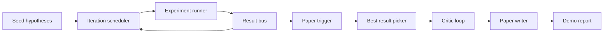
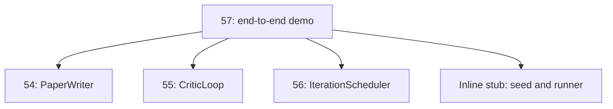
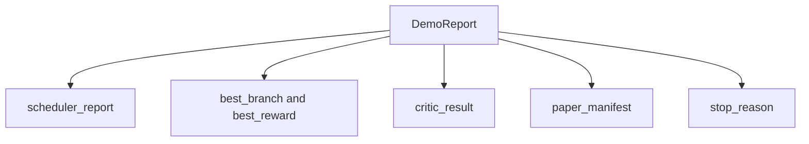

# Sonundan Sonuna Araştırma Demo

> Bir demo, daha önce yazdığın her sözleşmenin yazılması gereken yer.

**Type:** Build
**Languages:** Python
**Prerequisites:** Phase 19 lessons 50-53
**Time:** ~90 minutes

## Öğrenme Hedefleri

- Otomatik araştırma döngüsünü sonuna kadar bağlayın: hipotez tohumları, deney koşucuları, programcıları, eleştirmen döngüsünü, kağıt yazarlarını.
- Dört önceki Track D dersi'nden ilkselleri bir çerçeve değil, basit Python ithalatı ile oluşturun.
- Bu döngüyü kendi kendini bitiren bir sonuna doğru çalıştır ve her aşamanın çıkışını listeden tek bir demo raporunu yayınla.
- Demo belirleyici kalsın böylece test kümesi son şeklini belirleyebilir.
- Bir aşama sözleşmesi bozulduğunda açık bir başarısızlık modunu yüze çıkarın, böylece bir sonraki aşama bozulmuş bir giriş ile çalışmaz.

```figure
ch-research-pipeline
```

## Burada neyin oluştuğunu



Beş aşama. Tohum üç hipotezin bir listesidir. Programlayıcı üç paralel yuva ile altı deney yürütür. Otobüs bir veya daha fazla kağıt tetikleyicisini bildirir. Seçicisi en iyi sonucu seçer. Eleştirmen döngüsü bu sonucu oluşturan bir taslak üzerinde tekrarlanır. Kağıt yazarı son LaTeX, BibTeX ve manifestoyu yayar.

## Neden kopyalamıyorsun, neden ithal ediyorsun?

Her önceki ders bir `main.py`Bu uygulama, genel olarak, genel veri sınıfları ve işlevleri ile birlikte kullanılır.`sys.path`Bu çerçeve kablosu değil, önceki derslerde zaten kullanılan test dosyalarının aynı içeriği.



İç çizgi kalınlık, elli ile elli üç ders arasında yer alır: tohum hipotezlerinin küçük bir jeneratörü ve eşzamanlı ödül fonksiyonu. Kullanıcı iki ithalatı ayarlayarak iç çizgi kalınlığı bu derslerden gerçek ilkeler için değiştirebilir.

## Determinizm garantileri

Demo yapısal olarak belirgin bir şekilde yapılır. Deneyimci numpy. Eleştirmen döngüsünün revisörü sabit boyutlarda sabit bir sırada yürür. Kağıt yazarının proza jeneratörü ders elli dört'ten alay edilen bir şeydir. Programlayıcı'nın UCB seçicisi, rastgele seçim değil, tekrarlama sırasıyla bağları bozar.

Aynı tohum verildiğinde, demo aynı raporu yayar. Test, demo'yu iki kez çalıştırarak ve manifest'i karşılaştırarak bu özelliği doğruluyor.

## Demo rapor şekli



Her alan yukarıdaki aşamalı aşamalı bir şekilde ortaya çıkar. Demo hiçbir çıkışı dönüştürmez; onları oluşturur.

## Başarısızlık modunun yönetimi

Her aşama ya başarılı olur ya da bir yazma hatası ortaya çıkar.

```text
Scheduler ........ returns SchedulerReport with stop_reason
                   in {queue_empty, max_experiments, deadline}
Best-result pick . raises NoTriggerError if no paper trigger fired
Critic loop ...... returns LoopResult with status converged or stopped
Paper writer ..... raises PaperValidationError on contract break
```

Herhangi bir aşamada bir başarısızlık, bir tip dışı bir istisna ile demo'yu kısaltır.`test_no_triggers_raises_typed_error`ve `test_best_picker_raises_when_no_triggers`Toplayıcı yükselir .`NoTriggerError`- Ne ?`BestResultError`Bir de bir dal tetikleyici ateşlemediğinde ve yazarın adı asla çağırılmadığında.

## En iyi sonuçları seçen kişi

Programlayıcı her dal için kağıt tetikleyicileri gönderir. Seçicisi tüm tetikleyiciler arasında en yüksek ortalama ödül ile dalı seçer. Döngüler dal id ile alfabetik olarak kırılır, bu nedenle demo belirlenicidir. Seçicisi küçük saf bir fonksiyondur; testler sabit bir planlayıcı raporuna atır.

## Kritik döngüyü kablolamak

Beş beşinci derste eleştirmen döngüsü bir `MiniPaper`Demo bir `MiniPaper`Seçilen daldan, soyut'u dal id ile doldurarak, iki bölüm (İlk giriş ve sonuçlar) ekerek ve ayarlayarak `originality_tag`Şubenin ortalama ödülünden (yüksek ise)`>= 0.8`, orta , eğer`>= 0.6`- ... ... yoksa düşük .

Değiştiricisi daha sonra taslakı dönüşümlü hale getirir.

## Gazete yazarını kablolamak

54 dersindeki gazete yazarı tam olarak çalışmaktadır .`Paper`Bu, bir araya gelen kişilerin ve kitapçıkların şeklini oluşturur.`MiniPaper`-`mini_to_full_paper`, seçilen dal için bir rakam ve eleştirmenin önerdiği sitat anahtarları birleşiminden inşa edilen küçük bir sentetik bibliografi ekler.

## Şifreyi nasıl okuyabilirsiniz

`code/main.py`tanımlar `BestResultError`- Evet .`NoTriggerError`- Evet .`DemoReport`- Evet .`pick_best_branch`- Evet .`build_mini_paper`- Evet .`mini_to_full_paper`ve`run_demo`En üst düzey indirimleri düzenlenmiştir.`sys.path`Bir kere çekip çek .`PaperWriter`- Evet .`CriticLoop`ve`IterationScheduler`Derslerinden.

`code/tests/test_e2e.py`kapsamlar: demo uç uç uç uçları ile çalıştırır ve beş alanın hepsinin doldurulması ile bir rapor gönderir, iki uç boyunca belirlenme, hiçbir dal eşiği aşmadığında NoTriggerError, PaperValidationError yazarın sözleşmesi kırıldığında, kağıt manifest seçilen dalın rakamını içerir ve programlayıcı durdurma nedeni beklenen değerlerden biridir.

## Daha ileri gitmeye çalışıyorum .

Demo yeşil olduğunda üç eklenti kablolamaya değer. İlk olarak, sürekli durum: her aşamanın sonucu küçük bir JSON depoya yazılır, böylece ucuz aşamaları tekrar çalıştırmadan yeniden başlatılabilir. İkincisi, bir ara çubuğu: programcı ve eleştirel döngüden izlenen olaylar tek bir zaman çizgisi olarak gösterilmektedir. Üçüncü olarak, gerçek model çağrıları: alaylı proza jeneratörünü ve belirleyici eleştiricini model yönlendirilenlere değiştirin; kablolama değişmez.

Demo'nun görevi, yapının mimarlık olduğunu kanıtlamak. Beş ders, dört ithalat, bir rapor. Bir sonraki aşama eklediğinizde, kablo tam olarak bir satır büyür.
