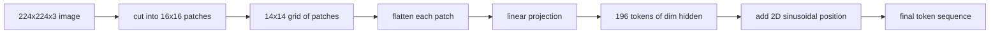

# Görüş Kodlayıcı Çizgilemeleri

> Bir görüntü modeli piksel okuyor. piksel için bir tokenizer gerekir. Patch yerleştirme bu tokenizer. resmini bir kare şebekesi olarak kesin, her kareyi düzeltin, bir çizgi katman üzerinden projekte edin, sonra 2 boyutlu bir konum sinyali ekleyin böylece transformatör orijinal resimde her kare nerede oturduğunu bilir.

**Type:** Build
**Languages:** Python
**Prerequisites:** Phase 19 lessons 30-37 (Track B foundations)
**Time:** ~90 minutes

## Öğrenme Hedefleri

- Bir resmini sabit uzunluklu bir patch yerleştirme sırasına işaretleyin.
- A.`Conv2d`-Düzsel olarak ortaya çıkış matematikine uyan bir yama projeksiyonu.
- 2 boyutlu bir sinusoidal pozisyon oluşturun. Böylece simgesel düzen uzay pozisyonunu kodlar.
- Çizgi sayısını, yerleştirme şeklini kontrol edin ve `Conv2d`-Sintez bir alet üzerinde eşdeğerliği aç.

## Sorun

Bir transformatör vektörlerin bir diziyi yiyor. Bir görüntü üç kanallı bir ağ. Her pikselü bir simge olarak okuyarak dizinin uzunluğu patlar: 224x224 RGB görüntüsü 150.528 simgeyi oluşturur, bu da 12 katmanlı bir dönüştürücüye dikkat çekmek için imkânsızdır. Resimi bir dev düz vektör olarak okuyarak dikkat katmanının geri alamayacağı yerleri atıyor. Kodlayıcı ön ucunun görevi, piksel şebekesini her biri kare bir bölgeyi özetleyen birkaç yüz tokene sıkıştırmaktır.

Patch embedding bunu bir çizgisi projeksiyon ile çözür. 16x16 patchlere kesilmiş 224x224 görüntü 196 patch'ın 14x14 şebekesi üretir. Her patch düzleştirilmiştir.`(3, 16, 16) = 768`Bir piksel değerleri bir vektörde, sonra bir çizgi katman onu modelin gizli boyutuna haritası yapar.`hidden`Bu, ağın geri kalanı tarafından çiğneyebilecek bir dizi.

## Anlaşım



### Neden piksel değil, yamalar?

Dikkat, dizinin uzunluğunda karelidir. 196-token dizisi maliyetleri `196 * 196 = 38,416`Bir katman başına dikkat puanları; 150.528 token dizisi maliyetleri `150,528 * 150,528 = 22.6 billion`. Patchler dikkat hesaplamalarının 590,000x azaltılmasını satın alır ve tek bir 16x16 bölgesi yüksek düzeyde görme görevleri için yeterli sinyal taşır.

### Neden bir çizgiden proje yeterli

Her yama bağımsız bir vektör olarak ele alınır. Projesiyon bir temel öğrenir: kenar detektörleri, renk filtreleri, basit dokular.`768 * 768 = 589,824`Daha derin konvulsiyonal gövdeleri vardır (viT "hibridi"), ancak düz bir doğrusal projeksiyon standarttır ve çoğu modern açık ağırlıklı kodlayıcı bu tam şekle sahiptir.

### - Evet .`Conv2d`Yaptık

A.`Conv2d(in_channels=3, out_channels=hidden, kernel_size=patch_size, stride=patch_size)`Bu, bir filtreye karşı patch piksellerini üreten her çıkış pozisyonu noktası olduğu için, açılan ve çizilen gibi aynı sayısal sonuç verir. Konvulsiyon patch projeksiyonudur ve çoğu üretim kod tabanı GPU'da daha hızlı olduğu ve bir tane daha az şekil değiştirmeyi kullandığı için bu şekilde gönderir.

### Konum yerleşimleri

2D sinusoidal yerleşim, her simgeye sabit bir sinyal verir ve bu sinyalin kodlanmasını sağlar.`(row, col)`yerleştirme boyutunun yarısı, birden fazla frekansta sin/cos ile satır pozisyonunu kodlar; diğer yarısı sütun pozisyonunu kodlar. Kodlama belirginliktir, böylece yeniden eğitim almadan çözünürlükleri değiştirebilirsiniz ve eğitim sırasında model hiç görmediği ağlara temiz bir şekilde interpolar.

| Component | Shape | Parameters |
|-----------|-------|------------|
| Patch projection (`Conv2d`) | `(hidden, 3, patch, patch)` | `3 * P * P * hidden + hidden` |
| Position embedding (fixed) | `(num_patches, hidden)` | 0 (computed, not learned) |
| CLS token (learned) | `(1, hidden)` | `hidden` |

ViT-Base/16 için 224 çözünürlükte: projeksiyonda 590.592 parametre, CLS token'da 768 ve sinusoidal pozisyon için sıfır.

### Akıl sağlığı kontrolü olarak eşdeğerlik

Patch adımı iki harflemeyi içerir: a `Conv2d`Bu testler aynı ağırlık için aynı çıkış üretmelidir. Eğer yapmazlarsa, çözülme matematiği yanlış olur ve kodlamanın geri kalanı kum üzerinde inşa edilir.

```figure
ch-patch-tokenizer
```

## Yapın

`code/main.py`Uygulamaları:

- `PatchEmbed`, bir `nn.Module`paketleme`Conv2d`Patch proje için.
- `sinusoidal_2d(grid_h, grid_w, dim)`, 2 boyutlu konum tablosunu oluşturan bir devletsiz işlev.
- `VisionFrontEnd`, ki, bir ileri geçiş için patch ekleme, CLS prepend ve pozisyon eklemeyi içerir.
- A.`synthesize_image(seed)`                                                                                                                                                                                                                                                                                                                                                                                                                                                                                                                             `numpy.random`- Evet .
- Ön ucundan bir sabit görüntü çalıştırıp çıkış şeklini, CLS token normunu ve pozisyon yerleştirme bir satırını yazdırır.

Çek şunu:

```bash
python3 code/main.py
```

Çıktı: 224x224 sabitliği bir şekil sırasına işaretlenir `(1, 197, 768)`. İlk simge CLS, sonraki 196'lar patch simgesidir.

## Kullan

Aynı patch ön ucunda her modern görme dilinde modeller görünür: CLIP ViT-L/14, SigLIP, DINOv2, Qwen-VL ailesi ve InternVL yığın hepsi bir `Conv2d`Çizgileme projesi artı bir pozisyon sinyali. Aileler arasındaki farklılıklar aşağı akıntıda yaşar (CLS vs. no-CLS birleştirme, kayıt simgeler, değişen çizgileme boyutları 14 vs. 16, interpolated pozisyonlar üzerinden dinamik çözünürlük).

## Testler

`code/test_main.py`kapsamlar:

- Patch sayımı eşleşebilir `(image_size / patch_size) ** 2`
- çıkış şekli eşleşir `(batch, num_patches + 1, hidden)`
- `Conv2d`Projection küçük bir sabit üzerinde manuel açılmak-sonra-lineer eşittir
- Sinusoidal konum tablosu çağrılar arasında belirlenir
- CLS token yayınları, sızıntı olmadan seriyi bulanıklaştırır

- Onları çalıştır:

```bash
python3 -m unittest code/test_main.py
```

## Egzersizler

1. Sinusoidal pozisyonu öğrenilmiş bir pozisyonla değiştir .`nn.Parameter`Birinci çağda olan kayıpları küçük bir sentetik sınıflandırma görevi ile karşılaştırın.

2. Değiştir `Conv2d`Açık bir şekilde.`nn.Unfold`Ek olarak .`nn.Linear`Aynı matematikte, iki şekilde yazılır.

3. Çekirde olmayan yama boyutları için destek ekleyin (örneğin geniş açılı girişler için 32x16) ve konum tablosunun çerez olmayan ağları ele aldığını doğrulayın.

4. Patch adımını 1, 8, 64'teki parti boyutlarında profil edin. Patch projesi nadiren şişek boynuztur; akıntıda dikkat katmanları baskın.

5. Ön ucunu 4 sınıf sentetik şekil veri kümesi (daireler, kare, üçgenler, yıldızlar) üzerinde dondurulmuş bir özellik çıkarıcı olarak eğit. CLS token çıkışı doğrusal olarak ayırmalıdır.

## Anahtar Terimler

| Term | What it means |
|------|---------------|
| Patch | A square sub-region of the image, typically 14x14 or 16x16 |
| Patch embedding | Linear projection of one flattened patch to the hidden dim |
| Sequence length | Number of tokens after patch tokenization, usually plus CLS |
| Sinusoidal position | Fixed sin/cos signal that encodes 2D grid coordinates |
| CLS token | Learned vector prepended to the sequence as the pooling head |

## Daha Fazla Okumak

- Bir görüntü orijinal patch-embed çerçeve için 16x16 kelimelere değer (ViT, 2021)
- Burada 2D'ye uyarlanmış sinusoidal pozisyon formülü için dikkat etmeniz gereken her şey (2017)
- DINOv2 kağıdı kayıt simgeler için, bir uzantı ekleyebilirsiniz egzersiz 6.
