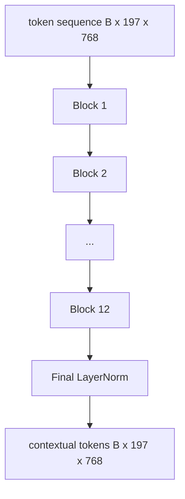
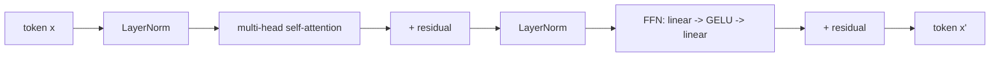

# Görüş Transformer Kodlayıcı

> Çizgilemeler tek başına görmez. 12 dikkat başı olan 12 katman öncesi LN transformatörü, çizgileme simgelerinin bir dizi bağlam simgelerine dönüştürür ve CLS simgesi, son gizli durumunda tüm görüntü özelliklerini bir araya getirir. Bu ders, her modern görme dilinin makine odasıdır.

**Type:** Build
**Languages:** Python
**Prerequisites:** Phase 19 lessons 30-37 (Track B foundations)
**Time:** ~90 minutes

## Öğrenme Hedefleri

- Çok başlı kendi kendine dikkatle ve ileriye aktarma alt katmanlı bir pre-LN transformatör blokunu uygulayın.
- 12 başlı 12 blok toplayarak ViT-Base kodlayıcısı oluşturun.
- 58 dersinden patch ön ucunu kodlayıcıya bağla ve ileriye geçiş yap.
- CLS token'un her yama ile ilgili bilgileri topladığını kontrol edin.

## Sorun

Patch yerleştirme 197 tokenin bir dizi üretir, her biri başka bir patch farkında olmadan bir vektör. Bir kedinin resminize hangi parşömenler sis içerdiğini, hangi parşömenler arka planı içerdiğini ve hangi parşömenler gözü içerdiğini bilmek için her parşömen gereklidir. Transformatör, farkındalık oluşturan mekanizmadır, bir seferde bir dikkat katmanı. Bu olmadan, patch ön ucu anlayışsız bir akıllı işaretçidir.

Standart tarif 12 blok derinlik, 12 baş genişlik, ön LayerNorm yerleştirme, GELU etkinleştirme ve 4x ileriye aktarma genişleme ile. Bu tarif, CLIP ViT-L, SigLIP, DINOv2, Qwen-VL ailesi, InternVL ve 2025-2026 yıllarındaki diğer açık ağırlıklı görüş kodlayıcılarının omurgasıdır. Reçet yeterince istikrarlıdır ki bu makalelerden herhangi birini okuyabilir ve açıkça aksi söylemeleri gerekmediği sürece bu blok şeklini alabilirsiniz.

## Anlaşım





### LN öncesi vs LN sonrası

Orijinal Transformer, kalanın ardından LayerNorm yerleştirdi. Pre-LN (her alt katmanın önüne LayerNorm) her modern görme dil modelinin kullandığı versiyondur, çünkü öğrenme hızının ısıtma hileleri olmadan sabit bir şekilde eğitim alır. Fark ileri geçideki bir çizgidir ve 12+ derinlikte gradient akışı gece ve gündüzdür.

### Çok başlı kendine dikkat

Her baş kendi simgesel vektörünü kendi başına projekt eder .`(query, key, value)`Üçlü boyutlu `head_dim = hidden / num_heads`- Evet .`hidden = 768`ve `heads = 12`, her başın var .`dim = 64`. 12 baş paralel olarak hareket eder, sonra çıkışları 768 boyutuna geri döner ve bir çıkış projeksiyonu üzerinden geçer.

### Neden 4 kat daha fazla verilebilir

FFN gidiyor`hidden -> 4 * hidden -> hidden`GELU'nun ortalarında. 4 faktörü deneysel ve 2017'den beri dil ve vizyon transformatörlerinde geçerlidir. Daha küçük (2x) yetersiz; sabit veri bütçesinde daha büyük (8x) fazla. MLP, modelin öğrendiği gerçeklerin çoğunu sakladığı yerdir ve daha geniş orta, oturduğu yerdir.

| Component | Parameters at ViT-Base scale |
|-----------|------------------------------|
| qkv projection per block | `3 * 768 * 768 = 1.77M` |
| output projection per block | `768 * 768 = 590K` |
| FFN per block (4x expansion) | `2 * 768 * 4 * 768 = 4.72M` |
| LayerNorm per block | `4 * 768 = 3K` |
| Total per block | about 7.1M |
| 12 blocks | about 85M |
| Plus front end | about 86M total |

ViT-Base, 86M parametre kodlayıcıdır. 2026 standartlarına göre küçüktür (SigLIP-So400M 400M, Qwen-VL ViT 675M), ancak mimarisi genişlik ve derinlik açısından aynıdır.

### - Sebep maskası mı yoksa değil mi?

Görüş Transformerleri sadece kodlama ve iki yönlü: token `i`- Evet .`j`61 dersindeki dekodör taraflı çapraz dikkat bir sebep maskası kullanır, ama görme kodörünün içinde dikkat tamamen bağlantılıdır.

### CLS tokeninin öğrendiği şeyler

CLS token öğrenilmiş bir parametrek olarak başlar, kendi patch içeriğine sahip değildir ve her blok boyunca dikkat yoluyla bilgi biriktirir. Son katmanla CLS satırı tüm görüntünün vektör özetidir; aşağı akıntılı başlıklar bu tek vektörü bir metin dekodörü için sınıf logitlerine, kontrastlı yerleşimlere veya çapraz dikkat anahtarlarına projekt eder.

```figure
ch-cls-funnel
```

## Yapın

`code/main.py`Uygulamaları:

- `MultiHeadSelfAttention`, ile`qkv`ve çıkış projeleri, ölçeklenmiş nokta- ürünün dikkat matematiği ve şekil iddiası.
- `FeedForward`, 4x genişleme GELU MLP.
- `Block`, bir LN öncesi blok, kalanlar içeren dikkat ve ileriye aktarma alt katmanlarını oluşturur.
- `ViT`, 12 blokluk bir yığın, son bir LayerNorm ile.
- `VisionEncoder`, hangi kablolar `VisionFrontEnd`58 dersinden `ViT`bir `forward()`bağlamlı sırayı ve toplu CLS vektörünü geri getirmek.
- Tam kodlayıcı üzerinden sentezleştirilmiş 224x224 sabit görüntü çalıştıran ve her diğer katmanlarda girme şekli, çıkış şekli, parametreler sayımı ve CLS normunu yazdırırır.

Çek şunu:

```bash
python3 code/main.py
```

Çıktı: cihaz bir  olarak kodlanır.`(1, 197, 768)`CLS normı katmanların oluştuğu sırada yukarı doğru hareket eder, sonra son katman normunda istikrar kazanır.

## Kullan

Burada tanımlanan kodlayıcı, genişliğe ve derinliğe kadar, 2025-2026 yıllarında her açık ağırlıklı VLM'nin içine gönderilen aynı blok yığınıdır.

- **Width and depth.**ViT-Large `hidden=1024, depth=24, heads=16`SigLIP So400M `hidden=1152, depth=27, heads=16`Aynı blokta.
- **Pooling head.**CLS birleştirme (bu ders) vs ortalama birleştirme (SigLIP) vs dikkat birleştirme (sonradan VLM).
- **Position handling.**Sıkı sinusoidal (dersi 58) vs öğrenilmiş 1D vs ALiBi vs 2D RoPE.
- **Register tokens.**DINOv2 4 tane daha öğrenilmiş token hazırlıyor.

Bu blok yığını altyapıdır. Sonraki dersler (60-63) onun üzerinde duruyor.

## Testler

`code/test_main.py`kapsamlar:

- Tek bir blok şeklini korur ve giriş parti boyutuna değişmez.
- dikkat puanları anahtar eksesi boyunca bir toplam (mükemmel maksimum akıl sağlığı)
- Geri kalan yollar kablolu (sıfır giriş hala CLS jetonu üzerinden sıfır dışı çıkış üretir)
- 4 katlı bir ileri kat kat kat, doğru şekli oluşturur.
- CLS çıkışından patch projesyonuna doğru eğilime akışı

- Onları çalıştır:

```bash
python3 -m unittest code/test_main.py
```

## Egzersizler

1. Register tokenlerini ekleyerek (CLS'den sonra hazırlanmış 4 öğrenilmiş vektör) tekrar çalıştırın.

2. LN öncesi ile LN sonrası arasında değişim yaparak sentetik şekil sınıflandırıcısı üzerinde bir dönem için tren yapın.

3.                                                                                                                                                                                                                                                                                                                                                                                                                                                                                                                              `attn_mask`Bu da aynı blokun bir dekodör bloğu olarak tekrar kullanılabilmesi için bir argüman.`(seq, seq)`, alt üçgenli.

4. 1, 8, 64 seri boyutlarında bir ileri geçiş profili `torch.profiler`MLP katmanı duvar zamanını, dikkatini değil.

5. Bir dikkat başının q-k-v projeksiyonlarını düşük seviyeli bir LoRA adaptörü ile değiştirin, geri kalanı dondurup, gradientin sadece beklediğiniz yere akıştığını kontrol edin.

## Anahtar Terimler

| Term | What it means |
|------|---------------|
| Pre-LN | LayerNorm applied before each sub-layer instead of after |
| Self-attention | Each token attends to every other token in the same sequence |
| Multi-head | The hidden dim is split across `H` independent attention heads |
| FFN expansion | The feed-forward layer widens to `4 * hidden` before contracting |
| CLS pooling | Use the first token's final hidden state as the image summary |

## Daha Fazla Okumak

- Bir görüntü 16x16 kelime değerinde (ViT, 2021) kodlayıcı tarifi için.
- DINOv2 (2023) kayıt simgelerinin ve kendiliğinden denetim yapılmış eğitim öncesi hedef için.
- SigLIP (2023) ders 62'de kullanılan ortalama birleştirme varianti ve sigmoid kontrast kaybı için.
