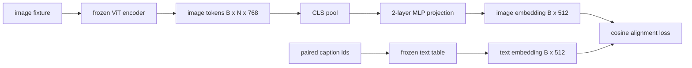

# Modalite Düzeltmesi için Projection Layer

> Bir görüntü kodlayıcı görüntü belirtilerini üretir. Bir metin dekodörü metin belirtilerini tüketir. İkisi farklı vektör alanlarında yaşar. Küçük iki katlı MLP, görüntü belirtilerini metin yerleştiren alanlara projekt eder ve çiftleştirilmiş başlıklara karşı kosinus ayar kaybı iki alanı anlaşmaya çekir. Bu projeksiyon bir görüntü dil modelinin en küçük parçasıdır ve aktarım için en önemli olanıdır.

**Type:** Build
**Languages:** Python
**Prerequisites:** Phase 19 lessons 30-37 (Track B foundations)
**Time:** ~90 minutes

## Öğrenme Hedefleri

- Görüntü özelliklerini metin yerleştirme alanına haritası yapan iki katmanlı bir MLP projeksiyonu oluşturun.
- Sahte metin yerleştirme tablosunu oluşturun (önce eğitilmiş bir işaretlemeci yok, gerçek bir korpus yok).
- Yönlendirilmiş görüntü belirtileri ve çiftleştirilmiş başlık yerleştirilmesi arasında bir cosine ayar kaybı hesaplayın.
- Projeksiyonu dondurulmuş bir görüntü kodlayıcı ve dondurulmuş bir metin tablosu ile tek başına çalıştırın.

## Sorun

Görüş kodlayıcı (dersi 58-59) boyut işaretleri üretir .`vision_hidden = 768`Yukarıda yerleştirmek istediğin bir metin dekodörü var .`text_hidden = 512`Bu, bir kodlayıcı tarafından sadece görme öncesi eğitiminde öğrenilen bir temel üzerinde yaşamak anlamına gelir.

İki katmanlı MLP projeksiyonu (lineer, GELU, lineer) boşluğu köprüler.`768 * 1024 + 1024 * 512 = 1.3M`Bu, bir BLIP-2'nin Q-Former olarak yeniden çerçevelediği ve o zamandan beri her açık ağırlıklı VLM'nin bir şekilde kabul ettiği bir LLaVA reçetesidir.

## Anlaşım



### Proje yapmadan önce bir araya getirmek

Görüş kodlayıcı 197 simge yayar. Metin tarafında tek bir başlık seviyesine yerleştirilmiştir. Onları sıralanmak için örnek başına bir görüntü seviyesine vektör gerekir. CLS birleştirme en basit yöntemdir: kodlayıcıdan ilk simgeyi alın ve onu projekt edin. Tüm 197 simge üzerinde ortalama birleştirme bir başka seçenektir ve SigLIP'in kullandığı şeydir.

### Neden iki katman ve bir katman değil ?

Tek bir çizgisi projeksiyon dönüp yeniden ölçeklendirebilir, ancak iki alanın eğrilik eşleşmezliği varsa temelini sabitleyemez. İki doğrusal katman arasındaki GELU, projeksiyonu bir doğrusal olmayan eğime verir, bu da CLIP tarzı özellikleri dil modellerinin yerleştirilmesine uyum sağlamak için empiri olarak yeterlidir. Daha derin projeksiyonlar (LLaVA-NeXT GLU kullanıyor; Qwen-VL bir dikkat katmanları istifesini kullanıyor) uzantılardır; iki katlı MLP kanonik temel çizgidir ve BLIP-2'nin Q-Former projeksiyon baş gemilerinin kapının altında olanıdır.

| Layer | Shape | Parameters |
|-------|-------|------------|
| fc1 | `(vision_hidden, projection_hidden)` | `768 * 1024 + 1024` |
| activation | GELU | 0 |
| fc2 | `(projection_hidden, text_hidden)` | `1024 * 512 + 512` |

Bir  için yaklaşık 1.3M parametreler`768 -> 1024 -> 512`Başını.

### Kosin ayar kaybı

Düzleşme demek değil.`image_emb == text_emb`- Düzeltme demek .`image_emb`Aynı yönde noktalar `text_emb`- Kozin kaybı.`1 - cos_sim(image, text)`Bu ders, her resmin kendi başlığından daha yakın olması gerektiği kontrastlı bir partiye (InfoNCE) genelleştirir. Bu ders, dinamiklerin görünür olması için çift başına versiyonu kullanır.

### Dondurulmuş kodlama hilesi .

Görüş kodlayıcı 86M parametresi var. Metin tablosunda birkaç milyon daha var. Hepsini sahte bir kurpustan eğitmek başlamaktır. Her ikisini de dondurmak, projeksiyonun 1.3M parametreleri değişen tek şey demektir ve sentetik çiftler üzerinde birkaç yüz adım kaybı azaltmak için yeterlidir. Bu tam olarak her adaptör tabanlı VLM'nin işletim şekli: Ağır parçalar donmuş kalır, hafif köprü trenleri.

```figure
ch-projection-bridge
```

## Yapın

`code/main.py`Uygulamaları:

- `MLPProjector(in_dim, hidden_dim, out_dim)`GELU aktivasyonu ile iki katlı lineer MLP.
- `MockTextEmbedding(vocab_size, dim)`, bir tohumdan belirleyici başlangıç ile donmuş bir gömleme tablosu.
- `make_pair(seed, vocab_size)`Başlıklar kısa id dizisi; başlık yerleştirme, simge yerleştirmeler üzerinde ortalama birleştirilmiştir.
- `cosine_alignment_loss(image_emb, text_emb)`, çift başına`1 - cos_sim`- Amacımız.
- 32 sentetik çift üzerinde 200 adım boyunca projeksiyonu (sikle) yapan bir eğitim döngüsü, görme kodlayıcı ve metin tablosu dondurulmuş ve kayıp her 25 adımda bir basılır.

Çek şunu:

```bash
python3 code/main.py
```

Çıktı: eğitim raporları, ilk kayıplardan yaklaşık 1.07'den yaklaşık 0.80'e düşer ve 200 adım içinde, yalnızca projeksiyonun görüntü jetonlarını metin alanına çekebileceğini gösterir.

## Kullan

Aynı model her açık ağırlıklı VLM'de görülüyor:

- **LLaVA 1.5.**İki katmanlı GELU MLP projeksiyonu CLIP-ViT-L'den gizlenerek LLaMA'ya gömülür. Dondurulmuş görme kodlayıcı, dondurulmuş LLM, sadece projeksiyonu çalıştırır (doğrusu ikinci aşamada LLM'yi dondurur).
- **BLIP-2.**Q-Former, 32 öğrenilmiş sorgu simgesi ile görüntü simgesi karşı karşı karşıya dikkatle alır, sonra LLM gömleği dim'e projeler.
- **MiniGPT-4.**BLIP-2 Q-Former çıkışından Vicuna gömülme zayıflığına tek çizgici projeksiyon.
- **Qwen-VL.**Birkaç katmanlı çapraz dikkat adaptörü, ama son parça yine LM gömülmesi bulanık bir projeksiyon.

Şekil değişir ama rol aynıdır: bir havuz görüntü belirtileri, projekt metin gömülmesi zayıf, tek başına tren.

## Testler

`code/test_main.py`kapsamlar:

- Projector çıkış şekli yapılandırılmış ile eşleşir `out_dim`
- Dondurulmuş metin yerleştirme tablosunun sıfırı var `requires_grad`parametreler
- Eşsiz vektörlerde kozin kaybı sıfır, paralel olmayan vektörlerde ise 2
- Bir geriye geçişten sonra projector gradient akışları
- Eğitim döngüsü, adım 0 ile adım 200 arasında kayıpları azaltır.

- Onları çalıştır:

```bash
python3 -m unittest code/test_main.py
```

## Egzersizler

1. CLS birleştirmeyi 196 patch token üzerinde ortalama birleştirme ile değiştirin ve 200 adımdan sonra son kaybı karşılaştırın. Ortalama birleştirme genellikle sentetik veriler üzerinde daha hızlı çalışır; CLS doğal görüntülerde daha örnek verimlidir.

2. Kosin kaybına öğrenilen skalar sıcaklığı ekleyin (`cos / tau`) ve ne zaman olur izleyin.`tau`Çok küçük (gredyan ses) veya çok büyük (kayıp platoları yüksek).

3. İki katlı MLP'yi tek bir doğrusal katman için değiştirin ve kayıp boşluğunu ölçün.

4. Projector ağırlıklarına küçük bir L2 cezası ekleyin ve kosinus ayarıyla nasıl etkileşime girdiğini izleyin (kosinus ölçek değişmez, bu nedenle cezası çoğunlukla kullanılmayan yönleri küçültürür).

5. Projector ağırlıklarını sürdürün, sonra yeniden yüklenme ve görüntü kodlayıcıyı geriye geçmeden sonuçlandırmayı çalıştırın.

## Anahtar Terimler

| Term | What it means |
|------|---------------|
| Modality alignment | The act of making image and text embeddings comparable in one shared space |
| Projection head | The small module that maps one space to another, usually a 2-layer MLP |
| Cosine similarity | Dot product divided by the product of L2 norms |
| Frozen encoder | The vision (or text) model has all parameters with `requires_grad=False` |
| Mock corpus | Synthetic pairs used so training has no dataset download dependency |

## Daha Fazla Okumak

- İki aşamalı tren için LLaVA kağıdı (proje, sonra LM'yi dondur).
- Öğrenilebilir bir projeksiyon alternatif olarak Q-Former için BLIP-2 kağıdı.
- Daha derin projeksyon başlıkları olarak çapraz dikkat adaptörleri için Qwen-VL teknik raporu.
