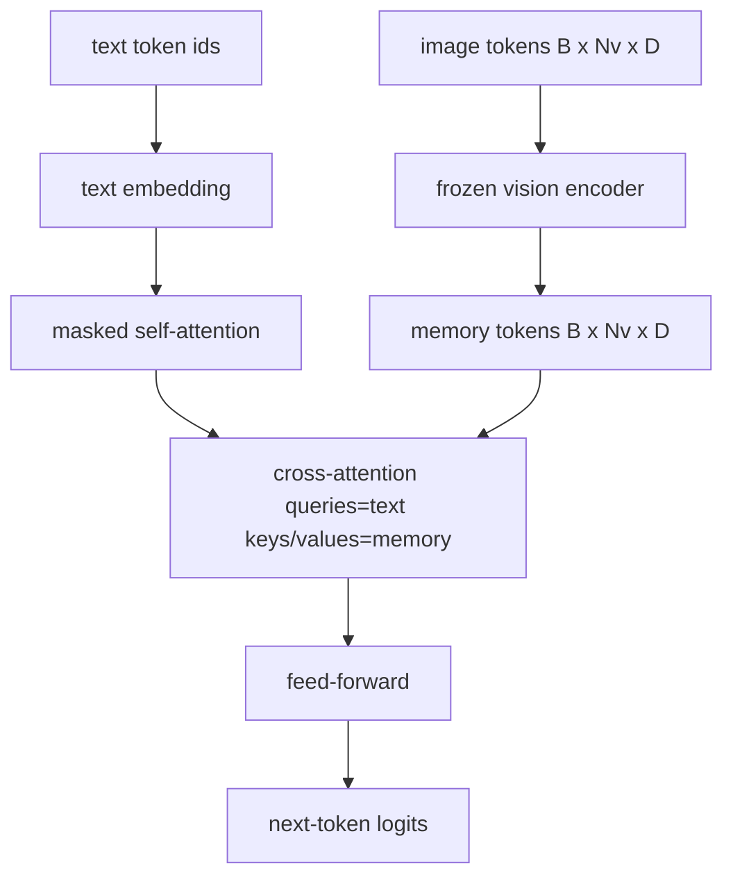
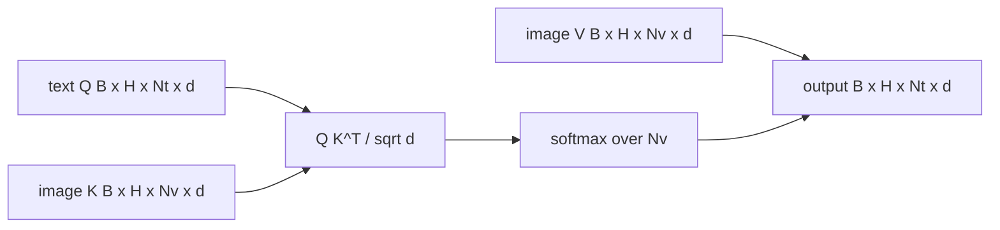

# Çaplak Dikkat Füzyonu

> Yönleme katmanı bir görüntü vektörünü bir başlık vektörüne uymaktadır. Gerçek bir görme dilinde dekodör her bir yazılı token'a ihtiyaç duyar. Böylece model her kelimeyi bir bölgede yerleştirebilir. Çelişkili dikkat, bu yerleşimlerin nasıl gerçekleşeceğini gösteriyor. Metin sorular; görüş anahtarları ve değerleri cevap verir. Bu ders, çapraz dikkat blokunu, sebepli metin kendi dikkatini ve her ikisini de yasal tutan maske şekillerini oluşturur.

**Type:** Build
**Languages:** Python
**Prerequisites:** Phase 19 lessons 30-37 (Track B foundations)
**Time:** ~90 minutes

## Öğrenme Hedefleri

- Sorgu akışı metindir ve anahtar/değer akışı görsel olduğunda çok yönlü çapraz dikkat uygulanmalıdır.
- Bir dekodör bloğunu oluşturun: sebepli kendi dikkatini + çapraz dikkatini + ileriye aktarmayı.
- Maskenin şeklini doğru tut: sebepli maske kendini dikkat etmek için, karşılıksal dikkat için maske yok.
- Batch metin jetonları ve sabit bir görüntü jetonları havuzu ile ileri geçiş çalıştırın.

## Sorun

Resim jetonları ve metin jetonlarını bir diziye bağlamak bir füzyon seçeneğidir (erken füzyon, Chameleon ve Emu3'ün aldığı yol). Çelişkili dikkat diğeridir (son fusion, Flamingo'nun tanıtıldığı ve o zamandan beri tüm Flamingo şeklinde dekodörlerin kopyaladığı yol).

Geç füzyon iki avantajı vardır. Birincisi, metin akışı temiz kalır ve model yalnızca metin özelliklerini korur. İkincisi, görüntü akışı her görüntü başına bir kez hesaplanır ve her dekodleme adımı için tekrar kullanılır, bu nedenle uzun başlıklar için bile jenerasyon ucuz.

## Anlaşım





### Maske şekilleri

Bir dekodör blokunun içindeki iki dikkatin farklı maskelere ihtiyacı vardır:

| Attention | Query length | Key length | Mask | Why |
|-----------|--------------|------------|------|-----|
| Self-attention | `Nt` (text) | `Nt` (text) | Causal: lower-triangular `(Nt, Nt)` | Text tokens may not look ahead during autoregression |
| Cross-attention | `Nt` (text) | `Nv` (vision) | No mask | The whole image is visible to every text position |

Ders bir şekil doğrulama işlevi içerir . Böylece onları karıştırma hatası bir `ValueError`Sessizce kırılmış bir kayıp eğri yerine.

### Neden dikkatini değiştiren bir maske yok ?

Resim herhangi bir metin oluşturulmadan önce tamamen gözlemlenir.`t`Bazı Flamingo varianları, birden fazla görüntü ve metin bölümü birbirine bırakıldığında örnek başına bir maske kalıbı ekler, ancak tek bir görüntü ve bir başlık için, çapraz dikkat her şeyi görür.

### Anahtar/değer önbelleği

Resim anahtarları ve değerleri, çözme başlangıcında bir kez hesaplanır ve bir önbelleğe yerleştirilir. Her yeni metin token, önbelleği yeniden hesaplama olmadan kullanır. Bu, başlık yazmayı sonuçlandırmada hızlı hale getiren şeydir: ağır ViT bir kez çalışır; çapraz dikkat her adım için anahtarlarını ve değerlerini tekrar kullanır. Ders önbelleği ortaya çıkarır ve önbelleğe vurulan yolu test eder.

### Blok bileşimi

Bir dekoder bloğu çalışır: pre-LN -> kendinize dikkat -> geri kalan -> pre-LN -> çapraz dikkat -> geri kalan -> pre-LN -> ileriye aktar -> geri kalan. Her biri kendi LayerNorm ile üç alt katman. Flamingo kağıdı çapraz dikkat üzerine öğrenilmiş bir kapı ekledi, böylece model eğitim zamanı istikrar maliyetinde görüntü yolundan çıkıp çıkılabilir; kanonik temel çizginin (burada kullanılır) kapısı yoktur.

```python
class DecoderBlock:
  def forward(self, text_tokens, image_tokens, text_mask, cross_mask):
      text_tokens = text_tokens + self.self_attn(self.ln1(text_tokens),
                                                 mask=text_mask)
      text_tokens = text_tokens + self.cross_attn(self.ln2(text_tokens),
                                                  image_tokens,
                                                  mask=cross_mask)
      text_tokens = text_tokens + self.ffn(self.ln3(text_tokens))
      return text_tokens
```

```figure
ch-crossattn-fan
```

## Yapın

`code/main.py`Uygulamaları:

- `CrossAttention(hidden, heads)`, ayrı ayrı bir başlı çapraz ilgi`q`ve `kv`Yönlendirme.
- `CausalSelfAttention(hidden, heads)`, standart bir dekodörden maskeli dikkat.
- `DecoderBlock`, üç alt katmanı, LN öncesi kalıntılarla oluşturur.
- `VisionLanguageDecoder`, dört katmanlı dekodör, sahte görüntü kodlayıcı çıkışı ve küçük bir metin yerleştirme tablosu ile beslenir.
- `causal_mask(length)`bir `(length, length)`Alt üçgenli Boolean tensörü.
- Uzunluk 10'lu iki metin dizisinin bir partiyi uzunluk 197'lik bir görüntü belleği ile besleyen ve çıkış şeklini, kendi dikkat maskesinin şeklini ve her pozisyonda çapraz dikkat çıkış normunu yazdırırmış bir demo.

Çek şunu:

```bash
python3 code/main.py
```

Çıktı: dekodör bir `(2, 10, text_vocab)`- Maske şekli `(10, 10)`KV-cache tekrar kullanımı kontrolü, önbelleğe alınan ve önbelleğe alınmayan yollar arasında aynı logitleri doğruluyor.

## Kullan

İki üretim ailesinde çapraz ilgi görülüyor:

- **Flamingo and IDEFICS.**K dil model bloklarına, donmuş bir LM ile çapraz dikkat alt tabakası yerleştirin. Görme dili adaptörü çapraz dikkat bloku artı kapısıdır.
- **BLIP-2.**Q-Former, sabit 32 sorgu jetonundan gelen çapraz dikkatini görüntü özelliklerine kullanır, sonra sorguları LM gömme alanına projekt eder.

Bu dersdeki blok şekli doğrudan her ikisine de yer alır.

## Testler

`code/test_main.py`kapsamlar:

- Sebep maskası alt üçgen ve beklenen boolean şekle uygular
- Çelişkili dikkat çıkış şekli `(B, Nt, hidden)`Anahtar uzunluğundan bağımsız olarak
- KV-cache yolu, kaydedilmemiş yolla yüzen toleransına eşleşir
- Metin ve görüntü akışları arasındaki şekil uyuşmazlığı net bir `ValueError`
- Tam bir dekodör ön geçisi doğru parti ve dizi şeklini oluşturur

- Onları çalıştır:

```bash
python3 -m unittest code/test_main.py
```

## Egzersizler

1. Çarpışıklık geri kalanına (Flamingo hilesi) öğrenilmiş bir tanh kapısı ekleyin ve neredeyse sıfır bir başlangıç kapısından gelen eğitimlerin birleştiğini doğrulayın. Kapı 0'dan başlar; model görüntü akışını karıştırmadan önce yalnızca metin davranışını geri kazanır.

2. Aynı dekodörün birden fazla görüntü ve birden fazla metin bölümü tükettiği durumlarda birbirine karışmış dikkat uygulayın.

3.                                                                                                                                                                                                                                                                                                                                                                                                                                                                                                                              `Nt=64, Nv=576`(büyük çözünürlükte 24×24 bir ağ)`Nt * Nv`ve yüksek görüntü çözünürlüğünde hakimdir.

4. Çelişkili dikkat haritasına sorgu tarafındaki bir çıkış ekleyin ve gösterimde başlık çeşitliliğini ölçün (başlık örneği varyansiyası çapraz haritada çıkış ile artar).

5. Çarpışıklık katmanını, sabit bir 32 jeton sorgu havuzu tarafından bir katman başına bir kez görüntü özelliklerine katılan Q-Former tarzı bir dikkat bloğu için değiştirin.

## Anahtar Terimler

| Term | What it means |
|------|---------------|
| Late fusion | Text and vision stay in separate streams; cross-attention bridges them at every block |
| Cross-attention | Q comes from one stream, K and V from another |
| Causal mask | Lower-triangular boolean mask that prevents looking ahead during autoregression |
| KV cache | Image keys and values stored once and reused for every decode step |
| Memory tokens | The frozen image tokens that the decoder reaches into |

## Daha Fazla Okumak

- Flamingo (2022) kapalı çapraz dikkatle kanonik geç füzyon tasarımı için.
- BLIP-2 (2023) için Q-Former, öğrenilmiş bir soru havuzu olarak giyinmiş bir çapraz dikkat bloğu.
- Flamingo tarifinin açık ağırlıklı bir yeniden üretimi için IDEFICS (2023).
