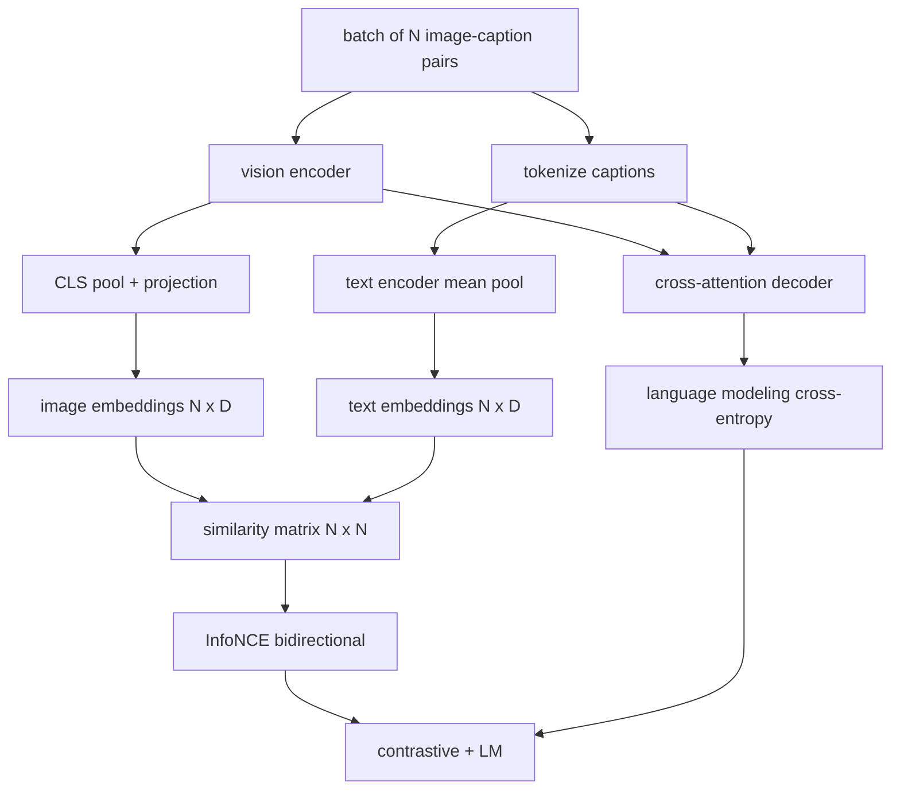

# Görme Dilini Yönlendirmek

> Kodlayıcı, projeksiyon ve dekodör kablolarla birlikte çalıştırılır. Şimdi bunları birlikte eğit. İki hedef öğrenmeyi teşvik eder: ortak yerleşim alanında eşleşen çiftleri bir araya getiren kontrastlı bir görüntü-metin kaybı (InfoNCE) ve her bir görüntü için doğru görüntü bulmak ve görüntü için bir başlık yazmak için ağı öğretir.

**Type:** Build
**Languages:** Python
**Prerequisites:** Phase 19 lessons 30-37 (Track B foundations)
**Time:** ~90 minutes

## Öğrenme Hedefleri

- Bir dizi görüntü başlıklı çiftler arasında InfoNCE kontrast kaybı uygulanmalıdır.
- Kontrast kaybı ile autoregressive dil modeli kaybı ile birleştirin.
- Gerçek veri kümesi indirilmeden 200 çiftlik sahte resim başlıklı bir corpus sentezleyin.
- 50 adımlık bir demo eğitim döngüsü çalıştırın ve her iki kayıpın da azalmasını gözlemleyin.

## Sorun

Görme dili modeli iki beceriye ihtiyaç duyar. Bir başlık verildiğinde, birçok kişi arasında doğru görüntü bulmalıdır. Bir görüntü verildiğinde, bir başlık yazmalıdır. Bir beceri üzerinde modelin eğitimi tek başına size yarı bir sistem verir. CLIP çivi sıralaması ama başlık yapamaz. GPT-4V başlık yapabilir, ancak sıralama için ayrı bir geri alma başlığı kullanır. Çoklu objektif önceden eğitimi her ikisini de bir geçit ile elde eder.

InfoNCE sıralama yarısını ele alır. N çiftler için model N eşleşen çiftleri pozitif olarak ve `N^2 - N`Yanlış eşleşen çiftler negatif olarak, sonra sonuçta çapraz entropi kaybı `(N, N)`LM kaybı, neslin yarısını ele alır: görüntüye bağlı standart bir sonraki belirti tahminidir. Her iki kaybı da farklılaştırılabilir ve kodlayıcı, projektor ve dekodör ağırlıklarını paylaşabilir.

## Anlaşım



### InfoNCE'nin tek bir paragrafında

N görüntü yerleştirmelerini satır olarak ve N metin yerleştirmelerini satır olarak yığ. L2- her ikisini de normalleştirin.`N x N`matris`S = I T^T / tau`nerede`tau`Diyagonal girişler eşleşen çiftlerdir; diyagonal dışı girişler negatifdir.`argmax`Dayak boyunca ilerliyor: Satır `i`sütunda en yüksek girişine sahip olmalıdır `i`Bu, sekiz satırdaki CLIP kaybı.

### Sıcaklık önemli

         `tau`Yumuşaklık maksimumının ne kadar yüksek olduğunu kontrol eder.`tau = 0.01`) ve gradient sadece en sert negatifden gelir, eğitim gürültülüdür. Çok büyük ve yumuşak maksimum düzeltir ve gradient kaybolur. CLIP öğrenir `tau`Bu da bir parametre olarak.

### Dil modeli kaybı

Dekoder, görüntü belleği belirtilerini çapraz dikkat yoluyla tüketir ve her pozisyonda bir sonraki metin belirtilerini tahmin eder. Kayıp, bir sonraki pozisyon hedefiyle standart çapraz entropi.

### Kayıpları birleştirmek

`total = contrastive + lm_weight * lm`nerede`lm_weight`Bu iki kayıp, gradientleri kodlayıcı ve projeksiyonda paylaşır; sadece dekodör LM kayıp gradienti alır. Bu CoCa, BLIP ve SigLIP tarzındaki modellerin çeşitli ağırlıklarla kullandığı çok görevli bir tarif.

| Component | Loss surface | Affects |
|-----------|--------------|---------|
| InfoNCE | Pair ranking in the joint space | Encoder + projection + text head |
| LM | Token prediction conditioned on image | Encoder + projection + decoder |
| Combined | Multi-task | Whole stack |

### Neden 50 adım bir demo için yeterli?

Sahte corpus, rastgele görüntüler ve rastgele başlık kimlikleri ile sentetik 200 çiftli bir settir. 50 SGD adımdan sonra, 16 parti boyutu ile, her iki kayıp da mutlak değerlerin gerçek veri modeli elde edeceği değerlerin üzerinde kalmasına rağmen görünür olarak düşer. Demo'nun amacı gradient tesisat çalışmalarının sonuna kadar doğrulanması ve LM kaybının eklenmesi karşıtılı hedefleri istikrarsızlaştırmaz.

```figure
ch-infonce-diagonal
```

## Yapın

`code/main.py`Uygulamaları:

- `MultimodalModel`, küçük bir ViT kodlayıcı, MLP projeksiyonu, küçük bir metin taraflı kodlayıcı (eğlenmiş kimliklerin ortalama bir kaynağı) ve ders 61'den çapraz dikkat dekodörü birleştirir.
- `info_nce_loss(image_emb, text_emb, temperature)`, iki yönlü CLIP tarzı kontrast kaybı.
- `lm_loss(logits, target_ids, padding_id)`, maskeli bir sonraki simge çapraz entropisi.
- `make_mock_corpus(seed, n_pairs)`, 200 belirleyici (resim, yazı_id) çiftini geri verir.
- 50 adımlık bir eğitim döngüsü, 16 parti boyutu, Adam optimizörü ve öğrenilmiş bir günlük sıcaklık parametri ile.

Çek şunu:

```bash
python3 code/main.py
```

Üretim: kontrast kaybı yaklaşık olarak düşüyor `ln(16) = 2.77`LM kaybı,                                                                `ln(512) ≈ 6.24`Bu iki düşüş de gradientin doğru şekilde kabloluğunu kanıtlıyor. Gerçek modeller milyonlarca adım için tren yapıyor.

## Kullan

Bu da gönderilen aynı kaybı tarifi:

- **CLIP (2021).**Sadece görüntü-metin kontrastı, ayrı bir donmuş kodlayıcı başlık sorgulaması ile.
- **CoCa (2022).**Resim-metin kontrastı artı resim başlık kaybı bir modelde.
- **BLIP (2022) and BLIP-2.**Kontrast artı LM artı görüntü-metin eşleşme başı.
- **SigLIP (2023).**Sigmoid çift kaybı için InfoNCE'yi değiştirir; aynı kontrastlı rol, farklı fonksiyonel form.
- **LLaVA family.**Birinci aşamalı düzeltme (dozulan LM'de cozin) ve ikinci aşamalı iki aşamalı eğitim, donmamış LM ile LM kaybını ekler. 60 ders birinci aşamaya haritalar; bu ders ikinci aşamaya haritalar.

## Testler

`code/test_main.py`kapsamlar:

- InfoNCE kaybı resim/metin satırları arasında simetriktir
- InfoNCE kaybı benzerlik matrisi büyük olumlu sayıların mükemmel bir diyagonal olduğu zaman 0 gönderir
- LM kaybı, dolgu pozisyonlarını doğru şekilde maske eder
- Modelle ileri geçiş hata olmadan her iki kayıp üretir
- 5 adımlı eğitim döngüsü, birleşik kayıpları azaltır.

- Onları çalıştır:

```bash
python3 -m unittest code/test_main.py
```

## Egzersizler

1. InfoNCE'yi SigLIP tarzı sigmoid çift kaybı ile değiştirin ve simülasyon korpusunda konverjensiyi karşılaştırın.

2. Hard-negative madencilik adımını ekleyin: her diğer parti, önceki partiden en sert diyagonal çiftini seçin ve ekleyin.

3. Üç başlı BLIP'in ayarını kopyalayarak üçüncü bir kayıp için ortak gömülmenin üstüne bir görüntü-metin eşleşen ikili baş ekleyin (gerçek/sahte: bunlar eşleşir mi?)

4. Yaptıklık korpusunu, geçiş matrisi görüntü haşına bağlı olan Markov zincirinden alınan başlık kimliği dizisi ile değiştirin. Başlık kaybı daha da düşmelidir çünkü gerçek bir öğrenilebilir sinyal var.

5. Aynı modelle tren yap `lm_weight = 0`Ve yine `lm_weight = 1`- Karşılaştırıcı kayıplar; LM kayıpları sıralama hedefine geri dönmemelidir.

## Anahtar Terimler

| Term | What it means |
|------|---------------|
| InfoNCE | Noise contrastive estimation: cross-entropy on a similarity matrix |
| Temperature | Scalar that controls how peaked the contrastive softmax is |
| Hard negative | An off-diagonal pair the model finds confusing, useful for sampling |
| LM loss | Standard next-token cross-entropy on the captioning side |
| Joint embedding space | The shared space where image and text vectors live after projection |

## Daha Fazla Okumak

- Orijinal kontrastlı tarif için CLIP kağıdı.
- Bir modelde kontrast ve başlıklı bir şey için CoCa kağıdı.
- Sigmoid çift kaybı variansı için SigLIP kağıdı ve neden daha iyi ölçeklendirilir.
