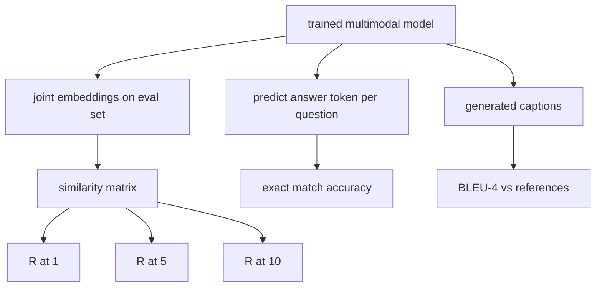

# Multimodal değerlendirme

> Eğitim, yarı döngüdür. Diğer yarı ölçümdür. Bu ders, üç değerlendirme yüzeyini ilkelerden oluşturur: R@1, R@5, R@10 olarak bildirilen görüntü başlıklı alıntı; tam eşleşme doğruluğu olarak bildirilen görsel soru cevaplaması; ve görüntü başlıklandırması BLEU-4 olarak bildirilen görüntü.

**Type:** Build
**Languages:** Python
**Prerequisites:** Phase 19 lessons 58-62 (Track E foundations: encoder, transformer, projection, cross-attention fusion, pretraining)
**Time:** ~90 minutes

## Öğrenme Hedefleri

- Resim ve başlık yerleştirmeleri arasındaki benzerlik matrisinden Recall@K hesaplayın.
- Tam eşleşen VQA doğruluğunu, sabit bir cevap sözlüğüne (resim, soru) eşlik eden bir modelden hesaplayın.
- Yaratılan ve referans token dizilerinden herhangi bir dış kütüphaneden BLEU-4 hesaplayın.
- Üç değerlendirmeyi de ders 62'deki eğitimli modelin üzerine inşa edilmiş sentetik bir takımla karşılaştır.

## Sorun

Eğitim kaybı platoları olduğunda bir multimodal modeli bitirdiğini ilan etmek ayartma. Eğitim kaybı ölçümleri eğitim dağılımına uyar; modelin tutulan bir partide çiftleri sıralayabileceğini, bir soruya cevap verebileceğini veya bir insanın kabul edeceği bir başlığı yazabileceğini ölçmez. Üç değerleme yüzey standarttır:

- **Retrieval (R@1, R@5, R@10).**Bir sorgu başlığı için ortak gömülü oluşturun; eval havuzundaki her resmi cosine göre sıralayın; eşleşen resmin üst 1, üst 5, üst 10'da yer aldığını bildirin. Simetrik (resim-söz) form aynı şekilde çalışır.
- **Visual question answering (exact match).**Verilen (resim, soru), model bir cevap jetonu çıkarır. Tam eşleşme örnek başına bir bit: öngörülen cevap referans cevabına eşit miydi?
- **Captioning (BLEU-4).**Bir başlık oluşturun. Referans başlıklarına göre 1 gram ile 4 gram doğrulukları arasındaki geometrik ortalamayı hesaplayın. Kısalık cezası ile.

Her metrik ince bir fonksiyondur. Ders hepsini kodla inşa eder, böylece matematik beton olur ve yüzey kontrolünüz altında kalır. Gerçek referans takımları (MS-COCO, VQA v2, GQA, OK-VQA) aynı fonksiyon şekillerine bağlanır.

## Anlaşım



### benzerlik matrisinden hatırlat@K

Yapın `(N, N)`Resim ve başlık yerleştirmeleri arasındaki kozine benzerlik matrisi. Her satır için, sütunları aşağıdaki benzerlik ile sıralayın. Recall@K, diyagonal sütun indeksi üst K konumlarında bulunan satırların bölümüdür. Simetrik Recall@K (caption-to-image) transpose edilen matris üzerinde hesaplanır. Her iki rakam da bildirildi. N=100 değerlendirmesi için, R@1 = 0.6 100 başlıktan 60'ının en üst eşleşme olarak doğru resmini aldığını gösterir.

### VQA'nın tam eşleşmesi

Her bir (resim, soru, cevap) için, resmini kodlayın, soruyu yerleştirin, dekodör aracılığıyla birleşin ve sonraki simgeyi okuyun. Önceden belirtilmiş simge kimliği referans kimliği ile karşılaştırılır; eşit ise doğru. Değerlendirme setinden ortalama. Gerçek VQA veri kümeleri, her soruya birden fazla insan tarafından not edilen cevaplarla gönderilmektedir ve yumuşak doğruluk formülü kullanılır (1.0 eğer 10 notatörden en az 3'ü aynı fikirdeyse, aşağıda ölçeklendirilmiştir); derse netlik için tek cevaplı kesin eşleşmeyi kullanır.

### BLEU-4

```text
BLEU-4 = BP * exp(mean(log p1, log p2, log p3, log p4))
```

Nerede ?`p_n`değiştirilmiş n-gram doğruluğu (herhangi bir referansta bulunan üretilen n-gramların toplam üretilen n-gram ile bölünmüş kesilmiş sayısı) ve `BP`Kısa süreli ceza:

```text
BP = 1                if generated length > reference length
   = exp(1 - r/g)     otherwise, where r is reference length and g is generated
```

Küçük örnekler için yumuşatma gerekir.`p_n`Uygulama, düşük sayımlı rejimler için en güvenli varsayılan olan Chen ve Cherry "metodu 1" (herhangi bir sıfır sayımı için sayıcı ve isimlendiriciye 1 ekle) kullanır.

### Sintez değerlendirme kümesi

50 örnek değerlendirme kümesi, ders 62'de kullanılan aynı sahte corpus örneğinden, bir beklenmedik tohumla bellekte inşa edilmiştir.

- `pairs`: 50 (resim, caption_ids) çift geri alınması için.
- `vqa`: 50 (resim, soru, cevap) üçlü.
- `caps`: 50 (resim, [reference_caption_ids, ...]) bir resim başına en fazla 3 referans ile yazılar.

Suit, tohumdan belirlenir ve eğitim korpusundan çıkarılır, bu nedenle ölçümler modelin hiç görmediği veriler üzerinde hesaplanır.

| Metric | Range | Random baseline (N=50) |
|--------|-------|------------------------|
| R@1 | 0 to 1 | 0.02 (1 / N) |
| R@5 | 0 to 1 | 0.10 |
| R@10 | 0 to 1 | 0.20 |
| VQA EM | 0 to 1 | 1 / vocab |
| BLEU-4 | 0 to 1 | small but nonzero |

Sentetik verilere dayalı 50 adımlı bir eğitim için ölçümlerin yüksek olması beklenmiyor; demo kontrolü olan rastgele temel çizgiden yukarı olması bekleniyor.

```figure
ch-recall-window
```

## Yapın

`code/main.py`Uygulamaları:

- `recall_at_k(sim_matrix, k)`, bir yüzen geri döndürmek için `[0, 1]`Her iki yönde de.
- `vqa_exact_match(predictions, references)`, ortalama değerini geri getirir .`int`eşitlik.
- `bleu4(generated, references, smoothing=True)`, çok referanslı destekle.
- `build_eval_suite(seed, n_samples, vocab_size, max_len)`, üç belirleyici değerlendirme listesini geri verir.
- `evaluate(model, suite)`, tüm üç metrikleri çalıştırır ve bir `dict`Sayılar.
- Ders 62'den yeni başlatılmış bir multimodal modeli yükleyen bir demo, değerlendirir, sonra 50 adım boyunca eğitilir ve tekrar değerlendirir, ön/sonu ölçümleri basar.

Çek şunu:

```bash
python3 code/main.py
```

Çıktı: ön/sonu metrik tabloda modelin öğrendiği sinyali için neredeyse rastgeleden geri alınma gelişimi, rastgeleden yukarı gelişen VQA ve BLEU-4 gelişimi (sentetik yapısı 4 gram hassas bir kaldırım için yeterlidir) gösterilmiştir.

## Kullan

Her metrik doğrudan bir üretim referans değerine yerleştirir:

- **Retrieval.**MS-COCO 5K val, Flickr30K, ImageNet sıfır çekim hepsi aynı benzerlik matrisinde R@K sorunlarıdır.
- **VQA.**VQA v2, GQA, OK-VQA aynı tam eşleşen şekli kullanır (VQA v2 için tek cevap EM yerine yumuşak acc ile).
- **BLEU-4.**MS-COCO başlıklı, NoCaps, Flickr30K başlıklı hepsi BLEU-4 artı CIDEr ve METEOR kullanıyor. CIDEr eklemek bir işlev daha.

Gerçek referans değerleri için, değişim`build_eval_suite`Matematik, referans-agnostik.

## Testler

`code/test_main.py`kapsamlar:

- remember@k, mükemmel bir kimlik benzerliği matrisinde 1.0 ve k < N için ters birinde 0.0 gönderir.
- hatırlatmak için saygı duyarız .`k <= N`üst sınır
- bleu4 1.0'u oluşturduğunda, referanslardan birisine eşit olur.
- bleu4 ayrılmış kelime birikimi için 0.0 gönderir.
- vqa tam eşleşme eşit çiftlerin bölümüdür
- build_eval_suite beklenen çift, vqa öğeleri ve başlık girişlerini gönderir

- Onları çalıştır:

```bash
python3 -m unittest code/test_main.py
```

## Egzersizler

1. CIDEr, bilgi verici tokenleri ödüllendiren n-gramlar üzerinde TF-IDF ağırlığını kullanır.

2. Yumuşak doğruluklı VQA uygulamak: her soruya birden fazla insan cevabı, doğruluk `min(human_count / 3, 1)`Eğer eşleşirse, VQA v2'yi kopyalar.

3.  NaN güvenli bir çeşit ekleyin`bleu4`Bu boş üretilen dizilerle çarpışmadan çalışır.

4. R@K'nin yanında hesaplama ortalama karşılıklı sıralama (MRR) MRR, doğru öğenin üst K'nin ötesinde yer aldığı yere karşı hassasdır; R@K, üst K'ye düşüp yer aldığı yere karşı hassasdır.

5. Evalüasyonu eğitim sırasında beş kontrol noktasında (addım 0, 10, 20, 30, 40, 50) çalıştırın ve öğrenme eğriyi çizin.

## Anahtar Terimler

| Term | What it means |
|------|---------------|
| R@K | Fraction of queries where the correct match lands in the top K results |
| Exact match | The simplest VQA scoring: predicted answer equals reference |
| BLEU-4 | Geometric mean of 1- to 4-gram precisions, with brevity penalty |
| Multi-reference | A captioning metric accepts several reference captions per image |
| Held-out | The eval set is sampled from a seed disjoint from the training corpus |

## Daha Fazla Okumak

- Yumuşak doğruluk formülü ve veri kümesi istatistikleri için VQA v2 kağıdı.
- TF-IDF ağırlıklı n-gram başlıklı yazılar için CIDER kağıdı.
- Düzeltme çeşitleri için BLEU orijinal (Papineni et al., 2002)
- MS-COCO başlıklı değerlendirme senaryoları, kanonik referans uygulaması için.
