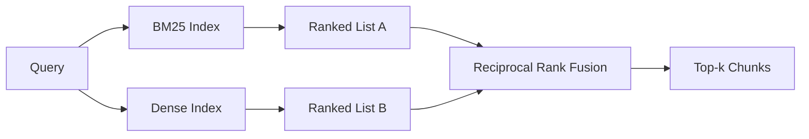

# BM25 ve Dense Eklentilerle Hibrit Çıkarma

> Leksik ve semantik geri alım ters sorgu dağılımlarında başarısız olur. karşılıklı sıra birleşimi ile hibrit geri alım interpolat etmez, oy verir - ve oy her sorgu sınıfında kazanır.

**Type:** Build
**Languages:** Python
**Prerequisites:** Phase 11 lessons 04 (embeddings), 06 (RAG); Phase 19 Track B foundations (lessons 20-29); Phase 19 lesson 64 (chunking strategies)
**Time:** ~90 minutes

## Öğrenme Hedefleri
- Robertson ve Sparck Jones formülasyonundan BM25'i sıfırdan uygulayın, alan ağırlığı, belge uzunluğunun normalleşmesi ve ayarlanabilir k1 ve b ile.
- Deterministik simge yerleştirme üzerine yoğun bir retriever yapın ki bu da döngü çevrimdışı çalışsın.
- Cormack, Clarke ve Buettcher'ın 2009'da yayınladığı gibi karşılıklı sıra birleşimini uygulayın ve neden puan ağırlığıyla interpolasyon üzerinde egemen olduğunu açıklayın.
- RRF k sabitini ve modaliyet ağırlıklarını ayarlayın ve küçük bir sabitleme korpusunda değişimleri okuyun.

## Sorun

Leksik arama, sorguda kelimenin tam anlamıyla bir tanımlayıcı bulunurken kazanır.`AbortMultipartOnFail`BM25 üzerinden doğru Go fonksiyonunu mikrosekünte geri verir. Aynı sorgu, gömülü, üç benzerlik kümesinin sınırında yer alır ve yoğun bir geri alıcı önce yanlış dosyayı sıralar.

Dense arama, sorunun korpusun sözcük simgelerinden uzaklaştırıldığında kazanır. "Kansallı yüklemeleri nasıl işletiyoruz" diye soran bir kullanıcı hiçbir zaman abort veya multipart kelimesini yazmadı. BM25, belge parçacığını "büyük dosyaları yükleme" üzerine gönderir çünkü bu sayfa yüklemeler kelimesini içerir. Dense geri alım, iptal fonksiyonunu bulur.

Bu iki seçenek arasında seçim statik bir seçenek değildir. Sorgu dağılımı değişkendir. Bir üretim RAG sistemi her iki sınıfı aynı uç noktadan ele alır, bu yüzden geri alım her ikisini de aynı anda ele almalıdır. Bu hibrid geri alımdır. Birleştirme adımı doğru olması gereken bölümdür.

## Anlaşım



### BM25 tek bir paragraf

BM25, sorgu terimleri üzerinde uzunluk-normalleştirme düzeni içeren doymuş bir term-frequency faktörü ile çarpılmış ters bir belge frekans faktörünü toplamlayarak bir sorgu-dokument çiftini puanlar.`k1`term-frequency saturation kontrolü; varsayılan 1.5 yayınlanan öneridir ve referans göstergesi olmadan taşımak olmaz. `b`Bu sayede, daha uzun belgelere ceza verilir, ancak çizgi olarak değil.

IDF formülü, Robertson ve Sparck Jones'un düzeltilmiş tanımını kullanıyor.`log((N - df + 0.5) / (df + 0.5) + 1)`Bu, küçük korpuslarda, teknik olarak nadir olan kısımlarda önemli olan bir terim olduğunda, günlük içindeki bir artı IDF'yi pozitif tutar.

Alan ağırlığı, BM25'e simge adındaki bir maçın vücutta bir maçtan daha fazla sayıldığını söylemenizi sağlar. Uygulama, puanlama sırasında değil, indeksleme sırasında sayılan terimin bir katıcısıdır. Bu matematikin aynı kalmasını sağlar ve her alan için ayrı bir puanı önler.

### Tek paragraf içinde yoğun bir çekim

Her parçayı bir yerleştirme modeli ile sabit boyutlu bir vektöre yerleştirin. Sorgu zamanında sorguyu yerleştirin, her parçayı benzerlik ile cosine sıralayın ve üst-k'yi geri verin. Model kaliteyi belirleyen değişkendir. Algoritminin kendisi iki satırdan oluşur: nokta ürünü ve sıralama.

Bu ders, bir ağ çağrısı olmadan füzyon matematikini okuyabilmeniz için belirleyici bir hash tabanlı yerleştirme kullanır. Hash, 96 boyutlu bir vektörde simge anahtarlı karşılaştırmalar toplamı yapar ve normalleştirir. Kosinus sıraları test süiti için gerektiren bir dizi boyunca belirleyici olur.

### Karşılıklı sıra birleşimi, yayınlanan formül

İki sıralama listesi. Her iki listeye giren aday için karşılıklı sıralama katkılarını toplamlayın. 2009 makalesinde kullanılmış `1 / (k + rank)`Bu da, k'nin 60'a eşit olduğu, yani toplam puanın değerini belirleyerek sıralamayı içerir.

Yayınlanan sabit k = 60 keyfi değildir. k = 60 ile 1 / 61 ve 10 oranında katkı 1 / 70 oranında. katkı yavaş yavaş bozulur, böylece derin adaylar hala oy kullanır.

Uygulamalarımızda iki ayarlanabilir düğme var.`k`BM25 veya yoğun bir çift, daha önce kanıtınız olduğunda BM25 veya yoğun bir çift olarak kullanılır.

### Neden füzyon puan ağırlığıyla interpolasyonu yener

BM25 puanları sınırsız ve korpus bağımlıdır.`alpha * bm25 + (1 - alpha) * cosine`Bu nedenle, bu işlemler, bir dizi dizi dizi dizi dizi dizi dizi dizi dizi dizi dizi dizi dizi dizi dizi dizi dizi dizi dizi dizi dizi dizi dizi dizi dizi dizi dizi dizi dizi dizi dizi dizi dizi dizi dizi dizi dizi dizi dizi dizi dizi dizi dizi dizi dizi dizi dizi dizi dizi dizi dizi dizi dizi dizi dizi dizi dizi dizi dizi dizi dizi dizi dizi dizi dizi dizi dizi dizi dizi dizi dizi dizi dizi dizi dizi dizi dizi dizi dizi dizi dizi dizi dizi dizi dizi dizi dizi dizi dizi dizi dizi dizi dizi dizi dizi dizi dizi dizi dizi dizi dizi dizi dizi dizi dizi dizi dizi dizi dizi dizi dizi dizi dizi dizi dizi dizi dizi dizi dizi dizi dizi dizi dizi dizi dizi dizi dizi dizi dizi dizi dizi dizi dizi dizi dizi dizi dizi dizi dizi dizi dizi dizi dizi dizi dizi dizi dizi dizi dizi dizi dizi dizi dizi dizi dizi dizi dizi dizi dizi dizi dizi dizi dizi dizi dizi dizi dizi dizi dizi dizi dizi dizi dizi dizi dizi dizi dizi dizi dizi dizi dizi dizi dizi dizi dizi dizi dizi dizi dizi dizi dizi dizi dizi dizi dizi dizi dizi dizi dizi dizi dizi dizi dizi dizi dizi dizi dizi dizi dizi dizi dizi dizi dizi dizi dizi dizi dizi dizi dizi dizi dizi dizi dizi dizi dizi dizi dizi dizi dizi dizi dizi dizi dizi dizi dizi dizi dizi dizi dizi dizi dizi dizi dizi dizi dizi dizi dizi dizi dizi dizi dizi dizi dizi dizi dizi dizi dizi dizi dizi dizi dizi dizi dizi dizi dizi dizi dizi dizi dizi dizi dizi dizi dizi dizi dizi dizi dizi dizi dizi dizi dizi dizi dizi dizi dizi dizi dizi dizi dizi dizi dizi dizi dizi dizi dizi dizi dizi dizi dizi dizi dizi dizi dizi dizi dizi dizi dizi dizi dizi dizi dizi dizi dizi dizi dizi dizi dizi dizi dizi dizi dizi dizi dizi dizi dizi dizi dizi dizi dizi dizi dizi dizi dizi dizi dizi dizi dizi dizi dizi dizi dizi dizi dizi dizi dizi dizi dizi dizi dizi dizi dizi dizi dizi dizi dizi dizi dizi dizi dizi dizi dizi dizi dizi dizi dizi dizi dizi dizi dizi dizi dizi dizi dizi dizi dizi dizi dizi dizi dizi dizi dizi dizi dizi dizi dizi dizi dizi dizi dizi dizi dizi dizi dizi dizi dizi dizi dizi dizi dizi dizi dizi dizi dizi dizi dizi dizi dizi dizi dizi dizi dizi dizi dizi dizi dizi dizi dizi dizi dizi dizi dizi dizi dizi dizi dizi dizi dizi dizi dizi dizi dizi dizi dizi dizi dizi dizi dizi dizi dizi dizi dizi dizi dizi dizi dizi dizi dizi dizi dizi dizi dizi dizi dizi dizi dizi dizi dizi dizi dizi dizi dizi dizi dizi dizi dizi dizi dizi dizi dizi dizi dizi dizi dizi dizi dizi dizi dizi dizi dizi dizi dizi dizi dizi dizi dizi dizi dizi dizi dizi dizi dizi dizi dizi dizi dizi dizi dizi dizi dizi dizi dizi dizi

Bu, Vespa ve Weaviate belgelerinde RankFusion vs RRF hakkında duyduğunuz aynı argüman.

```figure
rrf-fusion
```

## Yapın

`code/main.py`Uygulamaları:

- `tokenize(text)`- hızlı bir regex tokenizer.
- `BM25Index`- alan ağırlığı ile `add`ve `search`ve ayarlanabilir k1, b.
- `mock_embed`- Evet .`DenseIndex`- Ders 64 ile aynı belirleyici yerleştirme, böylece parçalar karşılaştırılabilir.
- `rrf(rankings, k, weights)`- yayınlanan multi-modality ağırlıkları ile birleşim.
- `HybridRetriever`- BM25 ve densi kombinasyonu.
- Bir demo .`main()`Bu, küçük bir sabitleme corpusunu yükler, her retriever'in güçlü ve zayıf yönlerini hedef alan üç sorgu yürütür ve her modalite üretilen sıralamaları artı birleşik listeyi yazdırır.

Çek şunu:

```bash
python3 code/main.py
```

Demos çıkışını yan yana okuyun. Sözcük tanımlayıcı sorusu BM25 sıra 1, yoğun sıra 4, RRF sıra 1. Parafrase sorusu BM25 sıra 6, yoğun sıra 1, RRF sıra 1. belirsiz sorgu BM25 sıra 3, yoğun sıra 3, RRF sıra 1. Füzyon bir eşleşme değildir; her sorgu sınıfında kazanan sistemdir.

## Kürekleri ayarlamak

| Knob | Default | Move it up when | Move it down when |
|------|---------|----------------|------------------|
| BM25 k1 | 1.5 | Terms repeat in documents and you want frequency to matter more | Documents are short and term repetition is noise |
| BM25 b | 0.75 | Long documents really do say less per word | Document length is uncorrelated with topic |
| RRF k | 60 | Deep candidates should keep voting | The top-1 should dominate |
| BM25 weight | 1.0 | Your corpus contains literal identifiers and queries match them | Your queries are user-paraphrased |
| Dense weight | 1.0 | Queries are paraphrased | Queries are literal |

Ders 68'in değerlendirme harmanını tekrar çalıştırarak, içgüdü ile değil, beklediğiniz sorgu setinize ayarlayın.

## Başarısız modlar demo gizlenecek

**Out-of-vocabulary tokens.**BM25'in IDF'si korpustan hesaplanır, bu nedenle sorguda yalnızca terimler sıfır katkı sağlar. Sık yerleşimler aynı terim için bir vektör halüsinasyon sağlar. Korpus dışı tanımlayıcılarda yoğun modaliteler makul görünen ama yanlış komşuları gönderir. Füzyon bunu absorbe eder çünkü BM25 hiçbir şey göndermez ve sıra katkı düşer, ancak yalnızca belge ile kopyalamayı keserseniz, parça olarak değil.

**Stop-token domination.**BM25 "the" kelimesine karşı bir düz sıralama oluşturur.

**Identical content across modalities.**Eğer korpusunuz BM25'in üst-1'i de yoğunluğun üst-1'ü olması için yeterince küçükse, RRF aynı komşuların üst-1'ini verir. Bu doğru bir davranış, bir başarısızlık değil, ancak birleşmeyi görünmez hale getirir.

## Kullan

Üretim biçimleri:

- BM25 indeks işlemi; şişe boynuzları, vektörler değil, term-frequency sözlüğüdür.
- Ayrı bir mağazada yoğun vektörleri indeksiye edin (bu dersde düz bir liste kullanıyoruz; üretimde HNSW kullanırdınız).
- Her iki soruyu da paralel olarak çalıştırın; birleşme, sendikanın üzerinde sürekli bir zaman birleşimidir.
- Her alınan darbe modaliteyi sürdürün böylece aşağıdaki bir yeniden sıralamacı hangi modaliteyi oy verdiğini görebilir.

## Gönder

Ders 66 bu dersden top-k'yi toplu olarak alır ve bir çapraz kodlayıcı ile yeniden sıralar. Ders 68 tüm boru hattını hassaslıkla, hatırlama, MRR ve nDCG ile değerlendirir. Bu dersdeki hibrit geri alıcı, ders 69'daki son-son sisteminin ilk aşamasıdır.

## Egzersizler

1. Değiştir `mock_embed`Provayderinizden gerçek bir modelle tekrar çalıştırın ve parafraseli sorguda sadece yoğun sıralama nasıl değiştiğini bildirin.
2. Üçüncü bir modalite ekleyin: ayrı olarak indekslenen ve üçüncü sıralama listesi olarak birleşen parça özetleri.
3. RRF k'yi 10, 30, 60, 100, 200'e doğru tarayın. 68 dersinden hatırlama@k eğrisini çizin.
4. BM25F'yi doğru bir şekilde uygulayın (koşul boyutunun çarpıcı hilesinin yerine normalleştirilmesi) ve simge eşleşmelerinin en önemli olduğu bir korpusta karşılaştırın.

## Anahtar Terimler

| Term | What people say | What it actually means |
|------|-----------------|------------------------|
| BM25 | "Lexical search" | Probabilistic ranking with idf x saturating tf x length normalization |
| RRF | "Rank fusion" | Sum of 1 / (k + rank) across ranked lists; k = 60 default |
| k1 | "TF saturation" | Controls how fast a repeated term stops adding more score |
| b | "Length penalty" | 0 means ignore document length, 1 means full normalization |
| Field weighting | "Symbol boost" | Repeat tokens during indexing to boost matches in that field |
| Rank-based vs score-based fusion | "Why RRF beats linear" | Ranks are comparable across modalities; scores are not |

## Daha Fazla Okumak

- Cormack, Clarke, Buettcher, "Reciprocal Rank Fusion outperforms Condorcet and individual rank learning methods", SIGIR 2009
- Robertson, Walker, Beaulieu, Gatford, Payne, "Okapi at TREC-3" (orjinal BM25 kağıdı)
- [Vespa: Hybrid Retrieval with BM25 and Embeddings](https://docs.vespa.ai/en/tutorials/hybrid-search.html)
- [Weaviate: Hybrid Search](https://weaviate.io/developers/weaviate/search/hybrid)
- EY 11 Ders 06 - RAG Temellikleri
- Fase 19 ders 64 - çıkışları burada indeksizlenmiş olan parçacıklar
- Fase 19 ders 66 - top-k'yi tüketen çapraz kodlayıcı yeniden sıralama
