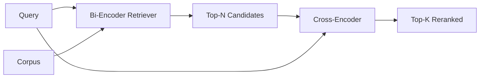

# Çapraz Kodlayıcı Yeniden Reranker

> Bir iki kodlayıcı sorgulama ve belgeyi bağımsız olarak yerleştirir. Bir çapraz kodlayıcı onları birleştirir ve her ikisini de aynı anda okuyor. çapraz kodlayıcı en akıllı okuyucu ve en yavaşıdır. İki kodlayıcı'nın üst k'sinde ikinci bir aşama olarak kullanılır, kendi başına ödüllendirilir.

**Type:** Build
**Languages:** Python
**Prerequisites:** Phase 11 lesson 06 (RAG), Phase 11 lesson 07 (advanced RAG); Phase 19 Track B foundations (lessons 20-29); Phase 19 lesson 65 (hybrid retrieval feeding this stage)
**Time:** ~90 minutes

## Öğrenme Hedefleri
- Bir iki kodlayıcı geri alma cihazını, giriş şekli, parametreler sayımı ve sorgu başına maliyetleri ile çapraz kodlayıcı yeniden sıralamayı ayırt edin.
- Bir paketlenmiş (soru, belge) dizisini tüketen ve tek bir önem ölçekini yayan bir transformatör bloğu olarak sıfırdan küçük bir çapraz kodlayıcı uygulayın.
- İki aşamalı bir geri çekim-sonra yeniden sıralama borusunu bağlayın: ucuza geri çekim cihazı ile üst N'yi geri çek, çapraz kodlayıcı ile üst K'ye yeniden sıralamayı, K'yi geri getir.
- Küçük bir cihaz korpusunda latensi ile kalite arasındaki değişimi ölç ve verilen bir latensi bütçesi için doğru N'yi seç.

## Sorun

Bir iki kodlayıcı sorguyu ve belgeyi aynı vektör alanına haritası yapar ve cosine göre sıralar. İki kodlama asla birbirini görmez. Modelle, bir belge hakkında yararlı olan her şeyi tek bir vektöre sıkıştırmak zorundadır, sorguya kördür. Bu hızlıdır - indeks zamanında bir belge için bir gömle ve sorgu zamanında bir sorgu için bir - ve corpus ölçeğinde sıralamanın tek yolu budur.

İki belge aynı genel konuyu taşıyan bir belge, soruyu bir tanesi cevapladığında ve diğerinden cevap vermediğinde bile neredeyse aynı gömülmelerde olabilir.

Bir çapraz kodlayıcı, soruyu ve belgeyi birlikte okuyarak çözür.`[query] [SEP] [document]`Bu, bir tek sekans olarak, bütün dikkatini birleştirme üzerinden yürütür ve bir bağlamlık skalar üretir. belgenin her simgesi sorguya katılabilir.

Bi-encoder bir kez yerleştirildiğinde ve sonsuza kadar sorular sorulduğunda, çapraz encoder her çift için bir kez çalışır. 10 milyonlu bir belge korpusu için, bu sorgu başına 10 milyon ileri geçiştir.

Çözüm aşama aşamasıdır. Yukarı-N'i almak için iki kodlayıcı kullanın. Yukarı-K'ye N'i yeniden sıralamak için çapraz kodlayıcı kullanın. N küçük (50 ila 200) ve çapraz kodlayıcı kalitesi önemli olduğu yerlerde yoğunlaşır. Toplam gecikme talep bütçesinde kalır. Toplam kalitesi çapraz kodlayıcı kalitesi, iki kodlayıcıyı N'de geri çağırmakla sınırlıdır.

## Anlaşım



### Çarşı kodlayıcı giriş şekli

Standart ambalaj:`[CLS] query_tokens [SEP] document_tokens [SEP]`CLS pozisyon çıkışı, ilgililik skalarını çıkaran tek bir çizgi başına girer. Bazı uygulamalar CLS yerine ortalama birleştirmeyi kullanır; fark küçüktür.

22M parametre çapraz kodlayıcı (publised `ms-marco-MiniLM-L-6-v2`Bu nedenle, daha küçük modeller, gecikmeyi korumaktan daha hızlı kalite kaybeder.`bge-reranker-v2-m3`568M parametrelerinde) çevrimdışı yeniden sıralama veya K küçük olduğu ilk sayfada yeniden sıralama için tasarlanmıştır.

### Bu ders neden küçük bir çocuğu eğitir?

Gerçek çapraz kodlayıcı, ince ayarlanmış bir kodlayıcı dönüştürücüdür. Üretim sırasında bir kontrol noktasını yükler ve çalıştırırsınız. Bu derste hedef size modelin şeklini ve gecikme kalitesi eğri şeklini göstermektir, en son sınıflandırıcıyı eğitmek değil.`nn.Module`Bir transformatör bloğu, çoklu başlı dikkat (4 başı varsayılan olarak) ve bir gerileme başı ile birlikte.

Oyuncak modeli, sabitlik korpusundan doğru şekli öğrenir: ilgili sorgu-doküman çiftlerinin ilgili olmayan çiftlerden daha yüksek öngörülen puanları vardır. Sonundan sonuna kadar boru hattı iki kodlayıcıın çıkışını ve yeniden sıralamanın üst-k oranını altın etiketlerle ilişkilendirir.

### Gecikme vs. Kalite

İki aşamalı boru hattının bir ayarlaması vardır: N. 5'den 100'e kadar N'yi bir beklenmedik sorgu seti üzerinde tarayın ve eğri elde edin.

| N | Recall@1 of stage 2 | Cross-encoder forward passes per query | Latency |
|---|--------------------|---------------------------------------|---------|
| 5 | 0.62 | 5 | low |
| 20 | 0.81 | 20 | medium |
| 50 | 0.86 | 50 | high |
| 100 | 0.86 | 100 | very high |

Bu rakamlar, bu cihazın ölçümleri değil, şeklini gösterir. Bu biçim gerçek. 20 ila 50 aday arasında bir diz vardır.

N değerlendirme eğriden artı gecikme bütçesinden seçin. çapraz kodlayıcı, iki kodlayıcıyı N'de geri çağırmaktan yukarı çekebilir.

```figure
rerank-funnel
```

## Yapın

`code/main.py`Uygulamaları:

- `CrossEncoder`- Küçük bir ...`torch.nn.Module`: token embedding, multi-head dikkat ve feedforward, ortalama bir skalar üreten bir transformator blok.
- `tokenize_pair(query, document)`- iki ipleri sınır, belirleyici ve stdlib işaretleyen tip idleri ile tek bir id dizisine paketler.
- `train_tiny(pairs)`- tek bir denetimli eğitim geçmesi, el ile etiketlenen (soru, belge, ilgililik) üçlü bir liste üzerinde, böylece model, cihaz üzerinde mantıklı puanlar üretir.
- `rerank(query, candidates, top_k)`- üretim arayüzü.
- `pipeline(query, retriever, top_n, top_k)`- iki aşamalı akış.
- Bir demo .`main()`65 dersindeki kalıptan corpus'u yükler, üst N'yi alır, üst K'ye kadar sıralar, iki listeni de yan yana basar ve her aşamanın gecikmesini rapor eder.

Çek şunu:

```bash
python3 code/main.py
```

Çıktı çıkış, iki kodlayıcı'nın üst-N, çapraz kodlayıcı'nın üst-K ve zamanlama özetini gösterir. çapraz kodlayıcı her çağrıda daha uzun sürer, ancak tüm corpus üzerinde çalışmaz. İki aşamalı toplam, iki kodlayıcı'nın ikinci veya üçüncü sırada yer aldığı cevabı seçerken talep bütçesinde kalır.

## Başarısız modlar demo gizlenecek

**Cross-encoder is not symmetric.** `rerank(q, d)`ve `rerank(d, q)`Eğer yanlışlıkla bir şey değiştirirseniz, hatırlama çökür.

**N is too low to expose the bug.**Eğer N = K ayarlıyorsanız, çapraz kodlayıcı yeniden düzenleyemez; sadece yeniden ağırlıklandırabilir. Asansör sıfır görünüyor. N'yi en az üç kez K'ye seçin.

**Training data leaks into the eval.**El etiketli eğitim çiftleri değerlendirme sorgularını içerirse, yeniden sıralama sihirli görünür.

**Production weights are dense.**22M parametresi çapraz kodlayıcı, float32'de 88MB'dir.

**Batching matters.**Gerçek bir çapraz kodlayıcı N adaylarını bir partide çalışır.`_batch_encode`, ki , toplu id ve tip-id tenzorlarını oluşturur `torch.tensor(...)`Bir seriyi atlayıp gecikme süresi N ile çarpılır.

## Kullan

Üretim biçimleri:

- İki kodlayıcı, çapraz kodlayıcı ve N'yi bir araya getir.
- Cache'nin çıkışını (soru, document_id) hash ile önbelleğe koyun.
- Bir sorunun üst 1 puanı bir corpus-spesifik eşiğinden aşağı olan bir sorgu, bir alan dışı bir hittir; LLM'ye "Emin değilim" olarak açın.

## Gönder

68 dersi, bu iki aşamalı boru hattını sonundan sonuna değerlendirir. 69 dersi, bu retranger'i 65 dersinden hibrit geri alıcı arkasına ve cevap jeneratörünün önüne bağlar.

## Egzersizler

1. N'yi 5'den 50'e kadar tarayın ve yeniden sıralamalı çıkışın hatırlatma@1'ünü çizin.
2. Çarpıcıyı bir dönem yerine on dönem boyunca çalıştırın. Her dönemde olumlu ve negatif çiftler arasındaki puan-marjinin ölçülmesi.
3. Ortalama ortaklığı CLS-token başıyla değiştirin.
4. Bir ikili "bu cevap belgedeki cevap" etiketini öngören ikinci bir çapraz kodlayıcı başını ekleyin.
5. Deterministik simüel iki kodlayıcıyı ders 65'ten alınan bir kodla değiştirin ve iki aşamayı zincirleyin.

## Anahtar Terimler

| Term | What people say | What it actually means |
|------|-----------------|------------------------|
| Bi-encoder | "Vector retriever" | Encodes query and doc independently; cosine ranks them |
| Cross-encoder | "Reranker" | Encodes (query, doc) jointly; outputs one relevance scalar |
| Two-stage pipeline | "Retrieve and rerank" | Cheap retriever returns N, expensive reranker keeps K |
| N (candidate budget) | "Rerank pool" | The number of candidates the cross-encoder scores per query |
| Mean-pooling head | "Mean of last hidden" | Average the encoder's last-layer outputs into one vector |

## Daha Fazla Okumak

- Nogueira, Cho, "Bert ile Geçit Yeniden Ranklama", 2019 - kanonik çapraz kodlayıcı sıralama kağıdı
- Reimers, Gurevych, "Sentence-BERT: Siamese BERT-Networks'i kullanarak cümle yerleştirmeleri", 2019 - bi-encoderler vs. çapraz-encoderler
- [SentenceTransformers Cross-Encoders documentation](https://www.sbert.net/examples/applications/cross-encoder/README.html)
- [BGE Reranker v2 model card](https://huggingface.co/BAAI/bge-reranker-v2-m3)
- Fase 19 ders 65 - bu yeniden sıralama aşamasını besleyen hibrit retriever
- Fase 19 ders 68 - bu yeniden sıralama sağlayan yüksekliği ölçen değerlendirme
