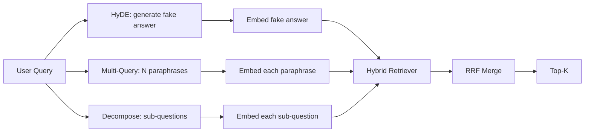

# Sorguya yeniden yazma: HyDE, Multi-Query ve Decomposition

> Kullanıcılar tarafından yazılan sorgu, aramacı tarafından istediği sorgu değildir. yeniden yazmak arama öncesi boşluğu kapatır, bu nedenle indeks cevabın neye benzediğine daha yakın bir şey görür.

**Type:** Build
**Languages:** Python
**Prerequisites:** Phase 11 lessons 04 (embeddings), 06 (RAG); Phase 19 Track B foundations (lessons 20-29); Phase 19 lessons 64 and 65
**Time:** ~90 minutes

## Öğrenme Hedefleri
- Hipotetik Belge Sarımsaklarını (HyDE) uygulayın: sahte bir cevap oluşturun, yerleştirin, sorgu vektörünün yerine o vektöre karşı çekiniz.
- Çok sorgu genişlemesini uygulayın: bir sorguyu N parafraseye yeniden yazın, her biriyle geri alın, birleşmeyi karşılıklı sıra birleşimi ile birleştirin.
- Sorgu parçalanmasını uygulayın: karmaşık bir soruyu alt sorulara ayırın, her alt soruya geri alın, birleşin.
- Üç yazıcıyı bir takımla karşılaştır ve her stratejinin ne zaman kazandığını açıkla.
- Deterministik, sabit çıkışlar üreten sahte bir LLM'yi bağlayın böylece yeniden yazma döngüsü çevrimdışı çalışacak.

## Sorun

Bir kullanıcı "Undurular başarısız olduğunda ve bütçe yok olduğunda ekibimiz ne yapar?" Korpus, "AbortMultipartOnFail uçuşta bir S3 çok bölüm yüklemeyi keser ve yükleme başarısız olduğunda her kutu için yeniden deneme bütçesini azaltır" diyen bir belge içerir. Sorgu ve belge isim ifadesini paylaşmaz. BM25'in başarısızlığı. Bi-encoder, belgeyi üçüncü veya dördüncü sıraya koyar çünkü sorgu vektörü, iptal edilen yüklemeler hakkında belgeyi tercih eden yerleşim alanının bir bölgesine yer alır. Ders 66'dan iki aşamalı yeniden sıralama, eğer üst N'de oturursa cevabı kurtarır, ama üst N'e bile ulaşmazsa, yeniden sıralamacı onu asla görmez.

Düzeltme, sorguyu retriever'e dokunmadan önce yeniden yazmaktır. 2023 makalesinde "Alaqı Etiketleri olmadan Tam Zero-Shot Dense Retrieval" (Gao et al.) HyDE'yi tanıttı: soruyu cevaplayacak belgeyi yazmasını, o hipotez belgeyi yerleştirmesini ve yerleştirilmesini geri alma vektörü olarak kullanmasını isteyin. Hipotez belge yerleşim alanının sağ bölgesinde yer almaktadır çünkü corpus'un sesinde yazılmıştır. Sorgu vektörü değil.

İki kuzen teknik HyDE ile eşleşir. Çoklu sorgu genişleme (Microsoft'un GraphRAG terimi kullanılır) sorgu N parafrases üretir ve her biri ile geri alır, sonra birleştirir. Decomposition (Stanford DSPy çalışmasında 2024'te "alt sorguya ayrıklama" olarak popülerleştirilmiş) "Uçuşlar başarısız olduğunda ve bütçe kaybolduğunda ekibimiz ne yapar" ı iki soruya ayırır: "Uçuş başarısız olduğunda ne olur" ve "Yeni deneme bütçesi kaybolduğunda ne olur". İki arama, bir birleşim sonucu, her iki cevap da ulaşılabilir.

Bu ders, üçü de uyguluyor ve onları aynı bir yapıtaşla karşılaştırıyor.

## Anlaşım



### HyDE detaylı olarak

HyDE, kullanıcı sorgu vektörünü LLM yazılı bir hipotez belge vektörü ile değiştirir.

```
You are a domain expert. Write a one-paragraph passage that answers the question
below. Use the same vocabulary and phrasing the documentation in this domain would
use. Do not refuse. Do not say you do not know.

Question: {user_query}

Passage:
```

LLM'nin cevabı gerçek bir cevap olarak yanlış çünkü LLM'nin sizin korpusunuzu bilmediği için. - İyi. Retriever gerçek doğruluğu umursamıyor, sadece simge dağıtımını. Hipotezci pasaj "abort", "multipart", "bucket", "budget" kelimelerini içerir, çünkü bu konuda bir belge pasajı böyle söyler. O geçişi yerleştir. vektör gerçek geçidinin yakınında yerleşir.

Yapım sırasında, hipotetik belgeyi iki veya üç cümleye sınırlı tutarız. Uzun hipotetikler daha fazla gürültü toplar.

### Çoklu sorular için ayrıntılı genişleme

Kullanıcının sorusunun N parafrasesini oluşturun.

```
Rewrite the following question in {N} different ways. Each rewrite must preserve
the original intent. Number them 1 to {N}. Do not add explanations.
```

Her parafrasi için üst-k'yi alın. N sıralamalı listeleri RRF ile (dersin 65'den aynı algoritma) birleştirin.

Çoğu sorgu, kullanıcının ifade etmesi soruyu sormanın birçok eşit derecede geçerli yolundan biri olduğunda kazanır ve yeniden yazılanların herhangi biri daha iyi sorardı. Tüm yeniden yazılar aynı derecede kötü olduğunda kaybeder çünkü orijinal aynı şekilde kötüydü.

### Detaylı ayrıntılar

Tek bir geri alım, çok yönlü bir soruyu tatmin edemez. Decomposition LLM'den soruyu alt sorulara ayırmasını ve sistemin her alt soruya geri almasını ister.

```
The following question may require information from multiple distinct topics.
Decompose it into a list of sub-questions. Each sub-question must be answerable
independently. If the question is already atomic, return it unchanged.

Question: {user_query}
```

Bir alt sorunun alınması. Birleştirilmek. Decomposition, birleştirmeler, çoklu madde karşılaştırmaları veya iki ilişkisiz konu içeren sorular için doğru araçtır. Atom sorular için yanlış araç; parçalayıcının görevi tek soruyu geri vermek ve sahte alt sorular uydurmak değildir.

### Üçü de neden var ?

Üçü tamamlayıcıdır. HyDE sorgu-korpus jeton boşluğunu kapatır. Çoklu sorgu parafrase varyansını kapsar. Decomposition çoklu konu sorgularını kapsar. Bir üretim sistemi üçünü de çalışır ve her sorguya göre stratejiyi seçer (dersin 69'daki son-son sistem seçeneği gösterir).

## Sahte LLM

Ders çevrimdışı çalışmaktadır. Sahte LLM, kullanıcının sorguya tıklanmış küçük bir arama tablosudur, ayrıca görmediği sorgular için bir geri dönüştürülür.

- Her bir aramayı: yazılı bir hipotez geçişi, üç parafrasi ve bir parçalanma.
- Bilinmeyen bir sorgu için: bir belirleyici dönüşüm: sorgu içeriği kelimelerini alın, onları bir eş anlamlı harita yoluyla genişletin ve sonucu geri verin.

İsteğe göre, simgeyi gerçek bir model çağrısı için değiştirirsin.

```figure
cd-hyde-vector
```

## Yapın

`code/main.py`Uygulamaları:

- `MockLLM`- yukarıda tarif edilen belirleyici bir alternatif.
- `HyDERewriter`- HİM'i hipotetik belgeyi yazmaya çağırır, yeniden yazıcı çıkışını `RewriteResult`- Bu, bir teksten daha fazla bilgi almak için.
- `MultiQueryRewriter`- LLM'yi N parafrases için çağırır, sorular listesini gönderir.
- `DecomposeRewriter`- LLM'yi parçalanmaya çağırır, alt soruları gönderir.
- `retrieve_with_rewriter`- bir yazıcı ve bir geri alıcı alır, yeniden yazıları yürütür, sonuçları birleştirir.
- Üç yazıcıyı bir cihazda çalıştıran bir demo ve altın cevap belgesini önce hangi stratejiyi yazdırdığını basıyor.

Retriever şekli ders 65'ten (hibrid BM25 + yoğun) yeniden kullanılır. Füzyon aynı RRF'dir. Tek yeni şekil küçük olan yeniden yazıcı arayüzüdür.

Çek şunu:

```bash
python3 code/main.py
```

Gelişim, strateji sıralaması ve son bir özetdir. HyDE, ifade-birleştirici sorguda kazanır. Çoklu sorgu, parafrase-varians sorguda kazanır. Decomposition, çoklu konu sorgularında kazanır. Fallback (hayır yazıcı yoktur) üç sorgudan en az birini kaybeder.

## Başarısız modlar demo gizlenecek

**HyDE hallucinates corpus-specific identifiers wrong.**Model bir fonksiyon adını icat eder. Sağ belgeye düşen hipotetik BM25 puanı çöküyor çünkü icat edilen isim şimdi indeksde görünmeyen yüksek ağırlıklı bir simge.

**Multi-query rewrites all converge.**Zayıf bir model neredeyse aynı üç parafrasi üretir. N geri alınmaları aynı üst-k'yi geri verir. RRF birleşimi tek bir geri alınmadan daha iyi değildir. Yeniden yazma çağrısına açık bir çeşitlilik talimatı ekleyin ve Jaccard tarafından kopyaları tespit edin.

**Decomposition over-splits.**Bu sorunun çözücü bir atom sorusunu bir listeye dönüştürür. Tüm çekimler aynı belgeyi ancak düşük bir sıra ile geri verir. Birleştirme orijinalden daha kötüdür.

**Latency multiplies.**HyDE bir LLM çağrısı masraf eder. N yeniden yazılması için bir LLM çağrısı masraf eder, sonra N geri alımı masraf eder. Decomposition bir LLM çağrısı masraf eder, sonra M geri alımı masraf eder. Geri alım paralel olarak çalışır; LLM çağrısı zemin.

## Kullan

Üretim biçimleri:

- Sorguya göre strateji seçimi sorgu uzunluğu: atomik kısa sorgular çok sorgular, karmaşık çok madde sorgular parçalanma, jargon ağır sorgular HyDE elde.
- Geri yazıcı çıkışını sorgulama hash ile önbelleğe koyun. Birçok sorgu tekrarlanır.
- Üçü de paralel olarak çalıştırın ve üç sonuç setini RRF ile birleştirin.

## Gönder

Ders 69 bu yeniden yazma aşamasını ders 65'ten geri alıcı ve ders 66'dan geri alıcı aşamasına bağlar. Ders 68 yeniden yazıcı geri alıcı hatırlamasına eklediği yüksekliği değerlendirir.

## Egzersizler

1. RAG-Fusion uygulaması (multi-query'in 2024 variansı), yeniden yazıcının parafrasesinin kasten çeşitli olduğu zaman, yeniden sıralama adımı (dersi 66) son listesini seçer.
2. Dördüncü bir strateji ekleyin: geri adım atma (ABD'ye daha genel soruyu sor, sonra da kısıtlı sorular sor).
3. "Soru atomik" başlığı ekleyerek parçalayıcıyı atom sorgularını tanımaya çalıştırın.
4. Sahte LLM'yi gerçek bir model çağrı ile değiştirin.
5. Tekrar yazma başına bir güven puanı ekleyin. Tekrar yazmaların eşiğinin altında bırakılmasını sağlayın.

## Anahtar Terimler

| Term | What people say | What it actually means |
|------|-----------------|------------------------|
| HyDE | "Fake-document retrieval" | LLM writes the answer; embed and retrieve on that instead of the query |
| Multi-query | "Paraphrase expansion" | N rewrites of the query; retrieve N times, merge by RRF |
| Decomposition | "Subquery split" | Multi-topic queries split into sub-questions, retrieved separately |
| Atomic query | "Single-topic" | Cannot be decomposed without inventing fake sub-questions |
| Step-back | "Abstract the query" | Ask the more general question, retrieve, then narrow |

## Daha Fazla Okumak

- Gao, Ma, Lin, Callan, "Alaqı Etiketleri olmadan Tam Zero-Shot Dense Retrieval" (HyDE), 2023
- Microsoft Research, "Multi-Query Expansion for Retrieval"
- Stanford DSPy, "Multi-Hop QA için Alt Sorgu Decomposition"
- [LlamaIndex query transformations documentation](https://docs.llamaindex.ai/en/stable/optimizing/advanced_retrieval/query_transformations/)
- Eğlence Fası 11 Ders 07 - Gelişmiş RAG modelleri
- Eğitim 65 - Bu yazıcı tarafından beslenen retriever
- Eğitim 68 - yeniden yazıcı yükselişini ölçen değerlendirme
