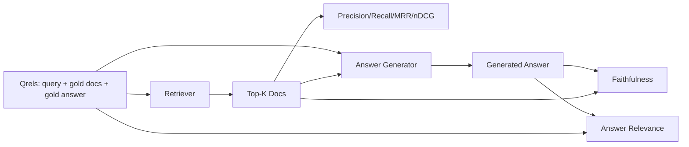

# RAG Değerlendirme: Düzgünlük, Hatırlatma, MRR, nDCG, Sadakat, Cevap Önemliliği

> Eğer aynı anda arama ve cevapları sıralayamazsanız, sistem gönderilemez.

**Type:** Build
**Languages:** Python
**Prerequisites:** Phase 11 lessons 06 (RAG), 10 (evaluation); Phase 19 Track B foundations (lessons 20-29); Phase 19 lessons 64, 65, 66, 67
**Time:** ~90 minutes

## Öğrenme Hedefleri
- Altın qrels'ten dört geri alım ölçüsünü hesaplayın: precision@k, recall@k, MRR (orta karşılıklı sıralama) ve nDCG@k.
- Cevap derecesinin iki ölçüsünü hesaplayın: sadakat (her iddia alınmış bağlamda yerleştirilmiş) ve cevap doğruluğu ( cevabın soruyu ele alması).
- Evaluasyonun sonuna kadar okuyacağı sabit bir qrels dosyası oluşturun (sorular, altın belge kimlikleri, altın cevap metni).
- Bir boru hattının başarısız olduğu yerleri teşhis etmek için ölçüm değerlerini okuyun: geri alınma, sıralama, üretim veya yerleştirme.

## Sorun

RAG sisteminde en az dört hareketli parça vardır: chunker, retriever, reranker, generator. Bunların herhangi biri yanlış bir cevabın nedeni olabilir.

Bir kullanıcı yanlış bir cevap bildirir. Bu, çunker'in cevap aralığını kesmesi mi? Retriever'in top-k'a çunkeri dahil etmediği mi?

- Retriever'den çıkanları değerlendirmek için geri alım ölçümleri.
- Doğru bölümü sırada yer aldığı notlara göre sıralama.
- Generatörün alınan bağlamda kalıp kalmadığını değerlendirmek için sadakat.
- Cevap sorunun cevabını cevaplamaya uygun olup olmadığını değerlendirmek için uygun.

Bu ders, altı bölümün hepsini bir sabit qrels dosyasının üzerine inşa eder. değerlendirme çevrimdışı ve belirleyici; üretim sırasında sahte LLM-as-judge'yi gerçek birine değiştirirsiniz.

## Anlaşım



### Precision@k

Top-k belgeleri geri alınan, altın setinde ne kadar bölüm vardır? Eğer altın üç belge ve top-3 iki belge ve bir yanlış bir geri verir, doğruluk@3 2 / 3 olur.

### Anlatma@k

Altın belgelerden en üst k'de ne kadar bölümü bulunur? Altın üç belgesi varsa ve en üst 5'te de üçü varsa, remember@5 1.0'dur.

Üretim RAG'de insanların genellikle alıntıladığı metrik, recall@k. Genre, önemsiz parçaları kolayca bırakabilir; hiç görmediği bir parçalardan bir cevap icat edemez.

### MRR (Orta karşılıklı sıralama)

Her sorgu için sıralama listesinde ilk ilgili belgenin konumunu bul. karşılıklı sıra 1 / konumdur. Sorgu kümesi boyunca ortalama. MRR, en iyi cevabı en üstte ne kadar iyi yerleştirdiğini belirleyen tek sayısal bir özetdir.

MRR pozisyon-1 ağır ağırlığıdır. Altın belgesinin 1 sırada olduğu bir sorgu 1.0. sırada 2. sırada 0.5. sırada 10. sırada 0.1.

### nDCG@k

Normalleştirilmiş Diskonlu Toplam Kazanç. Tam formül, elde edilen her belgeye bir kazanç (genellikle ilgili için 1 , olmayan için 0), pozisyonun günlükine göre indirimler, toplamlar ve ideal DCG ile bölünür (tam bir sıralama yaparsanız elde edeceğiniz DCG). 0 ila 1 aralığı.

nDCG derecelendirilmiş bağdaşmaya uygun: altın "doc A 3, doc B 2, doc C 1" diyebilir. MRR ve recall@k her şeyi ikili olarak düzeltir. Corpus'un her sorguda birden fazla kısmen ilgili belge olduğu zaman nDCG kullanın.

### Sadakat

Yaratılan yanıtdaki her iddia için, iddiaın alınan bağlam tarafından desteklendiğini kontrol edin. Standart uygulamada bir LLM-as-judge prompt kullanılır ve evet veya hayır gönderir. Metrik geçerli iddiaların bölümüdür.

Sadakat, modelin içeriği icat ettiği jeneratör başarısızlık modunu yakalar. Retriever doğru parçaları geri gönderse bile, halüsinasyon yapan bir jeneratör bozulur. Sadakat ayrıca yerleşiklik, destek, atribut olarak da adlandırılır.

Bu ders, her iddia simgelerinin alınan bağlamı bir eşiğiyle örtüp örtüp örtüp örtmediğini kontrol eden bir belirleyici sahte yargıçla sadakat uyguluyor.

### Cevapların uygunluğu

Bu soruların cevabı gerçekten soruyu cevaplıyor mu? Sadakat " cevabın bağlamda yer alıyor mu?" sorusunu sorar. Cevap doğruluğu " cevabın soruda yer alıyor mu?" sorusunu sorar. Sadık ama konu dışındaki bir cevap sadakat konusunda yüksek puan alır ve ilgililik konusunda düşük puanlar verir.

Standart uygulamada ayrıca LLM-as-judge kullanılır: alın (soru, cevap) ve sor sorunun cevabını sormaya uygun olup olmadığını sor.

## Çekilen cihaz

```python
{
  "qid": "q1",
  "query": "what is the abort threshold for multipart uploads",
  "gold_doc_ids": ["d1", "d3"],
  "gold_answer_substring": "three failed parts",
  "graded_relevance": {"d1": 3, "d3": 2},
}
```

Her sorguda şunlar yer alır:
- sorgu dizisi,
- Altın belge kimlikleri (tam / geri çağırma / MRR için),
- dereceli bir derecelilik diktasyonu (nDCG için),
- Altın cevap altını (her bir qrel'de referans metadata olarak tutulur; bu dersdeki sadakat, bu altıncı katınayla değil, elde edilen bağlamla çıkarılan iddiaları değerlendirerek hesaplanır).

Bu ders el yapımı bir cihaz gönderir böylece değerlendirme kutudan çıkıyor.

```figure
ci-rag-metric-ladder
```

## Yapın

`code/main.py`Uygulamaları:

- `precision_at_k(retrieved, gold, k)`- kelimenin anlamı.
- `recall_at_k(retrieved, gold, k)`- kelimenin anlamı.
- `mean_reciprocal_rank(retrieved_list_of_lists, gold_list)`- sorular hakkında.
- `ndcg_at_k(retrieved, graded_relevance, k)`- DCG / IDCG, ikili veya sınıflandırılmış kazançlar ile.
- `extract_claims(answer)`- Cevabı cümle şeklinde iddialara ayırır.
- `faithfulness(claims, context_texts, judge)`- desteklenmiş olduğu kabul edilen taleplerin bir kısmı.
- `answer_relevance(question, answer, judge)`- Cevabın soruyu cevapladığını değerlendirebilir.
- `MockJudge`- Deterministik token üst üstelik yargılaması böylece değerlendirme offline çalışır.
- `evaluate_pipeline(pipeline_fn, qrels, ks)`- her metrikleri kontrol eden orkeströr.
- Üç boru hattı variansı (chunker baseline, hibrit geri alım, hibrit + yeniden sıralama) ile qrels karşı çalıştırılan bir demo ve bir metrik tablosu basar.

Çek şunu:

```bash
python3 code/main.py
```

Çıktı sonuçlar, bir metrik tablosundaki her varians için precision@k, recall@k, MRR, nDCG@k, sadakat ve cevap bağlamını gösterir.

## Başarısızlıkları teşhis etmek için ölçümleri okumak

| Symptom | Likely cause | What to fix |
|---------|-------------|-------------|
| Low recall@k, low precision@k | Chunker cut the answer or retriever cannot find it | Chunker boundaries (lesson 64) or retriever modality (lesson 65) |
| Decent recall@k, low MRR | Right chunk is in top-k but not at position 1 | Reranker (lesson 66) |
| High MRR, low faithfulness | Generator invents content despite right context | Generation prompt; force-cite-or-refuse |
| High faithfulness, low relevance | Answer is grounded but off-topic | Query rewriter (lesson 67) or generation prompt |
| All four high, users still complain | Eval set is unrepresentative | Expand qrels with real user queries |

## Başarısız modlar demo gizlenecek

**LLM-as-judge bias.**Bir model kendi çıkışlarını kendilerinden daha sadık olarak değerlendirir.

**Qrels rot.**Altın cevapları korpus değişikliğiyle hareket eder. Ocak 2024'te q1 için altın olan bir belge artık Ekim 2024'te doğru cevap değildir çünkü ekip fonksiyonu yeniden adlandırır.

**Faithfulness micro-checks miss macro-claims.**Cevapların genel yapısı yanıltıcı olduğu halde cümle sadakati geçebilir. Otomatik ölçümün üstüne örnek seviyesindeki kalitatif bir inceleme ekleyin.

**Recall@k masks per-query failures.**Bir sorgulama sınıfının her zaman kaçırdığını bir ortalama hatırlama %90 gizleyebilir. sorgulama sınıfına göre qrels'leri kesin (yazılı, parafrase edilmiş, çok konu) ve parça başına rapor edin.

## Kullan

Üretim biçimleri:

- Her geri alma cihazı veya jeneratör değişikliğinde eval çalıştırın.
- Bir kullanıcı şikayet ettiğinde, eşleşen qrels girişini arayın ve yakalanmış olup olmadığını görün.
- Qrels'leri sıralayın: CI'de çalışan 20 sorunun duman kümesi; gecelik olarak çalışan 200 gerileme kümesi; haftalık olarak çalışan 2000 derin bir kümesi.

## Gönder

Ders 69 tüm boru hattını (çunker, retriever, reranker, generator) kablolar ve bu değerlendirmeyi son-son sistemle karşılar.

## Egzersizler

1. Beşinci bir geri alma metrikini ekleyin: hit-rate@k. Onu hatırlama@k ile karşılaştırın. Farklı olduklarını açıklayın.
2. 0 (daha desteklenmeyen), 1 ( kısmen desteklenen), 2 (tamamen desteklenen) derecelendirilmiş sadakat uygulayın.
3. Sahte yargıçı gerçek bir model çağrı ile değiştirin.
4. Sorgu sınıfı bir parça ekleyin ("yazılı", "parafrase edilmiş", "çok konu").
5. " cevabın uzunluğu " ölçüsünü ekle ve sadakat ile ilişkilendirme.

## Anahtar Terimler

| Term | What people say | What it actually means |
|------|-----------------|------------------------|
| Precision@k | "Hit rate over retrieved" | Fraction of top-k that are gold |
| Recall@k | "Hit rate over gold" | Fraction of gold in top-k |
| MRR | "First-hit position" | Mean of 1 / rank of first relevant document |
| nDCG@k | "Graded ranking quality" | DCG over the top-k divided by ideal DCG |
| Faithfulness | "Groundedness" | Fraction of answer claims supported by retrieved context |
| Answer relevance | "Did it address the question?" | Whether the answer matches the question's intent |
| Qrels | "Gold labels" | The labeled set of queries and their gold documents and answers |

## Daha Fazla Okumak

- Buckley, Voorhees, "Evaluation Measure Stability Assessment", SIGIR 2000 - ranking metrikleri üzerine kanonik makale
- Jarvelin, Kekalainen, "Kümülte Kazanç Baslı IR Tekniklerinin Değerlendirilmesi" - nDCG makalesi
- [Ragas: Automated Evaluation of RAG Pipelines](https://docs.ragas.io)
- [Anthropic, Evaluating RAG](https://www.anthropic.com/news/evaluating-rag)
- EY 11 Ders 10 - Değerlendirme çerçevesinin temelleri
- Fase 19 dersleri 64-67 - burada değerlendirilmiş bileşenler
- Eğitim 69 - Bu değerlendirme notlarının sonundan sonuna kadar olan boru hattı
