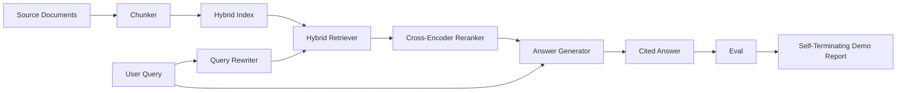

# Sonundan Sonuna RAG Sistemi

> 6 parça dersi, bir boru hattı, bir değerlendirme döngüsü, bir kendi kendini bitirmekle birlikte, bu da gönderdiğiniz sistem.

**Type:** Build
**Languages:** Python
**Prerequisites:** Phase 11 lessons 06 (RAG), 10 (evaluation); Phase 19 Track B foundations (lessons 20-29); Phase 19 lessons 64, 65, 66, 67, 68
**Time:** ~90 minutes

## Öğrenme Hedefleri
- Çunker, hibrit geri alıcı, sorgu yeniden yazıcı, çapraz kodlayıcı yeniden sıralamacı ve cevap jeneratörü tek bir uçtan sonuna boru hattına birleştirin.
- Cevap üreticisini uygulamak için, iddialarını parçalar ile bağlamak için, düşük güvenle geri dönüş.
- Ders 68 değerlendirmesini toplanan boru hattına karşı çalıştır ve aşama aşamasında yapılanın her metrik üzerinde aynı bileşenleri tek başına kazanmış olduğunu kanıtla.
- Bir sabit corpus'u yudumlayan, sabit bir sorgu seti çalıştıran ve özet raporu ile sıfırdan çıkmış bir kendi kendini sona erdiren CLI demo oluşturun.

## Sorun

6 bileşen bir arada hiçbir şey kanıtlamaz. Çunker, recall@5'de corpus'a karşı kazanır ve sistemin recall@5'de kaybedebilir çünkü retriever, çunker'ın yaydığı şeyi sıralayamaz. Yeniden sıralama yapan, sentetik aday havuzunda MRR'yi kaldırıp gerçek iki kodlayıcı adaylarda başarısız olabilir çünkü iki kodlayıcı yeniden sıralama bütçesinde geri çağırılması çok düşüktür. Sorgu yeniden yazarı, altın dokümanı tek bir sorguda teşvik edebilir ve bir sonraki sorguda kesilebilir çünkü LLM numarası bir bozulmuş hipotezi geri gönderir.

Entegreleme testi, bütün boru hattının aynı metrik ile aynı sabit qrels ile aynı metrikle aynı bir orkestrasyon dosyası ile aynı birleştirme testidir. Bu dersin oluşturduğu şey bu.

## Anlaşım



### Kablolama seçenekleri

Bu küçük bir grafiktir. Her aşama açık bir imzası olan bir fonksiyon.

| Stage | Input | Output |
|-------|-------|--------|
| Chunker | Document text | List of Chunk records |
| Retriever | Query string | Top-N Chunk records |
| Rewriter (optional) | Query string | List of rewrites + hypothetical |
| Reranker | Query, candidates | Top-K Chunk records with cross scores |
| Generator | Query, top-K Chunk records | Answer string with citations |

Her imzası istikrarlı olduğunda kompozisyon basit olur.`Pipeline`Sınıf beş aşamayı ve bir `query`Her aşama değişebilir: farklı bir şunker, retriever, yeniden yazıcı, yeniden sıralama veya jeneratör geçin ve boru hattı hala çalışır.

### Cevap üreticisi alıntılarla

Bu derste, bir belirleyici simülasyon jeneratörü kullanılır.

1. Top-K'nin yeniden sıralamalı parçalarını alır.
2. En yüksek içerik belirtiyi içeren metni sorgu ile üst üste tutan iki parçaya kadar seçilir.
3. Her cümleyi bir cümle ile takip eden bir cümle-her seçilen parçadan bir cümle zinciri olan bir cevap verir.`[doc_id:chunk_index]`- Anchor.
4. Eğer bir parça çöpe düşen bir sınırın üzerinde bir şey yapmıyorsa, "Bilmiyorum" derken alıntı yapılmaz.

Üretim sırasında, numarayı gerçek bir LLM çağrısı için, hemen şablonla değiştirirsiniz:

```
You are answering a question using only the snippets below.
Cite every claim with the anchor in parentheses.
If the snippets do not answer the question, say "I do not know".

Question: {query}

Snippets:
{enumerated chunks with anchors}

Answer:
```

Bu, alucina cevaplarına karşı güvenlik valfidir. bu, alucina cevaplarına karşı güvenlik valfidir.

### Kendini öldüren demo

Demo her şeyi sonuna kadar yürütür. Bir sorunun aşama aşamasında ayrıştırılmasını yazdırır, eval'i dört sabit qrels üzerinde çalıştırır, bir metrik tablosunu yazdırırır ve tüm ders 68 metrikleri demo'da belirlenen eşiğe ulaşırsa sıfır durumla çıkır. Eğer herhangi bir metrik eşiğin altında ise, demo sıfır olmayan bir durumla ve başarısız metrik isimlendiren bir mesajla çıkır.

Bu bir CI duman testi şekli. boru hattı, hızlı, belirleyici olarak çevrimdışı çalışır. Eğitiler kasıtlı olarak sabit üzerinde sıkıdır.

```figure
rag-pipeline-flow
```

## Yapın

`code/main.py`Uygulamaları:

- `Chunk`- her aşamada gerçekleştirilen kayıt (dersi 64'ün şeklini bir parça_index ve kaynak dokümanı ile genişletiyor).
- `Chunker`- ders 64'ten bir strateji seçer (öntemli rekürziv bölünme).
- `HybridIndex`- BM25 + yoğun + RRF paketleri ders 65'ten.
- `Rewriter`(vezif) - HyDE, çok sorgu, sorgu uzunluğu ve konjonsiyonların varlığı ile ders 67'den parçalanma seçer.
- `Reranker`- 66 dersindeki eğitimli çapraz kodlayıcı, daha küçük bir cihaz eğitim kümesi ile saniyeler içinde bir araya gelir.
- `Generator`- alıntılarla ve düşük güvenle belirleyici sahte jeneratör.
- `Pipeline`- beş aşamayı bir `query(question)`Geri veren yöntem `Result(answer, top_k, latency_ms_per_stage)`- Evet .
- `run_demo()`- corpus'u yutar, üç sabit sorgu yürütür, değerlendirme yapar, sonuçları yazdırır, çıkış kodunu eşiğine göre belirler.

Çek şunu:

```bash
python3 code/main.py
```

Çıktı bir yazılı sorgu izini, tam değerleme tablosunu ve son geçiş/başarısız durumunu içerir.

## Başarısız modlar demo gizlenecek

**Chunker boundary drift.**Eğer değerlendirme qrels etiketleme geçiş ve demo arasında çunker stratejisi değiştirirseniz, altın belge kimlikleri artık sıraya geçmez. çunker stratejisini qrels dosyasına kilitleyin. demo çunker adını bir başlık içerir.

**Reranker training set leaks into the eval.**Ders 66'daki 14 eğitim üçlü, değerlendirme sorgularına benzeyen sorguları içerir.

**Mock generator hides hallucination risk.**Bu numara halüsinasyon yapamaz çünkü sadece alınan parçalardan metin yayar.

**No streaming.**Bu sistem, her aşamada tam cevapları gönderir. Bir üretim sistemi jeneratörün çıkışını akışlandırır. Akışlama kapsamının dışında; cevap derecesi ölçümleri son ip üzerinde her iki yönden çalışır.

**Latency is offline.**Sahte LLM aramaları sürekli süredir. Gerçek LLM aramaları hakimdir. İstediğin alanında gecikme bütçesini planla; dersin her aşaması zamanlaması sadece CPU çalışmasını ölçer.

## Kullan

Üretim biçimleri:

- Boru hattı dosyasını açık bir aşama arayüzü ile tek bir orkestratörün altında gönderin.
- Bir aşamaya dokunan her birleşmeden önce eval'i çalıştırın.
- CI koşusunda metrik izini sürdürün, böylece bir aşama değişikliğine gerilemeleri atıfta edebilirsiniz.
- 30 saniye içinde çalışan 20 sorunun (regresyon setinin alt kümesi) bir duman kümesi ekleyin; tam regresyon kümesi her gece çalışır.

## Gönder

Bu dersdeki boru dosyası, 19'un Track F derslerinin geri kalanının aldığı şekildir. Sonraki dersler alım otomasyonunu, artışlı yeniden indeksi, telemetri ve üstte bir servis katmanı ekleyecektir. Alım, yeniden sıralama, yeniden yazma ve değerlendirme yarıları burada tamamlanmıştır.

## Egzersizler

1. Tekrar yazıcıya bir soru başına strateji seçeneği ekleyin: ders 67'den heuristikler (uzunluk, bağlamlar, jargon oranı) HyDE, çok sorgu veya parçalanma seçin.
2. Env bayrağının arkasındaki jeneratör için gerçek bir LLM çağrısı ekleyin.
3. Demo'yu bir sürüm için uzatın.`--corpus path`Gerçek bir korpus yükleyen bir bayrak.
4. Bir ekle`--strategy`Her stratejinin sonundan sonuna geri çağırma katkılarını ölçmek.
5. Akışlı bir jeneratör arayüzü ekleyin ve eval'e ekleyin. Sadakatin akışlı bir önbellek üzerinde değil, son dizilere göre hesaplandığını doğrulayın.

## Anahtar Terimler

| Term | What people say | What it actually means |
|------|-----------------|------------------------|
| Pipeline | "RAG pipeline" | The composed stages from ingestion to cited answer |
| Citation anchor | "Source link" | The (doc_id, chunk_index) reference attached to each claim |
| Refuse-on-low-confidence | "I do not know" | Generator returns no answer when the reranker top-1 score sits below threshold |
| Smoke set | "CI eval" | The minimal qrels subset that runs in every PR check |
| Stage interface | "Function signature" | The stable input and output type of each pipeline stage |

## Daha Fazla Okumak

- [Anthropic, Building search and retrieval](https://www.anthropic.com/news/contextual-retrieval)
- [Pinterest, MCP internal search](https://medium.com/pinterest-engineering)- referans üretim mimarisi
- [Ragas: Automated Evaluation of RAG Pipelines](https://docs.ragas.io)
- EY 11 Ders 06 - RAG Temellikleri
- Fase 19 dersleri 64-68 - burada oluşturulan bileşenler
