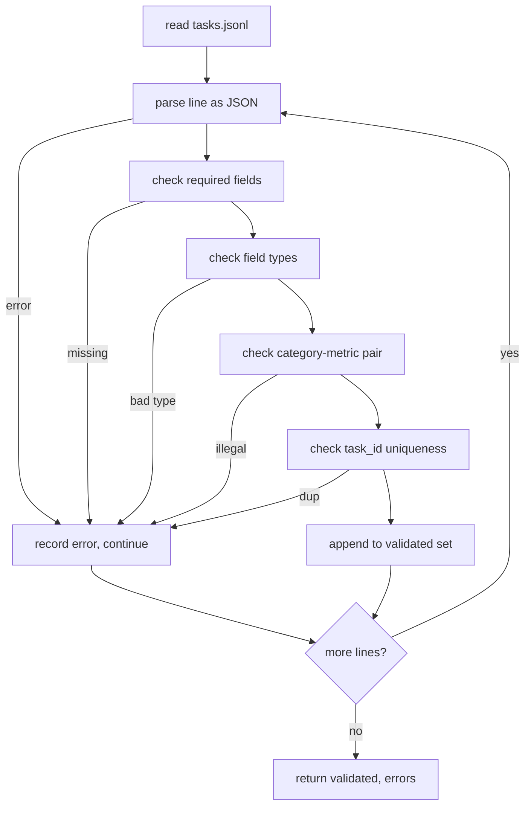

# Görev Özelliği Formatı

> Bir eval harness, sadece sözleşmenin görevlerini yerine getirmesi kadar iyidir. Tek bir puanlama işlevi yazmadan önce JSONL şeklini ve metrik kelime birikmesini dondur.

**Type:** Build
**Languages:** Python
**Prerequisites:** Phase 19 Track B foundations
**Time:** ~90 min

## Öğrenme hedefleri

- Bir şekilde aritmetik, çoklu seçim, kod uygulanması, sınıflandırma ve serbest metin özetlemesini kapsayan bir JSONL görev kayıt şeması tanımlayın.
- Metrik isimlerin kapalı bir sözcüklüğünü koyun, böylece aşağıdaki dersler (71-73) tek bir alanda gönderilebilir.
- Birkaç atış örneği ve işleme sonrası kuralları, koşucunun değil görevin bir parçası olarak belirtin, böylece aynı istek aynı hedefi tüm modellerde üretir.
- Kaçaklara ulaşmadan önce yanlış biçimlendirilmiş kayıtları reddeden sıkı bir onaylayıcı uygulayın.
- 10 görevli bir cihaz gönderin ki, spesifikasyonun her dalını kullansın böylece onaylayıcıya gerçekten bir şey yapması gerek.

```figure
ci-task-spec-gate
```

## Neden dondurulmuş bir spec

Araştırma kod tabanı testlerin toplandığından daha hızlı değerlendirme senaryolarını biriktirir. Altı ay sonra, her not defterinin kendi JSON şekli vardır, her metrik iki kez yeniden uygulanır ve hiçbir şey çalışmalar arasında karşılaştırılamaz. Düzeltme sıkıcıdır. Bir şema seçin. Bir onaylayıcı yazın. Geri kalanı reddedin. Bu dersin yaptığı şey budur.

Şekil, BIG-bench, HELM ve lm-eval tarzındaki harnelerden fikirler ödünç alır, ancak alan isimleri bizimdir. Her alanın tek bir sahibi vardır. Koşucu görevi okuyor. Metrik hedefleri okuyor. İşlem sonrası adım nesli normalleştirir. Hiçbir alan değişmez.

## Kayıt şekli

Bir görev tek bir satırdaki JSON nesnesi.`tasks.jsonl`Bir kötü satır, kaydı ortadan kaldırır, koşumu değil.

```json
{
  "task_id": "arith_001",
  "category": "arithmetic",
  "prompt": "Compute the result. Question: 17 + 24\nAnswer:",
  "targets": ["41"],
  "metric_name": "exact_match",
  "few_shot_examples": [
    {"prompt": "Question: 2 + 2\nAnswer:", "completion": "4"}
  ],
  "post_process": "strip_whitespace",
  "metadata": {"difficulty": "easy"}
}
```

Gerekli alanlar `task_id`- Evet .`category`- Evet .`prompt`- Evet .`targets`- Evet .`metric_name`- Evet .`post_process`- Evet .`few_shot_examples`ve `metadata`Bilinmeyen üst düzey alanlar onaylamayı başarısız ediyor.

## Alan kuralları

`task_id`Validatör dosya boyunca benzersizliği zorlar.

`category`- Bu bir şey .`arithmetic`- Evet .`mcq`- Evet .`code_exec`- Evet .`classification`- Evet .`summary`. Kategori hangi metrik ve post-process çiftin yasal olduğunu belirtiyor.`code_exec`Görev kullanmalıdır `metric_name = code_exec`ve bir `mcq`Görev kullanmalıdır `metric_name = exact_match`Tek bir harfle hedeflenmiş.

`prompt`Validatör, beyaz alanın arkasını yasaklar ve hemen hemen bir kaç atışlı blok içeren kayıtları reddeder.

`targets`Bu, boş olmayan bir dizilme listesidir.`exact_match`, herhangi bir eşleşen element sayılır.`f1`ve `rouge_l`En yüksek puan alan hedef kazanır.`mcq`, listede tam olarak bir element var.

`metric_name`- Bu bir şey .`exact_match`- Evet .`f1`- Evet .`bleu_4`- Evet .`rouge_l`- Evet .`accuracy`- Evet .`code_exec`Yeni bir metrik yeni bir ders ve yeni bir giriş gerektirir.

`few_shot_examples`bir liste `{prompt, completion}`Validatör listeyi sekiz girişle kapatır.

`post_process`- Bu bir şey .`none`- Evet .`strip_whitespace`- Evet .`lower`- Evet .`extract_letter`- Evet .`extract_code_block`- Evet .`extract_first_line`Her kural tek bir belirleyici davranışına sahiptir.

## Validatör davranışları



Validatör iki listeyi gönderir: geçerli kayıtlar ve hata kayıtları, ihlal edilen satır, ihlal edilmiş kural ve hatalı alan ile.`--allow-bad-tasks`Bayrak ayarlandı.

## Az çekimli görüntüleme

Runner, birkaç atışlı örnekleri boş satır ayırıcı ile istekle birlikte bağlar. Her model için aynı kod yolu çalışır, bu nedenle farklılık tek kaynağı model kendisidir. Yazarlar örnekleri bir kez değil, her sunucu için bir kez yazarlar.

```python
def render(task):
    parts = []
    for ex in task.get("few_shot_examples", []):
        parts.append(ex["prompt"] + " " + ex["completion"])
    parts.append(task["prompt"])
    return "\n\n".join(parts)
```

## İşlem sonrası kuralları

İşlem sonrası adım, metrikten önce, nesneden nesneye kadar geçer.

- `none`İpucu değişmez olarak geri gönderir.
- `strip_whitespace`Beyaz alanın önüne ve arkasına giden çizgiler.
- `lower`İpucu aşağıya düşürür.
- `extract_letter`eşleşen ilk karakterini gönderir `[A-E]`MCQ için kullanılır.
- `extract_code_block`kod-exec için kullanılan ilk üçlü arka çubuk çitli blokun vücudu geri gönderir.
- `extract_first_line`Toplam sınıflandırma için kullanılan ilk boş olmayan satırı gönderir.

Bu listeden başka bir kurallara ihtiyaç duyan bir görev yeni bir derse ait.

## Bu ders neyi yapmaz

Bu dersler 71, 72 ve 75 derslerinde gelir. Bu ders, onların hepsinin onurlandırması gereken sözleşmeyi dondururur.

10 görevli bir düzenleyici iki aritmetik öğeyi, iki MCQ öğesini, iki kod uygulayıcı öğesini, iki sınıflandırma öğesini ve iki toplama öğesini kapsar.`tasks_bad.jsonl`) her kuralı geçersiz kılar ve doğrulayıcı tam olarak o kadar çok hata gönderir.

## Şifreyi nasıl okuyabilirsiniz

`main.py`tanımlar `TaskSpec`- Evet .`validate_task`- Evet .`validate_file`, ve bir CLI giriş noktası.`load_fixtures`- Render ve post-process yardımcıları doğrulama yanında yaşar, böylece ders 75'te çalışan tek bir modül ithal eder.

Oku `main.py`Yukarıdan aşağıya.`code/tests/test_spec.py`Testler her doğrulama kuralını ve her işlem sonrası davranışı belirler.`main.py`paketlenmiş cihazı onaylar ve bir özet basar.

## Daha ileri gitmeye çalışıyorum .

Gerçek değerleme süitleri, sütunlar büyüdüğü şekilde kategorileri büyütür. Ayık hareket, metrik, bir süreç sonrası kural ve en az bir sabitleme görevi eklemeden bir kategorisi eklemeyi reddetmektir. Spec'i bir veritabanı göçü gibi değerlendirin. Her değişiklik gözden geçirilir, versiyonlandırılır ve testlerle eşlik edilir. Bu dersdeki onaylayıcı kapıdır.
