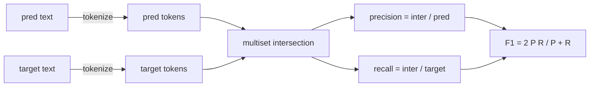
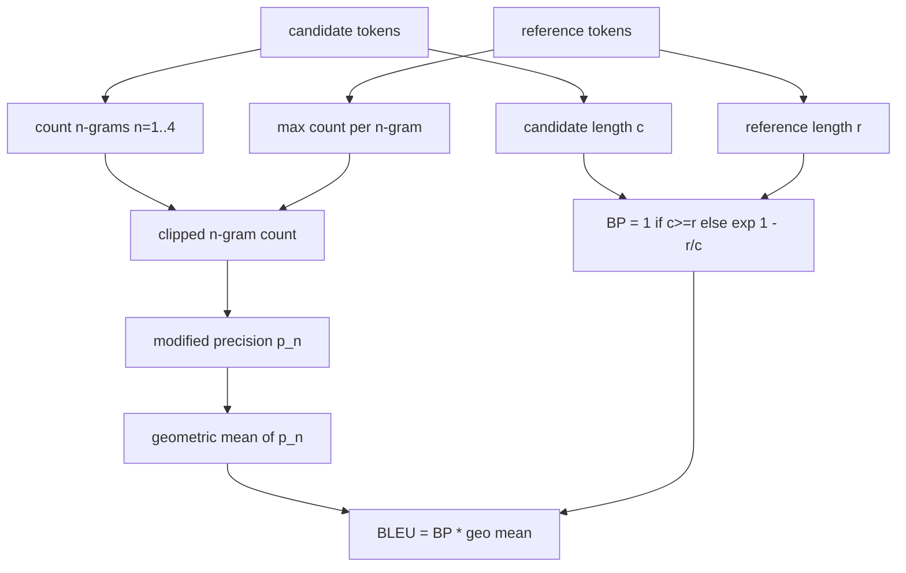

# Klasik Metrikler

> BLEU, ROUGE-L, F1, tam eşleşme, doğruluk. 5 ölçüm hala yayınlanan LLM değerlendirme sayılarının çoğunu oluşturur. Her birini ilk ilkelerden uygulayın böylece sayının ne anlama geldiğini anlarsınız.

**Type:** Build
**Languages:** Python
**Prerequisites:** Phase 19 Track B foundations, lesson 70
**Time:** ~90 min

## Öğrenme hedefleri

- Token seviyesindeki tam eşleşme, F1 ve açık bir tokenizasyon kurallarıyla doğruluk uygulayın.
- BLEU-4'i yerden başlat: n-gram kesinliği değiştirilmiş, n'in üzerinde geometrik ortalama 1 ile 4 arasında eşit, kısalık cezası.
- ROUGE-L'yi en uzun ortak alt sekvensi kullanılarak, F-beta kesinlik ve geri çağırma kombinasyonu ile uygulayın.
- Metrik_name alanına gönder 70 dersinden koşucu metrik-agnostik kalsın.
- Davranışı üçüncü taraf kütüphaneden değil, çalışılmış örneklerden alınan referans vektörleriyle bağlayın.

```figure
cd-bleu-overlap
```

## Neden yeniden uygulanmalı

BLEU 28.3 ve BLEU 0.283 rapor eden bir makale okuyacaksınız. İki kütüphanede ROUGE-L puanlarının 10 puan farklı olduğunu göreceksiniz çünkü biri küçük yazıya kısaltır, diğeri ise değil. Kafanızı karıştırmak için en hızlı yol metrikleri kendiniz yazmak, sonra işaretlemeci karar verdiği çizginin ve düzeltme uygulanırken çizginin işaretlemesi. Bundan sonra, sayıları kağıtlar arasında karşılaştırmak, kütüphaneler hakkında tartışmak yerine, metrik ayarları okumakla ilgilidir.

Stdlib + numpy yeter. BLEU sayıyor ve bir klem. ROUGE-L dinamik programlama. F1 jetonlar üzerinde bir kesimdir. En zor kısmı bir jetonlayıcı seçmek ve buna bağlıdır.

## Tokenizasyon

Tokenizer `re.findall(r"\w+", text.lower())`Bu dersdeki her metrik tam olarak bu tokenizer kullanıyor. Koşucu seçemez. Tokenizerleri değiştirirseniz, farklı bir referans göstergesini çalıştırıyorsunuz.

```python
TOKEN_RE = re.compile(r"\w+", re.UNICODE)
def tokenize(text):
    return TOKEN_RE.findall(text.lower())
```

Bu kasıtlı bir basitleştirme. Üretim ayarları CJK, kısıtlamalar ve kod tanımlayıcıları ile ilgilenir. Dersin amacı tokenizer'in bir düğme değil bir sözleşme olmasıdır.

## Tam eşleşme

```python
def exact_match(pred, targets):
    return float(any(pred.strip() == t.strip() for t in targets))
```

Bu, bir veri kümesi üzerinde toplam ortalamadır. Bu aritmetik, MCQ ve kısa sınıflandırma görevleri için iş atıdır.

## Token seviyesinin F1

F1 harmonik ortalama. Uygulama boş-hüşan ve boş-hüşan kenar durumlarını ele alır. F1 harmonik ortalama.



Çoklu hedef görevleri için hedef listesinden en iyi F1'i alırız. Bu, literatürde yaygın olarak bildirilen SQuAD tarzında davranışlarla eşleşir.

## BLEU-4

BLEU, kanonik makine çevirisi metrikidir ve halen özetleme çalışmalarında ortaya çıkar. Kullandığımız formül, standart kısalık cezası ve n-gram sayımlarında değiştirilmiş ek-bir düzeltme ile korpus seviyesindeki BLEU-4'dir.

Her aday-referans çift için, n eşit olduğu için değiştirilmiş n-gram hassaslığı sayıyoruz 1, 2, 3, 4. değiştirilmiş hassaslık, aday n-gram sayısını herhangi bir referansdaki n-gram sayısının maksimum sayısına kadar keser, bu nedenle bir aday bir cümleyi tekrarlayarak şişemez. Dört hassaslığın geometrik ortalaması kısalık cezası ile sarılır.



Düzeltme kuralı, Lin ve Och'un 1 numaralı yöntemini belirtir.`log 0`referansın 4 gram eşleşmesi olmadığı ve uzun adaylarda düzelenmemiş değere yakın kalması durumunda.

## ROUGE-L

ROUGE-L, aday ve referans jeton dizisinin en uzun ortak alt sırasını karşılaştırır. LCS, birbiriyle uzlaşmayı zorlamadan kelime sırasını yakalar, bu nedenle standart bir özetleme metrikidir. LCS uzunluğunu standart bir dinamik programlama tablosu ile hesaplar ve sonra hatırlamaları bir şekilde çıkarır.`lcs / reference length`, doğruluk gibi`lcs / candidate length`, ve F-beta ile birleştirir.

```python
def lcs_length(a, b):
    n, m = len(a), len(b)
    dp = numpy.zeros((n + 1, m + 1), dtype=int)
    for i in range(n):
        for j in range(m):
            if a[i] == b[j]:
                dp[i+1, j+1] = dp[i, j] + 1
            else:
                dp[i+1, j+1] = max(dp[i+1, j], dp[i, j+1])
    return int(dp[n, m])
```

Numpy tablosu uygulamayı okuyabilir hale getirir; saf Python listeleri de çalışırdı. ROUGE-L'ye seçilen görevler görev başına O(n m) maliyetini öder. Tipik bir milisaniyede kalırken kısa süreler için.

## Dürüstlük

Çoklu hedef sınıflandırma görevleri için, doğruluk tek bir normal hedefle tam eşleşmeye düşürülür.`metric_name`Koşucu içinde bir dizi karşılaştırma yapmadan.

## Gönderiş sözleşmesi

Tek giriş noktası `score(metric_name, prediction, targets)`- Bir akış geri verir .`[0, 1]`Koşucu metrik adıyla bağlantılı değildir. Çağrıyı geri verir ve sonucu yazar. Bu, ders 75'in görev spesifikasyonuna ders 70'den yapıştıracağı yüzeydir.

```python
def score(metric_name, pred, targets):
    if metric_name == "exact_match":
        return exact_match(pred, targets)
    if metric_name == "f1":
        return max(f1_score(pred, t) for t in targets)
    if metric_name == "bleu_4":
        return max(bleu4(pred, t) for t in targets)
    if metric_name == "rouge_l":
        return max(rouge_l(pred, t) for t in targets)
    if metric_name == "accuracy":
        return accuracy(pred, targets)
    raise ValueError(f"unknown metric_name: {metric_name}")
```

`code_exec`72 dersinde ele alınır ve orada dispatcher'a yerleştirilir.

## Bu ders neyi yapmaz

Bu bir model çağırmaz. 70 dersindeki süreç sonrası kuralların zaten yaptığından daha fazla nesil normalleştirmez. Güven aralıkları hesaplamaz. BLEURT veya BERTScore yapmaz (bir model gerektirir ve farklı bir dersde yaşar).

## Şifreyi nasıl okuyabilirsiniz

`main.py`Bu metrik, her metrikin serbest fonksiyon artı göndericisi olarak tanımlanmasını sağlar.`_reference_examples`Demo, dispatcher'ı sekiz örnekle karşılaştırır ve her metrik puanı yazdırırır.`code/tests/test_metrics.py`Referans vektörlerini çekin ve her kenar durumunu vurgulayın (boş tahmin, boş referans, paylaşılan işaretler yok, tam eşleşme, tekrarlanan cümle kesimi).

Oku `main.py`Fonksiyonlar karmaşıklığa göre sıralanır. exact_match ve doğruluk her biri bir satırdır. F1 altı satırdır. BLEU ve ROUGE-L ağır parçalardır ve düzeltme kuralı ve LCS tekrarı hakkında ayrıntılı yorumlar içerir.

## Daha ileri gitmeye çalışıyorum .

Klasik ölçümler gerekli, yeterli değil. Yüzey üstlenmesini ödüllendirirler ve anlamı kaçırırlar. Düzeltme, klasik zemine güvendiğinizde model tabanlı ölçümleri üstte (BLEURT, BERTScore, GEval) tabakalamak. Bu daha sonraki bir ders. Şimdilik: bu beş şeyi çalıştırın, testlerle bağlayın ve denetlenebilir, hızlı ve tekrarlanabilir bir metrik yığınınız olur.
