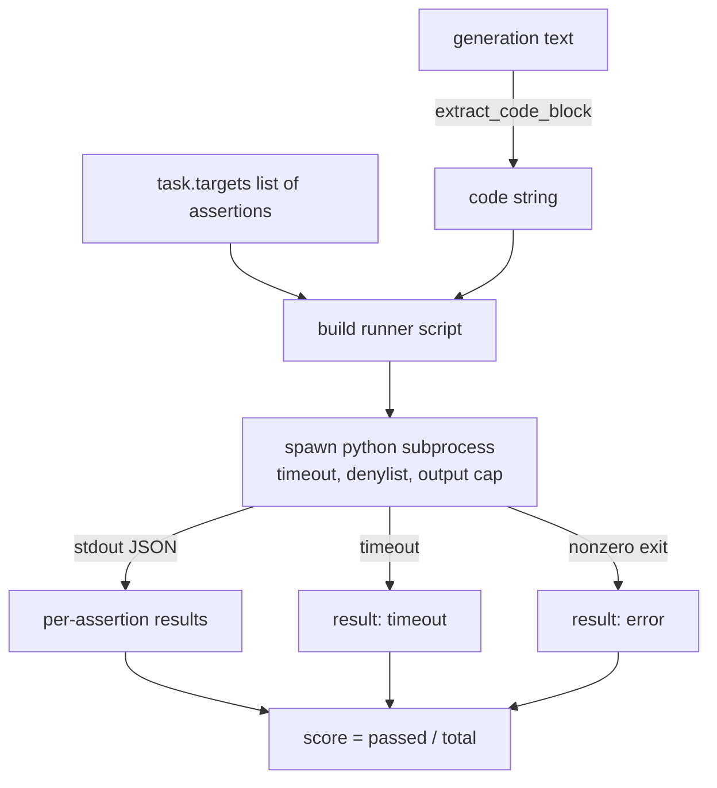
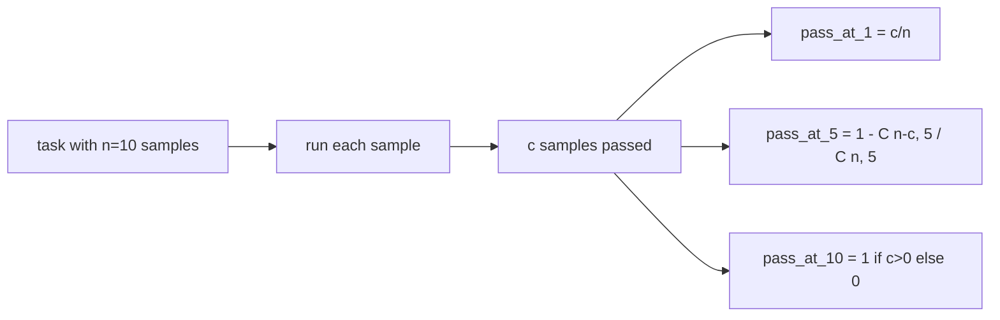

# Kod Exec Metrik

> Yaratılan kod testleri geçince doğru olur. değerlendirme harnesinin kodu çıkarması, ev sahibi çökmeden çalıştırması ve sayım geçiş oranlarını dürüstçe hesaplaması gerekir. Bu ders yüzeyi oluşturur.

**Type:** Build
**Languages:** Python
**Prerequisites:** Phase 19 Track B foundations, lessons 70 and 71
**Time:** ~90 min

## Öğrenme hedefleri

- Özgür bir biçim üretimi blokundan kod blokunu ders 70'den sonrası işlem kuralı ile eşleştir.
- Bir duvar saati zamanlaması, çıkış kapı ve bir ithalat denilisti ile ayrı bir alt işlemde aday kodu çalıştırın.
- Bir görevi, adayın karşısında geçen verili iddia dizileri bölümünün bir kısmı olarak puanlayın.
- Bir modelden birden fazla nesne örneği alan görevler için geçiş-at-k hesaplama.
- Kum kutu çöküşlerini, sözcük hatasını ve zaman çıkışlarını, koşucu'nun kaydetebildiği farklı çıkış kodları ile birinci sınıf başarısızlık modları olarak ele alın.

```figure
sandbox-runner
```

## Neden bir alt işlem

İndirim`exec`Bu, güvenlik ve istikrar için bir tehlike.`while True: pass`Bu değerlendirmeyi sonsuza kadar engeller.`import shutil; shutil.rmtree('/')`Bu, bir Python tercümanı oluşturmak, kodu stdin'e aktarmak, iddia sonuçlarını stdout'a yazmak ve işlemin aşılması durumunda işlemin öldürülmesi.

HumanEval, MBPP, BigCodeBench ve LiveCodeBench gibi gerçek değerlendirmeler alt işlem sandbox kullanır. Üstteki bazı katman Docker. Alt işlemleri bir nedenden dolayı durdururuz: taşınabilir, stdlib ve eğitim değerlendirme için önemli olan başarısızlık modlarını yakalar. Üretim dağıtımları seccomp, ağ izolasyonu ve sadece okuma dosya sistemi ekler.

## Kod-execu görevinin şekli

A.`code_exec`Görev , açıklama dizileri içerir .`targets`Koşucu, nesnenin bir kod blokunu çıkarır, etrafında bir test harnesini inşa eder ve sonucu çalıştırır.



Notun bir bölümü `[0, 1]`. İki geçiş puanı 0.667 olduğu üç iddialı bir görev. Uçuşcu, ne olursa olsun aynı şekli geri verir: alt işlem çöküşleri normal bir hata koduna harmanlanmıştır, harnes'e doğru kabaran bir Python izleme değil.

## Denylist

Denilist ithalat tabanlı. aday kodu çalıştırmadan önce, koşucunun metni tehlikeli modüllerin ithalatını yükselten bir çubuklara yeniden yazar.`ImportError("denied")`Liste kasten muhafazakar:`os.system`- Evet .`subprocess`- Evet .`socket`- Evet .`requests`- Evet .`urllib`- Evet .`urllib.request`- Evet .`urllib.error`- Evet .`urllib.parse`- Evet .`ctypes`- Evet .`shutil`- Evet .`http.client`- Evet .`asyncio.subprocess`- Evet .

Bu kurşun geçirmez bir şeymiş gibi davranmıyoruz. belirlenmiş bir karşılaşma kodu Python'da herhangi bir işlem içindeki kum kutudan kaçabilir. Denylist bir arka çıkışdır. Duvar saatinin zamanlaması ve çıkış kapı yük taşıma kontrolleridir.

```python
DENIED = {
    "os.system": True,
    "subprocess": True,
    "socket": True,
    "shutil": True,
    "requests": True,
    "urllib": True,
    "ctypes": True,
}
```

Başvuruyu hazırlayarak bağlıyoruz .`import sys`ve maymunlar için bir koruyucu .`os.system`Tam şablonun içinde.`main.py`- Evet .

## Duvar saatinin vakti

Her alt işlem üç saniyelik bir bütçe alır.`subprocess.run(..., timeout=t)`Eğer zaman sonunu alırsa, koşucu yakalar.`TimeoutExpired`, süreci öldürür ve bir kayıt yapar `timeout`Bu görevin puanı sıfırdır.

Zamanlama süreci  ile görev başına yapılandırılabilir.`task.metadata.timeout_s`Uzun süreli birim testleri daha fazla talep edebilir; ders 70'den gelen onaylayıcı, süiti sınırlandırmak için değeri otuz saniyeye sınırlıyor.

## Çıktılık kap

Alt işlem, stdout'u seldenir ve ev sahibi hafızasını tüketebilir. Koşucu stdout'u tampona akıtır ve çalışkan toplam 256 KB'yi geçtikten sonra çocuğu öldürür. Sonuç kaydedilmiştir.`exit_code = error`Detaylı bir dilimle.`"output overflow"`Bu, bir neslin yanlışlıkla yazdığı sonsuz bir döngü yazdığı zaman pratikte ortaya çıkar.

## - Geç-at-k

Pass-at-k, HumanEval ve arkadaşları tarafından kullanılan tarafsız bir tahminçidir.`n`Görev başına bağımsız örnekler ve `c`Bu örneklerin geçmesi, büyüklüğünün bir örnek olması olasılığıdır.`k`- ...`n`en az bir geçiş çözünürlüğü içerir:

```
pass_at_k(n, c, k) = 1 - C(n - c, k) / C(n, k)
```

Ne zaman ?`n - c < k`Sayıcı tanımlanmamış ve değer `1`Uygulama, kenarlık olayını doğrudan ele alır.`pass_at_k(n, c, k)`Ders 74'te liderlik katmanının kullanımı için.



## Çıkış kodları

Koşucu her görev için beş sonuçtan birini gönderir:

- `pass`Her sözün geçtiği zaman.
- `assertion_fail`Kod çalıştırıldığında ama en az bir iddiası başarısız oldu.
- `syntax_error`kodun içeri alınmadığı veya bir SYNTASYKALAR HALKATLARI olduğu durumlarda.
- `timeout`Duvar saati sona erdiğinde.
- `error`Denilist vurguları ve çıkış aşması dahil olmak üzere diğer herhangi bir çarpışma için (ayrıca aşım yüzeyleri detaylı olarak `"output overflow"`)

Sonuç hâlâ bir bölümü. Çıkış kodu metadata. Aşağıdaki dersler bir zaman sonunu sıfır olarak veya eksik veriler olarak saymaya karar verebilir.

## Bu ders neyi yapmaz

Bu, gerçek bir kum kutusu vermez. Açık webten güvenilmeyen kod çalıştırmaz. Dosya I/O veya ağ çağrıları gibi durumlu görevleri işlemez. Bunlar bir konteyner veya bir microVM gerektirir. Bu dersin amacı sözleşmedir: bir ayrı alt işlem, denylist, bir zamanlama, bir çıkış kapı, temiz bir çıkış kod sözlük ve geçme-k matematik.

## Şifreyi nasıl okuyabilirsiniz

`main.py`tanımlar `extract_code`- Evet .`run_candidate`- Evet .`score_code_exec`ve`pass_at_k`Alt işlemci senaryosu bir ip olarak oluşturulur ve `-c`Yeni bir Python tercümanına.`code/tests/test_exec.py`HumanEval tarzından alınan çalışma örneklerine karşı dört çıkış kodu ve pass-at-k kullanın.

Oku `main.py`Yukarıdan aşağıya. Runner şablonu yük taşıyan parça. Ana işlemine geri yazılan JSON zarfını tahmin edene kadar itiraz döngüsüne bakın.

## Daha ileri gitmeye çalışıyorum .

Alt işlem şekli işe yaradıktan sonra, bir sonraki endişe taşınabilirlik. Farklı Python sürümleri SIGKILL'i Windows'ta farklı şekilde kullanır. En temiz çözüm, koşucuyu Docker görüntüsüne koymaktır. Bundan sonraki şey, itiraf dizileri gerçek birim test dosyalarıyla değiştirmek, böylece değerlendirme üretim CI'nin yaptığıyla eşleşir. Bu noktada iddia iplerini test olarak adlandırmayı bırakın; bunlar oyuncak testleri ve oyuncak başarısızlık modları vardır.
