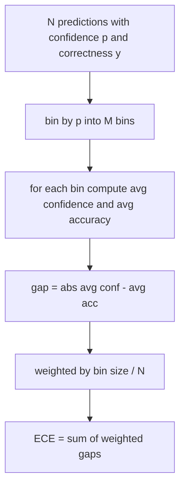
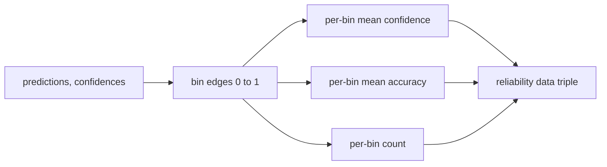

# Kafası karışık ve kalibrasyon

> Eğer modeliniz bin cevabı %90 güvenle verip %600 doğru bulursa, bu doğru değil. Kalibrasyon güvenilir değerlendirmeyin yarısıdır. Diğer yarısı da karmaşıklık, modelin tutulan metnin mantıklı olduğunu düşünüp düşünmediğini gösteriyor.

**Type:** Build
**Languages:** Python
**Prerequisites:** Phase 19 Track B foundations, lessons 70 and 71
**Time:** ~90 min

## Öğrenme hedefleri

- Model adaptör tarafından sağlanan token negatif log olasılıklarından, bir korpus üzerinde token seviyesindeki karmaşıklığı hesaplayın.
- Bir sınıflandırıcının veya birden fazla seçeneğin tahmin edilen olasılıklardan beklenen kalibrasyon hatasını (ECE) hesaplayın.
- Brier puanını hesaplayın (sağlık göstergesi karşısında ortalama kareler hatası) ve ECE'nin yapmadığı şeyleri ne zaman yaptığını açıklayın.
- Güven-Düzgünlik eğri çizmek için gerekli güvenilirlik şablon verilerini oluşturun.
- Üçünü de değerlendirme kemerine bağla , böylece koşucu bağlanabilir .`perplexity`- Evet .`ece`ve`brier`Model rapor için numaralar.

```figure
cd-reliability-diagram
```

## Neyin şaşırtıcı olduğunu anlayacaksın.

Kafasızlık, bir token başına ortalama negatif log olasılığıdır. Daha düşük daha iyidir. Birin karmaşıklığı, modelin her gerçek simgeye bir olasılık tahsis ettiği anlamına gelir. Sözcük büyüklüğünün karmaşıklığı, modelin birer halinde olduğu ve hiçbir şey öğrenmediği anlamına gelir. Gerçek rakamlar arasında düşüyor: WikiText-103'deki güçlü 2026 temel modeli sekiz ila on iki arasında yer alır. Aynı metinde kötü olan 50 artı.

Harness log-probabiliteleri kendiliğinden hesaplamaz. Bunlar model adaptöründen gelir. Harness agregatları: bir token log-probabiliteleri listesini alır, bir dizi başına token sayıları listesini alır ve korpus karmaşıklığını iade eder.

```python
def perplexity(neg_log_probs, token_counts):
    total_nll = sum(neg_log_probs)
    total_tokens = sum(token_counts)
    return math.exp(total_nll / total_tokens)
```

Uygulama sıfır jeton kenar durumlarını ele alır ve negatif log- olasılıklarının negatif olmadığını iddia eder.`log p`yerine`-log p`Bu işlev bunu sözleşme ihlal olarak algılar.

## ECE'nin hangi önlemleri

Beklenen kalibrasyon hatası, sabit bir sayıda kutuya güvenleri ile tahminleri gruplar ve daha sonra kutuların büyüklüğü ile ağırlanan güveni ve doğruluk arasındaki ortalama farkı ölçer.



Standart formülasyonda 10 adet eşit genişlikten kutu kullanılıyor .`[0, 1]`Uygulama herhangi bir pozitif tam sayıyı destekler.`bins`Parametr, koşucunun yayın konvansiyonu (10) ile karşılaştırma konvansiyonu (15) arasında seçim yapabilmesi için.

ECE, kutu sayısına ve örnek boyutuna göre tarafsızdır. On kutu ve yüz tahminle, rastgele gürültüden 0.02 ECE'yi ayırt edemezsiniz. Uygulama ECE ile birlikte kalabalık kutu sayısını gönderir, böylece koşucu çok az örnek üzerinde tek bir sayı bildirmeyi reddedebilir.

## Brier'in ECE'nin yapmadığı puan

ECE sadece ortalama boşluklar hakkında endişeleniyor. Bir model kutuların yarısına aşırı güvenir ve diğer yarısına güvenirken yerel olarak kötü kalibrelenirken düşük ECE'ye sahip olabilir. Brier puanı, tahmin başına gerçek sonuç karşısında karelerde hata ölçer, bu nedenle doğrudan yayılmayı cezalandırır.

İkili sonuçlar için Brier `mean((p_i - y_i)^2)`Bu, güvenilirliğe, çözünürlüğüne ve belirsizliklere ayrılır.

```python
def brier(p, y):
    return float(np.mean((p - y) ** 2))
```

## Güvenilirlik şablonu verileri

Bir güvenilirlik şablonu, her bin'de empirici doğruluğa karşı güven tahminini gösterir. Diagonal mükemmel kalibrasyondur. Fonksiyon üç dizini gönderir: bin başına ortalama güven, bin başına ortalama doğruluk ve bin başına sayım.



Geri dönüştürülen tuple, bir çağrı katmanının planı çizmek veya özel bir ECE varianti hesaplamak için ihtiyaç duyduğu şeydir (adaptif ECE, tarama ECE, vb.).

## Güven Kaynakları

Harness, güvenin softmax' dan geldiğini düşünmez.`[0, 1]`Çoklu seçim görevleri için doğal güven `softmax over option log-likelihoods`Bu, normal güvenilirlik olarak, modelin kendi kendine bildirilen olasılık veya ortalama log olasılığının eksponensalini gösterir.

## Kenarlık kapı

- Tüm tahminler yanlış: ECE ortalama güven, Brier yüksek, karmaşıklık modelin metne ne düşündüğünü.
- Tüm tahminler yüksek güvenle doğru: ECE sıfır yakınında, Brier sıfır yakınında.
- P=0.5'de tamamen belirsiz bir tahminçi: ECE 0.5 eksi doğruluk, Brier 0.25 eksi bir doğrulama terimi.
- Boş giriş: ECE, Brier ve güvenilirlik geri dönüşü `0.0`(veya sıfır dolmuş dizileri).`NaN`Bu yollardan hiçbiri uyarı yaymaz; koşucu değerleri inceliyor ve rapor vermek veya atlamak için karar veriyor.

Bu vakalar testlere yerleştirilir. Gerçek bir referans üzerinde gerçek bir model onlara çarpar, ama bir buggy adaptörü veya küçük bir örnek çarpar ve koşucu düşmemesi gerekir.

## Gönderi

Kalibrasyon F1 gibi bir görev metrikası değil.`(confidence, correct)`Bu işlemler, ECE, Brier ve güvenilirlik verilerini bir kez hesaplar ve görevden görev puanlamasından ayrı olarak, kalmış bir metin korpusu üzerinde karmaşıklık hesaplanır.

Ara yüzü:

```python
report = CalibrationReport.from_predictions(confidences, correct)
report.ece          # float
report.brier        # float
report.reliability  # tuple of three numpy arrays
report.populated_bins  # int
```

`PerplexityResult.from_token_nll(neg_log_probs, token_counts)`Token başına karmaşıklık ve ortalama negatif log olasılığı gönderir.

## Bu ders neyi yapmaz

Bu, bir model çağırmaz. Softmax uygulamamaktadır. Çıktılık belirtilerinden güvenini tahmin etmez; bu adaptörün işi. Temperatur ölçeklemesini veya Platt ölçeklemesini yapmaz; bunlar farklı bir ders içinde yaşayan post-hoc düzeltmeleridir. Bu dersin amacı üç rakamı (çılgınlık, ECE, Brier) güvenilir ve yeniden üretilebilir hale getirmektir.

## Şifreyi nasıl okuyabilirsiniz

`main.py`tanımlar `perplexity`- Evet .`expected_calibration_error`- Evet .`brier_score`- Evet .`reliability_diagram`, ve `CalibrationReport`- Ne ?`PerplexityResult`Bu testler, temel gerçekliği bildiği sentetik tahminlere dayanır: iyi kalibrlenen bir model, aşırı güvenli ve güvensiz bir model.`code/tests/test_calibration.py`Her kenar kapıyı ekle ve sentetik tahminçiler için referans değerlerini işaretle.

Oku `main.py`Bu işlemlerin birbiriyle ilgili olarak, bir dizi metin ve bir sözleşme ile ilgili olarak, bir dizi metin ve bir dizi metin ile ilgili olarak, bir dizi metin ve bir dizi metin ile ilgili olarak, bir dizi metin ve bir dizi metin ile ilgili olarak, bir dizi metin ve bir dizi metin ile ilgili olarak, bir dizi metin ve bir dizi metin ile ilgili olarak, bir dizi metin ile, bir dizi metin ile, bir dizi metin ile, bir dizi metin ile, bir dizi metin ile, bir dizi metin ile, bir dizi metin ile, bir dizi metin ile, bir dizi metin ile, bir dizi metin ile, bir dizi metin ile, bir dizi metin ile, bir dizi metin ile, bir dizi metin ile, bir dizi metin ile, bir dizi metin ile, bir dizi metin ile, bir dizi metin ile, bir dizi metin ile, bir dizi ile, bir dizi metin ile, bir dizi ile, bir dizi metin ile, bir dizi ile, bir dizi ile, bir dizi ile, bir dizi ile, bir dizi ile, bir dizi ile, bir dizi ile, bir, bir, bir, bir, bir, bir, bir, bir, bir, bir, bir, bir, bir, bir, bir, bir, bir, bir, bir, bir, bir, bir, bir, bir, bir, bir, bir, bir, bir, bir, bir, bir, bir, bir, bir, bir, bir, bir, bir, bir, bir, bir, bir, bir, bir, bir, bir, bir, bir, bir, bir, bir, bir, bir, bir, bir, bir, bir, bir, bir, bir, bir, bir, bir, bir, bir, bir, bir, bir, bir, bir, bir, bir, bir, bir, bir, bir, bir, bir, bir, bir, bir, bir, bir, bir, bir, bir, bir, bir, bir, bir, bir, bir, bir, bir, bir, bir, bir, bir, bir, bir, bir, bir, bir, bir, bir, bir, bir, bir, bir, bir, bir, bir, bir, bir, bir, bir, bir, bir, bir, bir, bir, bir, bir, bir, bir, bir, bir, bir, bir, bir

## Daha ileri gitmeye çalışıyorum .

Kalibrasyon yayınlanan değerlendirme'de en çok göz ardı edilen eksindir. Çoğu sıralama tablosu tek bir doğruluk numarasını rapor eder ve bunu tamamladığını söyler. Dürüstlük konusunda kazanılan ve Brier'e kaybedilen bir model, doğruluk konusunda birkaç puan daha düşük puan alan ancak belirsizliklerini güvenilir bir şekilde bildiren bir modelden daha kötü bir üretim uygulanmasıdır. Kalibrasyon tesisatını yerleştirdikten sonra, uzun süreli bir doğrulama parçasındaki sıcaklık ölçeklemesini ekleyin, ECE'yi yeniden hesaplayın ve boşluğu küçültmeyi izleyin. Bu ayrı bir ders ama zemin burada yaşıyor.
