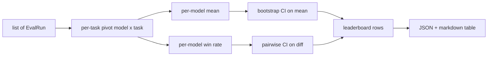
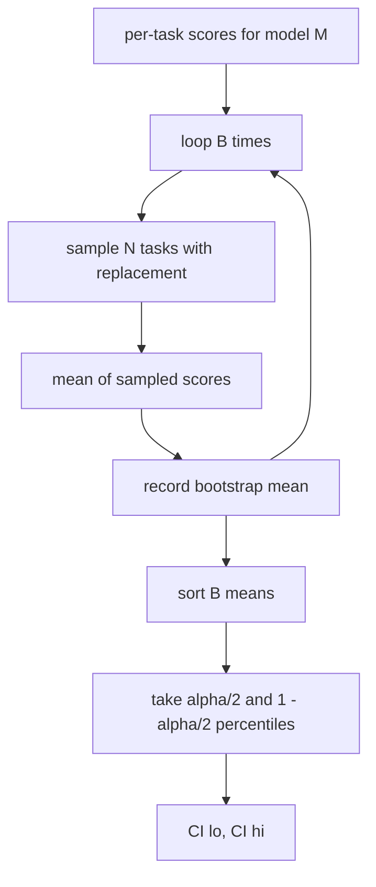

# Lider Tablosu Toplantısı

> Görev başına puanlar kolay. Heterogene görevlerdeki model sıralamaları daha zor. Bin tahmin lider tablosundaki istatistiksel önem herkesin atladığı bir bölümdür. Bu ders bunu atlamaz.

**Type:** Build
**Languages:** Python
**Prerequisites:** Phase 19 Track B foundations, lessons 70, 71, 73
**Time:** ~90 min

## Öğrenme hedefleri

- Çoklu modeller ve çoklu görevler boyunca görev başına puanları düzenli bir model başına sıra olarak toplayın.
- Eşsiz puanları normalleştirmek, böylece geçiş oranları ve BLEU değerleri toplamı fazla etkilemez.
- Ortalama ve kazanç oranı ile modelleri sıralayın ve her biri doğru bir özet olduğunda açıklayın.
- Modelle başına ortalama puan ve çiftlik farklılıkları üzerine bootstrap güven aralıkları hesaplayın.
- Ranger tablosunu JSON raporu olarak çıkartın ve ders 75'teki koşucunun bir CI yorumuna yapıştırması.

```figure
ci-leaderboard-ci
```

## Giriş biçimi

Toplayıcı bir listeyi tüketir `EvalRun`Kayıtlar:

```python
@dataclass
class EvalRun:
    model_id: str
    task_id: str
    metric_name: str
    score: float          # in [0, 1]
    category: str
```

75 dersindeki koşucu , her bir kişiye bir rekor çıkarıyor .`(model, task)`Bir çift. toplayıcı puanın nasıl üretildiği umurunda değil.`[0, 1]`- Evet .

## Çıktı

Üç masa çıkıyor:



Randevu sıralaması şunları içerir: `model_id`- Evet .`mean_score`- Evet .`mean_ci_lo`- Evet .`mean_ci_hi`- Evet .`win_rate`- Evet .`tasks_completed`, ve bir seçeneği `categories`Kategoriya ortalaması için haritaya.

## Normalleşme

Bir görev puan alırsa `[0, 1]`Ve bir tane daha .`[0, 100]`Bir toplamlayıcı, her giriş puanının yer aldığını doğruluyor.`[0, 1]`Bu, bir süre sonra bir süre sonra bir süre sonra bir süre sonra bir süre sonra bir süre sonra bir süre sonra bir süre sonra bir süre sonra bir süre sonra bir süre sonra bir süre sonra bir süre sonra bir süre sonra bir süre sonra bir süre sonra bir süre sonra bir süre sonra bir süre sonra bir süre sonra bir süre sonra bir süre sonra bir süre sonra bir süre sonra bir süre sonra bir süre sonra bir süre sonra bir süre sonra bir süre sonra bir süre sonra bir süre sonra bir süre sonra bir süre sonra bir süre sonra bir süre sonra bir süre sonra bir süre sonra bir süre sonra bir süre sonra bir süre sonra bir süre sonra bir süre sonra bir süre sonra bir süre sonra bir süre sonra bir süre sonra bir süre sonra bir süre sonra bir süre sonra bir süre sonra bir süre sonra bir süre sonra bir süre sonra bir süre sonra bir süre sonra bir süre sonra bir süre sonra bir süre sonra bir süre sonra bir süre sonra bir süre sonra bir süre sonra bir süre sonra bir süre sonra bir süre sonra bir süre sonra bir süre sonra bir süre sonra bir süre sonra bir süre sonra bir süre sonra bir süre sonra bir süre sonra bir süre sonra bir süre sonra bir süre sonra bir süre sonra bir süre sonra bir süre sonra bir süre sonra bir süre sonra bir süre sonra bir süre sonra bir süre sonra bir süre sonra bir süre sonra bir süre sonra bir süre sonra bir süre sonra bir süre sonra bir süre sonra bir süre sonra bir süre sonra bir süre sonra bir süre sonra bir süre sonra bir süre sonra bir süre sonra bir süre sonra bir süre sonra bir süre sonra bir süre sonra bir süre sonra bir süre sonra bir süre sonra bir süre sonra bir süre sonra bir süre sonra bir süre sonra bir süre sonra bir süre sonra bir süre sonra bir süre sonra bir süre sonra bir süre sonra bir süre sonra bir süre sonra bir süre sonra bir süre sonra bir süre sonra bir süre sonra bir süre sonra bir süre sonra bir süre sonra bir süre sonra bir süre sonra bir süre sonra bir süre sonra bir süre sonra bir süre sonra bir süre sonra bir süre sonra bir süre sonra bir süre sonra bir süre sonra bir süre sonra bir süre sonra bir süre sonra bir süre sonra bir süre sonra bir süre sonra bir süre sonra bir süre sonra bir süre sonra bir süre sonra bir süre sonra bir süre sonra bir süre sonra bir süre sonra bir süre sonra bir süre sonra bir süre sonra bir süre sonra bir süre sonra bir süre sonra bir süre sonra bir süre sonra bir süre sonra bir süre sonra bir süre sonra bir süre sonra bir süre sonra bir süre sonra bir süre sonra bir süre sonra bir süre sonra bir süre sonra bir süre sonra bir süre sonra bir

## Ortalama ve kazanç oranı

İki sıralama sistemi farklı amaçlara hizmet eder.

Ortalama puan, bir model için görev başına puanların ortalamasıdır. Başlık sayı leaderboard raporudur.

Kazanç oranı, bir modelin aynı görevde diğer tüm modellerden ne sıklıkta geçtiğini hesaplar. Her görev için en yüksek puan alan model kazanır (taktı bölünür). Kazanç oranı, modelin puan alan görevlerin sayısına bölünmüş kazançlara eşit olur.

```python
def win_rate(model_id, runs_by_task, all_models):
    wins, total = 0, 0
    for task_id, runs in runs_by_task.items():
        scores = {r.model_id: r.score for r in runs if r.model_id in all_models}
        if model_id not in scores:
            continue
        total += 1
        best = max(scores.values())
        if scores[model_id] >= best:
            wins += 1
    return wins / total if total else 0.0
```

Harness her ikisini de bildirir. Ders 75'te koşucunun standart olarak ortalama sıralaması vardır; kullanıcı tercih ederse kazanç oranı için geriye doğru sütun tam orada bulunur.

## Bootstrap güven aralıkları

Modelle göre bir güven aralığı ile gelir. Görevler üzerinde yeniden örnekleme ile tahmin edilir. Görev kimliklerini değiştirmekle yeniden örnekleyelim, yeniden örneklenen set üzerinde ortalamayı hesaplayalım, tekrarlayalım `B`%s intervalini düzeyde alın.`alpha`- Evet .



Çiftlik karşılaştırmalar için görev başına farkı başlatırız `score_A - score_B`Bu durumda, fark alfa seviyede önemli olur. Eğer bu değilse, sıralama tablosu modelleri eşit olarak değerlendirir.

Düşük düzeyde yardımcılar (`bootstrap_mean_ci`- Evet .`bootstrap_pairwise_diff`) `B=1000`• kamu toplayıcıları (`aggregate`- Evet .`pairwise_diffs`) `b=500`Bu yüzden demo ve testler hızlı kalır. Varsayılan alfa 0.05'dir.

## Kategoriler

- Eğer`EvalRun.category`Bu, her sıralama tablosundaki sütun ve bu sütun,`math`- Evet .`reasoning`- Evet .`code`- Evet .`safety`Bu, bir modelin genel olarak iyi olup olmadığını ama kodun zayıf olup olmadığını belirlemesine izin verir. Bu, başlık anlamı tarafından gizlenen bir bilgi.

## Markalı dönüşüm

Randevran bir çizgi çizelgesi olarak gösterilmiştir:

```text
| Rank | Model | Mean | 95% CI | Win rate | Tasks |
|------|-------|------|--------|----------|-------|
| 1    | gpt   | 0.78 | 0.74-0.82 | 0.62 | 50 |
| 2    | claude| 0.75 | 0.71-0.79 | 0.34 | 50 |
| 3    | random| 0.10 | 0.07-0.13 | 0.04 | 50 |
```

Tablo ortalama puan ile sıralanır. CI iki onluklara gösterilmektedir. Uzun model kimlikleri yirmi karakterlere kısaltılır.

## Bu ders neyi yapmaz

Bu, model çalıştırmaz. Metrik katmanı çağırmaz. Adaptif ECE veya diğer kalibrasyon varyantlarını uygulanmaz. Bunlar ders 73. Görev ağırlığını uygulanmaz. Her görev burada aynı sayılır. Üretim sıralamaları ağırlık görevleri; bu kancayu açık bırakırız.`weight`Eğer ihtiyacınız olursa, bir sonraki dersde ağırlık ekleyin.

## Şifreyi nasıl okuyabilirsiniz

`main.py`tanımlar `EvalRun`- Evet .`LeaderboardRow`- Evet .`aggregate`- Evet .`bootstrap_mean_ci`- Evet .`bootstrap_pairwise_diff`ve`render_markdown`. Demo, üç model ve on iki görevden oluşan sentetik bir takım oluşturur, toplamaları oluşturur ve sıralama tablosunu ve çiftlik farklılık tablosunu yazdırırır.`code/tests/test_leaderboard.py`Başlangıç çizgisini, geri dönüşü, kazanç oranı kenarlık durumlarını ve boş giriş davranışını işaretle.

Oku `main.py`Top aşağı. Veriler şekli (EvalRun, LeaderboardRow) önce gelir, toplayıcı sonra, başlangıç çubuğu üçüncü, gösterme son. Her işlev odaklı bir sözleşme vardır.

## Daha ileri gitmeye çalışıyorum .

Doğal bir sonraki adım eşleşmemiş bir başlangıç şeridi yerine çiftleme görevi anlamıdır. Eğer A ve B modelleri aynı yüz görevi gerçekleştirirse, uygun test, görevden görev farklılıkları üzerinde çiftleştirilmiş bir başlangıç çizgisidir. Bundan öte, görev aileleri saygı derecesinde bir hiyerarşik başlangıç çizgisi istiyorsunuz (matematik sorunlar birbirinden bağımsız değildir; bir aritmetik hata örneği onlarını etkiler). Bu bir takip. Bu dersin amacı, düzeyi doğru yapmaktır. Böylece değerlendirme, savunabileceğiniz bir rakamı rapor eder.
