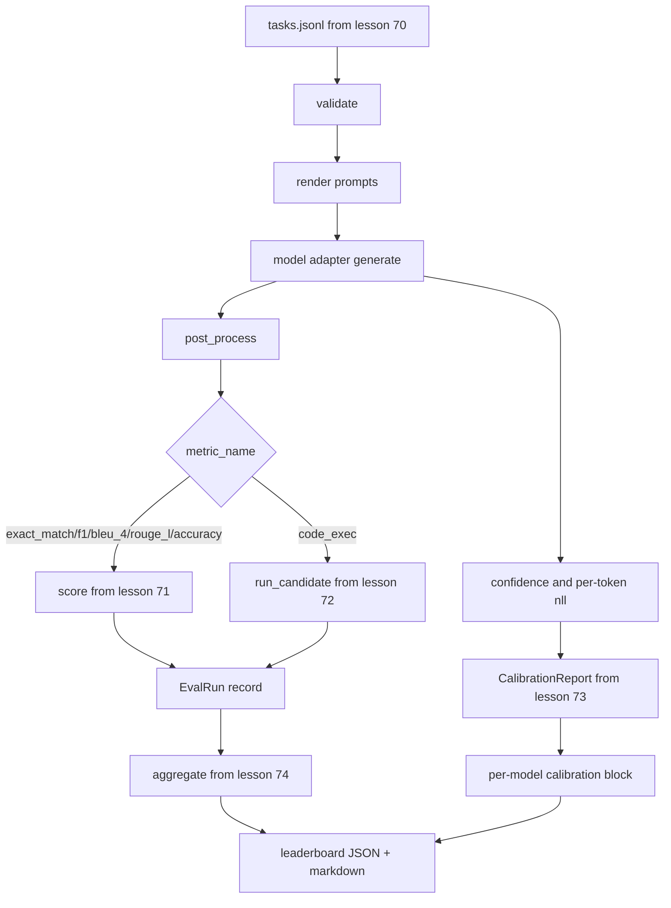

# Sonundan Sonuna Eval Koşucu

> Beş tesisat dersi, onları yapıştırmak için bir ders. Koşucu, 70 dersiyle görev spesifikasyonunu okuyor, adaptör aracılığıyla bir model çağırır, 71 ve 72 dersi ile puanlar, 73 dersiyle kalibrasyon raporunu ekler ve 74 dersiyle lider tablosunu yayar. Demo kendini bitirir.

**Type:** Build
**Languages:** Python
**Prerequisites:** Phase 19 Track B foundations, lessons 70 through 74
**Time:** ~90 min

## Öğrenme hedefleri

- Define et `ModelAdapter`Herhangi bir modelin (sahte, yerel, API) küçük bir yöntem yüzeyi ile tatmin edebileceği bir arayüz.
- Çalışanlar havuzunda paralel görev yürütmesi ile sabit bir JSONL dosyası üzerinde eval çalıştırın.
- Bir geçit içinde kalibrasyon katmanı ile metrik katmanı (exact_match, F1, BLEU-4, ROUGE-L, code_exec) birleştirin.
- Modelle göre emit `EvalRun`Kayıtlar ve doğrudan sıralama çizelgesine ekler.
- Hem JSON raporunu hem de bir markdown tablosunu çıkart; temiz bir çalışmada sıfır çıkışla kendiliğinden bitir, doğrulama veya çalıştırma süresi başarısızlığı sırasında sıfır dışı.

```figure
eval-grid
```

## - Boru hattı



Koşucu, entegrasyon noktasıdır. 70 ila 74 dersleri arasında koşucu tarafından oluşturulan bir modül vardır. Koşucu bu modüllerden herhangi bir mantığı kopyalamaz: bunları ithal eder.

## Adaptör arayüzü

Adaptör, koşucu ile herhangi bir model arasındaki dikiştir.

```python
class ModelAdapter:
    model_id: str

    def generate(self, prompt: str, task: TaskSpec) -> Generation: ...
```

`Generation`aşağıdaki bir veri sınıfıdır:

- `text`: modelin serbest biçim çıkışı
- `confidence`: bir yüzer `[0, 1]`Modelin yanıt için kendi kendine bildirilen olasılıklarını temsil eden
- `token_nll`: oluşturulan tokenler üzerindeki negatif log olasılığının seçmeli toplamı
- `token_count`: Yaratılan tokenlerin seçeneği

Koşucuda bulunan sahte adaptörler üç tat sağlar: `RuleBasedAdapter`(determinist, neredeyse mükemmel),`NoisyAdapter`(çok kendine güvenen, çoğu zaman yanlış) ve`BiasedAdapter`Demo, ders 70'li takımın her üçü üzerinde çalışıyor.

## Paralel yürütme

Koşucu kullanır `concurrent.futures.ThreadPoolExecutor`İşçi sayısı öntanımlı olarak sekizden küçük olan ve görev sayısına kadar. Düzgün model çağrıları için şişe boğazı ağ I/O olduğu için yeterlidir. Kod-execute yolu görevin içinde kendi alt işlemini oluşturur ve uygulayıcı sadece bekleme programını programlar.

Determinizm testleri için, koşucu ortaya çıkarır `run_eval(adapters, tasks, parallel=False)`Böylece testler idam emri belirleyebilir.

## Tek geçiş puanlama döngüsü

Her görev için:

1. İndirme işaretini gönderin (belirli bir kaç atışla birlikte, iptal etme işaretini ekleyin).
2. Adaptörü arayın ve çağrı zamanı belirleyin.
3. Görev kuralına göre nesneyi sonrası işlem.
4. Metrik katmanına gönder.
5. Bir tane yapın.`EvalRun`Not ve metrik metadata ile kayıt.
6. Ekle `(confidence, correct)`Kalibrasyon tamponu ile çiftleştir.

- Evet .`correct`Sinyal `score >= 1.0`exact_match stilli ölçümler için (`exact_match`- Evet .`accuracy`- Evet .`code_exec`) ve `score >= 0.5`Sınıf ölçümleri için.`_correct_from_score`Koşucu bir kamu baskısını ortaya çıkarmaz.

## Toplantı

Her görevin sonucu olduğunda, koşucu arar.`aggregate`ve `pairwise_diffs`Ders 74 ve `CalibrationReport.from_predictions`Dersi 73. çıkış tek bir JSON zarfıdır:

```json
{
  "leaderboard": [...],
  "pairwise": [...],
  "calibration": {
    "model_id_a": {"ece": 0.04, "brier": 0.10, "populated_bins": 8, ...},
    ...
  },
  "summary": {
    "tasks": 10,
    "models": 3,
    "wall_seconds": 1.2
  }
}
```

Koşucu ayrıca kullanıcının sonuçları bir PR incelemesine yapıştırması için stdout'a bir işaretleme tablosu yazar.

## Kendini yok eden demo

Demo ders 70'den on sabit görev boyunca üç sahte adaptör çalıştırır. Duvar süresi 10 saniyeden az olmalıdır.

Temizlik kriterleri şunlardır:

- Her görev ders 70'e göre doğrulanmış.
- Her görev 71 ve 72 ders altında puanlandı.
- Kalibrasyon raporu hata olmadan ders 73'e göre toplanmıştır.
- Randej tablosu kurallara dayalı adaptörü rastgele adaptörden kesinlikle üst düzeyde sıraladı.

Bu kırıklardan herhangi biri olursa, JSON zarfında yapılandırılmış bir hata ile koşucun sıfır dışı çıkması gerekir.

## Bu ders neyi yapmaz

Bu, gerçek bir model çağırmaz. API anahtar akışı veya hız limitini işlemeyi uygulamıyor. Akış veya kısmi jenerasyon uygulamıyor; adaptör her çağrıda bir nesil gönderir. Geri denemeleri veya önbelleği yapmıyor. Bu sorunlar adaptör katmanında yaşar; koşucu metrik-agnostik ve sağlayıcı-agnostiktir.

## Şifreyi nasıl okuyabilirsiniz

`main.py`Diğer beş ders modülünden küçük bir`_load_sibling`Bu, bir yardımcı olarak göreceli yolla çözülür.`Generation`- Evet .`EvalReport`ve`ModelAdapter`Sahte adaptörler dosyanın alt tarafında.

Oku `main.py`Üstüne aşağıya.`run_eval`O zaman ...`_score_one`Sonunda gösterim giriş noktasıdır.

Testler `code/tests/test_runner.py`Adaptör arayüzünü, tek geçiş döngüsünü, paralel karşı sıralama eşdeğerliğini, kalibrasyon tamponu ve JSON zarf şeklini pinle.

## Daha ileri gitmeye çalışıyorum .

Bu koşucun zemini. Bir üretim değerlendirme sistemi ekler: sonuçlar önbelleği kilitlenmiş `(task_id, model_id, model_version)`Bu, bir süre boyunca dolar ve jetonları takip eden bir maliyet defteri, oran sınırlarını destekleyen bir yeniden deneme katmanı, geçiş-at-k görevleri için örnekleme politikası ve uzun sıralar için akış çıkış biçimi.

Sahteliklerin çalışmasından sonra gerçek bir sağlayıcı için bir adaptör ekleyin. Bir tane ücretsiz bir katman ile seçin, otuz satır yapıştırıcı yazın, lider tablosunun ışığını izleyin. Sonra ikinci sağlayıcı ekleyin ve harness'in işini yapmasına izin verin.
