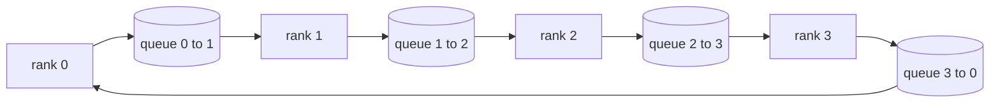

# Toplu İşler Baştan Başlangıç

> Toplu olarak dağıtılmış eğitimleri bir araya getiren dört operasyon: allreduce, broadcast, allgather ve reduce_scatter.`multiprocessing.Queue`- - - - - - - - - - - - - - - - - - - - - - - - - - - - - - - - - - - - - - - - - - - - - - - - - - - - - - - - - - - - - - - - - - - - - - - - - - - - - - - - - - - - - - - - - - - - - - - - - - - - - - - - - - - - - - - - - - - - - - - - - - - - - - - - - - - - - - - - - - - - - - - - - - - - - - - - - - - - - - - - - - - - - - - - - - - - - - - - - - - - - - - - - - - - - - - - - - - - - - - - - - - - - - - - - - - - - - - - - - - - - - - - - - - - - - - - - - - - - - - - - - - - - - - - - - - - - - - - - - - - - - - - - - - - - - - - - - - - - - - - - - - - - - - - - - - - - - - - - - - - - - - - - - - - - - - - - - - - - - - - - - - - - - - - - - - - - - - - - - - - - - - - - - - - - - - - - - - - - - - - - - - - - - - - - - - - - - - - - - - - - - - - - - - - - - - - - - - - - - - - - - - - - - - - - - - - - - - - - - - - - - - - - - - - - - - - - - - - - - - - - - - - - - - - - - - - - - - - - - - - - - - - - - - - - - - - - - - - - - - - - - - - - - - - - - - - - - - - - - - - - - - - - - - - - -

**Type:** Build
**Languages:** Python
**Prerequisites:** Phase 19 Track C lessons 42-49
**Time:** ~90 min

## Öğrenme Hedefleri

- Implement ring allreduce iki geçiş (reduce-scatter sonra allgather) ve her sıra iletişim hacmi 2(N-1) / N bytes element başına olduğunu kanıtlamak.
- Gösteri oluşturun, toplayın ve nokta-to- nokta gönderilerinin üzerine yayımlanmayı azaltın `multiprocessing.Queue`- Evet .
- Her bir primitif'i bir `torch.distributed`Aynı giriş için referans.
- Kluster şekli, gecikme zemini ve bant genişliği tavanı üzerine halka vs ağaç seçimini savun.

## Sorun

N sıralar üzerinde saf bir tüm azaltmak, N çarpı tenzoru köküye gönderir ve N çarpı geri gönderir. Band genişliği, her sıra için O ((N) olarak ölçebilir, kök bir şişek boynuna dönüşür ve duvar saatinin zemini en yavaş bağlantı çarpı N'dir. Ring allreduce flattens'i 2(N-1) büyüklüğündeki T/N parçalarına düşürür, böylece sıra başına baytlar kümenin büyüklüğünden bağımsız olarak 2T(N-1)/N'e düşer. Ağacı altreduce küçük N ve yüksek gecikme bağlantılarında kazanır çünkü derinlik 2(N) yerine log2(N) hops. Kluster şekli için yanlış topoloji seçin ve en yavaş GPU adım zamanını belirler.

Bu izleri okuduğunuz her dağıtılan eğitim çerçevesinin temelinde bu dört primitif var. PyTorch DDP, gradientleri parametre kova başına bir allreduce ile senkronize eder. ZeRO, reduc_scatter ile optimizer durumunu parçalayarak ve allgather tarafından güncellenmiş parametreleri yayınlar. FSDP, tüm ileriyi tüm toplama artı azaltma_paylayıcıya dönüştürür. Bombalardaki paralel ihtiyaçlar, aşama grupları arasında etkinleştirmeler için yayınlanır. Eğer dört kolektifi uygulayamıyorsanız, eğitimlerin neden durduğunu, gradient eşleşmemesinin neden 3'te olduğunu veya topolojileri değiştirdiğinizde boru hattı kabarcığının neden iki katına çıkıyor olduğunu düşünemezsiniz.

## Anlaşım



### İki geçişle tüm yüzükleri düşürün .

Tansoru N eşit parçalara ayırmak 0..N-1 indeksi. Her bir rütbe rütbesine eşit bir parça endeksi vardır. 1 geçit, yayılma azaltma, N-1 adımları. S adımında, r r, mod N'yi (r + 1) mod N'ye gönderir ve mod N'den (r - s - 1) mod N'yi (r - 1) mod N'den alır ve alınan parçayı yerel kopyasına biriktirir. N-1 adımlardan sonra, r r r'nin tüm toplamına sahip olur. 2. geçişi, toplanıp, bir N-1 adım daha atıp, her sıra her parçacık için tam toplamı tutana kadar bitmiş parçaları halka çeviriyor.

| Primitive | Per-rank bytes | Steps | When to use |
|-----------|---------------|-------|-------------|
| Ring allreduce | 2T(N-1)/N | 2(N-1) | Large T, fat-pipe homogeneous cluster |
| Tree allreduce | T log2(N) | 2 log2(N) | Small T or high-latency links |
| Broadcast | T | log2(N) tree | Parameter init, scalar config |
| Allgather | T(N-1)/N | N-1 | Sharded forward, ZeRO unshard |
| Reduce_scatter | T(N-1)/N | N-1 | ZeRO gradient sharding |

### NCCL'nin yerine sırayla ağ

NCCL, PCIe ve NVLink'de donanımlı yüklenme oranı azaltır.`multiprocessing.Queue`Bu, bir kullanıcı alanında gerçekleşir, bu nedenle Python genel masraflarını ödersiniz, ancak tel örneği NCCL ring allreduce ile aynıdır.

### Glow karşı kontrol

Her ilkel , üretimini karşılaştıran birim testi ile yer alır .`torch.distributed`Eğer yüzük tümü aynı dünya boyutunda aynı tenzorda, aynı geri uç ile başlatılır. Eğer tümü küçük yüzük, tümüyle aynı dünya boyutunda, tümüyle aynı güneşten float32 epsilon'dan fazla farklılık gösterirse, test başarısız olur.

```figure
ci-ring-allreduce
```

## Yapın

`code/main.py`Uygulamaları:

- `Mesh`N tellerini taşıyan sınıf`multiprocessing.Queue`Bir halka ve açıklamalara girer.`send(dst, tensor)`ve `recv(src)`Bir sıra.
- `ring_allreduce(mesh, rank, world_size, tensor)`İki geçiş algoritmasını çalıştırmak.
- `broadcast(mesh, rank, world_size, tensor, src)`Bir logaritmik ağaç üzerinde.
- `allgather(mesh, rank, world_size, tensor)`N-1 dönüşümleri kullanıyor.
- `reduce_scatter(mesh, rank, world_size, tensor)`Allreduce'nin ilk yarısı olarak.
- `_gloo_reference(op, world_size, tensor)`Aynı giriş yoluyla `torch.distributed`Büt eşit karşılaştırma için "glou" ile.

Çek şunu:

```bash
python3 code/main.py
```

Çıktı: sırada-mesh ve gloo çıkışlarını karşılaştıran ilk doğrulama tablosu, ardından 2T(N-1) / N ölçeklemesini kanıtlayan bir sıra bayt sayıcısı.

## Doğada üretim biçimleri

Üç model, ilkeleri gemiye gönderecek kadar sertleştirir.

**Bucket gradients before allreduce.**1B parametre modeli on binlerce gradient tensörüne sahiptir. Bir allreduce per tensor gecikme zemini N kat öder. DDP, gradientleri ~ 25 MB parçalara ve bir allreduce per bucket'a çıkarır. Küçük tensörler büyüklerin arkasında sürer. Gecikme yükü üst düzeyde basamakta egemenlik eder.

**Overlap communication with computation.**Geriye doğru, katmanlar katmanlar tarafından ters sırada hesaplanır. Son katmanın katmanı hazır olduğunda, bir sonraki katman hesaplamayı sürdürürken tüm azaltmayı başlatır. PyTorch DDP bu kabloları kova hazır kancalarla kablolar.

**Pick ring or tree by message size, not religion.**NCCL, ~ 1 MB'den ve altındaki ağaçtan üstteki mesajlar için halka seçen bir topoloji algılayıcısı gönderir. Crossover bant genişliği karşı gecikme: 1 MB'den yukarı, bant genişliği terimi 2T(N-1) / N baskın ve yüzük kazanır; 1 MB'den aşağı, log2(N) hop sayısı kazanır. Hard kodlama bir topoloji yanlış mesaj boyutunda geçiş maliyetini ödüyor.

## Kullan

Üretim biçimleri:

- **PyTorch DDP.**Arayışlar .`dist.all_reduce`Çöp boyutu ayarlanabilir; standart 25 MB 100Gbit Ethernet için makul.
- **DeepSpeed ZeRO.**Sorunlar, parçalanma gradientlerine kadar yayılmayı azaltır ve tüm parametreleri ileriye doğru yeniden yapılandırmak için toplar.
- **FSDP.**Önceki tüm katmanları parçalayarak, hesaplar yaparak, sonra reduce_scatter ile azaltarak parçalanmamışları atarak başlar.

## Gönder

77-81 derslerinde kuyruk-mesh primitipleri kullanın. 77 dersinde kabloların hepsi DDP'ye düşürülür. 78 dersinde kabloların ZeRO'ya yayılması azaltılır. 79 dersinde kabloların boru hattı etkinleştirmelerine yayılması. 81 dersinde dörtü de sonundan sonuna kadar gösterime yer alır.

## Egzersizler

1. Bir ağaç ekle, tümüyle azalt ve mesaj boyutuna göre halka ve ağaç arasında geç.
2. Bir ekle`recv_timeout_ms`Yani durgun bir sıra sonsuza kadar asılmak yerine bir tarih hatası ortaya çıkar.
3. Değiştir `multiprocessing.Queue`Dört primitif için TCP soketleri ile aynı testler, gerçek tel.
4. Band genişliği aletleri hokunu ekleyin böylece her sıra bayt sayıcıları JSONL'e kaydedilir.
5. 1KB, 1MB, 16MB boyutlarındaki tenzorlar için yüzük ve ağaç arasındaki duvar saati zamanını 4 sırada karşılaştırın.

## Anahtar Terimler

| Term | What people say | What it actually means |
|------|----------------|------------------------|
| Allreduce | "Sum across ranks" | After the call every rank holds the same reduced tensor |
| Ring | "The fast topology" | N-1 chunks of size T/N flow around the cycle twice |
| Tree | "The log topology" | Reduction follows a binary tree; depth is log2(N) hops |
| Allgather | "Concatenate shards" | Every rank ends with every other rank's shard |
| Reduce_scatter | "Split the sum" | Each rank ends with the sum of one chunk only |
| Bucket | "Fuse small tensors" | Coalesce N small allreduces into one large one |

## Daha Fazla Okumak

- [PyTorch Distributed: NCCL collectives](https://pytorch.org/docs/stable/distributed.html#collective-functions)
- [Horovod ring allreduce paper](https://arxiv.org/abs/1802.05799)
- [NCCL topology and algorithm selection](https://docs.nvidia.com/deeplearning/nccl/user-guide/docs/index.html)
- [Patarasuk and Yuan, Bandwidth optimal allreduce algorithms](https://www.cs.fsu.edu/~xyuan/paper/09jpdc.pdf)
- 10. aşama 05 ders - dağıtılmış eğitim genel bakış
- Fase 19 Ders 77 - DDP bu primitiflerin üzerine kablolu
