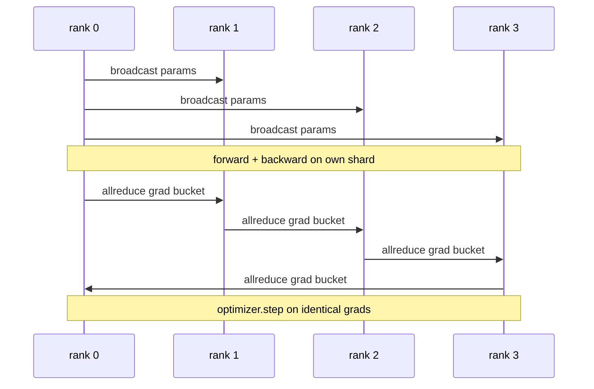

# İletişimler DDP

> DistributedDataParallel, allreduce'nin üstündeki bir kanca. Bir modeli sarın, her sıra aynı şekilde başlaması için ilk parametreleri 0 sıralamadan yayınlayın, gradientin tümüyle azaltılan her parametreye geriye bir kanca yükleyin ve geri kalanı gradient düşüşüdür. Tüm örneği 200 satırdır.

**Type:** Build
**Languages:** Python
**Prerequisites:** Phase 19 Track C lessons 42-49
**Time:** ~90 min

## Öğrenme Hedefleri

- - Bir tel .`DistributedDataParallel`- başlangıç parametrelerini yayınlayan ve geriye doğru ilerledikten sonra tüm eğilimi azaltan şekilli bir sarımsak.
- Spawn N CPU sıralaması `torch.multiprocessing.spawn`Dosya tabanlı buluşma ile karanlık arka planda.
- Aynı modelin aynı verilere sırayla eğitim vererek ve adımlardaki parametreler eşdeğerliğini göstererek gradient-sinkron doğrulığını kanıtlayın.
- İşleyen bir DDP'yi üretim DDP'ye dönüştüren iki değişim olarak, kovaların (gradyen füzyon) ve üst üstelik (geriye doğru giderken komut) kullanımı savunmak.

## Sorun

12 GB etkinleştirme ile 1 milyar parametrelik bir model, bir tüketici GPU'ya uygun değildir. Uygun olduğunda bile eğitim haftalar sürer. Veriler paralel olarak partiyi N sıralara bölüyor, her sıra parçacığı üzerinde ileri ve geriye hesaplar ve her adımda her sıra'nın gradiyentleri toplanır, böylece tüm N kopyaları aynı kalır. Toplanan gradiyent optimizörün adımlarıdır.

Gradyent sinkronizasyonu olmadan, N replikası 2. adımla ayrılır. Model artık "bir model daha fazla veri üzerine eğitilmiş" değil, başlangıç ağırlıklarını paylaşan N ayrı modeller. Gradyent senkronizasyonu kötü bir şekilde yapıldığında (parametre başına bir tüm azalt, örtüşme, kürekleme yok) ağ boğazı ve GPU'lar tel için bekleyen boşlukta. DDP'nin işi, gradient sinkronizasyonunu hesaplama ile nispeten neredeyse serbest hale getiriyor. Kanonik PyTorch DDP, bu şekilde gradientleri yığarak, bir sonraki katmanın geriye doğru olan tümüyle örtüşerek ve NVLink'de NCCL kullanarak başarır. Üçünü de CPU'da Glow ile yapabiliriz ve aynı dersleri öğrenebiliriz.

## Anlaşım



### DDP'nin ihtiyaç duyduğu üç operasyon

| Stage | Collective | Why |
|-------|-----------|-----|
| Init | broadcast from rank 0 | Every rank starts with the same parameters |
| After backward | allreduce of each grad | The mean gradient is what the optimiser steps on |
| Sometimes | broadcast of buffers | Batchnorm running stats stay synchronised |

### Neden kötü ve toplam değil

Allreduce-SUM world_size ile bölünmüş ortalama gradient verir. Ortalama world_size'ye değişmez: bir sıra üzerinde ayarlanmış bir öğrenme oranı dört sıra üzerinde çalışır çünkü adımlardaki gradient büyüklüğü değişmez. Allreduce-SUM bölünmeden her grup boyutunu değiştirdiğinizde öğrenme oranını yeniden ayarlamanızı zorlar. DDP toplamı sarıp bölür; dersde aynı şeyi yapın.

### Neden kova dereceleri

Bir transformatör binlerce parametre tensörüne sahiptir. Tensör başına bir allreduce, tüm latensi tabanını binlerce kez ödüyor. DDP, gradientleri ~ 25 MB kovalara gruplar ve bir allreduce bir kova çıkarır. Aynı toplam baytlar tel boyunca hareket eder, ancak latensi kova üzerinde amortis edilir. Dersin küçük modeli için her şeyi bir kovaya gruplarız; yapısı taşıyan şeydir.

### Neden tohumları sıkıştırıyorsun?

Her rütbe çağıracak .`torch.manual_seed(seed + rank)`- Çekmek için .`torch.manual_seed(seed)`Parametre init için. Tek paylaşılmış tohum her sıra aynı parti sırasını görür (verileri eşzamanlı olarak yenir); parametre için sıra-spesifik bir tohum, başlangıç parametreleri yüzen epsilon ve gradient senkronizasyonu tarafından anlaşılmıyor anlamına gelir.

```figure
ci-ddp-grad-sync
```

## Yapın

`code/main.py`Uygulamaları:

- `MiniMLP`: 3 katlı MLP, saniyeler içinde bir araya gelmek için yeterince küçük, kabloyu ortaya çıkarmak için yeterince büyük.
- `DistributedDataParallel(model, world_size)`: yapım zamanında param yayınlar, bir ambalajı iade eder.`sync_grads`toplanan tüm düşürme-toplamlı öğrencileri dünya_size ile böler.
- `worker(rank, world_size, ...)`:  ile birlikte tam eğitim döngüsü`torch.distributed`İnsine, ileriye, geriye, senkronize, adım.
- `_reference_single_process_loop(...)`: aynı modelin aynı verilere bir sıra üzerinde sıradan olarak çalıştırılır, her adımdan sonra byte eşit parametresi eşdeğerliği testi kullanılır.

Çek şunu:

```bash
python3 code/main.py
```

Çıktı: tek süreç kaybı ve parametreler kontrol toplamını DDP çalışması ile 4 sıra karşılaştıran bir adımlık bir eğitim tablosu.

## Doğada üretim biçimleri

Üç model DDP'yi gönderecek kadar sertleştirir.

**Find unused parameters.**Bazı ileri yollar parametreleri şartlı olarak atlar (erken çıkış, uzmanların karışımı yönlendirici). Atlanılan parametrelerin hiçbir gradiyenti yoktur, ancak DDP'nin kova hazır kolu hala onları bekliyor ve tüm kalınlıkları azaltıyor. `find_unused_parameters=True`Bu, bir adım için bir grafik yürüyüşü, bu yüzden ileri dalları yoksa bırakın.

**Static graph optimisation.**Ön tarafı adımlar boyunca sabit olduğunda,`static_graph=True`DDP'nin bucket programını önceden hesaplamasıdır. Optimize ölçekte önemlidir: önceden hesaplama, 10000 adım boyunca birleşen bir adım başına birkaç ms tasarruf eder.

**Gradient accumulation needs care.**Her bir mikrobatçın senkronizasyonundan önce K mikrobatç üzerinde gradientler biriktirmek 10 kat fazlalık kazanır.`no_sync()`Bu nedenle, bu durumun bir parçası olarak, bir bağlam yöneticisi olarak, geriye dönüp tüm azaltmayı durdurur.

## Kullan

Üretim biçimleri:

- **PyTorch DDP.**Kanonik uygulanma. `torch.nn.parallel.DistributedDataParallel(model)`Kablolar, üst üste geçiş ve no_sync bağlamı.
- **HuggingFace Accelerate.**Yapacak bir fırlatıcı ekliyor `torchrun`- D.P. ve model sarkıtı.
- **Megatron-LM data parallel.**Büyük modeller için DDP'yi tensor paralelle birleştirir; veri paralel parçası aynı tüm azaltma sonrası geriye dönme örneğidir.

## Gönder

Ders 78 (ZeRO parçalanması) tüm azaltma parametresi yerine reduce_scatter kullanır, böylece her sıra sadece optimizer durumunun parçacığını saklar.

## Egzersizler

1. Yapılandırılabilir boyutlu gradient kovalarını ekle ve daha derin bir modelde hızlandırmayı vs. bir tüm azaltma-parametre ölç.
2. Uygulama`no_sync()`bir bağlam yöneticisi olarak ve gradient birikimini doğrulayarak K mikrobatçları üzerinde tek süreç tabanına eşleşir.
3. Bir ekle`find_unused_parameters`Önceki yolcu bazen MLP katmanlarından birini atlarken; bayrak olmadan koşun kapanması gerekir.
4. Glow yerine `torch.distributed.barrier()`-herkiden azaltma ve engelleme tabanlı sinkronizasyon arasındaki farkı hissetmek için sadece senkronizasyon.
5. 1, 16, 256 parti boyutları için merdiven-sinkron üst maliyetini adım zamanının bir parçası olarak ölç ve ölçeklendirmeyi açıklayın.

## Anahtar Terimler

| Term | What people say | What it actually means |
|------|----------------|------------------------|
| DDP | "Data parallel" | Wrapper that broadcasts params and allreduces grads each step |
| Bucket | "Fuse grads" | Group N small allreduces into one large one |
| Overlap | "Hide comm" | Issue allreduce while later layers still computing backward |
| no_sync | "Accumulate" | Skip the post-backward allreduce for gradient accumulation |
| find_unused | "Branchy forward" | Detect parameters with no grad before reducing |

## Daha Fazla Okumak

- [PyTorch DistributedDataParallel docs](https://pytorch.org/docs/stable/generated/torch.nn.parallel.DistributedDataParallel.html)
- [PyTorch DDP internals tutorial](https://pytorch.org/tutorials/intermediate/ddp_tutorial.html)
- [Li et al, PyTorch Distributed: Experiences on Accelerating Data Parallel Training](https://arxiv.org/abs/2006.15704)
- Eğitim 76. aşama - DDP kolektifleri üzerine kurulmuştur
- Eğitim 19. Ders 78 - ZeRO parçalanması, her paramlı allreduce'yi reduc_scatter ile değiştirir
