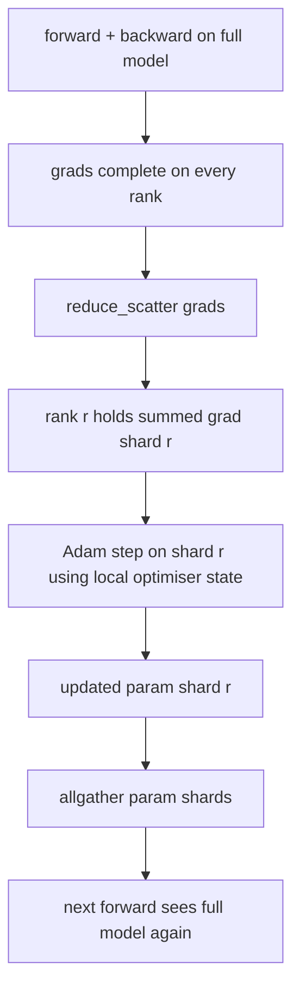

# ZeRO Optimizer Devlet Çekimleri

> Adam, her parametre için iki an tahminini, her ikisi de float32'de saklıyor. 7B parametreli bir model 56 GB optimizasyon durumunu taşır. ZeRO 1. aşamasında N sıraları keser; her sıra optimizörün 1/N'ine sahiptir. Yerel adımdan sonra güncelleştirilmiş parametreler kısımları geri yayınlanır, her sıra tam modelini yeniden oluşturur ve bir sonraki adım başlar. Kazanma, eğitim yığınındaki en büyük tek tahsisde doğrusal hafıza düşüşüdür.

**Type:** Build
**Languages:** Python
**Prerequisites:** Phase 19 Track C lessons 42-49
**Time:** ~90 min

## Öğrenme Hedefleri

- Parça optimizer durumu (birinci an, ikinci an, fp32 master kopyası) N sıralar boyunca böylece her sıra 1/N sahip.
- Her sıralamayı sadece parçacıklarının gradient toplamını göndermek için reduce_scatter kullanın, sonra güncellenmiş parametreler parçacıklarını geri yayınlamak için toplayın.
- 1. aşama, 2. aşama, 3. aşama için hafıza tasarruf tabloyu vanilya DDP ile hesaplayın.
- Modelin boyutuna ve bant genişliği bütçesine göre 1. aşama vs. 2. aşama vs. 3. aşama seçimini savunmak.

## Sorun

Vanilla DDP her şeyi çoğaltır: parametreler, gradientler ve optimizer durum her sıra üzerinde tam olarak mevcuttur. Fp16'da 7B-parametrli bir model için bu, her sıra için 14 GB parametre, 14 GB gradient ve 28 GB optimizer durum anlamına gelir. Optimizer durum en büyük terimdir ve parçalanması en kolaydır çünkü sadece adım sırasında dokunur, ileri veya geri dönerken değil.

ZeRO 1. aşaması, optimizasyon durumunu azaltıyor. Her sıra Adem anlarının 1/N'ini tutar. Geriye doğru, tüm gradientin azaltılmasına ve yerel olarak adım atılmasına karşılık, ZeRO yayılanları azaltır, böylece her sıra sadece parçacıklarının toplam gradientinini alır. Renk, ana parametrelerin parçacığına optimizasyon adımını uyguluyor. Güncelleştirilmiş parametreler parçaları sonra tümü yeniden toplanarak her sıra bir sonraki ileri için tam modeline sahip olur. Optimizer hafızası N oranında düşer. Adım başına kablo trafiği DDP ile aynıdır: bir reduc_scatter artı bir allgather, bant genişliği ile bir allreduce'ye eşittir. Hatıra kazanır, akış gücü kalır.

## Anlaşım



### ZeRO'nun aşamaları

| Stage | What is sharded | Memory per rank | Comm per step |
|-------|----------------|------------------|---------------|
| DDP | nothing | params + grads + optim | 1x allreduce |
| ZeRO-1 | optimiser state | params + grads + optim/N | 1x reduce_scatter + 1x allgather |
| ZeRO-2 | optim + grads | params + grads/N + optim/N | 1x reduce_scatter + 1x allgather |
| ZeRO-3 | optim + grads + params | params/N + grads/N + optim/N | 1x allgather per layer + 1x reduce_scatter per layer |

1. aşama, en ucuz kazançtır çünkü optimizer durum bütçeye hükmeder. 2. aşama, gradient-shard birikimi mantığına ihtiyaç duyar ancak bant genişliği aynıdır. 3. aşama (FSDP) her ileri ve geriye katman için katmanlı iletişim ödüllendirir, parametre-shard hafıza düşüşünü kazanır. Ders 1. aşamayı tam olarak uyguluyor.

### Hatıra matematikleri, gerçek sayılar

Adam ile karıştırılmış hassasiyetle eğitilmiş P parametreleri olan bir model için:

| Term | Vanilla | ZeRO-1 | Why |
|------|---------|--------|-----|
| fp16 params | 2P bytes | 2P bytes | needed for forward |
| fp16 grads | 2P bytes | 2P bytes | needed for backward |
| fp32 master copy | 4P bytes | 4P/N bytes | only the optim uses it |
| fp32 first moment | 4P bytes | 4P/N bytes | only the optim uses it |
| fp32 second moment | 4P bytes | 4P/N bytes | only the optim uses it |
| Total | 16P bytes | 4P + 12P/N bytes |   |

N=8: Vanilla 16P, ZeRO-1 5.5P, %65 düşüş. N=64: Vanilla 16P, ZeRO-1 4.19P, %74 düşüş.

### Neden reduc_scatter beats allreduce-then-shard

Allreduce her dereceyi toplamdaki tüm gradiyenti verir. Eğer sadece r bölümü gerekiyorsa, azaltılan gradientin (N-1) / N'i r sırada harcanır. Reduce_scatter her sıra sahip olduğu parçacığı tam olarak sağlar; her sıra baytları allreduce ile aynıdır (çünkü allreduce reduce_scatter + allgather) ancak ikinci yarısı daha sonra parametre-shard allgather ile değiştirilir. Net tel DDP ile aynı, bellek bölünmüş.

```figure
cd-zero-shard
```

## Yapın

`code/main.py`Uygulamaları:

- `flatten_params(module)`ve `unflatten_into(module, flat)`Bu, bir modelin parametrelerini bir kenar tenzorla paketleyip tekrar paketlemeyi halleder.
- `ZeroOptimizer(model, world_size, rank, lr)`Bu, master kopyasının ve Adam'ın anlarının sırasındaki parçacıkların sahibi.
- `step()`Bu, düz bir gradient üzerinde reduce_scatter çalıştırır, Adam'ı sıra parçalarına uyguluyor ve güncellenmiş parametreleri geri topluyor.
- 3 katlı MLP'yi 20 adım boyunca eğiten ve bir vanilya DDP temel çizgisi ile birlikte adım başına hafıza bütçesini yazdırırır.

Çek şunu:

```bash
python3 code/main.py
```

Çıktı: adım başına kayıp ve ZeRO-1'yi gösteren bellek tablosu, her sıra üzerinde DDP'nin tam kopyasına karşı optimizer durumunun 1/N'ini tutar.

## Doğada üretim biçimleri

Üç model ZeRO'yu gönderecek kadar sertleştirir.

**Sharded checkpointing matters.**ZeRO-1'nin optimizer durumu sıralara bölünür; kontrol noktası hangi rütbeyi sahip olduğunu kaydetmelidir. 80 ders aynı dünya büyüklüğünde ZeRO çalışmasını yeniden başlatan parçalanmış kontrol noktası manifisti oluşturur.

**Mixed precision is the point.**ZeRO, karışık hassasiyetli bir tekniktir; fp32 master kopyası parçalanır. ZERO'yu karışık hassasiyetsiz çalıştırmak, ilgili fp16 ileri kazanç olmadan fp32 master'da hafıza vergisini öder. Üretim çalışmalar her zaman ZeRO'yu otomatik döküm veya bf16 ağırlıklarla eşleştirir.

**Stage 1 is a near-free win.**Bağlantı, bant genişliği açısından DDP ile aynıdır. bellek tasarrufu N'de doğrusaldır. Tek maliyet optimizer parçacığı için muhasebeleme.

## Kullan

Üretim biçimleri:

- **DeepSpeed ZeRO.**Referans uygulanması. `deepspeed_config.json`Etap 1/2/3 ve bölüm boyutlarını seçer.
- **PyTorch FSDP.**PyTorch-devli eşdeğeri.`ShardingStrategy.SHARD_GRAD_OP`ZeRO-2'dir; `FULL_SHARD`ZeRO-3.
- **HuggingFace Accelerate.**DeepSpeed ve FSDP'yi de birer konfigürasyon altında sarar.

## Gönder

Ders 79 (pipeline paralel) ortogonal parçalanma ekseni: aynı model boyunca optimizer durumunu parçalanmak yerine, boru hattı sıralar boyunca katmanları parçalayır. Ders 81, son-son demo üzerinde DDP + ZeRO oluşturur.

## Egzersizler

1. ZeRO-2'ye kadar, parçalanma gradiyenti ile uzan: her sıra sadece parçalanmadığı için gradiyenti saklar, geriye doğru olmayan bölümü sıfırlayarak elde edilir.
2. Gerçek fp32 bayt kullanımını formül öngörüsü karşısında 0 sıralamasında yazdırırır.
3. Vanilya DDP vs. ZeRO-1'in adım başına duvar saati zamanını ölç ve ileriye, geriye, komünite olarak parçalan.
4. ZeRO-1 altında gradient kesimi uygulayın: L2 normı, yerel normın karesini tüm parçalar üzerinden tümüyle azaltarak hesaplanmalıdır.
5. "Naif ZeRO" uygulamasını reduce_scatter yerine allreduce ile yapın, tel-zaman farkını ölçün. reduce_scatter seçeneğini sayılarla savunun.

## Anahtar Terimler

| Term | What people say | What it actually means |
|------|----------------|------------------------|
| ZeRO-1 | "Shard the optimiser" | Each rank holds 1/N of fp32 master + Adam moments |
| ZeRO-2 | "Shard grads too" | Each rank also drops the non-shard gradients after reduce_scatter |
| ZeRO-3 | "Shard params" | Each rank holds 1/N of fp16 params; allgather per layer in forward |
| Master copy | "fp32 weights" | The high-precision parameter copy the optimiser updates |
| Reduce_scatter | "Split the sum" | Deliver each rank only its shard's summed gradient |

## Daha Fazla Okumak

- [Rajbhandari et al, ZeRO: Memory Optimizations Toward Training Trillion Parameter Models](https://arxiv.org/abs/1910.02054)
- [DeepSpeed ZeRO documentation](https://www.deepspeed.ai/tutorials/zero/)
- [PyTorch FSDP documentation](https://pytorch.org/docs/stable/fsdp.html)
- Eğitim 76 - Kısaltma ve toplama bu ders üzerinde duruyor
- Ekipmanlık ve güvenlik sistemleri,
