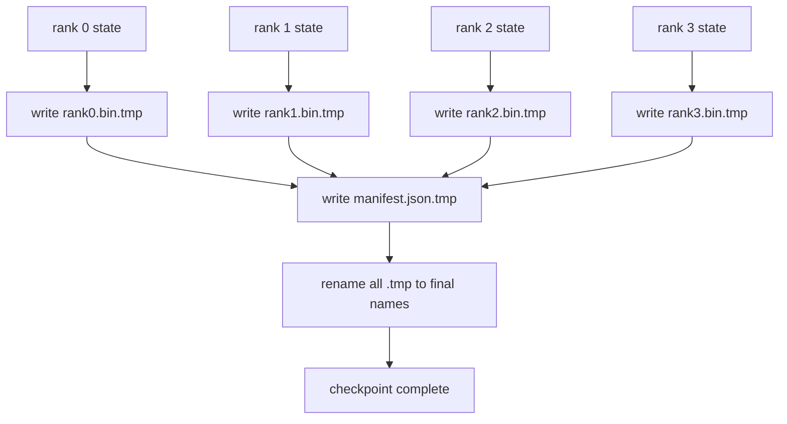

# Parçalama Kontrol Noktası ve Atom Özetleme

> 70B parametresi eğitim işi birkaç saatte bir düğüm başarısızlığıyla durur. Kontrol noktası formatı 30 dakika mı, 30 saat mi kaybedilir karar verir. Bir parça parça kontrol noktası her rütbün parçalarını paralel olarak yazar ve mülkiyetini bir manifeste kaydeder. Resume her rütbeden parçaları kendi dosyasından yükler, durumu aynı dünya boyutunda yeniden yapılandırır ve hiçbir şey olmamış gibi daha iyi adımlar atır. Atomik yazma, yarım bitmiş bir kontrol noktasını bir sonraki özetlemeyi zehirlemeden korur.

**Type:** Build
**Languages:** Python
**Prerequisites:** Phase 19 Track C lessons 42-49
**Time:** ~90 min

## Öğrenme Hedefleri

- Bir sıralama kontrol noktasını bir sıralama bölümü dosyası olarak kaydet ve hangi sıralamanın neyin sahibi olduğunu kaydet.
- Atomik yazma biçimini kullanın (zamanlı bir yoluna yazın ve sonra adını değiştirin), böylece bir çökme yazısının ortasında asla yarım bitmiş bir kontrol noktası üretilmez.
- Her bir sıralamada fp16 parametreleri ve ZeRO optimizer durumu için bayt eşit durumunu doğrulayan manifestten devam edin.
- Açıklama şeması üç başarısızlık moduna karşı savun: dünya boyutundaki değişiklik, parçacık sayısının eşleşmemesi ve kısmi yazma.

## Sorun

Vanilya kontrol noktası tüm parametreleri ve optimizer durumunu 0 sırasına okuyor, toplar ve tek bir dosya yazar. 70B modeli için, bir sıra ağ portu üzerinden 1,1 TB durum. Yazıcılar diğer tüm sıraları engeller çünkü toplanmayı beklerken boş kalırlar. IO bant genişliği, en yavaş tek GPU'nun ağ bağlantısı, toplam değil. Gerçek bir küme üzerinde toplanıp yazma adımları önceki eğitim saatinden daha uzun sürebilir, yani iş gemileri eğitim gününde bir kontrol noktasından daha az.

Parçalama kontrol noktaları örneği tersine çevirir: her sıra kendi parçalamasını kendi dosyasına paralel olarak yazar. Hangi parçacıkın sahibi olduğunu gösteren açık kayıtlar her parçacığı geldiği yere geri getirebilir. Toplam bant genişliği ölçeklerini kümelerle yazıyor. Bir sıralamayı 4 saat süren 1 TB kontrol noktası 64 sıralamayı 4 dakika sürer. Ayrıca manifest uyumsuz özetlemeler için bir sözleşme verir: Dünya boyutundaki değişiklik tespit edilebilir, kısmi yazılar tespit edilebilir ve yükleme yolu, eski verileri kullanarak sessiz olarak değil yüksek sesle başarısız olabilir.

## Anlaşım



### Açıklama şeması

```json
{
  "world_size": 4,
  "step": 1234,
  "wall_clock_seconds": 4521,
  "shards": [
    {"rank": 0, "path": "rank0.bin", "sha256": "...", "param_shard_offset": 0, "param_shard_numel": 65536},
    {"rank": 1, "path": "rank1.bin", "sha256": "...", "param_shard_offset": 65536, "param_shard_numel": 65536}
  ],
  "schema_version": 1
}
```

Üç alan yük taşıyor.`world_size`farklı boyutta bir özetlemeyi sessizce boşa çıkarmak yerine sessizce bozulur. `sha256`Parçalı ya da bozuk yazılar yakalar.`param_shard_offset`ve `param_shard_numel`Her parçacık yüklemeciyi düz parametre tenzorunu doğru pozisyonda yeniden yapılandırmasına izin verin.

### Atomik yazma

Standart örneği: her parçayı yaz `<name>.tmp`, manifesti yaz `manifest.json.tmp`Yeni dosya tamamen mevcut veya eski dosya. Son yeniden isimlendirme öncesi bir çöküş önceki kontrol noktasını canlı olarak terk eder. Atom yazılmadan bir çöküş, bir parçacık bırakır.

### Şema üç başarısızlık modundan korunmalıdır

| Failure | Symptom | Defence |
|---------|---------|---------|
| World-size change | resume on N=8 with manifest from N=4 | world_size mismatch in manifest, fail loudly |
| Shard count mismatch | resume sees fewer rank*.bin files than shards in manifest | enumerate shards, verify every one exists |
| Partial write | shard file truncated mid-flush | sha256 verification on load |

Her savunma kötü yükü erken reddeder; alternatif 100 adım sonra kayıp NaN'e gittiğinde ortaya çıkan sessiz yolsuzluktur.

### Neden bir büyük dosya değil, bir sıra dosyaları?

Aynı zamanda bir dosyaya yaz `O_APPEND`POSIX'de byte-aligned yazılar için çalışır, ancak pratikte bir parçacık içindeki ofsetler MB boyutlu bölgeler ve kilitleme baskın. Per-rank dosyaları, altındaki dosya sistemi paralel olduğunda çizgiye sahip değildir ve faydalanabilir.

```figure
ci-sharded-checkpoint
```

## Yapın

`code/main.py`Uygulamaları:

- `ShardManifest`yukarıdaki şema ile veri sınıfı artı `to_json`- Ne ?`from_json`- Evet .
- `save_sharded(state_dict_per_rank, dir, step)`Bu, her sıra'nın ikili durumunu atom temp-then-rename örneğini kullanarak kendi dosyasına yazar ve sonra manifest yazır.
- `load_sharded(dir, expected_world_size)`Manifestoyu okuyor, her parçacığın sha256'ını doğruluyor ve her rütbeye göre devlet diktlerini gönderir.
- Bir dönüş testi: sıra durumunu oluştur, kaydet, yükle, bayt eşit olduğunu belirt.

Çek şunu:

```bash
python3 code/main.py
```

Çıktı: 4 parça dosyası ve manifest yazıldı, sonra byte eşit doğrulama ile yeniden yüklendi.

## Doğada üretim biçimleri

Üç model kontrol noktasını gemiye ulaştıracak kadar sertleştirir.

**Async write.**Üretim yığınları kontrol noktasını ayrı bir ip veya işlem üzerinde yazmak için çalışmaya devam eder.`async_io`Flag tam olarak bunu yapar. dersi yazıyı eşzamanlı tutar böylece adımlar görünür.

**Local fast disk first, then async upload.**Yerel NVMe'ye yazın (hızlı), sonra S3 veya GCS'e async yükleyin. İki katlı örnekteki kontrol noktası, arşiv için süren bir kopyanın arşiv dışına gönderilmesine rağmen, devam için hızlıdır. Manifestoda yerel yol taşınır; yükleme manifestoda uzaktan yol taşınır.

**Rotation matters.**Üretim çalışmalar son K kontrol noktalarını (genellikle 3-5) tutarak en eskiyi döndürür. Dönüşüm olmadan disk çalışmanın ortasında dolduruyor ve bir sonraki kontrol noktası başarısız olur. Dönüşümle bir sonraki kurtarma, bütçeyi serbest bırakarak en eskiyi önce siler.

## Kullan

Üretim biçimleri:

- **DeepSpeed checkpointing.** `deepspeed.save_checkpoint(tag=step)`Bir sıra dosyaları yazar ve bir `latest`Dosya aktif etiketle işaret ediyor.
- **PyTorch FSDP checkpointing.** `torch.distributed.checkpoint`bir  ile parçalanmış durum kurtarır`Planner`Bu, sıralama düzenini belirler.
- **NeMo.**DeepSpeed ve FSDP ' i üniforma ile sarar `save_to_checkpoint`Metadata ekleyen API.

## Gönder

Ders 81, DDP+ZeRO'nun son-son kontrol noktasının parçalanmasını korur ve CV sözleşmesinin geçerliliğini kanıtlamak için aynı dünya boyutunda yeniden yükler.

## Egzersizler

1. Async yazma ekleyin: bir ipte kaydetmeyi başlatın ve eğitim devam etsin. Önceki kaydetmeyi tamamlayıncaya kadar bloklayın.
2. Bir ekle`last_5_steps`Değişim: En son 5 kontrol noktasını tutun, yeni bir tane kaydetmeden önce en eskiyi silin.
3. İç döngü yeniden yüklenmesi için sadece CRC'li hızlı bir doğrulama yolu ekleyin (dolaşım bir kontrol noktasını tam sha256 olmadan yeni aktif bir kontrol noktası haline getirir).
4. Dünya çapındaki bir yük ekleyin: manifest, konkatenasyon ve yeniden parçalanma okuyarak N=4'ten N=8'e parçacık dengesini yeniden dengeleyin.
5. Sahte bir S3'e bir yükleme ekleyin (iki kat kat dizin) ve yükleme manifesti yazın.

## Anahtar Terimler

| Term | What people say | What it actually means |
|------|----------------|------------------------|
| Sharded checkpoint | "Per-rank save" | Each rank writes its own shard file in parallel |
| Manifest | "Index" | JSON file recording shard paths, offsets, and sha256 |
| Atomic write | "tmp then rename" | Write to .tmp then POSIX rename so a crash leaves the previous file live |
| Partial write | "Truncated shard" | A crash during write produces a corrupt shard; sha256 catches it |
| Rotation | "Keep last K" | Delete oldest checkpoint before writing new one to bound disk usage |

## Daha Fazla Okumak

- [DeepSpeed checkpointing](https://deepspeed.readthedocs.io/en/latest/model-checkpointing.html)
- [PyTorch torch.distributed.checkpoint](https://pytorch.org/docs/stable/distributed.checkpoint.html)
- [POSIX rename atomicity](https://pubs.opengroup.org/onlinepubs/9699919799/functions/rename.html)
- 19 . aşama 78 . Ders . ZeRO ' nun durumu bu kontrol noktasının tasarruf için tasarlanmış olduğunu gösteriyor .
- Eğitim 81 - Sonundan Sonuna Demo , Kaydedilen Durumu Geri Geziyor
