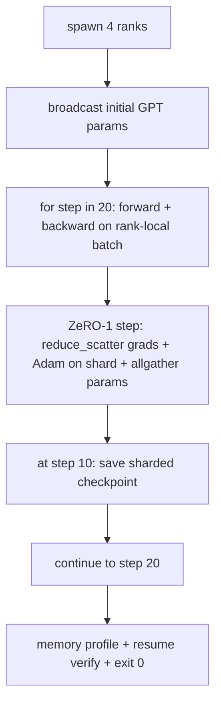

# Sonundan Sonuna Yayınlanan Eğitim

> Ders 76 ila 80'e kadar her biri bir parça oluşturdu. Bu birim: gradient senkronizasyonu için DDP ile 4 simülasyon sıra boyunca eğitilmiş küçük bir GPT, optimizer-devlet parçalanması için ZeRO-1 ve yarı yol işaretinde parçalanmış bir kontrol noktası. Demo 20 adım yürütür, kendini bitirir, bir kayıp eğriyi ekleyerek bir hafıza profili yazdırır ve yeniden yapılabilir bir kontrol noktası yazar.

**Type:** Build
**Languages:** Python
**Prerequisites:** Phase 19 Track C lessons 42-49
**Time:** ~90 min

## Öğrenme Hedefleri

- DDP (dersi 77) artı ZeRO-1 (dersi 78) artı parçalanmış kontrol noktalarını (dersi 80) tek bir eğitim döngüsüne birleştirin.
- 2 katlı bir dönüştürücü dil modelini küçük bir sentetik korpus üzerinde 20 adım boyunca 4 simüle sırada eğit.
- Adım başına kayıp tablosunu, sıra başına hafıza profilini ve aynı dünya büyüklüğünde bayt eşit olarak devam eden kontrol noktası manifesti bas.
- Kompozisyonu savun: Her parça daha önceki derslerde bağımsız olarak test edilebilir ve bu ders onların kompozisyon yaptıklarını kanıtlar.

## Sorun

Bir baş taşı, parçaların birbirine uyumlu olduğunu kanıtlar. Ders 76 uygulanan kolektifler. 77 ders onları DDP'ye bağladı. Ders 78 reduc_scatter ile parçalanmış optimizer durumu. Ders 79 analiz boru hattı. Ders 80 parçalanmış bir kontrol noktasını kurtardı. Her ders kendi sınavlarıyla duruyordu. Gerçek bir eğitim koşusu her bir primitif'i bir anda kullanır; eğer kompozisyon yanlışsa, kayıp farklılık gösterir, kontrol noktası yeniden başlamayı reddeder veya sırada hafızası küçülmesi gerektiğinde büyür.

Bu ders son-son demo'yu yürütür ve dört değişkenliği doğruluyor: (a) kayıp, yüzen gürültü içindeki 20 aşamada monoton olarak azalır, (b) her sıra her aşamada aynı parametrel normunu tutar, (c) her sıra optimizer belleği ZeRO-1 formülü 12P/N bytesine eşit ve (d) adım 10'daki kontrol noktası yeniden başlatıldığında byte-eşit. Demo kendi kendine sona erer: 20 adım, tek komut, çıkış 0.

## Anlaşım



### Mini GPT

Modeldeki amaç küçüktür: 2 transformatör blokları, gömülü dim 32, 4 dikkat başları, sözcük 64, dizilerin uzunluğu 16, parti 4. Birkaç bin parametre. Her kablolama kararını uygulayacak kadar büyük (çok başlı dikkat standart maskeli yolu yürütür; LayerNorm senkronize edilecek ağırlıklara sahiptir; LM başı kelimeciye ayrı bir çizgi projeksiyondur). 4 CPU sıralamasında 20 adım saniyede biter.

### Yapım kuralları

| Lesson piece | What it owns | What it leaves to the loop |
|--------------|--------------|----------------------------|
| DDP broadcast | Initial parameter sync | One call at construct time |
| ZeRO-1 step | Gradient sync, master copy update, parameter broadcast | One call per step replacing optimiser.step |
| Sharded checkpoint | Persist per-rank state, manifest with sha256 | Called on rank 0 with state collected via allgather |
| Training loop | Forward, backward, loss logging | Calls the three above in order |

Çubuk, reduce_scatter veya rendezvous dosyalarını bilmiyor. ZeRO ve kontrol nokta modülleri çubukun oluşturduğu dar arayüzleri ortaya çıkarır.

### Neden küçük bir GPT ve sadece bir MLP değil

77 dersindeki MLP, gradient senkronizasyonunu doğrulamak için yeterliydi. Küçük bir GPT üç şeyi ekler: kelime üzerinde ayrı bir LM başı (bu derste, netlik için çözülmüştür; tam GPT tipik olarak başı simge gömülmesine bağlar), softmax + çapraz entropy kayıp olarak (MSE'den daha fazla sayısal kenar durum), ve asimetrik ileri ( gömülmeler sonra dikkat sonra katman başına MLP). Kap taşı için bir MLP ile yapıştırmak, bileşimin LayerNorm veya yerleştirme katmanının grad şeklini doğru şekilde ele aldığını gizler.

### Kendini yok etmek, çıkış 0 anlamına gelir.

Çubuk sabit 20 adımla yürür ve çıkışlar yapar.`while True`Bu, bir insan müdahalesinin, dış durumun bir özetlemesi olmaması. Gözlemsiz çalışırken bırakabileceğiniz ve bitince tam bir günlük bulabileceğiniz bir baş taşıdır.

```figure
ci-distributed-assembly
```

## Yapın

`code/main.py`Uygulamaları:

- `MiniGPT`: 2 katlı, maskeli kendine dikkat eden ve ayrı bir LM başı olan transformatör.
- `make_corpus(seed, total_tokens)`: belirleyici bir sonraki belirti tahmin verileri.
- `_train_worker`: sıra başına doğurulmuş; init paramları yayınlar, döngüyü yürütür, ZeRO adımını çağırır, parça parçalı kontrol noktasını 10. adımda yazar.
- `verify_resume`: Ana çalışmanın ardından, aşama 10 kontrol noktasını işlemi sırasında yeniden yükler ve kaydedilen ana parçaların hafıza anında anında olan anket bayt-bayt ile eşleştiğini belirtir.
- `main`: tüm demo'yu orkestra eder, kayıp tablosunu, hafıza profilini ve doğrulama sonuçlarını yazdırır.

Çek şunu:

```bash
python3 code/main.py
```

Çıktı: 20 sıra kaybı tablosu, her sıra hatıra profili, kontrol noktası manifesti ve başarı üzerine "KÜNÜFET" satırı.

## Doğada üretim biçimleri

Üç desen gerçek koşular için kompozisyonu tamamlıyor.

**Checkpoint every K minutes, not every K steps.**Adım süresi, sek uzunluğuna ve mikrobaç sayısına göre değişir. 10 dakikalık kontrol noktası kadenci, model boyutuna bakılmaksızın aynı hesaplamaları yakalar. Ders basitlik için adım tabanlı kullanır; üretim duvar saatine dayalı kullanır.

**Detect divergence early.**Üretim koşularında geriye bir NaN koruyucu ve bir kayb-spike detektörü eklenir; bir adımda kayıp 2 kattan fazla atlarsa, optimizer'in bir bozukluğa girmesine izin vermek yerine önceki kontrol noktasına geri dönün. Dersin kayb eğri düzgüntür, bu nedenle koruyucu kullanılmıyor ancak kanca kalır.

**Aggregate the memory profile across ranks.**Per-rank hafızası gerçek çalışmalardaki sıralar ile farklıdır (en büyük boru hattı aşamasında daha fazla etkinleştirme vardır). Üretim, sıralar boyunca maksimum artı ortalama kaydeder; formül eşleşmesini göstermek için ders, sıralar başına baskı yapar.

## Kullan

Üretim biçimleri:

- **DeepSpeed.**DDP + ZeRO + boru hattı + etkinleştirme kontrol noktasını bir yapılandırma altında birleştirir. Dersin kompozisyonu Miniatürde DeepSpeed şeklidir.
- **PyTorch FSDP.**Yerli eşdeğer.`FullyShardedDataParallel`- Evet .`ShardingStrategy.SHARD_GRAD_OP`ZeRO-2.
- **NeMo and Megatron-LM.**En büyük modeller için tensor paralelini ekleyin; aksi takdirde bileşim aynı şekildedir.

## Gönder

Tüm parça burada sona erer. 6 ders birlikte, gerçek bir ekip DeepSpeed'i benimsemeden önce inşa edecekleri dağıtılmış eğitim alt sistemi; soyutlama, gözyaşlarına karşı kanıtlanmış ve başarısızlık modları uygulanmıştır. 17'nci aşama (infrastructure and production) bunu gerçek bir kümelere götürmek için yer.

## Egzersizler

1. Dikkat başının tensor paralel bölümü ekleyin ve kayıpın tek sıralı temel çizginin eşleştiğini kontrol edin.
2. 4 mikrobatç'te gradient birikimini ekle ve gradientin bir büyük partiye eşit olduğunu kanıtla.
3. Adım 10'dan devam eden bir devamı ekleyin ve başlangıçtaki koşuya benzer bir kaybı elde edin.
4. JSONL'ye bir metrik ihracatı (kayıp, grad norm, adım süresi) ekleyin, böylece gerçekten sonra çalışmanın görselleştirilebilir.
5. Bir kaybı tırnakta önceki kontrol noktasına geri dönen bir NaN koruyucu ekleyin ve bir adım LR çarpıcıyla bir tırnakı geri dönmeyi uygulamak için zorlayın.

## Anahtar Terimler

| Term | What people say | What it actually means |
|------|----------------|------------------------|
| End-to-end | "Wire it all up" | One run composes every piece, not a unit test per piece |
| Memory profile | "GB per rank" | Bytes held on each rank for params, grads, optimiser state |
| Resume contract | "Save and load" | Per-rank state byte-equal after a checkpoint round-trip |
| Self-terminating | "Bounded run" | Fixed step count, exit 0 on completion, no human in the loop |

## Daha Fazla Okumak

- [DeepSpeed end-to-end training tutorial](https://www.deepspeed.ai/getting-started/)
- [PyTorch FSDP advanced tutorial](https://pytorch.org/tutorials/intermediate/FSDP_advanced_tutorial.html)
- [Megatron-LM training script reference](https://github.com/NVIDIA/Megatron-LM)
- Eğitim 19 Ders 76-80 - her parça bu ders oluşturur
- 17 aşama - bileşimi gerçek bir küme taşıma
