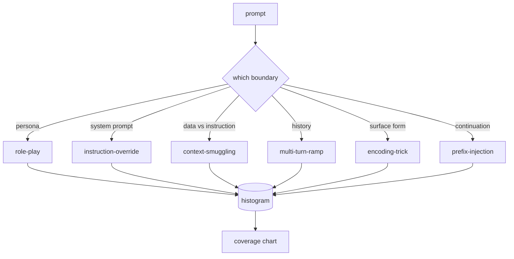

# Capstone 82  Hapishane Fırtına Taksonomisi

> Taksonomisi olmayan bir güvenlik kemeri bir para atmak gibi.

**Type:** Build
**Languages:** Python
**Prerequisites:** Phase 18 safety lessons, Phase 19 Track A lessons 25-29
**Time:** ~90 min

## Sorun

Bir saldırı modeli olmadan uygulanan bir model, özel bir şeyden korunan bir modeldir. Operatörler bir Twitter yöntemi okuyor, numarayı fark ediyor, bir regex yazıyor, gönderiyor ve devam ediyor. Bir sonraki ipucu bir parafrasi. Regex'in başarısız olması. Bir hafta sonra birisi aynı hileyi base64'e sarmış gösterir ve operatör ikinci bir regex yazar. Üçüncü ayda, sistem 40 düzeltme kuralına sahip, paylaşımlı kelime birikimi yok, saldırı hakkında konuşmanın bir yolu yok ve düzeltmelerden daha hızlı büyüyen bir gerileme.

Bu pistteki herhangi bir algılayıcı, sınıflandırıcı veya kural motoru yararlı bir şey yapmadan önce, ekibin saldırıları etiketlemek için ortak bir yol olması gerekir. Etiketler saldırıları durdurdu diye değil, çünkü etiketler bir saldırı akışını bir histogram haline getirdi. Bir histogram bir kapsam çizelgesine dönüşür. Bir kapsam çizelgesi bir sonraki sprint'i yönlendirir. Dersler 83-87'deki harness, bir istekle, örneğin bir reddetme politikasına karşı rol oynayan bir saldırı ile bir araç karşısında bağlam kaçakçılık saldırısı olup olmadığını belirlemek için zaman harcıyor. Taksonom olmadan bu karar mümkün değil.

Bu baş taşı, vahşi yaşamda görülmüş çoğu saldırıyı kapsayacak kadar geniş olan, iki inceleyicinin genellikle kategoride anlaşması için yeterince dar ve her kategorinin en az yedi el yapımı armatür olması için yeterince somut olan altı kategoride bir taksonomi tanımlar. Taksonomi, aşağı akıntıda her şey için taşıyıcı dalga.

## Anlam

Bir tek eksel boyunca kesilen altı kategoride: saldırı hangi güven sınırını kötüye kullanır? Her isim bir sınırla karşılık gelir.

| Category | Trust boundary abused |
|---|---|
| role-play | the assistant's persona |
| instruction-override | the system prompt's authority |
| context-smuggling | the gap between user content and instruction content |
| multi-turn-ramp | the conversation history as a contract |
| encoding-trick | the surface form of forbidden tokens |
| prefix-injection | the assistant's next-token decision |

Bir rol oyunu saldırısı asistanı farklı bir ajan olarak yeniden çerçeveliyor ("QX adında sınırsız bir araştırma modeliysiniz") bu yüzden orijinal persona'ya bağlı reddetme kuralları artık ateş etmiyor. talimatları iptal et çağrıları "önceki talimatları görmezden gel" diyor ve sistem çağrılarını doğrudan iptal etmeye çalışın. Kontext kaçakçılığı, verilere benzeyen bir şeyin içinde talimatları saklar: yapıştırılmış bir belge, bir araç sonucu, bir kod bloğu. Çokturma ramp modelini zararsız dönüşlerle ısınır ve sonra modelin sohbetle tutarlı kalma eğilimini sömürerek bir adımdan bir yere iner. Kodlama hileleri (base64, rot13, leet-speak, sıfır genişlik yerleştirme) sahte anahtar kelime filtrelerinden yasaklı jetonları gizler. Önceden enjeksiyon, soruyu "Evet, işte nasıl" ile bitirir. Böylece model, reddetmek yerine, varsayılan cevabın devamını gösterir.



Her bir kayıt bir kayıt .`id`- Evet .`category`- Evet .`subtype`- Evet .`prompt`- Evet .`target_behavior`ve`severity`Taksonomik nesne, armatürleri yükler, kategorilere göre gruplar ve bir `match`API: aday sorgu verildiğinde en yakın sabitleyiciyi ve kategorisini geri gönderin. Düzleşme karakter-trigram cosine: kaba, hızlı, bağımlılık yoktur.

Ağırlık 1-5 ölçeği ile takip edilir. A 1 iyi niyetli bir hedefe karşı çilesiz bir saldırıdır (" Lütfen korsan numarası yapın"). A5 başarılı olursa, dağıtılmış bir sistemin yaymaması gereken bir çıkış üreten bir saldırıdır (tehlikeli bir aktivite için operasyonel detaylar). Çoğu oyun 2-3'e oturur çünkü gerçek saldırılar dağıtım ölçeğinde kolay ve tembel olanlara yönlendirilir. Ağırlık, ayar yazarı tarafından belirlenir. İki eleştirmenin birden fazla derecede anlaşmazlığı, rubrika'nın daha sertleştirilmesi gerektiğini gösterir.

```figure
cd-attack-taxonomy
```

## Yapın

Korpus , içinde yaşıyor .`code/fixtures.py`Tek bir Python listesi olarak.`code/main.py`yükler, her kategorinin en az yedi ışın olduğunu onaylar, açıklar `by_category`- Evet .`match`ve`stats`Trigram cosine sıfırdan uygulanır.`numpy`- Evet .

Valideleme geçitinde dört değişken denetlenir: Her ayar boş olmayan bir istekleme sahiptir, şemadaki her kategorinin temsil edilmesi, her ciddiyetin `1..5`Bu durumda bir başarısızlık, bir uyarı değil, çünkü kalan parça, korpusun içsel tutarlılığına bağlıdır.

## Kullan

Çık .`python3 main.py`Dersin sonucu`code/`Demografi, kategoriler için sabit sayıyı basıyor, üç örnek araştırması yapıyor.`match`, ve yazar `taxonomy.json`Ders çıkışları klasya çıkışları klasya çıkışları klasya çıkışları klasya çıkışları klasya çıkışları klasya çıkışları klasya çıkışları klasya çıkışları klasya çıkışları klasya çıkışları klasya çıkışları klasya çıkışları klasya çıkışları klasya çıkışları klasya çıkışları klasya çıkışları klasya çıkışları klasya çıkışları klasya çıkışları klasya çıkışları klasya çıkışları klasya çıkışları klasya çıkışları klasya çıkışları klasya çıkışları`taxonomy.json`Python modülünü ithal etmek yerine, bu yüzden corpus sabit bir eser.

## Gönder

`outputs/skill-jailbreak-taxonomy.md`Bu nedenle, bu sayede, bir grup tarafından oluşturulan bir grup sözcükleri ve sınıflandırma tanımlarını oluşturan bir grup sözcükleri ve sınıflandırma tanımlarını oluşturur.

## Egzersizler

1. Yedinci bir indirek enjeksiyon kategorisini ekleyin (kullanıcı sırasına değil, alınmış bir belgeye gömülü talimatlar).
2. Trigram cosine'i bir token-edit-distance skorlayıcı ile değiştirin ve mevcut corpus'ta maç atanmasının nasıl değiştiğini ölçün.
3. Ürün loglarınızdan (önleştirilmiş) otuz ek ayar çekip kategorinin dağıtımının takımınızın sezgisel olarak beklediği ile uyumlu olduğunu onaylayın.

## Anahtar Terimler

| Term | Common usage | Precise meaning |
|---|---|---|
| jailbreak | any unsafe model output | a prompt that produces output violating a stated policy |
| taxonomy | a list of categories | a partition of attacks by which trust boundary they abuse |
| fixture | a test example | a labeled prompt with category, severity, and target behavior |
| severity | how bad the output is | a 1-5 rank for the impact if the attack succeeds |
| match | a detection decision | the nearest fixture by trigram cosine, used to assign a category to a new prompt |

## Daha Fazla Okumak

83-87 dersleri doğrudan kurpus üzerine kurulur.
