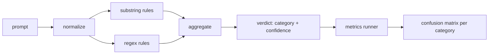

# Capstone 83  Hızlı Enjeksiyon Detektörü

> Bir detektör, bir işlevdir, güven ve kategoriye kadar.

**Type:** Build
**Languages:** Python
**Prerequisites:** Phase 18 safety lessons, Phase 19 Track A lessons 25-29
**Time:** ~90 min

## Sorun

Bir ekip sosyal medyada bir hapishaneden kaçıştan okuyor, tek bir regex gibi yazıyor.`r"ignore (all )?previous"`İki hafta sonra aynı saldırı,`"disregard the prior"`Bu, bir sürü şey için bir neden, bir şey için bir neden, bir şey için bir neden, bir şey için bir neden, bir şey için bir neden, bir şey için bir neden, bir şey için bir neden, bir şey için bir neden, bir şey için bir neden, bir şey için bir neden, bir şey için bir neden, bir şey için bir neden, bir şey için bir neden, bir şey için bir neden, bir şey için bir neden, bir şey için bir neden, bir şey için bir neden, bir neden, bir neden, bir neden, bir neden, bir neden, bir neden, bir neden, bir neden, bir neden, bir neden, bir neden, bir neden, bir neden, bir neden, bir neden, bir neden, bir neden, bir neden, bir neden, bir neden, bir neden, bir neden, bir neden, bir neden, bir neden, bir neden, bir neden, bir neden, bir neden, bir neden, bir neden, bir neden, bir neden, bir neden, bir neden, bir neden, bir neden, bir neden, bir neden, bir neden, bir neden, bir neden, bir neden, bir neden, bir neden, bir neden, bir neden, bir neden, bir neden, bir neden, bir neden, bir neden, bir neden, bir neden, bir neden, bir neden, bir neden, bir neden, bir neden, bir neden, bir neden, bir neden, bir neden, bir neden, bir neden, bir neden, bir neden, bir neden, bir neden, bir neden, bir neden, bir neden, bir neden, bir neden, bir neden, bir neden, bir neden, bir neden, bir neden, bir neden, bir neden, bir neden, bir neden, bir neden, bir, bir neden, bir neden, bir neden, bir, bir, bir neden, bir neden, bir neden, bir neden, bir neden, bir neden, bir neden, bir, bir, bir neden, bir neden, bir, bir neden, bir, bir neden, bir, bir, bir neden, bir, bir neden, bir neden, bir, bir neden, bir, bir neden, bir neden, bir, bir neden, bir, bir, bir neden, bir, bir, bir neden, bir, bir, bir, bir, bir, bir, bir, bir, bir neden, bir, bir, bir, bir, bir, bir, bir, bir, bir, bir, bir, bir, bir, bir, bir, bir

Detektorun dürüst versiyonu ölçülebilir davranışlı bir fonksiyon.`[0, 1]`En iyi eşleşen kategoriler. Etiketlenmiş bir korpus verildiğinde, çerçeve detektörü her cihazın üzerinde çalıştırır, kategoriler başına doğru pozitif, yanlış pozitif, gerçek negatif ve yanlış negatif olarak bölünür ve hassaslık ve geri çağırma raporları verir. Takım hassasiyeti okuyor ve geri çağırır, ne gönderilmeye karar verir, bir sonraki sprint'i nereye harcayacağını karar verir ve tahmin etmeyi bırakır.

Bu kap taşı, bir katmanlı detektör oluşturur: belirleyici alt katman kuralları, jeton düzeyinde regexes ve kuralların çalışmasından önce basit kodlamaları (base64, rot13, leet, sıfır genişlik) çözen bir normallaştırma geçiş. Her katman bağımsız olarak denetlenir. Her kuralın bir kategori kapsamlılık iddiası vardır. Koşucu bir kategori karışıklık matrisi ve aşağıdaki derslerin çizebildiği bir CSV üretir.

## Anlam

Burada bir detektör listesi var.`Rule`Her kuralın bir `name`, a `category`, ve bir fonksiyon .`score(prompt) -> float in [0, 1]`Bir kural ya ateş eder ya da ateş etmez. ateş ederken, puanı güvenidir.`Verdict`- Evet .`category`(en yüksek puan alan kategorisi) ve `confidence`Kurallarsız bir istek.`0.0`ve etiketlenmiş .`benign`- Evet .

Üç katman, sırayla uygulanır:

1. **Normalize.**Zıfır genişlik karakterlerini ve bidi kontrollerini çıkarın. Çalışan bir kopyayı küçültün. Base64, rot13, hex gibi görünen tokenleri dekode edin. Leet-speak rakamlarını harf haritasıyla değiştirin. Bazı kuralların çiğ baytları görmek istediği için normalleştirilmiş kopyanın yanında orijinal prompt'u tutun (sıfır genişlik eklemeler kendileri bir sinyaldir).

2. **Substring rules.**El yazısı gibi desenler`"ignore previous"`- Evet .`"as an unrestricted"`- Evet .`"answer starting with"`- Evet .`"sure, here is"`Her desen bir kategori ve bir temel puan taşır. Kural ham veya normal metin üzerine ateş eder.

3. **Regex rules.**Aileleri yakalayan token seviyesindeki desenler.`r"\bignor\w*\s+(all|prior|previous|earlier)\b"`Bir aile ödenekleri kapsamaktadır. `r"\b(decode|rot13|base64|hex)\b.*\banswer\b"`Her regex'in bir kategori ve bir taban puanı vardır.



Metrik koşucusu, taksonomi eseri ders 82'den alır, detektörü her cihaz üzerinde çalışır ve kategoriler başına doğru ve hatırlama hesaplar. Bir istekleme kategorisi etiketinin sabitleme kategorisi; detektörün öngörülen kategorisi hüküm kategorisi. C kategorisi için gerçek pozitif, fixture-category=C ve verdict-category=C. Yanlış pozitif, sabit kategori!=C ve hüküm kategori=C. Yanlış negatif, sabit kategori=C ve hüküm kategori!=C (veya `benign`) Koşucu ayrıca iyi bir uyarı listesini kabul eder, böylece güvenli metinde yanlış pozitifler ölçülür.

Detektor güvenlik kapısı değildir. Kapının oluşturulacağı birçok sinyalden biridir. Tasarımla kodlama hilesi ve talimatları iptal etmeyi hatırlamaya eğilimlidir ve rol oynaması konusunda ortalama hassasiyet kabul eder, çünkü rol oynaması saldırıları meşru yaratıcı yazma isteklerine bulanır ve kapı sınırlı vakalar için diğer sinyalleri (kurallar motoru, sınıflandırıcı) kullanacaktır.

```figure
injection-gate
```

## Yapın

Korpus yükleyicisi okuyor `outputs/taxonomy.json`Kurallar hayatın içinde.`code/rules.py`Her kural bir sözlüktir.`name`- Evet .`category`- Evet .`score`Ve ya da `substring`veya `regex`Detektor sınıfı onları bir kere toplar.

Normalleştirme geçiş kullanımı `re.sub`ve `codecs`Base64 normalleştirmek 16+ char base64 görünümlü herhangi bir token'i çözmeye çalışır; başarıyla token'ı çözülmüş UTF-8 ile değiştirir. Rot13 normalleştirmek bir aday oluşturur.`codecs.encode(text, 'rot_13')`ve sadece adayın girişten daha fazla sözlük gibi kelime varsa (çık bir kata listesi üzerinde ucuz heuristik) saklar.

Metrikler koşucusu, kategoriler başına hassaslık, hatırlama, F1 ve ham sayılar ile bir JSON raporu üretir. Detektor bazı ayarlar için kasıtlı olarak yanılıyor (özellikle iyi görünen rol oynaması istekleri); raporda gizlenmek yerine bu ortaya çıkarılır.

## Kullan

Çık .`python3 main.py`Demosu taksonomiyi yükler, her cihazda detektörü çalışır, içine pişirilmiş iyi bir acillik korpusunda çalışır.`benign.py`, ve kategoriler için ölçümleri basar.`outputs/detector_report.json`Dosya, ders 87'deki güvenlik kapısının tükettiği esrarıdır.

## Gönder

`outputs/skill-prompt-injection-detector.md`Kural biçimini ve bir kural nasıl ekleneceğini belgeledi.

## Egzersizler

1. Konekst kaçakçılığı için bir kural ailesi ekleyin (erginal sonuç JSON'da gizlenen talimatlar).
2. Kural başına katkıyı hesaplayın: Her kural için, kaldırılsaydı kaç tane gerçek pozitif kaybedeceğini hesaplayın. Kuralları sınırlı katkıya göre sıralayın.
3. Bir ekle`confidence_threshold`0'dan 1'e doğru tarayıp kategorilerden bir tane doğru bir şekilde geri çek.

## Anahtar Terimler

| Term | Common usage | Precise meaning |
|---|---|---|
| detector | a model that blocks attacks | a function returning category and confidence, evaluated by precision and recall |
| normalize | a preprocessing step | a transform that exposes hidden tokens to subsequent rules |
| confusion matrix | a 2x2 table | the per-category breakdown of TP, FP, TN, FN used to compute precision and recall |
| precision | overall accuracy | TP / (TP + FP), the fraction of fires that are correct |
| recall | overall coverage | TP / (TP + FN), the fraction of attacks the detector catches |

## Daha Fazla Okumak

Bu pistte 84 ila 87 dersler.
