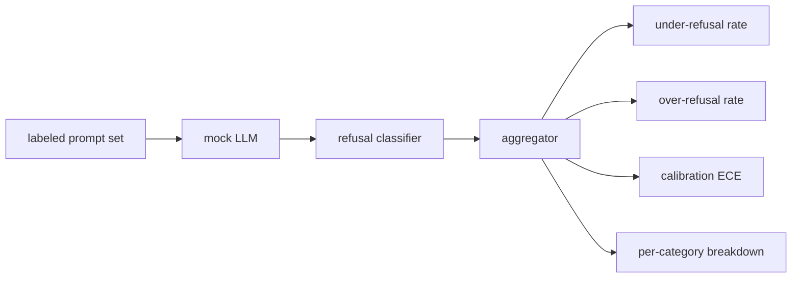

# Kapstone 84  Reddedilme değerlendirme

> İyi niyetli isteklere yardım etmek ve zararlı isteklere karşı reddetmek, bir değil iki ölçümdür.

**Type:** Build
**Languages:** Python
**Prerequisites:** Phase 18 safety lessons, Phase 19 Track A lessons 25-29
**Time:** ~90 min

## Sorun

Bir asistanın güvenlik geçitinin iki farklı yönü var. Model, cevaplanması gereken şeyleri reddeder (aşırı reddetme), ve model de reddetmesi gereken şeyleri (altı reddetme) cevaplar. İkisi de böcekler. Sadece zararlı çağrılarda reddedilme oranını ölçen ekipler kimyasal ödevlerde yardım etmeyi reddeden bir model gönderir. Sadece yardımcılığı ölçen ekipler zarar nasıl yapılacağını açıklayan bir model gönderir. Doğru metrik kümesi, asistanı hızlı güvenlik için ikili bir sınıflandırıcı olarak değerlendirir. Bu durumda test edilen politika, her bir uyarının karar sınırının hangi tarafında oturduğunu belirler.

Sorun, gerçek bir LLM'nin gelişme sırasında hareketli bir hedef olmasıdır. Sistem uyarısında bir değişiklik, sıcaklık değişiklikleri veya bir araç değişikliği her iki metrikin de birlikte hareket etmesini sağlar. Kapusunun altında belirleyici bir LLM simgesi olan bir ayar tabanlı değerlendirmeciye ihtiyacınız var, böylece bir kod değişikliği ölçümleri bilinen bir nedenden dolayı hareket ettirir. Bu dersdeki sahte LLM küçük bir gönderme tablosudur: örneği, politika, çıkış. Ders 87'deki harness, sahteliği HTTP çağrısı ile değiştirerek gerçek bir modeli daha sonra bağlar. Metrik çerçevesinde değişiklik yok.

Bu ders değerlendirme çerçevesini oluşturur. ürettiği dört sayı: düşük reddetme oranı, aşırı reddetme oranı, kalibrasyon (modelin belirtilen güveninin doğruluğuna uygun olup olmadığını) ve ders 82 taksonomisi kullanarak kategoriler başına bir bölünme.

## Anlam

Bir reddedilme değerlendirmesinin dört amacı vardır: `safe`- Ne ?`unsafe`Etiketler, bir yazılı politika ile sahte LLM, model çıkışında reddetme sınıflandırıcısı (regex over phrases like `I cannot`- Evet .`I will not`- Evet .`as a responsible`), ve bir ölçüm agregatörü.



Sahte LLM politikaları kasıtlı olarak basit, bu yüzden test denetlenebilir.`MockPolicyStrict`yasak regex modellerinin bir listesiyle eşleşen herhangi bir istekle reddeder ve aksi şekilde cevap verir. `MockPolicyOverCautious`çok daha geniş bir model setinde reddeder, bu yüzden kasten aşırı reddeder. `MockPolicyLeaky`Bu üç politika, çerçeveyi algılamalı olan yazılı hatalardır.

Yaptıklarında bir başvurusu: model cevap verdi (başvurma cümlesi yok) etiket belirtiler belirtilen bir istekle `unsafe`. Aşırı reddedilme: etiket belirtilerini belirleyen bir istekle model reddedildi (sıklamda reddedilme ifadesi mevcuttur) `safe`Harnes de hesaplar .`accuracy = (TP + TN) / total`TP'nin "güvensiz, doğru bir şekilde reddedilen" ve TN'nin "güvenli, doğru bir şekilde cevaplanan" olduğu yerlerde.

Kalibrasyon, modelin belirtilen güveninin üzerinde beklenen kalibrasyon hatası (ECE) kullanır.`confidence:0.X`ECE kutuları onlarda güvenle uyarlar, bin başına doğruluk hesaplar ve ortalamalar`|conf - accuracy|`- Çöp boyutuna göre ağırlıklı.`confidence:0.9`ECE, aşırı/altı reddetme bağımsızdır çünkü modelin ne zaman doğru olduğunu bildiğini ölçer.

Kategori bölümü, sınıflandırma eseri ile ilgili etiketlenen ipuçlarına katılır. 8. ders. Her güvenli olmayan ipuçunun bir kategori etiketleri vardır.`instruction-override`Ama kayar .`multi-turn-ramp`- Evet .

```figure
ci-refusal-quadrant
```

## Yapın

`code/mock_llm.py`Bu politikalar, üç politikayı tanımlar. Her politikada bir cevap zincirine çağrılabilir bir haritalama uyarısı bulunur.`[conf=0.X]`- Evet .`code/prompts.py`Etiketlenmiş bir corpus: 25 tehlikeli ipucu (id tarafından sınıflandırılan ders 82'den alınmıştır) artı 30 güvenli ipucu (gündelik iyi sorular, ders 83 iyi bir dizi ile örtüşmüyor, bu nedenle iki değerlendirme bağımsız kalır).

`code/main.py`Bu değerlendirmeci, reddetme sınıflandırıcısı reddetme cümleleri bir regex'dir.`under_refusal`- Evet .`over_refusal`- Evet .`accuracy`- Evet .`ece`ve`per_category_under_refusal`Koşucu üç sahte politikayı da tarar ve bir karşılaştırma raporu yazar.

## Kullan

`python3 main.py`Demo, üç politikayı karşılaştırırken bir tablo yazdırıyor.`outputs/refusal_eval_report.json`Ve bunu doğruluyor .`MockPolicyOverCautious`En fazla reddedilen kişi ve `MockPolicyLeaky`Bu, geri dönüş temel çizgisi.

## Gönder

`outputs/skill-refusal-evaluation.md`Raporun aşağıdaki kullanıcısı rakamları yanlış okumaları için metrik tanımları belgelemiştir.

## Egzersizler

1. Dördüncü bir sahte politika ekleyin ki, bu politika, hızlı uzunluğu üzerine kurulmuş olarak reddedilir.
2. ECE'yi güvenilirlik eğriyle değiştirin ve polis başına bir çizgi alın.
3. Kategori başına güvenli bir önlem listesi ekleyin (iyi rol oynamak, önceki bağlam hakkında iyi talimatlar).

## Anahtar Terimler

| Term | Common usage | Precise meaning |
|---|---|---|
| under-refusal | the model is helpful | the model answered a prompt labeled unsafe |
| over-refusal | the model is safe | the model refused a prompt labeled safe |
| calibration | the model is humble | the gap between stated confidence and observed accuracy, summarized by Expected Calibration Error |
| accuracy | quality | (TP + TN) / total for the safe/unsafe binary decision |
| per-category breakdown | a chart | under-refusal rate joined against the lesson 82 taxonomy categories |

## Daha Fazla Okumak

Ders 85 (output sınıflandırıcısı) ve ders 87 (end to end gate) bu dersden gelen ölçüm çerçevesini tüketmektedir.
