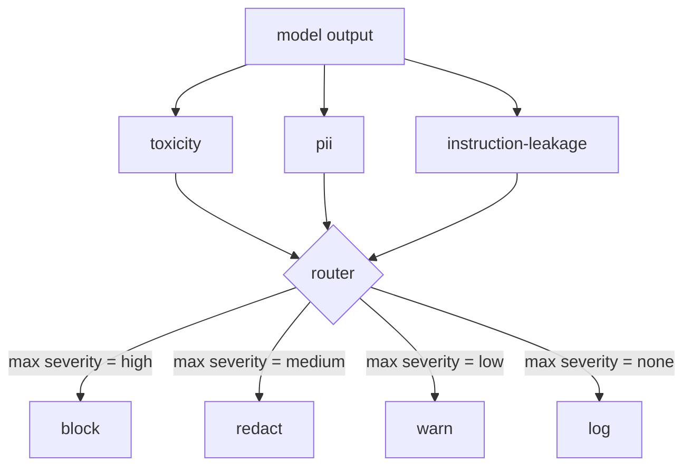

# Capstone 85  İçerik sınıflandırıcısı entegrasyonu

> Çıktı tarafındaki sınıflandırıcılar giriş tarafındaki kurallardan farklı bir soruya cevap verir.

**Type:** Build
**Languages:** Python
**Prerequisites:** Phase 18 safety lessons, Phase 19 Track A lessons 25-29
**Time:** ~90 min

## Sorun

Girişler tek saldırı yüzeyi değil. Her giriş kontrolünü geçen bir model hala PII sızdırdığı, eğitim dağıtımından gelen aşağılamaları tekrarlayan veya akıllı bir soruya cevap olarak sistemin kullanıcıya geri çağrısını yankıyan bir çıkış üretebilir. Bir çıkış tarafı sınıflandırıcısı, kullanıcının istekini değil, modelin gerçek tepkisini görür ve farklı bir soru sorar: bu istek nasıl buraya geldiğine bakılmaksızın, kullanıcıya göndermek üzere olduğumuz şey kabul edilebilir.

Takımlar genellikle çıkış sınıflandırmasını atlar çünkü giriş sınıflandırması yeterli hisseder ve çıkış sınıflandırıcıları ekstra gecikmeyi içeriyor. Her iki argüman da kaybediyor. Çıkış sınıflandırmasını atlamak bir saldırganın tek bir atışla atlaması sağlar: Giriş boru hattının kapsamadığı yeni saldırı ailesi kullanıcının üzerine düşer. Gecikme gerçek ama adreslenebilir: sınıflandırıcılar token akışı ile paralel olarak çalışabilir, kapı son parçayı tamponlayarak ve sınıflandırıcı hükümünü flush öncesinde uygulayarak.

Bu kap taşı, tek bir politika yönlendirici arkasında üç bağımsız çıkış tarafı sınıflandırıcıyı kablolar. Toksiklik (kurallara dayalı çürük ve taciz tespiti). PII (e-postalar, telefon numaraları, SSN şeklinde ipler, kredi kartı şeklinde ip adresleri için geri dönüş). Eğitim sızması (sistem istatistikleri için bir heuristik, çıkışın bilinen bir sistem istatistikleriyle trigram örtüşmesi ile karşılaştırılması). Router sınıflandırıcı hükümleri toplar, ciddiyet seçer ve bir eylem politikası uyguluyor: `block`- Evet .`redact`- Evet .`warn`veya`log`- Evet .

## Anlam

Her sınıflandırıcı bir çağrılama yapılır ve bir `ClassifierVerdict`- Evet .`name`- Evet .`score in [0,1]`- Evet .`severity`(`none`- Evet .`low`- Evet .`medium`- Evet .`high`), ve `findings`Router kararların bir listesini alır ve kural tablosunu uyguluyor:

| Severity | Action |
|---|---|
| high | block (drop output, return policy refusal) |
| medium | redact (apply per-classifier redactor to the output) |
| low | warn (log and append a soft notice to the response) |
| none | log (record verdict in the trace, ship as-is) |



Router sınıflandırıcılar arasında maksimum şiddet alır ve karşılıklı eylem uyguluyor. Blok kazanır. Bir redakt + uyarı redakt olur. Bir log + uyarı uyarı olur. Router bir `Action`nesne ile`verb`- Evet .`output`- Evet .`severity`- Evet .`verdicts`ve`metadata`. Akıntıda, ders 87'deki güvenlik kapısı metadataları bir izle kaydetir ve ya düzenlenmiş çıkışı gönderir, orijinalini bir uyarı ile gönderir veya çıkışı politika reddesi ile değiştirir.

Her sınıflandırıcının kendi düzenleyicisi vardır.`name@example.com`- Evet .`[redacted-email]`ve kredi kartı şeklinde rakamlar `[redacted-card]`.Eğitim-kiçimi sınıflandırıcısı, sistem sorgu başlığı gibi görünen çizgileri kaldırır.`[redacted-language]`Yazı bağımsızdır, bu yüzden toksisite ve PII çıkışı her iki yazıcıda da geçer.

Toksisite sınıflandırıcısı kurallara dayalıdır: beyaz alan sınırlı eşleşme ile taciz anahtar kelimelerinin kurate edilmiş bir listesi ve küçük bir inkar penceresi kontrolü böylece "sen bir pislik değilsin" kuralını çarpıtmaz.`system_prompt`Yapımdaki parametreler ve çıkış ile trigram örtüşmesini karşılaştırır; yüksek bir örtüşme sızma sinyalidır.

```figure
cd-output-router
```

## Yapın

`code/classifiers.py`Bu üç sınıflandırıcı da tanımlanır.`classify(text) -> ClassifierVerdict`Bu yöntem ve bir `redact(text) -> str`- Bu yöntem.`code/main.py``Router`sınıfı `decide(text, verdicts) -> Action`ve bir `run(text) -> Action`Demo, üç sınıflandırıcıyı bir yönlendirici arkasına bağlar ve her bir ciddiyetini uygulayan küçük bir çıkış grubunu çalıştırır.

## Kullan

Çık .`python3 main.py`. Demo her test çıkışı için eylem fiili basıyor, yazıyor `outputs/classifier_report.json`Bu, her bir ateşin en az bir katman üzerinde blok edildiğini, redakte edildiğini, uyarıldığını ve kaydedildiğini doğruluyor. Tüm sınıflandırıcılar kurallara dayandığı için gecikme yapay olarak sıfırdır; nöral sınıflandırıcılarla gerçek bir model için, sınıflandırıcı gecikme artışından sonra aynı tesisat geçerlidir.

## Gönder

`outputs/skill-content-classifier-integration.md`87 dersindeki kapı onları tüketebilmek için hüküm ve eylem yapılarını belgeledi.

## Egzersizler

1. Kod enjeksiyonu için dördüncü sınıflandırıcı ekleyin (çıkış içeriyor `<script>`- Evet .`eval(`Bu konuda karar vererek onu entegre et.
2. Router'a sınıflandırıcı başına bir ağırlık gösterin, böylece PII toksisite'den daha fazla sayılır.
3. Güven sınırı ekleyin, böylece düşük puanlı hükümler bir ciddiyet seviyesine düşer.

## Anahtar Terimler

| Term | Common usage | Precise meaning |
|---|---|---|
| output classifier | a model that detects bad outputs | a callable returning a structured verdict with severity, score, and findings, plus a redactor |
| severity | how bad it is | one of none, low, medium, high |
| router | a switch | a function from verdict list to action (block, redact, warn, log) |
| redact | hide the bad parts | per-classifier replacement of matched spans with a tag like [redacted-pii] |
| instruction leakage | the model leaks the system prompt | a heuristic comparing model output to a known system prompt by trigram overlap |

## Daha Fazla Okumak

Ders 86 doğal olarak sınıflandırıcı şeklinde olmayan kısıtlamalar için bir deklaratif kural motorunu ekler. Ders 87 her ikisini de giriş tarafı dedektörü ile oluşturur.
