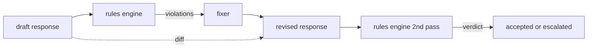

# Capstone 86  Anayasa Kuralları Motoru

> Bir kural bir isim, bir sözcük ve bir açıklama.

**Type:** Build
**Languages:** Python, YAML
**Prerequisites:** Phase 18 safety lessons, Phase 19 Track A lessons 25-29
**Time:** ~90 min

## Sorun

Sınıflandırıcılar tanınabilir hataları kapsar. Kurallar motorları sözleşme motorlarını kapsar. Bir kodlama asistanı yazmak için bir ekip "kod içeren her cevap, ya çalıştırılabilir bir blokta ya da belirtilen bir varsayımda bitmelidir". gibi bir kısıtlama istiyor. Müşteri destek botunu çalışan bir ekip "her reddedilme bir sonraki adım sunmalıdır". Bu kısıtlamalar doğal sınıflandırıcı hedefleri değildir. Cevap, konuşma ve sistem politikası üzerinde bir predikat ve mühendis olmayan bir kişi tarafından okunması gerekir.

Dürüst bir temsil, bir açıklama dosyasıdır. YAML'de bir anayasa kodun yanında, versiyon kontrolünde, ayrı bir inceleme süreci ile yaşar. Her kural bir `name`, a `predicate`, a `severity`ve bir `explanation`Şablon. Motor dosyayı yükler, her kuralı aday çıkışına göre değerlendirir ve yapılandırılmış bir `Violation`Bu kapı taşındaki kural motorunda,`all_of`- Evet .`any_of`ve`not_`Bu nedenle tek bir kural "eğer cevap kod içerirse, çalıştırılabilir bir blokla sona ermeli ve yalnızca iç kütüphaneden bahsetmemelidir".

Dersin diğer yarısı bir inceleme. Sadece bloklar yapan bir kural motoru yarı inşaat. Bir düzeltme önerisi veren kural motoru işlevsel olarak yararlıdır: asistan bir yanıt tasarlar, motor ihlalleri işaretler, bir düzeltmeci bir gözden geçirilmiş yanıt üretir ve motor gözden geçirilmiş kuralları karşıladığını onaylar. Ders, en az bir sabitleyici (her kural için regex değiştirme) ve düzenli bir fark (sırayla sırayla eklemeler, kaldırmalar, düzenlemeler) hazırlama ve gözden geçirilmiş arasında gönderir.

## Anlam



Bir kural şekli vardır.

```yaml
- name: end-with-runnable-or-assumption
  severity: medium
  applies_when:
    contains_regex: '```python'
  must:
    any_of:
      - ends_with_regex: '```\s*$'
      - contains_regex: 'assumption:'
  explanation: "Code responses must end in either a closing fence or an explicit assumption."
  fix:
    append_if_missing: "\n\nAssumption: example inputs are valid."
```

Predikatlar atomik .`contains_regex`- Evet .`not_contains_regex`- Evet .`ends_with_regex`- Evet .`starts_with_regex`- Evet .`max_words`- Evet .`min_words`Kompozisyonlar `all_of`- Evet .`any_of`- Evet .`not_`Motor değerlendiriyor .`applies_when`İlk olarak; eğer kural uygulanmazsa, ihlal olarak kaydedilmiştir.`not_applicable`Aksi takdirde motor değerlendirir .`must`Ve her ikisini de üretir.`pass`veya `violation`- Evet .

Ağırlıkları `low`- Evet .`medium`- Evet .`high`Akıntı kapısı (akıl 87) bir `high`Kural ihlal aynı bir `high`Sınıflandırıcı hüküm: blok.

Düzeltmeci, açıklama işlemlerinin bir listesi: `append_if_missing`- Evet .`prepend_if_missing`- Evet .`replace_regex`. Her işlem bir dönüşüme bir kuralın adını haritası yapar. Düzeltmeci kasıtlı olarak yerel düzenlemelere sınırlıdır; yapısal yeniden yazılar burada kapsamalanmayan ayrı bir reddetme ve yardım katmanına ait.

Fark, orijinal ve yenilenmiş ile hesaplanır.`Change`Kayıtlar `op`Aşağıdaki kapı, farkı kaydedebilir, böylece insan inceleyicisi zaman içinde sabitleyici davranışını denetleyebilir.

```figure
cd-constitution-loop
```

## Yapın

`code/rules.yml`Bu, anayasa'nın bir parçası.`code/main.py`Bir YAML dosyası (PyYAML mevcut olduğunda) veya bir JSON dosyası (binyumlanmış) kabul eder.`rules.yml`Dersin her iki kod yolundan da analiz testini yapması.`code/main.py``Engine`ve `Fixer`sınıfları ve bir `diff`Kompozisyonlar kısa devre ile rekürsiv olarak değerlendirilir.`any_of`- Evet .

Anayasa gönderildiği gibi:

- `no-empty-refusal`(orta) - reddedilme bir önerisi veya bir yönlendirme içermelidir
- `end-with-runnable-or-assumption`(orta) - kod cevapları temiz bir şekilde kapatılmalıdır
- `no-pii-in-examples`(yüksek) - örnek veriler e-posta veya telefon şekilleri içermez
- `cite-when-asserting-fact`(aşağı) - "Yine" ile başlayan satırlar, bir parantetik alıntı içermelidir.
- `no-internal-library-leak`(Yüksek) - kelimeler `internal-only`ve `policybot-internal`çıkışta görünmemeli
- `bounded-length`(Yük) - Cevaplar 800 kelimeyi aşmamalı

## Kullan

`python3 main.py`Demo motorun içinden üç taslak yanıt atıyor, ihlalleri yazdırıyor, düzeltme cihazını çalıştırıyor, farkı yazdırıyor ve yazıyor.`outputs/rules_report.json`. Bir düzenleme geçersiz bir kuralı (öntemde kod blokları yoktur) ve rapor göstermektedir `not_applicable`Bu kural için, ekip motorun açıkça değerlendirdiğini görsün.

## Gönder

`outputs/skill-constitutional-rules-engine.md`Kural dilbilgisini ve sabitleyici işlemlerini belgeledi.

## Egzersizler

1. Bu sorunun cevabını "Bu acil bir durumdur" ifadesini ekleyerek, güvenlik konusundaki kuralları ekle.
2. Regex fixer'i isimlendirilmiş boşlukları alan bir şablonlama fixer ile değiştirin.
3. Bir metrik son noktasını ekleyin. Bir dizi taslak verildiğinde, kural ihlal oranını gönderir. Böylece ekip hangi kuralın aşırı atıldığını görebilir.

## Anahtar Terimler

| Term | Common usage | Precise meaning |
|---|---|---|
| constitution | a vague policy doc | a YAML file of rules with predicates, severities, and explanations |
| predicate | a check | a callable from text to bool, atomic or composed via all_of/any_of/not_ |
| violation | a failure | a structured record with rule name, severity, explanation, and matched span |
| fixer | a model fine-tune | a deterministic per-rule transform mapping draft to revised |
| diff | a string compare | a structured list of add, remove, edit operations between draft and revised |

## Daha Fazla Okumak

Ders 87 bu motoru giriş tarafı algılayıcısı ve çıkış tarafı sınıflandırıcısı ile tek bir güvenlik kapısına birleştirir.
