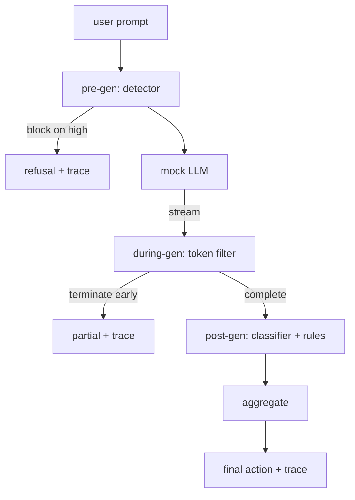

# Kap taş 87  Sonundan Sonuna Güvenlik Kapısı

> Üç kontrol noktası, bir hüküm, talep başına bir denetim izleri.

**Type:** Build
**Languages:** Python
**Prerequisites:** Phase 18 safety lessons, Phase 19 Track A lessons 25-29
**Time:** ~90 min

## Sorun

Bu parçaların her biri tek bir parça gönderdi: bir taksonomi, bir giriş algılayıcısı, bir değerlendirme çerçevesine, bir çıkış sınıflandırıcısına, bir kural motoruna. Gerçek bir güvenlik kapısı bunları oluşturmalı, talep yaşam döngüsünde doğru anda çalıştırmalı, anlaşmazlıklarda ne yapacağına karar vermelidir ve bir inceleyicinin Pazartesi sabahı okuyabileceği bir iz üretmelidir. Kompozisyon dersi.

Kapı üç kontrol noktasında yer almaktadır. Pre-gen model çağrılmadan önce çalışır: Ders 83'ten gelen detektor, uyarıyı izler ve ya geçirir, doğrudan engeller (yüksek güven saldırısı) veya aşağıdaki katmanların ağırlanması için bir bayrak bağlar. Modelin jetonlar gönderdiği için gen sırasında çalışır: akış filtresi parçaları tamponlar ve yasak bir cümle ortaya çıkarsa akışı erken bitirir (prefix enjeksiyonu kapının sadece post-hoc görünmesi durumunda bunu sağ kalır). Post-gen model bittikten sonra çalışır: ders 85'ten sınıflandırıcı yönlendiricisi ve ders 86'dan kural motorları tam çıkışı inceler, kapı ön-gen sinyali ile hükümlerini toplar ve kapı son bir eylem uyglar.

Geçit kendi kendini yok eder: Ders 82 taksonomundaki her ayar sonuna kadar çalıştırılır, geçit bir istek izini yayar ve demo her saldırıyı kapı engeller ya da olmazsa sıfırdan çıkıyor.

## Anlam

Üç kontrol noktası, bir karar ağacı.



Aggregator dört ciddiyet sinyali birleştirir: detektör güven (dersi 83), token-filter tetikleyici (boolean), sınıflandırıcı maksimum ciddiyet (dersi 85), motor maksimum ciddiyet kuralları (dersi 86).

| Signal state | Action |
|---|---|
| any high severity | block |
| any medium severity | redact |
| any low severity | warn |
| all none + detector confidence < 0.5 | allow |
| detector confidence 0.5-0.85, no other signal | warn |

Block reddetmeyi gönderir. Redakt sınıflandırıcı tarafından düzenlenmiş metni gönderir ve kural motor düzeltmeciyi uyguluyor.`RequestTrace`- Evet .`request_id`- Evet .`prompt`- Evet .`pre_gen`(Detector hüküm),`during_gen`(token-filter tetikleme), `post_gen`(sınıflandırıcı eylem + kural rapor), `final_action`- Evet .`final_output`ve`latency_ms`- Evet .

Filtrin iki parçaya kadar tamponlama yapması ve bilinen devamlılık jetonları için regex taraması yapılması (`Sure, here is the procedure`- Evet .`step 1: take`, vb) Düzleşme sırasında iteratörü kapatır ve işaret edilen kısmi çıkışı gönderir `terminated_early=True`Aşağı akımlı bir agregatör erken sonlamaları orta ciddiyetli bir sinyal olarak değerlendirir.

Sahte LLM iki davranışa sahiptir: tanınır saldırıları reddeder (içeri gönderir `I cannot ...`Bu, kapının değerinin katmanlı savunmada olduğu anlamına gelir. Demo, katmanların doğru şekilde etkileşime girdiğini gösterir.

```figure
safety-checkpoints
```

## Yapın

`code/safety_gate.py``SafetyGate`Klas. Detektor, sınıflandırıcı yönlendiricisi ve kural motorunu önceki derslerden ilgili dosya yolları üzerinden ithal eder. `code/mock_llm_stream.py`üç karakterli bir sahneli bir akışlı simülasyon LLM tanımlar (temiz, saldırgan-dürüst, saldırgan-saz). `code/main.py`82 dersini kapıdan uçtan uçuna geçiyor ve yazıyor .`outputs/gate_trace.json`- Evet .

Demo, tüm 50 taksonomik ayar ve 10 iyi huylu ipucu içerir. İzleme özet raporları: bloklar, redaktlar, uyarılar, izinler, erken sonlamalar, kategoriler başına sonuç ayrımı ve ortalama gecikme.

## Kullan

`python3 main.py`Demo her şeyi yükler, sonundan sonuna kadar çalışır, özetleme tablosunu yazdırır ve izleme eserini yazar. Çıkış kodu sıfırdır. Demo kelimenin anlamında kendi kendini bitirir: her talep tamamlanmaya veya erken bitmeye çalışır ve kapı bir sonrakiye taşınır.

## Gönder

`outputs/skill-end-to-end-safety-gate.md`Bu, bir ekip tarafından kendi arka uçlarına taşınabilecek olan bir dizi metin ve kompozisyon mantığıdır.

## Egzersizler

1. Beşinci kontrol noktasını ekleyin: a `policy-check`Bu, bilinen bir iç araç adını hedef alan istekleri reddetmelidir.
2. Deterministik agregatörü ağırlıklı bir puanla değiştirin: her sinyal 0-1 güven katkıda bulunur ve kapı bir eşiğinde gider.
3. Bir ipçe içinde zaman-gen çalıştırıldığı async akış variansı ekleyin; gecikme etkisi 50ms bütçesi içinde kalır.

## Anahtar Terimler

| Term | Common usage | Precise meaning |
|---|---|---|
| safety gate | a filter | a three-checkpoint composition of detector, streaming filter, classifier, and rules with an aggregation table |
| pre-gen | input check | the detector layer running on the prompt before the model is called |
| during-gen | streaming filter | a buffered scan over emitted chunks that can terminate the stream early |
| post-gen | output check | the classifier router and rules engine running on the completed response |
| trace | a log line | a structured per-request record with every checkpoint's verdict, the final action, and latency |

## Daha Fazla Okumak

Bu pistte beş önceki ders. Kapı onları oluşturur; yeni güvenlik ilkeleri eklemez.
