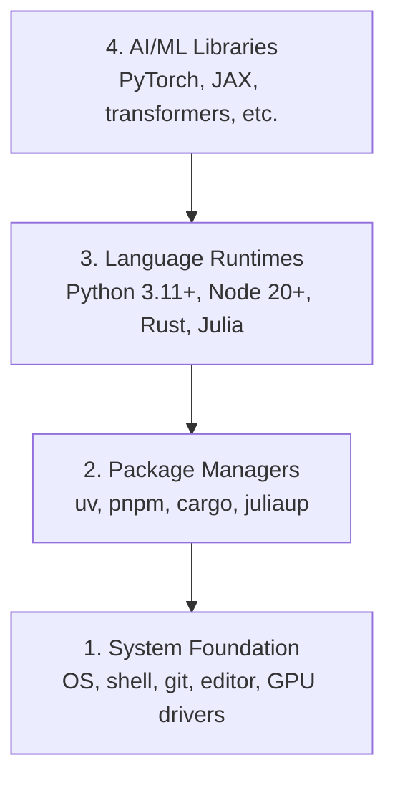

# Môi trường phát triển

> Các công cụ của bạn định hình tư duy của bạn.

**Type:** Build
**Languages:** Python, Node.js, Rust
**Prerequisites:** None
**Time:** ~45 minutes

## Mục tiêu học tập

- Thiết lập Python 3.11+, Node.js 20+, và Rust từ đầu
- Cài đặt môi trường ảo và quản lý gói cho các bộ xây dựng có thể tái tạo
- Kiểm tra truy cập GPU bằng CUDA/MPS và chạy một hoạt động tensor thử nghiệm
- Hiểu được các gói bốn tầng: hệ thống, gói, thời gian chạy, thư viện AI

## Vấn đề

Bạn sắp học kỹ thuật AI trên 500 bài học sử dụng Python, TypeScript, Rust và Julia. Nếu môi trường của bạn bị phá vỡ, mỗi bài học sẽ trở thành một cuộc chiến chống lại công cụ thay vì học tập.

Hầu hết mọi người bỏ qua cài đặt môi trường, sau đó họ dành nhiều giờ để cố gắng khắc phục lỗi nhập khẩu, xung đột phiên bản và các trình điều khiển CUDA bị mất.

## Khái niệm

Một môi trường kỹ thuật AI có bốn lớp:



Chúng tôi cài đặt từ dưới lên. Mỗi lớp phụ thuộc vào lớp dưới đó.

```figure
s0-env-stack
```

## Hãy xây dựng nó

### Bước 1: Cơ sở hệ thống

Kiểm tra hệ thống của bạn và cài đặt các cơ bản.

```bash
# macOS
xcode-select --install
brew install git curl wget

# Ubuntu/Debian
sudo apt update && sudo apt install -y build-essential git curl wget

# Windows (use WSL2)
wsl --install -d Ubuntu-24.04
```

### Bước 2: Python với uv

Chúng tôi sử dụng`uv` nó nhanh hơn 10-100 lần so với pip và xử lý môi trường ảo tự động.

```bash
curl -LsSf https://astral.sh/uv/install.sh | sh

uv python install 3.12

uv venv
source .venv/bin/activate  # or .venv\Scripts\activate on Windows

uv pip install numpy matplotlib jupyter
```

Kiểm tra:

```python
import sys
print(f"Python {sys.version}")

import numpy as np
print(f"NumPy {np.__version__}")
a = np.array([1, 2, 3])
print(f"Vector: {a}, dot product with itself: {np.dot(a, a)}")
```

### Bước 3: Node.js với pnpm

Đối với bài học TypeScript (các đại lý, máy chủ MCP, ứng dụng web).

```bash
curl -fsSL https://fnm.vercel.app/install | bash
fnm install 22
fnm use 22

npm install -g pnpm

node -e "console.log('Node', process.version)"
```

**macOS / Apple Silicon (M1/M2/M3/M4):**Nếu người cài đặt dừng lại với `Error: Cannot install under Rosetta 2 in ARM default prefix (/opt/homebrew)`, thiết bị của bạn đang chạy dưới Rosetta 2 (`arch`dấu vân tay`i386`(Tạm dịch: Homebrew là một bộ phận tự nhiên của arm64.`fnm install 22`- Có thể là:

```bash
arch -arm64 brew install fnm
echo 'eval "$(fnm env --use-on-cd)"' >> ~/.zshrc
source ~/.zshrc
```

### Bước 4: Độ độc

Đối với các bài học quan trọng về hiệu suất (trả lời, hệ thống).

```bash
curl --proto '=https' --tlsv1.2 -sSf https://sh.rustup.rs | sh

rustc --version
cargo --version
```

### Bước 5: Julia (Tự chọn)

Để học toán nặng mà Julia sáng sủa.

```bash
curl -fsSL https://install.julialang.org | sh

julia -e 'println("Julia ", VERSION)'
```

### Bước 6: Thiết lập GPU (Nếu bạn có một)

**NVIDIA (Linux / Windows):**

```bash
nvidia-smi

# Install PyTorch with CUDA
uv pip install torch torchvision torchaudio --index-url https://download.pytorch.org/whl/cu124
```

**macOS / Apple Silicon (M1/M2/M3/M4):**Không có CUDA trên Mac  được mong đợi, không có sự thất bại.**not** Đi qua`--index-url .../cuXXX`(Những bánh xe đó chỉ là Linux / Windows, vì vậy cài đặt thất bại).

```bash
uv pip install torch torchvision torchaudio
```

Kiểm tra (hợp tác trên bất kỳ nền tảng nào):

```python
import torch
print(f"CUDA available: {torch.cuda.is_available()}")           # False on macOS — expected
print(f"MPS available:  {torch.backends.mps.is_available()}")   # True on Apple Silicon
if torch.cuda.is_available():
    print(f"GPU: {torch.cuda.get_device_name(0)}")
```

Không có GPU? Không có vấn đề. Hầu hết các bài học đều chạy trên CPU. Đối với các bài học nặng, hãy sử dụng Google Colab hoặc GPU đám mây.

### Bước 7: Kiểm tra tuyến đường bạn muốn bắt đầu

Hãy chạy mọi lệnh trong bài học này từ nguồn kho, thư mục mà
chứa `README.md`và `phases/`- Chuẩn bị kiểm tra chỉ cần điều gì đó.
bắt đầu tuyến đường được chọn. Nó bỏ qua các công cụ sau theo mặc định để một người mới học thấy
Một câu trả lời rõ ràng thay vì một bức tường cảnh báo.

Bắt đầu chuỗi người mới bắt đầu:

```bash
python3 phases/00-setup-and-tooling/01-dev-environment/code/verify.py --route beginner
```

Hoặc chỉ kiểm tra đường bạn muốn:

```bash
python3 phases/00-setup-and-tooling/01-dev-environment/code/verify.py --route ml-foundations
python3 phases/00-setup-and-tooling/01-dev-environment/code/verify.py --route llm-engineering
python3 phases/00-setup-and-tooling/01-dev-environment/code/verify.py --route agents
python3 phases/00-setup-and-tooling/01-dev-environment/code/verify.py --route mcp
python3 phases/00-setup-and-tooling/01-dev-environment/code/verify.py --route agent-skills
python3 phases/00-setup-and-tooling/01-dev-environment/code/verify.py --route certification
```

Thêm `--show-later`khi bạn muốn cùng một chuyến bay trước để kiểm tra các công cụ tùy chọn
Một công cụ sau này không bao giờ chặn các
đường đi được chọn.

Mỗi kiểm tra yêu cầu thất bại bao gồm đường dẫn phát hiện hoặc lỗi nhập khẩu và một
Các kỹ năng của đại lý và các tuyến đường chứng nhận cũng cho thấy
kiểm tra máy chủ thủ công bởi vì một kịch bản Python không thể chứng minh rằng một máy chủ AI có
phát hiện ra một kỹ năng hoặc phạm vi kỹ năng bạn chọn là có thể viết.

Khi chuyến bay trước khi bắt đầu đi qua, nó in bài học đầu tiên:

```text
Ready to start Beginner course.
Next: python3 phases/01-math-foundations/01-linear-algebra-intuition/code/vectors.py
```

## Sử dụng nó

Môi trường của bạn sẵn sàng để bắt đầu tuyến đường bạn đã kiểm tra.
khi một bài học yêu cầu họ thay vì chặn bài học đầu tiên của bạn trên toàn bộ
Đây là những gì bạn sẽ sử dụng trong chương trình giảng dạy:

| Language | Used In | Package Manager |
|----------|---------|-----------------|
| Python | Phases 1-12 (ML, DL, NLP, Vision, Audio, LLMs) | uv |
| TypeScript | Phases 13-17 (Tools, Agents, Swarms, Infra) | pnpm |
| Rust | Phases 12, 15-17 (Performance-critical systems) | cargo |
| Julia | Phase 1 (Math foundations) | Pkg |

## Chuyển nó

Bài học này tạo ra một kịch bản xác minh mà bất cứ ai có thể chạy để kiểm tra thiết lập của họ.

Nhìn xem`outputs/prompt-env-check.md`cho một lời nhắc giúp trợ lý AI chẩn đoán các vấn đề môi trường.

## Các bài tập

1. Động trình kịch bản xác minh và sửa lỗi
2. Tạo một môi trường ảo Python cho khóa học này và cài đặt PyTorch
3. Viết "hào thế giới" bằng cả bốn ngôn ngữ và chạy mỗi ngôn ngữ
