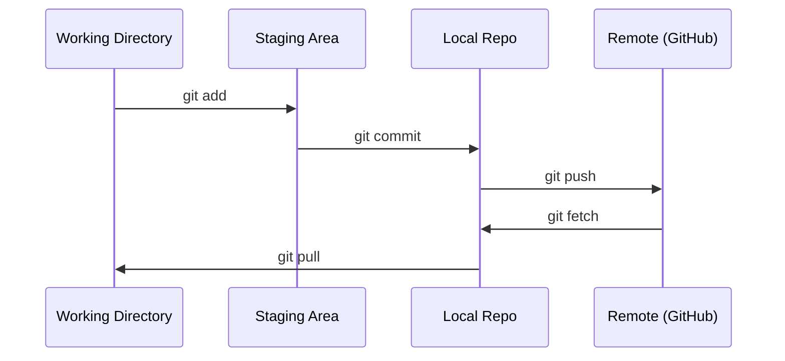

# Git & Collaboration

> Việc kiểm soát phiên bản không phải là tùy chọn, mỗi thí nghiệm, mỗi mô hình, mỗi bài học mà bạn tạo ra ở đây đều được theo dõi.

**Type:** Learn
**Languages:** --
**Prerequisites:** Phase 0, Lesson 01
**Time:** ~30 minutes

## Mục tiêu học tập

- Thiết lập kit nhận dạng và sử dụng dòng công việc hàng ngày của thêm, tham gia, và đẩy
- Tạo và hợp nhất các chi nhánh cho các thí nghiệm riêng biệt mà không phá vỡ chính
- Hãy viết một `.gitignore`không bao gồm các điểm kiểm soát mô hình và các tệp nhị phân lớn
- Di chuyển lịch sử tham gia với `git log`để hiểu sự phát triển của dự án

## Vấn đề

Bạn sắp viết hàng trăm tập tin mã trên 20 giai đoạn mà nếu không có kiểm soát phiên bản bạn sẽ mất công việc, phá vỡ những thứ bạn không thể hủy bỏ và không có cách để hợp tác với người khác.

Git là công cụ. GitHub là nơi mà mã sống. Bài học này bao gồm những gì bạn cần cho khóa học này và không có gì hơn thế.

## Khái niệm



Ba điều cần nhớ:
1. Tiết kiệm thường xuyên (`git commit`(văn)
2. Nhấn lên điều khiển từ xa (`git push`(văn)
3. Chi nhánh cho thí nghiệm (`git checkout -b experiment`(văn)

```figure
s0-commit-dag
```

## Hãy xây dựng nó

### Bước 1: Cài đặt git

```bash
git config --global user.name "Your Name"
git config --global user.email "you@example.com"
```

### Bước 2: Phương trình làm việc hàng ngày

```bash
git status
git add file.py
git commit -m "Add perceptron implementation"
git push origin main
```

### Bước 3: Nhóm phân nhánh cho các thí nghiệm

```bash
git checkout -b experiment/new-optimizer

# ... make changes, commit ...

git checkout main
git merge experiment/new-optimizer
```

### Bước 4: Làm việc với khóa học repo này

Bạn không thể đẩy đến khóa học repo chính nó  chỉ có người bảo trì có quyền truy cập viết. Nhập nó trên GitHub trước (phím nhập, bên phải trên) vì vậy `origin`Điểm trong bản sao của bạn:

```bash
git clone https://github.com/YOUR-USERNAME/ai-engineering-from-scratch.git
cd ai-engineering-from-scratch

git checkout -b my-progress
# work through lessons, commit your code
git push origin my-progress
```

## Sử dụng nó

Để thực hiện khóa học này, bạn cần những lệnh này:

| Command | When |
|---------|------|
| `git clone` | Get the course repo |
| `git add` + `git commit` | Save your work |
| `git push` | Back it up to GitHub |
| `git checkout -b` | Try something without breaking main |
| `git log --oneline` | See what you've done |

Đó là tất cả, không cần rebase, cherry-pick, hoặc submodules cho khóa học này.

## Các bài tập

1. Cửa ra cái repo này, nhân bản chiếc cành của bạn, tạo ra một nhánh tên là `my-progress`, tạo một tập tin, tham gia nó, đẩy nó
2. Tạo ra một `.gitignore`Không bao gồm các tập tin kiểm soát mẫu (`.pt`- `.pth`- `.safetensors`(văn)
3. Nhìn vào lịch sử tham gia của repo này với `git log --oneline`và đọc những bài học được thêm vào

## Các điều khoản chính

| Term | What people say | What it actually means |
|------|----------------|----------------------|
| Commit | "Saving" | A snapshot of your entire project at a point in time |
| Branch | "A copy" | A pointer to a commit that moves forward as you work |
| Merge | "Combining code" | Taking changes from one branch and applying them to another |
| Remote | "The cloud" | A copy of your repo hosted somewhere else (GitHub, GitLab) |
