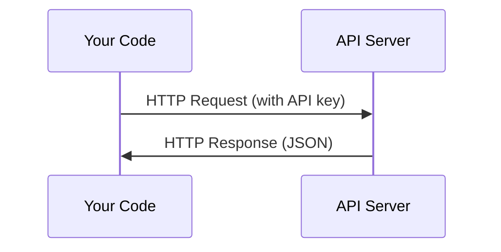

# API & Key

> Mỗi API AI hoạt động giống nhau: gửi yêu cầu, nhận được phản hồi.

**Type:** Build
**Languages:** Python, TypeScript
**Prerequisites:** Phase 0, Lesson 01
**Time:** ~30 minutes

## Mục tiêu học tập

- Cung cấp các khóa API an toàn bằng cách sử dụng các biến môi trường và `.env`tập tin
- Thực hiện một cuộc gọi LLM API sử dụng cả SDK Python Anthropic và HTTP nguyên liệu
- So sánh các định dạng yêu cầu / phản hồi HTTP dựa trên SDK và nguyên liệu để gỡ lỗi
- Xác định và xử lý các lỗi API phổ biến bao gồm xác thực và giới hạn tỷ lệ

## Vấn đề

Bắt đầu từ giai đoạn 11, bạn sẽ gọi LLM API (Anthropic, OpenAI, Google). Trong giai đoạn 13-16 bạn sẽ xây dựng các đại lý sử dụng các API này trong vòng lặp. Bạn cần biết cách API khóa hoạt động, làm thế nào để lưu trữ chúng một cách an toàn, và làm thế nào để thực hiện cuộc gọi API đầu tiên của bạn.

## Khái niệm



Mỗi cuộc gọi API có:
1. Endpoint (URL)
2. Một khóa API (tăng thực)
3. Một cơ quan yêu cầu (bạn muốn gì)
4. Một cơ thể phản ứng (bạn nhận lại)

```figure
s0-secret-inject
```

## Hãy xây dựng nó

### Bước 1: Cung cấp khóa API an toàn

Đừng bao giờ đặt khóa API vào mã. Sử dụng các biến môi trường.

```bash
export ANTHROPIC_API_KEY="sk-ant-..."
export OPENAI_API_KEY="sk-..."
```

Hoặc sử dụng `.env`file (tú thêm vào `.gitignore`):

```
ANTHROPIC_API_KEY=sk-ant-...
OPENAI_API_KEY=sk-...
```

### Bước 2: Cuộc gọi API đầu tiên (Python)

```python
import os

import anthropic

client = anthropic.Anthropic()

MODEL = os.environ.get("LLM_MODEL", "claude-sonnet-5")

response = client.messages.create(
    model=MODEL,
    max_tokens=256,
    messages=[{"role": "user", "content": "What is a neural network in one sentence?"}]
)

print(response.content[0].text)
```

`LLM_MODEL`chọn ID mô hình Anthropic, và mặc định là tên đếm Sonnet không được cập nhật. Các nhà cung cấp khác (OpenAI, Google, và những người khác) theo cùng một mô hình của một khóa cộng với một ID mô hình, nhưng mỗi người có SDK riêng, điểm cuối và quy trình yêu cầu / phản hồi.

### Bước 3: Cuộc gọi API đầu tiên (TypeScript)

```typescript
import Anthropic from "@anthropic-ai/sdk";

const client = new Anthropic();

const MODEL = process.env.LLM_MODEL ?? "claude-sonnet-5";

const response = await client.messages.create({
  model: MODEL,
  max_tokens: 256,
  messages: [{ role: "user", content: "What is a neural network in one sentence?" }],
});

console.log(response.content[0].text);
```

### Bước 4: HTTP Raw (không có SDK)

```python
import os
import urllib.request
import json

url = "https://api.anthropic.com/v1/messages"
headers = {
    "Content-Type": "application/json",
    "x-api-key": os.environ["ANTHROPIC_API_KEY"],
    "anthropic-version": "2023-06-01",
}
body = json.dumps({
    "model": os.environ.get("LLM_MODEL", "claude-sonnet-5"),
    "max_tokens": 256,
    "messages": [{"role": "user", "content": "What is a neural network in one sentence?"}],
}).encode()

req = urllib.request.Request(url, data=body, headers=headers, method="POST")
with urllib.request.urlopen(req) as resp:
    result = json.loads(resp.read())
    print(result["content"][0]["text"])
```

Đây là những gì SDK làm dưới nắp. Hiểu cuộc gọi HTTP nguyên thô giúp khi gỡ lỗi.

## Sử dụng nó

Đối với khóa học này:

| API | When you need it | Free tier |
|-----|-----------------|-----------|
| Anthropic (Claude) | Phases 11-16 (agents, tools) | $5 credit on signup |
| OpenAI | Phase 11 (comparison) | $5 credit on signup |
| Hugging Face | Phases 4-10 (models, datasets) | Free |

Anh không cần tất cả chúng ngay bây giờ, hãy đặt chúng lên khi bài học cần.

## Chuyển nó

Bài học này mang lại:
- `outputs/prompt-api-troubleshooter.md`- chẩn đoán các lỗi API phổ biến

## Các bài tập

1. Nhận một khóa API Anthropic và thực hiện cuộc gọi API đầu tiên của bạn
2. Hãy thử phiên bản HTTP nguyên liệu và so sánh định dạng phản ứng với phiên bản SDK
3. Ý định sử dụng một khóa API sai và đọc thông báo lỗi

## Các điều khoản chính

| Term | What people say | What it actually means |
|------|----------------|----------------------|
| API key | "Password for the API" | A unique string that identifies your account and authorizes requests |
| Rate limit | "They're throttling me" | Maximum requests per minute/hour to prevent abuse and ensure fair usage |
| Token | "A word" (in API context) | A billing unit: input and output tokens are counted and charged separately |
| Streaming | "Real-time responses" | Getting the response word by word instead of waiting for the full response |
