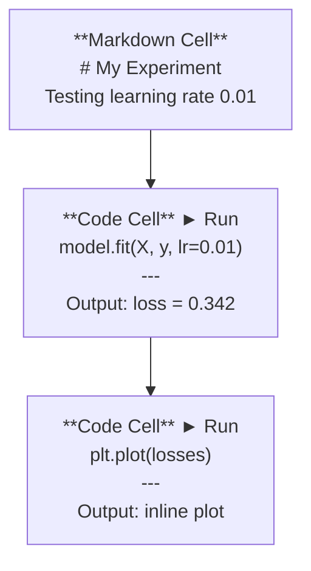
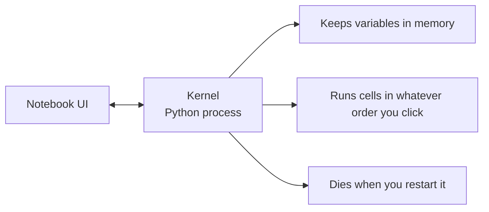

# Các sổ ghi chép Jupyter

> Các máy tính xách tay là phòng thí nghiệm của kỹ thuật AI. Bạn tạo ra nguyên mẫu ở đây, sau đó chuyển những gì hoạt động vào sản xuất.

**Type:** Build
**Languages:** Python
**Prerequisites:** Phase 0, Lesson 01
**Time:** ~30 minutes

## Mục tiêu học tập

- Thiết lập và khởi động JupyterLab, Jupyter Notebook, hoặc VS Code với tiện ích mở rộng Jupyter
- Sử dụng lệnh phép thuật (`%timeit`- `%%time`- `%matplotlib inline`) để đánh giá và hiển thị trong dòng
- Hóa ra khi nào sử dụng sổ ghi chép và kịch bản và áp dụng dòng công việc "xám phá trong sổ ghi chép, gửi trong kịch bản"
- Xác định và tránh những cái bẫy máy tính xách tay phổ biến: việc thực hiện không đúng trật tự, trạng thái ẩn và rò rỉ bộ nhớ

## Vấn đề

Mỗi bài báo AI, hướng dẫn và cuộc thi Kaggle đều sử dụng sổ ghi chép Jupyter. Chúng cho phép bạn chạy mã từng mảnh, xem kết quả trong dòng, trộn mã với lời giải thích và lặp lại nhanh chóng. Nếu bạn cố gắng học AI mà không cần sổ ghi chép, bạn sẽ làm bài tập về toán mà không cần giấy xước.

Nhưng sổ ghi chép có những cái bẫy thực sự. Mọi người sử dụng chúng cho mọi thứ, kể cả những thứ họ không giỏi. Biết khi nào sử dụng sổ ghi chép và khi nào sử dụng kịch bản sẽ giúp bạn tránh những cơn ác mộng sau này.

## Khái niệm

Một sổ ghi chép là một danh sách các tế bào. Mỗi tế bào là mã hoặc văn bản.



Lớp lõi là một quá trình Python chạy trong nền. Khi bạn chạy một tế bào, nó gửi mã đến lõi, nó thực hiện nó và gửi lại kết quả. Tất cả các tế bào chia sẻ cùng một lõi, vì vậy các biến tồn tại giữa các tế bào.



Phần "bất cứ thứ tự nào bạn nhấp vào" là cả siêu cường và súng trường.

```figure
s0-cell-order
```

## Hãy xây dựng nó

### Bước 1: Chọn giao diện của bạn

Ba lựa chọn, một định dạng:

| Interface | Install | Best for |
|-----------|---------|----------|
| JupyterLab | `pip install jupyterlab` then `jupyter lab` | Full IDE experience, multiple tabs, file browser, terminal |
| Jupyter Notebook | `pip install notebook` then `jupyter notebook` | Simple, lightweight, one notebook at a time |
| VS Code | Install "Jupyter" extension | Already in your editor, git integration, debugging |

Cả ba đều đọc và viết như nhau.`.ipynb`JupyterLab là công trình phổ biến nhất trong AI.

```bash
pip install jupyterlab
jupyter lab
```

### Bước 2: Các đường tắt bàn phím quan trọng

Bạn có thể hoạt động trong hai chế độ.`Escape`cho chế độ lệnh (bảng màu xanh lá cây ở bên trái), `Enter`cho chế độ chỉnh sửa (bar màu xanh lá cây).

**Command mode (most used):**

| Key | Action |
|-----|--------|
| `Shift+Enter` | Run cell, move to next |
| `A` | Insert cell above |
| `B` | Insert cell below |
| `DD` | Delete cell |
| `M` | Convert to markdown |
| `Y` | Convert to code |
| `Z` | Undo cell operation |
| `Ctrl+Shift+H` | Show all shortcuts |

**Edit mode:**

| Key | Action |
|-----|--------|
| `Tab` | Autocomplete |
| `Shift+Tab` | Show function signature |
| `Ctrl+/` | Toggle comment |

`Shift+Enter`là cái mà bạn sẽ sử dụng hàng ngàn lần một ngày.

### Bước 3: Các loại tế bào

**Code cells**chạy Python và hiển thị đầu ra:

```python
import numpy as np
data = np.random.randn(1000)
data.mean(), data.std()
```

Tạo ra: `(0.0032, 0.9987)`

**Markdown cells**Đưa ra văn bản định dạng. Sử dụng chúng để ghi lại những gì bạn đang làm và tại sao.`$E = mc^2$`), bảng và hình ảnh.

### Bước 4: Các lệnh phép thuật

Đây không phải Python, mà là lệnh đặc biệt của Jupyter bắt đầu bằng`%`(bức thuật đường dây) hoặc `%%`(tự thần học tế bào).

**Time your code:**

```python
%timeit np.random.randn(10000)
```

Tạo ra: `45.2 us +/- 1.3 us per loop`

```python
%%time
model.fit(X_train, y_train, epochs=10)
```

Tạo ra: `Wall time: 2.34 s`

`%timeit`chạy mã nhiều lần và trung bình. `%%time`chạy nó một lần.`%timeit`cho các dấu hiệu microbenchmark, `%%time`cho các cuộc tập luyện.

**Enable inline plots:**

```python
%matplotlib inline
```

Mỗi người`plt.plot()`hoặc `plt.show()`bây giờ sẽ được ghi trực tiếp trong sổ ghi chép.

**Install packages without leaving the notebook:**

```python
!pip install scikit-learn
```

- `!`Prefix chạy bất kỳ lệnh shell nào.

**Check environment variables:**

```python
%env CUDA_VISIBLE_DEVICES
```

### Bước 5: hiển thị đầu ra giàu trong dòng

Các notebook tự động hiển thị biểu hiện cuối cùng trong một tế bào.

```python
import pandas as pd

df = pd.DataFrame({
    "model": ["Linear", "Random Forest", "Neural Net"],
    "accuracy": [0.72, 0.89, 0.94],
    "training_time": [0.1, 2.3, 45.6]
})
df
```

Điều này tạo ra một bảng HTML định dạng, không phải là một thư rác.

```python
import matplotlib.pyplot as plt

plt.figure(figsize=(8, 4))
plt.plot([1, 2, 3, 4], [1, 4, 2, 3])
plt.title("Inline Plot")
plt.show()
```

Hình ảnh xuất hiện ngay dưới tế bào. Đó là lý do tại sao máy tính xách tay thống trị công việc AI. Bạn thấy dữ liệu, biểu đồ và mã cùng nhau.

Đối với hình ảnh:

```python
from IPython.display import Image, display
display(Image(filename="architecture.png"))
```

### Bước 6: Google Colab

Colab là một máy tính xách tay Jupyter miễn phí trong đám mây. Nó cung cấp cho bạn một GPU, thư viện cài đặt trước và tích hợp Google Drive. Không cần thiết lập.

1. Đi đi[colab.research.google.com](https://colab.research.google.com)
2. Lên bất cứ `.ipynb`tập tin từ khóa học này
3. Thời gian chạy > Thay đổi loại thời gian chạy > T4 GPU (tự do)

Sự khác biệt của Colab với Jupyter địa phương:
- Các tập tin không tồn tại giữa các phiên (trừ khi Drive hoặc tải xuống)
- Numpy, pandas, matplotlib, ngọn đuốc, tensorflow, sklearn
- `from google.colab import files`để tải lên/ tải xuống các tệp
- `from google.colab import drive; drive.mount('/content/drive')`cho việc lưu trữ liên tục
- Thời gian nghỉ các buổi sau khi không hoạt động 90 phút (tầng miễn phí)

## Sử dụng nó

### Notebook vs Script: Khi nào sử dụng cái nào

| Use notebooks for | Use scripts for |
|-------------------|-----------------|
| Exploring a dataset | Training pipelines |
| Prototyping a model | Reusable utilities |
| Visualizing results | Anything with `if __name__` |
| Explaining your work | Code that runs on a schedule |
| Quick experiments | Production code |
| Course exercises | Packages and libraries |

Quy tắc:**explore in notebooks, ship in scripts**- Tôi không biết.

Một quy trình làm việc phổ biến trong AI:
1. Tìm hiểu dữ liệu trong sổ ghi chép
2. Mô hình mẫu của bạn trong sổ ghi chép
3. Khi nó hoạt động, di chuyển mã đến `.py`tập tin
4. Tham nhập những thứ đó `.py`các tập tin trở lại sổ ghi chép để thử nghiệm tiếp theo

### Những cái bẫy phổ biến

**Out-of-order execution.**Bạn chạy tế bào 5, sau đó tế bào 2, sau đó tế bào 7. sổ ghi chép hoạt động trên máy của bạn nhưng bị phá vỡ khi ai đó chạy nó từ trên xuống.

**Hidden state.**Bạn xóa một tế bào nhưng biến nó tạo vẫn còn trong bộ nhớ. sổ ghi chép trông sạch nhưng phụ thuộc vào một tế bào ma.

**Memory leaks.**Lắp đặt một bộ dữ liệu 4GB, đào tạo một mô hình, tải một bộ dữ liệu khác. Không gì được giải phóng.`del variable_name`và `gc.collect()`, hoặc khởi động lại hạt nhân.

## Chuyển nó

Bài học này mang lại:
- `outputs/prompt-notebook-helper.md`cho các vấn đề ghi chép

## Các bài tập

1. Mở JupyterLab, tạo sổ ghi chép và sử dụng `%timeit`để so sánh sự hiểu biết danh sách với numpy để tạo ra một mảng 100.000 số ngẫu nhiên
2. Tạo một sổ ghi chép với cả các tế bào dấu và mã tải một CSV, hiển thị một khung dữ liệu và vẽ biểu đồ. Sau đó chạy Kernel > Restart & Run All để xác minh nó hoạt động từ trên xuống
3. lấy mã từ `code/notebook_tips.py`, dán nó vào một máy tính xách tay Colab, và chạy nó với một GPU miễn phí

## Các điều khoản chính

| Term | What people say | What it actually means |
|------|----------------|----------------------|
| Kernel | "The thing running my code" | A separate Python process that executes cells and keeps variables in memory |
| Cell | "A code block" | An independently runnable unit in a notebook, either code or markdown |
| Magic command | "Jupyter tricks" | Special commands prefixed with `%` or `%%` that control the notebook environment |
| `.ipynb` | "Notebook file" | A JSON file containing cells, outputs, and metadata. Stands for IPython Notebook |

## Đọc thêm

- [JupyterLab Docs](https://jupyterlab.readthedocs.io/)cho bộ tính năng đầy đủ
- [Google Colab FAQ](https://research.google.com/colaboratory/faq.html)cho các giới hạn và tính năng cụ thể của Colab
- [28 Jupyter Notebook Tips](https://www.dataquest.io/blog/jupyter-notebook-tips-tricks-shortcuts/)cho các đường tắt của người sử dụng điện
