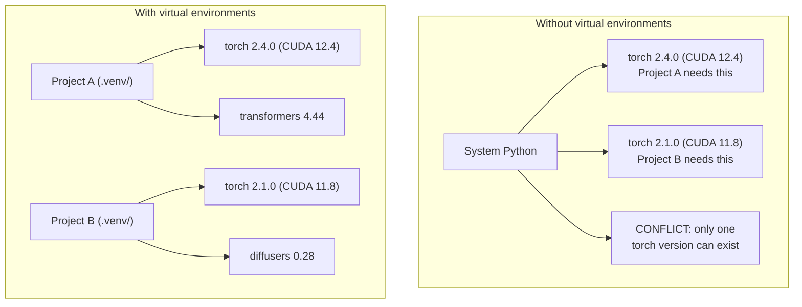

# Python môi trường

> Địa ngục phụ thuộc là thực tế.

**Type:** Build
**Languages:** Shell
**Prerequisites:** Phase 0, Lesson 01
**Time:** ~30 minutes

## Mục tiêu học tập

- Tạo môi trường ảo cách ly bằng cách sử dụng `uv`- `venv`, hoặc`conda`
- Hãy viết một `pyproject.toml`với các nhóm phụ thuộc tùy chọn và tạo các tập tin khóa để tái tạo
- Chẩn đoán và khắc phục các bẫy phổ biến: cài đặt toàn cầu, trộn pip / conda, sự không phù hợp của phiên bản CUDA
- Thực hiện chiến lược môi trường từng giai đoạn cho các dự án có sự phụ thuộc mâu thuẫn

## Vấn đề

Bạn cài đặt PyTorch 2.4 cho một dự án điều chỉnh tinh tế. Tuần tới, một dự án khác cần PyTorch 2.1 vì xây dựng CUDA của nó đã bị gắn. Bạn nâng cấp toàn cầu, và dự án đầu tiên bị phá vỡ. Bạn hạ cấp, và thứ hai bị phá vỡ.

Đây là địa ngục phụ thuộc. Nó xảy ra liên tục trong công việc AI / ML bởi vì:

- PyTorch, JAX và TensorFlow mỗi tàu kết nối CUDA của riêng họ
- Các thư viện mô hình pin các phiên bản khung cụ thể
- Một thế giới `pip install`viết qua bất cứ điều gì đã có trước đó
- CUDA 11.8 xây dựng không hoạt động với các trình điều khiển CUDA 12.x (và ngược lại)

Giải pháp: mỗi dự án có môi trường riêng biệt với các gói riêng của nó.

## Khái niệm



```figure
s0-env-isolation
```

## Hãy xây dựng nó

### Tùy chọn 1: uv venv (được khuyến cáo)

`uv`là trình quản lý gói Python nhanh nhất (10-100 lần nhanh hơn pip). Nó xử lý môi trường ảo, phiên bản Python và độ phân giải phụ thuộc trong một công cụ.

```bash
curl -LsSf https://astral.sh/uv/install.sh | sh

uv python install 3.12

cd your-project
uv venv
source .venv/bin/activate
```

Lắp đặt gói:

```bash
uv pip install torch numpy
```

Tạo một dự án với `pyproject.toml`trong một bước:

```bash
uv init my-ai-project
cd my-ai-project
uv add torch numpy matplotlib
```

### Tùy chọn 2: venv (được tích hợp)

Nếu không thể cài đặt `uv`, tàu Python với `venv`- Có thể là:

```bash
python3 -m venv .venv
source .venv/bin/activate  # Linux/macOS
.venv\Scripts\activate     # Windows

pip install torch numpy
```

Tốc chậm hơn `uv`, nhưng hoạt động ở mọi nơi Python được cài đặt.

### Tùy chọn 3: conda (Khi bạn cần nó)

Conda quản lý các phụ thuộc không phải Python như các bộ công cụ CUDA, cuDNN và thư viện C. Sử dụng nó khi:

- Bạn cần một phiên bản cụ thể của bộ công cụ CUDA mà không cần cài đặt nó trên toàn hệ thống
- Bạn đang ở trên một cluster chia sẻ nơi bạn không thể cài đặt các gói hệ thống
- Các hướng dẫn cài đặt của thư viện nói " Sử dụng conda "

```bash
# Install miniconda (not the full Anaconda)
curl -LsSf https://repo.anaconda.com/miniconda/Miniconda3-latest-Linux-x86_64.sh -o miniconda.sh
bash miniconda.sh -b

conda create -n myproject python=3.12
conda activate myproject

conda install pytorch torchvision torchaudio pytorch-cuda=12.4 -c pytorch -c nvidia
```

Một quy tắc: nếu bạn sử dụng conda cho một môi trường, hãy sử dụng conda cho tất cả các gói trong môi trường đó.`pip install`trong một conda env gây ra xung đột phụ thuộc mà là đau đớn để debug.

### Đối với khóa học này: Chiến lược từng giai đoạn

Bạn có thể tạo ra một môi trường cho toàn bộ khóa học. Không. Các giai đoạn khác nhau cần phụ thuộc khác nhau (thỉnh thoảng mâu thuẫn).

Chiến lược:

```
ai-engineering-from-scratch/
├── .venv/                    <-- shared lightweight env for phases 0-3
├── phases/
│   ├── 04-neural-networks/
│   │   └── .venv/            <-- PyTorch env
│   ├── 05-cnns/
│   │   └── .venv/            <-- same PyTorch env (symlink or shared)
│   ├── 08-transformers/
│   │   └── .venv/            <-- might need different transformer versions
│   └── 11-llm-apis/
│       └── .venv/            <-- API SDKs, no torch needed
```

- Lịch bản trong `code/env_setup.sh`tạo ra môi trường cơ bản cho khóa học này.

## pyproject.toml

Mỗi dự án Python nên có một `pyproject.toml`Nó thay thế`setup.py`- `setup.cfg`, và`requirements.txt`trong một tập tin.

```toml
[project]
name = "ai-engineering-from-scratch"
version = "0.1.0"
requires-python = ">=3.11"
dependencies = [
    "numpy>=1.26",
    "matplotlib>=3.8",
    "jupyter>=1.0",
    "scikit-learn>=1.4",
]

[project.optional-dependencies]
torch = ["torch>=2.3", "torchvision>=0.18"]
llm = ["anthropic>=0.39", "openai>=1.50"]
```

Sau đó cài đặt:

```bash
uv pip install -e ".[torch]"    # base + PyTorch
uv pip install -e ".[llm]"     # base + LLM SDKs
uv pip install -e ".[torch,llm]" # everything
```

## Các file khóa

Một tập tin khóa pin mọi phụ thuộc (bao gồm cả các phiên bản chuyển tiếp) thành phiên bản chính xác. Điều này đảm bảo khả năng tái tạo: bất cứ ai cài đặt từ tập tin khóa đều nhận được các gói chính xác.

```bash
# uv generates uv.lock automatically when using uv add
uv add numpy

# pip-tools approach
uv pip compile pyproject.toml -o requirements.lock
uv pip install -r requirements.lock
```

Khi ai đó nhân bản repo, họ cài đặt từ khóa và nhận được các phiên bản giống nhau.

## Những sai lầm phổ biến

### 1. Lắp đặt trên toàn cầu

```bash
pip install torch  # BAD: installs to system Python

source .venv/bin/activate
pip install torch  # GOOD: installs to virtual environment
```

Kiểm tra nơi gói hàng của bạn đi:

```bash
which python       # should show .venv/bin/python, not /usr/bin/python
which pip           # should show .venv/bin/pip
```

### 2. Trộn pip và conda

```bash
conda create -n myenv python=3.12
conda activate myenv
conda install pytorch -c pytorch
pip install some-other-package   # BAD: can break conda's dependency tracking
conda install some-other-package # GOOD: let conda manage everything
```

Nếu bạn phải sử dụng pip bên trong conda (một số gói chỉ có pip), cài đặt tất cả các gói conda trước, sau đó các gói pip sẽ kéo dài.

### 3. Quên kích hoạt

```bash
python train.py           # uses system Python, missing packages
source .venv/bin/activate
python train.py           # uses project Python, packages found
```

Các lệnh shell của bạn sẽ hiển thị tên môi trường:

```
(.venv) $ python train.py
```

### 4. Cung cấp .venv để git

```bash
echo ".venv/" >> .gitignore
```

Môi trường ảo là 200MB-2GB. Chúng là địa phương, không di động giữa máy tính.`pyproject.toml`và thay vào đó là khóa.

### 5. CUDA phiên bản không phù hợp

```bash
nvidia-smi                # shows driver CUDA version (e.g., 12.4)
python -c "import torch; print(torch.version.cuda)"  # shows PyTorch CUDA version

# These must be compatible.
# PyTorch CUDA version must be <= driver CUDA version.
```

## Sử dụng nó

Dạy kịch bản cài đặt để tạo môi trường khóa học của bạn:

```bash
bash phases/00-setup-and-tooling/06-python-environments/code/env_setup.sh
```

Điều này tạo ra một `.venv`tại gốc repo với các phụ thuộc cốt lõi được cài đặt và xác minh.

## Các bài tập

1. Đi chạy`env_setup.sh`và xác minh tất cả kiểm tra qua
2. Tạo một môi trường ảo thứ hai, cài đặt một phiên bản khác của numpy trong nó, và xác nhận hai môi trường là cô lập
3. Hãy viết một `pyproject.toml`cho một dự án cần cả PyTorch và SDK Anthropic
4. Chuẩn bị cài đặt một gói trên toàn cầu (không kích hoạt venv), nhận thức nó đi đâu, sau đó gỡ bỏ cài đặt nó

## Các điều khoản chính

| Term | What people say | What it actually means |
|------|----------------|----------------------|
| Virtual environment | "A venv" | An isolated directory containing a Python interpreter and packages, separate from the system Python |
| Lockfile | "Pinned dependencies" | A file listing every package and its exact version, guaranteeing identical installs across machines |
| pyproject.toml | "The new setup.py" | The standard Python project configuration file, replacing setup.py/setup.cfg/requirements.txt |
| Transitive dependency | "A dependency of a dependency" | Package B depends on C; if you install A which depends on B, C is a transitive dependency of A |
| CUDA mismatch | "My GPU isn't working" | PyTorch was compiled for a different CUDA version than what your GPU driver supports |
