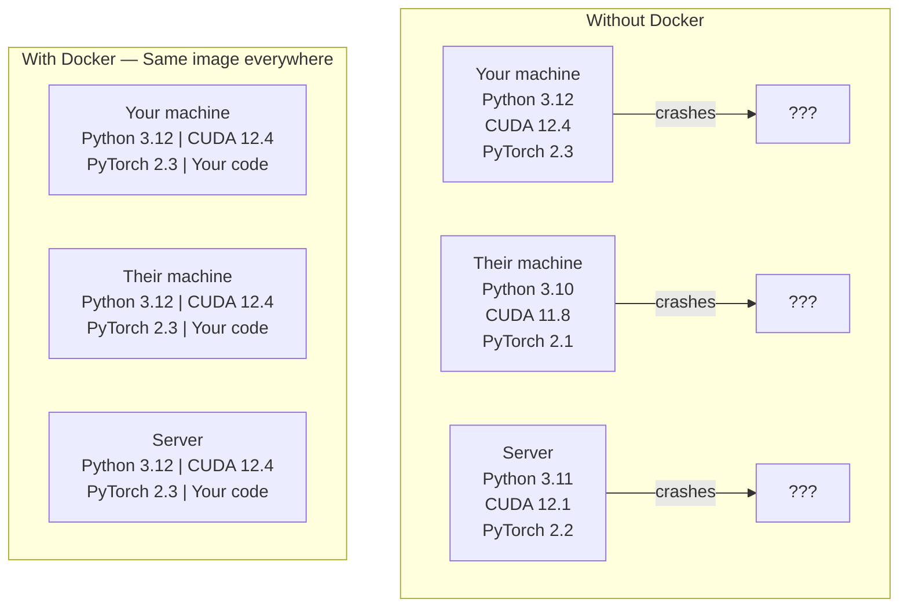

# Docker cho AI

> Các container làm cho "các công việc trên máy của tôi" là một điều của quá khứ.

**Type:** Build
**Languages:** Docker
**Prerequisites:** Phase 0, Lessons 01 and 03
**Time:** ~60 minutes

## Mục tiêu học tập

- Xây dựng hình ảnh Docker có khả năng GPU với CUDA, PyTorch và thư viện AI từ Dockerfile
- Lắp đặt thư mục chủ nhà như khối lượng để duy trì các mô hình, tập hợp dữ liệu và mã trên các container xây dựng lại
- Cài đặt NVIDIA Container Toolkit để lộ GPU bên trong container
- Phong phối các ứng dụng AI đa dịch vụ (tạm dịch máy chủ suy luận + cơ sở dữ liệu vector) bằng cách sử dụng Docker Compose

## Vấn đề

Bạn đã huấn luyện một mô hình trên máy tính xách tay của mình với PyTorch 2.3, CUDA 12.4 và Python 3.12. đồng nghiệp của bạn có PyTorch 2.1, CUDA 11.8 và Python 3.10. mô hình của bạn bị hỏng trên máy tính của họ. Dockerfile của bạn hoạt động trên cả hai.

Các dự án AI là những cơn ác mộng phụ thuộc. Một tập hợp điển hình bao gồm Python, PyTorch, trình điều khiển CUDA, cuDNN, thư viện C cấp hệ thống và các gói chuyên dụng như flash-attn cần các phiên bản biên dịch chính xác. Docker đóng gói tất cả trong một hình ảnh duy nhất chạy giống nhau ở khắp mọi nơi.

## Khái niệm

Docker bọc mã, thời gian chạy, thư viện và công cụ hệ thống của bạn vào một đơn vị riêng biệt được gọi là container. Hãy nghĩ về nó như một máy ảo nhẹ, ngoại trừ nó chia sẻ lõi OS chủ thay vì chạy riêng của nó, vì vậy nó bắt đầu trong giây thay vì phút.



### Tại sao các dự án AI cần Docker nhiều hơn hầu hết

1. **GPU drivers are fragile.**Mã CUDA 12.4 không chạy trên CUDA 11.8. Docker cô lập bộ công cụ CUDA bên trong container trong khi chia sẻ trình điều khiển GPU chủ thông qua bộ công cụ container NVIDIA.

2. **Model weights are large.**Một mô hình tham số 7B là 14 GB trong fp16. Bạn không muốn tải lại nó mỗi khi bạn xây dựng lại.

3. **Multi-service architectures are common.**Một ứng dụng AI thực sự không chỉ là một kịch bản Python. Nó là một máy chủ suy luận, một cơ sở dữ liệu vector cho RAG, có lẽ là một đầu tiên web. Docker Compose dàn xếp tất cả những điều này với một lệnh.

### Từ vựng chính

| Term | What it means |
|------|---------------|
| Image | A read-only template. Your recipe. Built from a Dockerfile. |
| Container | A running instance of an image. Your kitchen. |
| Dockerfile | Instructions to build an image. Layer by layer. |
| Volume | Persistent storage that survives container restarts. |
| docker-compose | A tool for defining multi-container applications in YAML. |

### Các mẫu container phổ biến trong AI

```
Dev Container
  Full toolkit. Editor support. Jupyter. Debugging tools.
  Used during development and experimentation.

Training Container
  Minimal. Just the training script and dependencies.
  Runs on GPU clusters. No editor, no Jupyter.

Inference Container
  Optimized for serving. Small image. Fast cold start.
  Runs behind a load balancer in production.
```

```figure
s0-image-layers
```

## Hãy xây dựng nó

### Bước 1: Lắp đặt Docker

```bash
# macOS
brew install --cask docker
open /Applications/Docker.app

# Ubuntu
curl -fsSL https://get.docker.com | sh
sudo usermod -aG docker $USER
# Log out and back in for group change to take effect
```

Kiểm tra:

```bash
docker --version
docker run hello-world
```

### Bước 2: Lắp đặt NVIDIA Container Toolkit (Linux với NVIDIA GPU)

Điều này cho phép các container Docker truy cập vào GPU của bạn. người dùng macOS và Windows (WSL2) có thể bỏ qua điều này; Docker Desktop xử lý GPU qua các nền tảng khác nhau.

```bash
distribution=$(. /etc/os-release;echo $ID$VERSION_ID)
curl -fsSL https://nvidia.github.io/libnvidia-container/gpgkey | sudo gpg --dearmor -o /usr/share/keyrings/nvidia-container-toolkit-keyring.gpg
curl -s -L https://nvidia.github.io/libnvidia-container/$distribution/libnvidia-container.list | \
    sed 's#deb https://#deb [signed-by=/usr/share/keyrings/nvidia-container-toolkit-keyring.gpg] https://#g' | \
    sudo tee /etc/apt/sources.list.d/nvidia-container-toolkit.list

sudo apt-get update
sudo apt-get install -y nvidia-container-toolkit
sudo nvidia-ctk runtime configure --runtime=docker
sudo systemctl restart docker
```

Kiểm tra truy cập GPU bên trong thùng:

```bash
docker run --rm --gpus all nvidia/cuda:12.4.1-base-ubuntu22.04 nvidia-smi
```

Nếu bạn thấy thông tin GPU của bạn, bộ công cụ đang hoạt động.

### Bước 3: Hiểu hình ảnh cơ bản

Chọn hình ảnh cơ sở đúng sẽ giúp tiết kiệm nhiều giờ để gỡ lỗi.

```
nvidia/cuda:12.4.1-devel-ubuntu22.04
  Full CUDA toolkit. Compilers included.
  Use for: building packages that need nvcc (flash-attn, bitsandbytes)
  Size: ~4 GB

nvidia/cuda:12.4.1-runtime-ubuntu22.04
  CUDA runtime only. No compilers.
  Use for: running pre-built code
  Size: ~1.5 GB

pytorch/pytorch:2.6.0-cuda12.4-cudnn9-runtime
  PyTorch pre-installed on top of CUDA.
  Use for: skipping the PyTorch install step
  Size: ~6 GB

python:3.12-slim
  No CUDA. CPU only.
  Use for: inference on CPU, lightweight tools
  Size: ~150 MB
```

### Bước 4: Tạo Dockerfile cho phát triển AI

Đây là hồ sơ Docker trong `code/Dockerfile`Đi qua nó:

```dockerfile
FROM nvidia/cuda:12.4.1-devel-ubuntu22.04

ENV DEBIAN_FRONTEND=noninteractive
ENV PYTHONUNBUFFERED=1

RUN apt-get update && apt-get install -y --no-install-recommends \
    software-properties-common \
    git \
    curl \
    build-essential \
    && add-apt-repository -y ppa:deadsnakes/ppa \
    && apt-get update && apt-get install -y --no-install-recommends \
    python3.12 \
    python3.12-venv \
    python3.12-dev \
    && rm -rf /var/lib/apt/lists/*

RUN update-alternatives --install /usr/bin/python python /usr/bin/python3.12 1

RUN curl -sSL https://raw.githubusercontent.com/pypa/get-pip/3b73145063be545b649ad9ca83ea8da5fc915a4f/public/get-pip.py -o /tmp/get-pip.py \
    && echo "a341e1a43e38001c551a1508a73ff23636a11970b61d901d9a1cad2a18f57055  /tmp/get-pip.py" | sha256sum -c - \
    && python /tmp/get-pip.py \
    && rm /tmp/get-pip.py \
    && update-alternatives --install /usr/bin/pip pip /usr/local/bin/pip3.12 1

RUN python -m pip install --no-cache-dir --upgrade pip setuptools wheel

RUN python -m pip install --no-cache-dir \
    torch==2.6.0+cu124 \
    torchvision==0.21.0+cu124 \
    torchaudio==2.6.0+cu124 \
    --index-url https://download.pytorch.org/whl/cu124

RUN python -m pip install --no-cache-dir \
    numpy \
    pandas \
    scikit-learn \
    matplotlib \
    jupyter \
    transformers \
    datasets \
    accelerate \
    safetensors

WORKDIR /workspace

VOLUME ["/workspace", "/models"]

EXPOSE 8888

CMD ["python"]
```

Hãy xây dựng nó:

```bash
docker build -t ai-dev -f phases/00-setup-and-tooling/07-docker-for-ai/code/Dockerfile .
```

Điều này mất một thời gian lần đầu tiên (tải xuống hình ảnh cơ sở CUDA + PyTorch).

Đi đi.

```bash
docker run --rm -it --gpus all \
    -v $(pwd):/workspace \
    -v ~/models:/models \
    ai-dev python -c "import torch; print(f'PyTorch {torch.__version__}, CUDA: {torch.cuda.is_available()}')"
```

Đưa Jupyter vào trong thùng:

```bash
docker run --rm -it --gpus all \
    -v $(pwd):/workspace \
    -v ~/models:/models \
    -p 8888:8888 \
    ai-dev jupyter notebook --ip=0.0.0.0 --port=8888 --no-browser --allow-root
```

### Bước 5: Lắp đặt khối lượng cho dữ liệu và mô hình

Các bộ sạc khối lượng rất quan trọng cho công việc AI. Nếu không có chúng, các tải về mô hình 14 GB của bạn sẽ biến mất khi container dừng lại.

```bash
# Mount your code
-v $(pwd):/workspace

# Mount a shared models directory
-v ~/models:/models

# Mount datasets
-v ~/datasets:/data
```

Bên trong kịch bản huấn luyện của bạn, tải từ đường mòn gắn:

```python
from transformers import AutoModel

model = AutoModel.from_pretrained("/models/llama-7b")
```

Mô hình sống trên hệ thống tệp chủ của bạn.

### Bước 6: Docker Compose cho các ứng dụng AI đa dịch vụ

Một ứng dụng RAG thực sự cần một máy chủ suy luận và một cơ sở dữ liệu vector. Docker Compose chạy cả hai với một lệnh.

Nhìn xem`code/docker-compose.yml`- Có thể là:

```yaml
services:
  ai-dev:
    build:
      context: .
      dockerfile: Dockerfile
    deploy:
      resources:
        reservations:
          devices:
            - driver: nvidia
              count: all
              capabilities: [gpu]
    volumes:
      - ../../../:/workspace
      - ~/models:/models
      - ~/datasets:/data
    ports:
      - "8888:8888"
    stdin_open: true
    tty: true
    command: jupyter notebook --ip=0.0.0.0 --port=8888 --no-browser --allow-root

  qdrant:
    image: qdrant/qdrant:v1.12.5
    ports:
      - "6333:6333"
      - "6334:6334"
    volumes:
      - qdrant_data:/qdrant/storage

volumes:
  qdrant_data:
```

Bắt đầu mọi thứ:

```bash
cd phases/00-setup-and-tooling/07-docker-for-ai/code
docker compose up -d
```

Bây giờ container AI của bạn có thể truy cập vào cơ sở dữ liệu vector tại `http://qdrant:6333`Docker Compose tự động tạo ra một mạng chia sẻ.

Kiểm tra kết nối từ bên trong container AI:

```python
from qdrant_client import QdrantClient

client = QdrantClient(host="qdrant", port=6333)
print(client.get_collections())
```

Đừng mọi thứ.

```bash
docker compose down
```

Thêm `-v`để xóa thêm khối lượng qdrant:

```bash
docker compose down -v
```

### Bước 7: Các lệnh Docker hữu ích cho công việc AI

```bash
# List running containers
docker ps

# List all images and their sizes
docker images

# Remove unused images (reclaim disk space)
docker system prune -a

# Check GPU usage inside a running container
docker exec -it <container_id> nvidia-smi

# Copy a file from container to host
docker cp <container_id>:/workspace/results.csv ./results.csv

# View container logs
docker logs -f <container_id>
```

## Sử dụng nó

Bây giờ bạn có một môi trường phát triển AI tái tạo.

- Sử dụng `docker compose up`để bắt đầu môi trường phát triển của bạn và cơ sở dữ liệu vector cùng nhau
- Lắp đặt mã, mô hình và dữ liệu của bạn như khối lượng để không có gì bị mất giữa các xây dựng lại
- Khi một bài học yêu cầu một gói Python mới, thêm nó vào Dockerfile và xây dựng lại
- Chia sẻ tập tin Docker của bạn với các đồng đội.

### Không có GPU?

Tắt `--gpus all`Trình chứa vẫn hoạt động cho các bài học dựa trên CPU. PyTorch phát hiện sự vắng mặt của CUDA và tự động quay lại CPU.

## Các bài tập

1. Xây dựng Dockerfile và chạy `python -c "import torch; print(torch.__version__)"`bên trong thùng
2. Bắt đầu các tập hợp docker và xác minh Qdrant là có thể truy cập từ container AI tại `http://qdrant:6333/collections`
3. Thêm `flask`để Dockerfile, xây dựng lại, và chạy một máy chủ API đơn giản trên cổng 5000.`-p 5000:5000`
4. Đo kích thước hình ảnh bằng `docker images`Hãy thử chuyển hình ảnh cơ bản từ`devel`đến`runtime`và so sánh kích thước

## Các điều khoản chính

| Term | What people say | What it actually means |
|------|----------------|----------------------|
| Container | "Lightweight VM" | An isolated process using the host kernel, with its own filesystem and network |
| Image layer | "Cached step" | Each Dockerfile instruction creates a layer. Unchanged layers are cached, so rebuilds are fast. |
| NVIDIA Container Toolkit | "GPU in Docker" | A runtime hook that exposes host GPUs to containers via `--gpus` flag |
| Volume mount | "Shared folder" | A directory on the host mapped into the container. Changes persist after the container stops. |
| Base image | "Starting point" | The `FROM` image your Dockerfile builds on top of. Determines what is pre-installed. |
