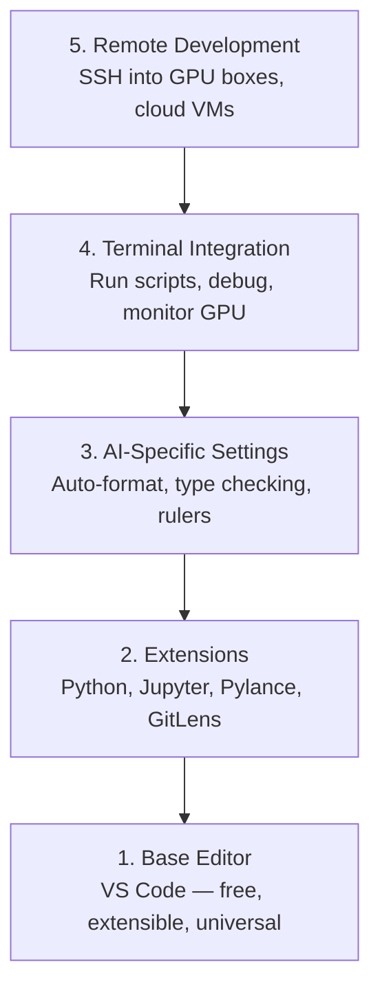

# Thiết lập trình biên tập

> Thư biên tập của bạn là phi công đồng hành của bạn, hãy cấu hình nó một lần để nó không cản đường bạn và bắt đầu kéo trọng lượng của nó.

**Type:** Build
**Languages:** --
**Prerequisites:** Phase 0, Lesson 01
**Time:** ~20 minutes

## Mục tiêu học tập

- Lắp đặt VS Code với các phần mở rộng thiết yếu cho Python, Jupyter, linting và SSH từ xa
- Thiết lập định dạng trên lưu, kiểm tra kiểu và cuộn sản xuất notebook cho các workflow AI
- Thiết lập Remote SSH để chỉnh sửa và gỡ lỗi mã trên máy GPU từ xa như thể chúng là địa phương
- Đánh giá các lựa chọn thay thế của biên tập viên (Cursor, Windsurf, Neovim) và sự thỏa hiệp của chúng cho công việc AI

## Vấn đề

Bạn sẽ dành hàng ngàn giờ trong biên tập viên của mình viết Python, chạy sổ ghi chép, gỡ lỗi vòng đào tạo và SSH vào các hộp GPU. Một biên tập viên không được cấu hình đúng cách biến mỗi phiên thành chi phối: không hoàn thành tự động, không có gợi ý kiểu chữ, không có lỗi đường thẳng, định dạng thủ công và một dòng công việc cuối cùng khó xử lý.

Việc thiết lập đúng cách mất 20 phút, bỏ qua nó sẽ tốn 20 phút mỗi ngày.

## Khái niệm

Một thiết lập biên tập kỹ thuật AI cần năm điều:



```figure
s0-lsp-roundtrip
```

## Hãy xây dựng nó

### Bước 1: Lắp đặt mã VS

VS Code là trình chỉnh sửa được khuyến cáo. Nó miễn phí, chạy trên mọi hệ điều hành, có hỗ trợ máy tính xách tay Jupyter hạng nhất, và hệ sinh thái mở rộng bao gồm tất cả mọi thứ bạn cần cho công việc AI.

Tải nó từ [code.visualstudio.com](https://code.visualstudio.com/)- Tôi không biết.

Kiểm tra từ đầu cuối:

```bash
code --version
```

Nếu`code`không được tìm thấy trên macOS, mở VS Code, nhấn `Cmd+Shift+P`, gõ "Shell Command", và chọn "Install 'code' command in PATH".

### Bước 2: Lắp đặt các tiện ích mở rộng cần thiết

Mở đầu cuối tích hợp trong mã VS (`` Ctrl+``` trên mọi nền tảng) và cài đặt các phần mở rộng quan trọng cho công việc AI:

```bash
code --install-extension ms-python.python
code --install-extension ms-python.vscode-pylance
code --install-extension ms-toolsai.jupyter
code --install-extension eamodio.gitlens
code --install-extension ms-vscode-remote.remote-ssh
code --install-extension ms-python.debugpy
code --install-extension ms-python.black-formatter
code --install-extension charliermarsh.ruff
```

Mỗi người làm gì:

| Extension | Why |
|-----------|-----|
| Python | Language support, virtual env detection, run/debug |
| Pylance | Fast type checking, autocomplete, import resolution |
| Jupyter | Run notebooks inside VS Code, variable explorer |
| GitLens | See who changed what, inline git blame |
| Remote SSH | Open a folder on a remote GPU box as if it were local |
| Debugpy | Step-through debugging for Python |
| Black Formatter | Auto-format on save, consistent style |
| Ruff | Fast linting, catches common mistakes |

Lưu tập`code/.vscode/extensions.json`trong bài học này chứa danh sách khuyến nghị đầy đủ. Khi bạn mở thư mục dự án, VS Code sẽ yêu cầu bạn cài đặt chúng.

### Bước 3: Cài đặt cài đặt

Tải lại cài đặt từ `code/.vscode/settings.json`trong bài học này, hoặc áp dụng chúng bằng tay qua `Settings > Open Settings (JSON)`- Tôi không biết.

Các thiết lập chính cho công việc AI:

```jsonc
{
    "python.analysis.typeCheckingMode": "basic",
    "editor.formatOnSave": true,
    "editor.rulers": [88, 120],
    "notebook.output.scrolling": true,
    "files.autoSave": "afterDelay"
}
```

Tại sao chúng quan trọng:

- **Type checking on basic**: Nhận sai các loại lập luận trước khi bạn chạy. Giữ thời gian gỡ lỗi trên các sự không phù hợp hình dạng tensor và các tham số API sai.
- **Format on save**Đừng bao giờ nghĩ về định dạng nữa.
- **Rulers at 88 and 120**: Mở màu đen ở 88. Các dấu hiệu 120 cho thấy khi các chuỗi tài liệu và bình luận đang trở nên quá dài.
- **Notebook output scrolling**: Các vòng huấn luyện in hàng ngàn dòng.
- **Auto-save**: Bạn sẽ quên lưu. kịch bản huấn luyện của bạn sẽ chạy mã lỗi thời. tự động lưu ngăn chặn điều đó.

### Bước 4: Kết hợp đầu cuối

Các kết nối kết nối của VS Code là nơi bạn chạy các kịch bản đào tạo, giám sát GPU, và quản lý môi trường.

Đặt nó đúng cách:

```jsonc
{
    "terminal.integrated.defaultProfile.osx": "zsh",
    "terminal.integrated.defaultProfile.linux": "bash",
    "terminal.integrated.fontSize": 13,
    "terminal.integrated.scrollback": 10000
}
```

Các đường tắt hữu ích:

| Action | macOS | Linux/Windows |
|--------|-------|---------------|
| Toggle terminal | `` Ctrl+` `` | `` Ctrl+` `` |
| New terminal | `` Ctrl+Shift+` `` | `` Ctrl+Shift+` `` |
| Split terminal | `Cmd+\` | `Ctrl+Shift+5` |

Các thiết bị kết thúc chia sẻ hữu ích: một để chạy kịch bản của bạn, một để theo dõi GPU với `nvidia-smi -l 1`hoặc `watch -n 1 nvidia-smi`- Tôi không biết.

### Bước 5: Phát triển từ xa (SSH vào GPU Box)

Đây là phần mở rộng quan trọng nhất cho công việc AI. Bạn sẽ chạy đào tạo trên máy tính từ xa (hình máy ảo đám mây, máy chủ phòng thí nghiệm, Lambda, Vast.ai). Remote SSH cho phép bạn mở hệ thống tập tin từ xa, chỉnh sửa tập tin, chạy các thiết bị kết thúc và gỡ lỗi như thể mọi thứ đều là địa phương.

Thiết lập:

1. Thiết lập phần mở rộng SSH từ xa (được thực hiện trong bước 2).
2. Báo `Ctrl+Shift+P`(hoặc `Cmd+Shift+P`), nhập "Remote-SSH: Connect to Host".
3. Nhập vào`user@your-gpu-box-ip`- Tôi không biết.
4. VS Code cài đặt thành phần máy chủ của nó trên máy từ xa tự động.

Để truy cập không mật khẩu, thiết lập khóa SSH:

```bash
ssh-keygen -t ed25519 -C "your-email@example.com"
ssh-copy-id user@your-gpu-box-ip
```

Thêm host vào `~/.ssh/config`Để thuận tiện:

```
Host gpu-box
    HostName 203.0.113.50
    User ubuntu
    IdentityFile ~/.ssh/id_ed25519
    ForwardAgent yes
```

Giờ thì`Remote-SSH: Connect to Host > gpu-box`kết nối ngay lập tức.

## Các lựa chọn thay thế

### Cursor

[cursor.com](https://cursor.com)là một chiếc vc code fork với bộ tạo mã AI tích hợp. Nó sử dụng cùng một hệ sinh thái mở rộng và định dạng cài đặt. Nếu bạn sử dụng cursor, tất cả mọi thứ trong bài học này vẫn áp dụng. nhập cùng `settings.json`và `extensions.json`- Tôi không biết.

### Windsurf

[windsurf.com](https://windsurf.com)là một cái khác của AI đầu tiên VS Code fork. cùng một câu chuyện: cùng một phần mở rộng, cùng một định dạng cài đặt, cùng một hỗ trợ Remote SSH.

### Vim/Neovim

Nếu bạn đã sử dụng Vim hoặc Neovim và có năng suất trong nó, hãy ở lại đó.

- **pyright**hoặc **pylsp**cho kiểm tra loại (via Mason hoặc cài đặt thủ công)
- **nvim-lspconfig**cho việc tích hợp máy chủ ngôn ngữ
- **jupyter-vim**hoặc **molten-nvim**cho việc thực hiện giống như sổ ghi chép
- **telescope.nvim**cho tìm kiếm tệp/chữ liệu
- **none-ls.nvim**Với màu đen và ruff để định dạng/linting

Nếu bạn chưa sử dụng Vim, đừng bắt đầu ngay bây giờ. cong học sẽ cạnh tranh với việc học kỹ thuật AI. Sử dụng VS Code.

## Sử dụng nó

Với thiết lập này, dòng công việc hàng ngày của bạn sẽ trông như:

1. Mở thư mục dự án trong VS Code (hoặc kết nối qua Remote SSH với một hộp GPU).
2. Viết Python trong trình chỉnh sửa với tự hoàn thành, gợi ý đánh dấu và lỗi trong dòng.
3. Đưa sổ ghi chép Jupyter theo chiều dài của Jupyter.
4. Sử dụng thiết bị kết hợp để viết kịch bản đào tạo,`uv pip install`, và giám sát GPU.
5. Xem lại các thay đổi với GitLens trước khi cam kết.

## Các bài tập

1. Lắp đặt mã VS và tất cả các tiện ích mở rộng được liệt kê trong bước 2
2. Tải lại `settings.json`từ bài học này vào cấu hình VS Code của bạn
3. Mở một tệp Python và xác minh rằng Pylance hiển thị các gợi ý kiểu và định dạng đen trên lưu
4. Nếu bạn có quyền truy cập vào máy tính từ xa, thiết lập Remote SSH và mở một thư mục trên nó

## Các điều khoản chính

| Term | What people say | What it actually means |
|------|----------------|----------------------|
| LSP | "Autocomplete engine" | Language Server Protocol: a standard for editors to get type info, completions, and diagnostics from a language-specific server |
| Pylance | "The Python plugin" | Microsoft's Python language server using Pyright for type checking and IntelliSense |
| Remote SSH | "Working on the server" | VS Code extension that runs a lightweight server on a remote machine and streams the UI to your local editor |
| Format on save | "Auto-prettier" | The editor runs a formatter (Black, Ruff) every time you save, so code style is always consistent |
