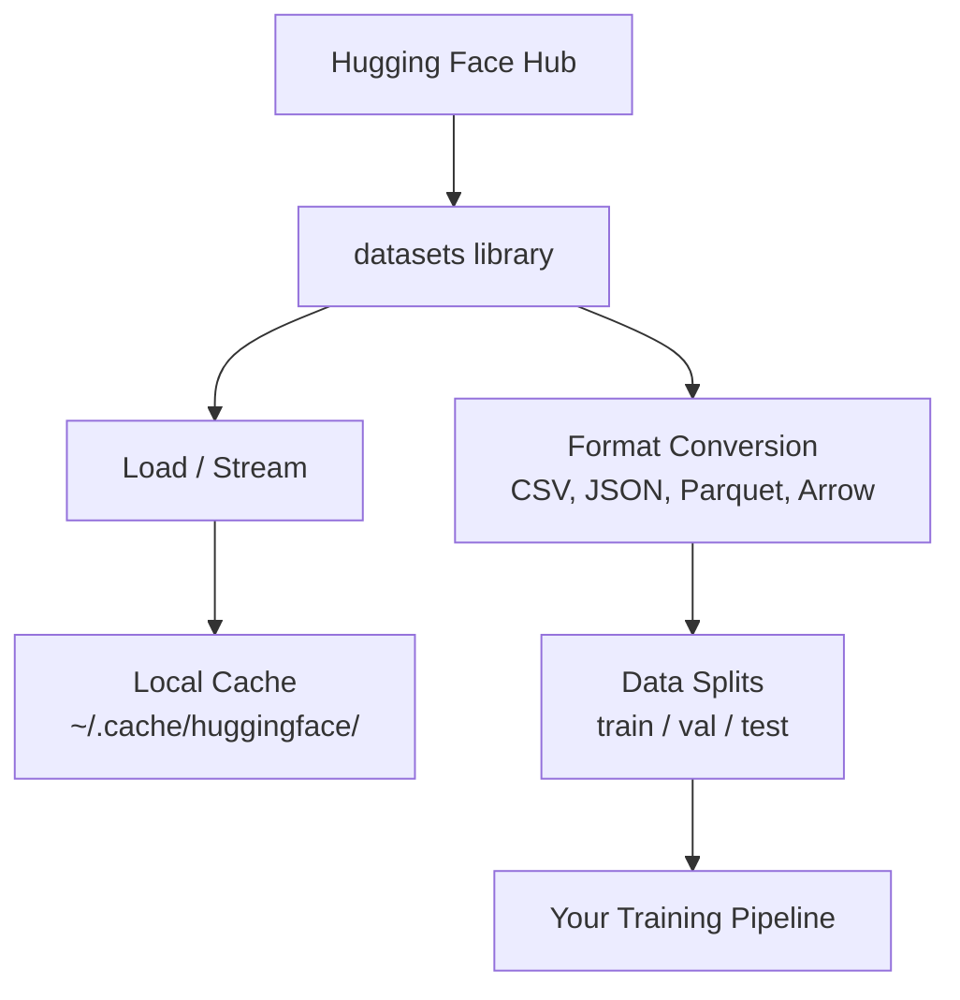

# Quản lý dữ liệu

> Dữ liệu là nhiên liệu, cách bạn quản lý nó sẽ quyết định tốc độ của bạn.

**Type:** Build
**Language:**Python
**Prerequisites:** Phase 0, Lesson 01
**Time:** ~45 minutes

## Mục tiêu học tập

- Load, stream, và cache tập dữ liệu bằng cách sử dụng Hugging Face `datasets`thư viện
- Chuyển đổi giữa các định dạng CSV, JSON, Parquet và Arrow và giải thích các thỏa thuận của chúng
- Tạo các phân chia có thể tái tạo được bằng tàu/bảo hợp/bảo nghiệm với hạt ngẫu nhiên cố định
- Quản lý các tập tin mô hình lớn và tập tin dữ liệu bằng cách sử dụng `.gitignore`, Git LFS, hoặc DVC

## Vấn đề

Mỗi dự án AI bắt đầu với dữ liệu. Bạn cần tìm tập dữ liệu, tải xuống chúng, chuyển đổi giữa các định dạng, chia chúng để đào tạo và đánh giá, và phiên bản chúng để các thí nghiệm có thể tái tạo. Làm điều này bằng tay mỗi lần là chậm và dễ mắc lỗi. Bạn cần một dòng công việc lặp lại.

## Khái niệm



Mặt ôm `datasets`thư viện là cách chuẩn để tải dữ liệu cho công việc AI. Nó xử lý tải xuống, lưu trữ trước, chuyển đổi định dạng và phát trực tuyến ra khỏi hộp.

```figure
s0-data-pipeline
```

## Hãy xây dựng nó

### Bước 1: Lắp đặt thư viện tập dữ liệu

```bash
pip install datasets huggingface_hub
```

### Bước 2: Lắp đặt một bộ dữ liệu

```python
from datasets import load_dataset

dataset = load_dataset("stanfordnlp/imdb")
print(dataset)
print(dataset["train"][0])
```

Điều này tải xuống bộ dữ liệu xem phim IMDB. Sau khi tải xuống đầu tiên, nó tải từ bộ nhớ cache tại `~/.cache/huggingface/datasets/`- Tôi không biết.

### Bước 3: Tạo dòng dữ liệu lớn

Một số bộ dữ liệu quá lớn để chứa trên đĩa. Streaming tải chúng hàng xét mà không tải toàn bộ.

```python
dataset = load_dataset("wikimedia/wikipedia", "20220301.en", split="train", streaming=True)

for i, example in enumerate(dataset):
    print(example["title"])
    if i >= 4:
        break
```

Streaming cho bạn một `IterableDataset`Bạn xử lý các hàng khi chúng đến. Sử dụng bộ nhớ vẫn không đổi bất kể kích thước tập dữ liệu.

### Bước 4: Các định dạng tập dữ liệu

- `datasets`thư viện sử dụng Apache Arrow dưới nắp. Bạn có thể chuyển đổi sang các định dạng khác tùy thuộc vào nhu cầu của đường ống của bạn.

```python
dataset = load_dataset("stanfordnlp/imdb", split="train")

dataset.to_csv("imdb_train.csv")
dataset.to_json("imdb_train.json")
dataset.to_parquet("imdb_train.parquet")
```

So sánh định dạng:

| Format | Size | Read Speed | Best For |
|--------|------|-----------|----------|
| CSV | Large | Slow | Human readability, spreadsheets |
| JSON | Large | Slow | APIs, nested data |
| Parquet | Small | Fast | Analytics, columnar queries |
| Arrow | Small | Fastest | In-memory processing (what `datasets` uses internally) |

Đối với công việc AI, Parquet là định dạng lưu trữ tốt nhất. Arrow là những gì bạn làm việc với trong bộ nhớ. CSV và JSON là cho trao đổi.

### Bước 5: chia dữ liệu

Mỗi dự án ML cần ba phân chia:

- **Train**: Mô hình học hỏi từ điều này (thường là 80%)
- **Validation**Bạn kiểm tra tiến bộ trong quá trình đào tạo (thường là 10%)
- **Test**: Đánh giá cuối cùng sau khi đào tạo được hoàn thành (thường là 10%)

Một số bộ dữ liệu được chia trước khi được chia, khi không chia, hãy tự chia chúng:

```python
dataset = load_dataset("stanfordnlp/imdb", split="train")

split = dataset.train_test_split(test_size=0.2, seed=42)
train_val = split["train"].train_test_split(test_size=0.125, seed=42)

train_ds = train_val["train"]
val_ds = train_val["test"]
test_ds = split["test"]

print(f"Train: {len(train_ds)}, Val: {len(val_ds)}, Test: {len(test_ds)}")
```

Luôn đặt hạt giống để tái sinh.

### Bước 6: Tải và cache mô hình

Các mô hình là các tập tin lớn.`huggingface_hub`thư viện xử lý tải xuống và lưu trữ.

```python
from huggingface_hub import hf_hub_download, snapshot_download

model_path = hf_hub_download(
    repo_id="sentence-transformers/all-MiniLM-L6-v2",
    filename="config.json"
)
print(f"Cached at: {model_path}")

model_dir = snapshot_download("sentence-transformers/all-MiniLM-L6-v2")
print(f"Full model at: {model_dir}")
```

Các mô hình cache đến `~/.cache/huggingface/hub/`Một khi tải xuống, chúng sẽ tải ngay vào các lần chạy tiếp theo.

### Bước 7: xử lý các tệp lớn

Các trọng lượng mô hình và tập dữ liệu lớn không nên đi vào git. Ba tùy chọn:

**Option A: .gitignore (simplest)**

```
*.bin
*.safetensors
*.pt
*.onnx
data/*.parquet
data/*.csv
models/
```

**Option B: Git LFS (track large files in git)**

```bash
git lfs install
git lfs track "*.bin"
git lfs track "*.safetensors"
git add .gitattributes
```

Git LFS lưu trữ các chỉ dẫn trong repo của bạn và các tệp thực tế trên một máy chủ riêng biệt. GitHub cung cấp cho bạn 1 GB miễn phí.

**Option C: DVC (data version control)**

```bash
pip install dvc
dvc init
dvc add data/training_set.parquet
git add data/training_set.parquet.dvc data/.gitignore
git commit -m "Track training data with DVC"
```

DVC tạo ra nhỏ `.dvc`dữ liệu tự sống trong S3, GCS, hoặc một phần lưu trữ từ xa khác.

| Approach | Complexity | Best For |
|----------|-----------|----------|
| .gitignore | Low | Personal projects, downloaded data you can re-fetch |
| Git LFS | Medium | Teams sharing model weights via git |
| DVC | High | Reproducible experiments, large datasets, teams |

Đối với khóa học này,`.gitignore`Sử dụng DVC khi bạn cần tái tạo các thí nghiệm chính xác trên máy.

### Bước 8: Các mẫu lưu trữ

**Local storage**HF cache xử lý điều này tự động.

**Cloud storage**là cho bất cứ thứ gì lớn hơn hoặc được chia sẻ giữa các máy:

```python
import os

local_path = os.path.expanduser("~/.cache/huggingface/datasets/")

# s3_path = "s3://my-bucket/datasets/"
# gcs_path = "gs://my-bucket/datasets/"
```

DVC tích hợp trực tiếp với S3 và GCS:

```bash
dvc remote add -d myremote s3://my-bucket/dvc-store
dvc push
```

Đối với khóa học này, lưu trữ địa phương là đủ. lưu trữ đám mây trở nên có liên quan khi bạn tinh chỉnh trên các phiên bản GPU từ xa.

## Các bộ dữ liệu được sử dụng trong khóa học này

| Dataset | Lessons | Size | What It Teaches |
|---------|---------|------|----------------|
| IMDB | Tokenization, classification | 84 MB | Text classification basics |
| WikiText | Language modeling | 181 MB | Next-token prediction |
| SQuAD | QA systems | 35 MB | Question answering, spans |
| Common Crawl (subset) | Embeddings | Varies | Large-scale text processing |
| MNIST | Vision basics | 21 MB | Image classification fundamentals |
| COCO (subset) | Multimodal | Varies | Image-text pairs |

Bạn không cần phải tải tất cả các bài học này ra ngay bây giờ.

## Sử dụng nó

Dạy kịch bản tiện ích để xác minh mọi thứ hoạt động:

```bash
python code/data_utils.py
```

Nó tải xuống một tập dữ liệu nhỏ, chuyển đổi nó, chia nó, và in một bản tóm tắt.

## Chuyển nó

Bài học này mang lại:
- `code/data_utils.py`- tiện ích tải dữ liệu và lưu trữ nhớ cache có thể được sử dụng lại
- `outputs/prompt-data-helper.md`- nhanh chóng để tìm ra bộ dữ liệu phù hợp cho một nhiệm vụ

## Các bài tập

1. Lắp `glue`bộ dữ liệu với `mrpc`cấu hình và kiểm tra 5 ví dụ đầu tiên
2. Chuyển `c4`tập dữ liệu và đếm bao nhiêu ví dụ bạn có thể xử lý trong 10 giây
3. Chuyển đổi một tập dữ liệu thành Parquet và so sánh kích thước tập tin với CSV
4. Tạo một phân chia đường sắt/val/test 70/15/15 với hạt cố định và xác minh kích thước

## Các điều khoản chính

| Term | What people say | What it actually means |
|------|----------------|----------------------|
| Dataset split | "Training data" | A named subset (train/val/test) used at different stages of the ML lifecycle |
| Streaming | "Load it lazily" | Processing data row by row from a remote source without downloading the full dataset |
| Parquet | "Compressed CSV" | A columnar file format optimized for analytical queries and storage efficiency |
| Arrow | "Fast dataframe" | An in-memory columnar format used internally by the datasets library for zero-copy reads |
| Git LFS | "Git for big files" | An extension that stores large files outside the git repo while keeping pointers in version control |
| DVC | "Git for data" | A version control system for datasets and models that integrates with cloud storage |
| Cache | "Already downloaded" | A local copy of previously fetched data, stored at ~/.cache/huggingface/ by default |
