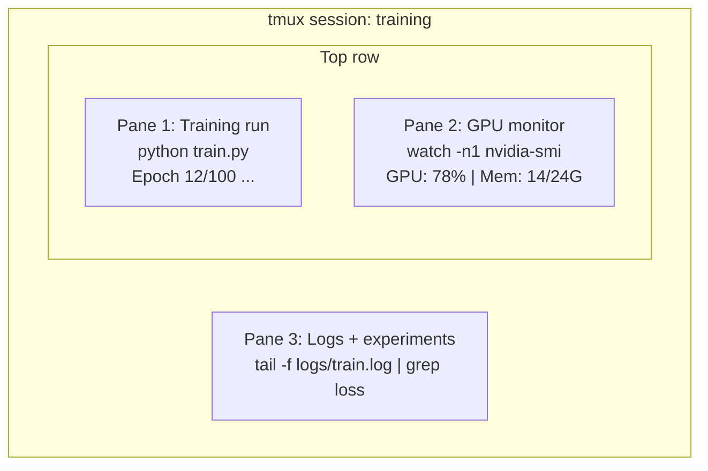

# Terminal & Shell

> Điểm cuối là nơi các kỹ sư AI sống.

**Type:** Learn
**Languages:** --
**Prerequisites:** Phase 0, Lesson 01
**Time:** ~35 minutes

## Mục tiêu học tập

- Sử dụng ống dẫn, chuyển hướng, và `grep`để lọc và xử lý nhật ký đào tạo từ dòng lệnh
- Tạo các phiên tmux liên tục với nhiều bảng để đào tạo đồng thời và giám sát GPU
- Kiểm tra hệ thống và các nguồn lực GPU với `htop`- `nvtop`, và`nvidia-smi`
- Chuyển tập tin giữa máy tính địa phương và từ xa sử dụng SSH, `scp`, và`rsync`

## Vấn đề

Bạn sẽ dành nhiều thời gian hơn trong thiết bị kết thúc hơn trong bất kỳ trình chỉnh sửa nào. Cấp hoạt động, giám sát GPU, theo dõi nhật ký, các phiên SSH từ xa, quản lý môi trường. Mỗi dòng công việc AI chạm vào vỏ. Nếu bạn chậm ở đây, bạn chậm ở khắp mọi nơi.

Bài học này bao gồm các kỹ năng cuối cùng quan trọng cho công việc AI không có lịch sử của Unix không có sâu vào Bash scripting chỉ là những gì bạn cần

## Khái niệm



Ba thứ chạy cùng một lúc, một thiết bị, bạn có thể tách ra, về nhà, SSH trở lại, và gắn lại.

```figure
s0-shell-pipeline
```

## Hãy xây dựng nó

### Bước 1: Biết được vỏ của bạn

Hãy kiểm tra con đạn nào mà bạn đang chạy:

```bash
echo $SHELL
```

Hầu hết các hệ thống sử dụng `bash`hoặc `zsh`Cả hai đều hoạt động tốt.

Những điều quan trọng cần biết:

```bash
# Move around
cd ~/projects/ai-engineering-from-scratch
pwd
ls -la

# History search (most useful shortcut you'll learn)
# Ctrl+R then type part of a previous command
# Press Ctrl+R again to cycle through matches

# Clear terminal
clear   # or Ctrl+L

# Cancel a running command
# Ctrl+C

# Suspend a running command (resume with fg)
# Ctrl+Z
```

### Bước 2: Đường ống và chuyển hướng

Đường ống kết nối các lệnh với nhau. Đây là cách bạn xử lý nhật ký, đầu ra bộ lọc và các công cụ chuỗi. Bạn sẽ sử dụng nó liên tục.

```bash
# Count how many times "loss" appears in a log
cat train.log | grep "loss" | wc -l

# Extract just the loss values from training output
grep "loss:" train.log | awk '{print $NF}' > losses.txt

# Watch a log file update in real time, filtering for errors
tail -f train.log | grep --line-buffered "ERROR"

# Sort experiments by final accuracy
grep "final_accuracy" results/*.log | sort -t= -k2 -n -r

# Redirect stdout and stderr to separate files
python train.py > output.log 2> errors.log

# Redirect both to the same file
python train.py > train_full.log 2>&1
```

Ba chuyển hướng bạn cần:

| Symbol | What it does |
|--------|-------------|
| `>` | Write stdout to file (overwrite) |
| `>>` | Append stdout to file |
| `2>` | Write stderr to file |
| `2>&1` | Send stderr to same place as stdout |
| `\|` | Send stdout of one command as stdin to the next |

### Bước 3: Các quy trình nền

Việc tập luyện mất nhiều giờ, bạn không muốn giữ máy bay mở suốt thời gian.

```bash
# Run in background (output still goes to terminal)
python train.py &

# Run in background, immune to hangup (closing terminal won't kill it)
nohup python train.py > train.log 2>&1 &

# Check what's running in background
jobs
ps aux | grep train.py

# Bring a background job to foreground
fg %1

# Kill a background process
kill %1
# or find its PID and kill that
kill $(pgrep -f "train.py")
```

Sự khác biệt giữa `&`- `nohup`, và`screen`- Không.`tmux`- Có thể là:

| Method | Survives terminal close? | Can reattach? |
|--------|-------------------------|---------------|
| `command &` | No | No |
| `nohup command &` | Yes | No (check log file) |
| `screen` / `tmux` | Yes | Yes |

Trong bất cứ điều gì dài hơn vài phút, sử dụng tmux.

### Bước 4: tmux

tmux cho phép bạn tạo các phiên kết thúc liên tục với nhiều bảng. Đây là công cụ đơn giản hữu ích nhất để quản lý các cuộc chạy đào tạo.

```bash
# Install
# macOS
brew install tmux
# Ubuntu
sudo apt install tmux

# Start a named session
tmux new -s training

# Split horizontally
# Ctrl+B then "

# Split vertically
# Ctrl+B then %

# Navigate between panes
# Ctrl+B then arrow keys

# Detach (session keeps running)
# Ctrl+B then d

# Reattach
tmux attach -t training

# List sessions
tmux ls

# Kill a session
tmux kill-session -t training
```

Một phiên quy trình công việc AI điển hình:

```bash
tmux new -s train

# Pane 1: start training
python train.py --epochs 100 --lr 1e-4

# Ctrl+B, " to split, then run GPU monitor
watch -n1 nvidia-smi

# Ctrl+B, % to split vertically, tail the logs
tail -f logs/experiment.log

# Now detach with Ctrl+B, d
# SSH out, go get coffee, come back
# tmux attach -t train
```

### Bước 5: Giám sát bằng htop và nvtop

```bash
# System processes (better than top)
htop

# GPU processes (if you have NVIDIA GPU)
# Install: sudo apt install nvtop (Ubuntu) or brew install nvtop (macOS)
nvtop

# Quick GPU check without nvtop
nvidia-smi

# Watch GPU usage update every second
watch -n1 nvidia-smi

# See which processes are using the GPU
nvidia-smi --query-compute-apps=pid,name,used_memory --format=csv
```

`htop`Các nút khóa bạn sẽ sử dụng:
- `F6`hoặc `>`để sắp xếp theo cột (định dạng theo bộ nhớ để tìm các lỗ hổng bộ nhớ)
- `F5`để chuyển đổi khung hình cây (xem quy trình trẻ em)
- `F9`để tiêu diệt một quá trình
- `/`để tìm kiếm tên của quy trình

### Bước 6: SSH cho các hộp GPU từ xa

Khi bạn thuê một GPU đám mây (Lambda, RunPod, Vast.ai), bạn kết nối qua SSH.

```bash
# Basic connection
ssh user@gpu-box-ip

# With a specific key
ssh -i ~/.ssh/my_gpu_key user@gpu-box-ip

# Copy files to remote
scp model.pt user@gpu-box-ip:~/models/

# Copy files from remote
scp user@gpu-box-ip:~/results/metrics.json ./

# Sync a whole directory (faster for many files)
rsync -avz ./data/ user@gpu-box-ip:~/data/

# Port forward (access remote Jupyter/TensorBoard locally)
ssh -L 8888:localhost:8888 user@gpu-box-ip
# Now open localhost:8888 in your browser

# SSH config for convenience
# Add to ~/.ssh/config:
# Host gpu
#     HostName 192.168.1.100
#     User ubuntu
#     IdentityFile ~/.ssh/gpu_key
#
# Then just:
# ssh gpu
```

### Bước 7: Tên đếm hữu ích cho công việc AI

Thêm những thứ này vào `~/.bashrc`hoặc `~/.zshrc`- Có thể là:

```bash
source phases/00-setup-and-tooling/10-terminal-and-shell/code/shell_aliases.sh
```

Hoặc sao chép những gì bạn muốn.

```bash
# GPU status at a glance
alias gpu='nvidia-smi --query-gpu=index,name,utilization.gpu,memory.used,memory.total,temperature.gpu --format=csv,noheader'

# Kill all Python training processes
alias killtraining='pkill -f "python.*train"'

# Quick virtual environment activate
alias ae='source .venv/bin/activate'

# Watch training loss
alias watchloss='tail -f logs/*.log | grep --line-buffered "loss"'
```

Nhìn xem`code/shell_aliases.sh`cho toàn bộ bộ.

### Bước 8: Các mô hình cuối AI phổ biến

Những điều này xuất hiện nhiều lần trong thực tế:

```bash
# Run training, log everything, notify when done
python train.py 2>&1 | tee train.log; echo "DONE" | mail -s "Training complete" you@email.com

# Compare two experiment logs side by side
diff <(grep "accuracy" exp1.log) <(grep "accuracy" exp2.log)

# Find the largest model files (clean up disk space)
find . -name "*.pt" -o -name "*.safetensors" | xargs du -h | sort -rh | head -20

# Download a model from Hugging Face
wget https://huggingface.co/model/resolve/main/model.safetensors

# Untar a dataset
tar xzf dataset.tar.gz -C ./data/

# Count lines in all Python files (see how big your project is)
find . -name "*.py" | xargs wc -l | tail -1

# Check disk space (training data fills disks fast)
df -h
du -sh ./data/*

# Environment variable check before training
env | grep -i cuda
env | grep -i torch
```

## Sử dụng nó

Đây là khi mỗi công cụ được chơi trong khóa học này:

| Tool | When you use it |
|------|----------------|
| tmux | Every training run (Phases 3+) |
| `tail -f` + `grep` | Monitoring training logs |
| `nohup` / `&` | Quick background tasks |
| `htop` / `nvtop` | Debugging slow training, OOM errors |
| SSH + `rsync` | Working on cloud GPUs |
| Piping + redirects | Processing experiment results |
| Aliases | Saving time on repetitive commands |

## Các bài tập

1. Thiết lập tmux, tạo một phiên với ba tấm, và chạy `htop`trong một,`watch -n1 date`trong một script khác, và một script Python trong thứ ba.
2. Thêm tên đằng sau `code/shell_aliases.sh`để cấu hình và tải lại với `source ~/.zshrc`(hoặc `~/.bashrc`().
3. Tạo một nhật ký đào tạo giả với `for i in $(seq 1 100); do echo "epoch $i loss: $(echo "scale=4; 1/$i" | bc)"; sleep 0.1; done > fake_train.log`và sau đó sử dụng `grep`- `tail`, và`awk`để lấy chỉ các giá trị mất mát.
4. Thiết lập mục cấu hình SSH cho một máy chủ mà bạn có quyền truy cập (hoặc sử dụng `localhost`để thực hành ngữ pháp).

## Các điều khoản chính

| Term | What people say | What it actually means |
|------|----------------|----------------------|
| Shell | "The terminal" | The program that interprets your commands (bash, zsh, fish) |
| tmux | "Terminal multiplexer" | A program that lets you run multiple terminal sessions inside one window, and detach/reattach |
| Pipe | "The bar thing" | The `\|` operator that sends one command's output as input to another |
| PID | "Process ID" | A unique number assigned to every running process, used to monitor or kill it |
| nohup | "No hangup" | Runs a command immune to the hangup signal, so closing the terminal won't kill it |
| SSH | "Connecting to the server" | Secure Shell, an encrypted protocol for running commands on a remote machine |
