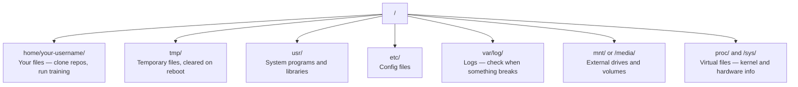

# Linux cho AI

> Hầu hết AI chạy trên Linux. Bạn cần biết đủ để không bị kẹt.

**Type:** Learn
**Languages:** --
**Prerequisites:** Phase 0, Lesson 01
**Time:** ~30 minutes

## Mục tiêu học tập

- Di chuyển hệ thống tệp Linux và thực hiện các hoạt động tệp thiết yếu từ dòng lệnh
- Quản lý quyền tập tin với `chmod`và `chown`để khắc phục lỗi "Phán phép bị từ chối"
- Lắp đặt các gói hệ thống với `apt`và thiết lập một hộp GPU mới cho công việc AI
- Xác định sự khác biệt giữa macOS và Linux thường khiến các nhà phát triển làm việc trên máy tính từ xa bị cản trở

## Vấn đề

Bạn phát triển trên macOS hoặc Windows. Nhưng ngay khi bạn SSH vào một hộp GPU đám mây, thuê một phiên bản Lambda, hoặc quay một máy EC2, bạn hạ cánh vào Ubuntu. Điểm kết nối là giao diện duy nhất của bạn. Không có Finder, không có Explorer, không có GUI. Nếu bạn không thể điều hướng hệ thống tệp, cài đặt gói và quản lý các quy trình từ dòng lệnh, bạn bị mắc kẹt trả tiền cho giờ GPU vô hiệu trong khi tìm kiếm "cách mở khóa tệp trong Linux".

Đây là hướng dẫn sống sót. Nó bao gồm chính xác những gì bạn cần để vận hành trên một máy Linux từ xa để làm việc AI. Không có gì hơn.

## Layout hệ thống tập tin

Linux sắp xếp mọi thứ dưới một gốc `/`Không có.`C:\`hoặc `/Volumes`Những thư mục mà bạn sẽ chạm vào:



Thư mục nhà của anh là`~`hoặc `/home/your-username`Hầu như mọi thứ anh làm đều xảy ra ở đây.

## Những điều răn quan trọng

Đây là 15 lệnh bao gồm 95% những gì bạn sẽ làm trên một hộp GPU từ xa.

### Di chuyển xung quanh

```bash
pwd                         # Where am I?
ls                          # What's here?
ls -la                      # What's here, including hidden files with details?
cd /path/to/dir             # Go there
cd ~                        # Go home
cd ..                       # Go up one level
```

### Các tệp và thư mục

```bash
mkdir my-project            # Create a directory
mkdir -p a/b/c              # Create nested directories in one shot

cp file.txt backup.txt      # Copy a file
cp -r src/ src-backup/      # Copy a directory (recursive)

mv old.txt new.txt          # Rename a file
mv file.txt /tmp/           # Move a file

rm file.txt                 # Delete a file (no trash, it's gone)
rm -rf my-dir/              # Delete a directory and everything inside
```

`rm -rf`Không có sự hủy bỏ, hãy kiểm tra đường đi trước khi nhấn vào.

### Đọc tập tin

```bash
cat file.txt                # Print entire file
head -20 file.txt           # First 20 lines
tail -20 file.txt           # Last 20 lines
tail -f log.txt             # Follow a log file in real time (Ctrl+C to stop)
less file.txt               # Scroll through a file (q to quit)
```

### Tìm kiếm

```bash
grep "error" training.log           # Find lines containing "error"
grep -r "learning_rate" .           # Search all files in current directory
grep -i "cuda" config.yaml          # Case-insensitive search

find . -name "*.py"                 # Find all Python files under current dir
find . -name "*.ckpt" -size +1G     # Find checkpoint files larger than 1GB
```

## Giấy phép

Mỗi file trong Linux đều có một chủ sở hữu và các bit quyền. Bạn sẽ gặp nó khi các kịch bản không thể thực hiện hoặc bạn không thể viết vào thư mục.

```bash
ls -l train.py
# -rwxr-xr-- 1 user group 2048 Mar 19 10:00 train.py
#  ^^^             owner permissions: read, write, execute
#     ^^^          group permissions: read, execute
#        ^^        everyone else: read only
```

Các sửa chữa chung:

```bash
chmod +x train.sh           # Make a script executable
chmod 755 deploy.sh         # Owner: full, others: read+execute
chmod 644 config.yaml       # Owner: read+write, others: read only

chown user:group file.txt   # Change who owns a file (needs sudo)
```

Khi có gì đó nói "Giấy phép bị từ chối", thì hầu như luôn luôn là vấn đề về quyền phép. `chmod +x`hoặc `sudo`sẽ sửa chữa hầu hết các trường hợp.

## Quản lý gói (apt)

Ubuntu sử dụng `apt`Đây là cách bạn cài đặt phần mềm cấp hệ thống.

```bash
sudo apt update             # Refresh the package list (always do this first)
sudo apt install -y htop    # Install a package (-y skips confirmation)
sudo apt install -y build-essential  # C compiler, make, etc. Needed by many Python packages
sudo apt install -y tmux    # Terminal multiplexer (keep sessions alive after disconnect)

apt list --installed        # What's installed?
sudo apt remove htop        # Uninstall
```

Các gói thông thường bạn sẽ cài đặt trên một hộp GPU mới:

```bash
sudo apt update && sudo apt install -y \
    build-essential \
    git \
    curl \
    wget \
    tmux \
    htop \
    unzip \
    python3-venv
```

## Người dùng và sudo

Bạn thường đăng nhập như một người dùng thường xuyên. Một số hoạt động cần truy cập root (admin).

```bash
whoami                      # What user am I?
sudo command                # Run a single command as root
sudo su                     # Become root (exit to go back, use sparingly)
```

Trong các trường hợp GPU đám mây, bạn thường là người dùng duy nhất và đã có quyền truy cập sudo. Đừng chạy mọi thứ như root. Chỉ sử dụng sudo khi cần thiết.

## Các quy trình và hệ thống

Khi tập luyện của bạn bị treo, hoặc bạn cần kiểm tra điều gì đang diễn ra:

```bash
htop                        # Interactive process viewer (q to quit)
ps aux | grep python        # Find running Python processes
kill 12345                  # Gracefully stop process with PID 12345
kill -9 12345               # Force kill (use when graceful doesn't work)
nvidia-smi                  # GPU processes and memory usage
```

systemd quản lý dịch vụ (daemons nền). Bạn sẽ sử dụng nó nếu bạn chạy máy chủ suy luận:

```bash
sudo systemctl start nginx          # Start a service
sudo systemctl stop nginx           # Stop it
sudo systemctl restart nginx        # Restart it
sudo systemctl status nginx         # Check if it's running
sudo systemctl enable nginx         # Start automatically on boot
```

## Không gian đĩa

Các hộp GPU thường có không gian đĩa hạn chế. Các mô hình và tập hợp dữ liệu lấp đầy nó nhanh chóng.

```bash
df -h                       # Disk usage for all mounted drives
df -h /home                 # Disk usage for /home specifically

du -sh *                    # Size of each item in current directory
du -sh ~/.cache             # Size of your cache (pip, huggingface models land here)
du -sh /data/checkpoints/   # Check how big your checkpoints are

# Find the biggest space hogs
du -h --max-depth=1 / 2>/dev/null | sort -hr | head -20
```

Máy tiết kiệm không gian phổ biến:

```bash
# Clear pip cache
pip cache purge

# Clear apt cache
sudo apt clean

# Remove old checkpoints you don't need
rm -rf checkpoints/epoch_01/ checkpoints/epoch_02/
```

## Mạng lưới

Bạn sẽ tải xuống các mô hình, chuyển các tập tin, và nhấn API từ dòng lệnh.

```bash
# Download files
wget https://example.com/model.bin                   # Download a file
curl -O https://example.com/data.tar.gz              # Same thing with curl
curl -s https://api.example.com/health | python3 -m json.tool  # Hit an API, pretty-print JSON

# Transfer files between machines
scp model.bin user@remote:/data/                     # Copy file to remote machine
scp user@remote:/data/results.csv .                  # Copy file from remote to local
scp -r user@remote:/data/checkpoints/ ./local-dir/   # Copy directory

# Sync directories (faster than scp for large transfers, resumes on failure)
rsync -avz --progress ./data/ user@remote:/data/
rsync -avz --progress user@remote:/results/ ./results/
```

Sử dụng `rsync`- Đúng rồi.`scp`Nó chỉ chuyển đổi các byte thay đổi và xử lý các kết nối bị gián đoạn.

## Tớ muốn giữ cho Sessions sống

Khi bạn SSH vào một hộp từ xa, đóng laptop của bạn giết chết chạy tập luyện của bạn.

```bash
tmux new -s train           # Start a new session named "train"
# ... start your training, then:
# Ctrl+B, then D            # Detach (training keeps running)

tmux ls                     # List sessions
tmux attach -t train        # Reattach to session

# Inside tmux:
# Ctrl+B, then %            # Split pane vertically
# Ctrl+B, then "            # Split pane horizontally
# Ctrl+B, then arrow keys   # Switch between panes
```

Luôn làm việc huấn luyện trong Tmux.

## WSL2 cho người dùng Windows

Nếu bạn đang sử dụng Windows, WSL2 cung cấp cho bạn một môi trường Linux thực sự mà không cần khởi động kép.

```bash
# In PowerShell (admin)
wsl --install -d Ubuntu-24.04

# After restart, open Ubuntu from Start menu
sudo apt update && sudo apt upgrade -y
```

WSL2 chạy một lõi Linux thực sự. mọi thứ trong bài học này hoạt động bên trong nó.`/mnt/c/Users/YourName/`từ bên trong WSL.

GPU passthrough hoạt động với trình điều khiển NVIDIA được cài đặt trên Windows.

## Gotchas: macOS đến Linux

Những điều sẽ làm bạn ngã nếu bạn đến từ macOS:

| macOS | Linux | Notes |
|-------|-------|-------|
| `brew install` | `sudo apt install` | Different package names sometimes. `brew install htop` vs `sudo apt install htop` works the same, but `brew install readline` vs `sudo apt install libreadline-dev` does not. |
| `open file.txt` | `xdg-open file.txt` | But you won't have a GUI on a remote box. Use `cat` or `less`. |
| `pbcopy` / `pbpaste` | Not available | Pipe to/from clipboard doesn't exist over SSH. |
| `~/.zshrc` | `~/.bashrc` | macOS defaults to zsh. Most Linux servers use bash. |
| `/opt/homebrew/` | `/usr/bin/`, `/usr/local/bin/` | Binaries live in different places. |
| `sed -i '' 's/a/b/' file` | `sed -i 's/a/b/' file` | macOS sed needs an empty string after `-i`. Linux does not. |
| Case-insensitive filesystem | Case-sensitive filesystem | `Model.py` and `model.py` are two different files on Linux. |
| Line endings `\n` | Line endings `\n` | Same. But Windows uses `\r\n`, which breaks bash scripts. Run `dos2unix` to fix. |

## Thẻ tham chiếu nhanh

```
Navigation:     pwd, ls, cd, find
Files:          cp, mv, rm, mkdir, cat, head, tail, less
Search:         grep, find
Permissions:    chmod, chown, sudo
Packages:       apt update, apt install
Processes:      htop, ps, kill, nvidia-smi
Services:       systemctl start/stop/restart/status
Disk:           df -h, du -sh
Network:        curl, wget, scp, rsync
Sessions:       tmux new/attach/detach
```

```figure
s0-process-fork
```

## Các bài tập

1. SSH vào bất kỳ máy Linux nào (hoặc mở WSL2) và di chuyển đến thư mục chính của bạn.`touch`, sau đó liệt kê chúng với `ls -la`- Tôi không biết.
2. Thiết lập `htop`với apt, chạy nó, và xác định quá trình nào đang sử dụng bộ nhớ nhiều nhất.
3. Bắt đầu một buổi tập tmux, chạy `sleep 300`bên trong nó, tách ra, liệt kê các phiên, và gắn lại.
4. Sử dụng `df -h`để kiểm tra không gian đĩa có sẵn, sau đó sử dụng `du -sh ~/.cache/*`để tìm ra những gì đang chiếm chỗ trong kho lưu trữ của bạn.
5. Chuyển tập tin từ máy tính địa phương của bạn sang máy tính từ xa bằng cách sử dụng `scp`, sau đó thực hiện cùng một chuyển nhượng với `rsync`và so sánh kinh nghiệm.
