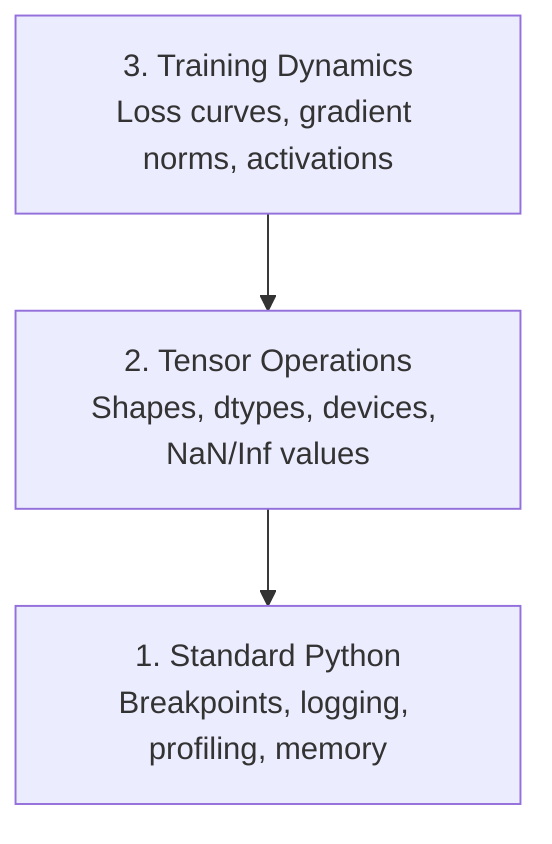

# Giải quyết lỗi và trình bày hồ sơ

> Những con bọ AI tồi tệ nhất không bị sập, chúng tập luyện lặng lẽ trên rác và báo cáo một đường cong mất mát đẹp.

**Type:** Build
**Language:**Python
**Prerequisites:** Lesson 1 (Dev Environment), basic PyTorch familiarity
**Time:** ~60 minutes

## Mục tiêu học tập

- Sử dụng điều kiện `breakpoint()`và `debug_print`để kiểm tra hình dạng tensor, dtypes và giá trị NaN giữa đào tạo
- Profile training loops với `cProfile`- `line_profiler`, và`tracemalloc`để tìm thấy những nút thắt chai
- Khám phá các lỗi AI phổ biến: sự không phù hợp hình dạng, mất NaN, rò rỉ dữ liệu và các tensor thiết bị sai
- Thiết lập TensorBoard để hiển thị đường cong mất mát, histogram trọng lượng và phân phối gradient

## Vấn đề

Mã AI thất bại khác với mã thông thường. Một ứng dụng web bị hỏng với một dấu vết hàng đống. Một vòng đào tạo không được cấu hình đúng chạy trong 8 giờ, đốt cháy 200 đô la trong thời gian GPU, và tạo ra một mô hình dự đoán trung bình của mỗi đầu vào. Mã không bao giờ sai. Bug là một tensor trên thiết bị sai, một lỗi bị lãng quên.`.detach()`, hoặc nhãn rò rỉ vào các tính năng.

Bạn cần các công cụ gỡ lỗi để phát hiện những lỗi âm thầm này trước khi chúng lãng phí thời gian và tính toán của bạn.

## Khái niệm

AI debugging hoạt động ở ba cấp độ:



Hầu hết mọi người nhảy thẳng lên cấp 3 (nghằm vào TensorBoard). Nhưng 80% lỗi AI sống ở cấp 1 và 2.

```figure
s0-flame-hot
```

## Hãy xây dựng nó

### Phần 1: Việc khắc phục lỗi in (Đúng, nó hoạt động)

Chế độ khắc phục lỗi được loại bỏ. Không nên. Đối với mã tensor, một lệnh in nhắm mục tiêu vượt qua một trình khắc phục lỗi bởi vì bạn cần phải xem hình dạng, kiểu dệt và phạm vi giá trị cùng một lúc.

```python
def debug_print(name, tensor):
    print(f"{name}: shape={tensor.shape}, dtype={tensor.dtype}, "
          f"device={tensor.device}, "
          f"min={tensor.min().item():.4f}, max={tensor.max().item():.4f}, "
          f"mean={tensor.mean().item():.4f}, "
          f"has_nan={tensor.isnan().any().item()}")
```

Hãy gọi cho tôi sau mỗi lần hoạt động đáng ngờ, và khi tìm thấy lỗi, hãy xóa dấu vân tay.

### Phần 2: Python Debugger (pdb và breakpoint)

Bộ xử lý lỗi được xây dựng trong là bị đánh giá thấp cho công việc AI.`breakpoint()`vào vòng huấn luyện của bạn và kiểm tra các tensor tương tác.

```python
def training_step(model, batch, criterion, optimizer):
    inputs, labels = batch
    outputs = model(inputs)
    loss = criterion(outputs, labels)

    if loss.item() > 100 or torch.isnan(loss):
        breakpoint()

    loss.backward()
    optimizer.step()
```

Khi debugger đưa bạn vào, lệnh hữu ích:

- `p outputs.shape`để kiểm tra hình dạng
- `p loss.item()`để xem giá trị mất mát
- `p torch.isnan(outputs).sum()`để đếm các NAN
- `p model.fc1.weight.grad`để kiểm tra độ nghiêng
- `c`tiếp tục,`q`để bỏ

Đây là điều kiện sửa lỗi, chỉ dừng lại khi có gì đó sai.

### Phần 3: Lập nhật Python

Thay thế các tuyên bố in bằng ghi nhật ký khi việc cố định vượt quá kiểm tra nhanh.

```python
import logging

logging.basicConfig(
    level=logging.INFO,
    format="%(asctime)s [%(levelname)s] %(message)s",
    handlers=[
        logging.FileHandler("training.log"),
        logging.StreamHandler()
    ]
)
logger = logging.getLogger(__name__)

logger.info("Starting training: lr=%.4f, batch_size=%d", lr, batch_size)
logger.warning("Loss spike detected: %.4f at step %d", loss.item(), step)
logger.error("NaN loss at step %d, stopping", step)
```

Việc ghi nhật ký cho bạn dấu thời gian, mức độ nghiêm trọng và đầu ra tệp. Khi một cuộc tập luyện thất bại vào 3 giờ sáng, bạn muốn một tệp ghi nhật ký, không phải đầu ra cuối bị quét ra khỏi màn hình.

### Phần 4: Các phần mã thời gian

Biết thời gian đi đâu là bước đầu tiên để tối ưu hóa.

```python
import time

class Timer:
    def __init__(self, name=""):
        self.name = name

    def __enter__(self):
        self.start = time.perf_counter()
        return self

    def __exit__(self, *args):
        elapsed = time.perf_counter() - self.start
        print(f"[{self.name}] {elapsed:.4f}s")

with Timer("data loading"):
    batch = next(dataloader_iter)

with Timer("forward pass"):
    outputs = model(batch)

with Timer("backward pass"):
    loss.backward()
```

Kết quả phổ biến: tải dữ liệu mất 60% thời gian đào tạo.`num_workers > 0`trong DataLoader của bạn, không phải là GPU nhanh hơn.

### Phần 5: cProfile và line_profiiler

Khi bạn cần nhiều hơn là bộ hẹn giờ thủ công:

```bash
python -m cProfile -s cumtime train.py
```

Đây cho thấy mỗi cuộc gọi hàm được sắp xếp theo thời gian tích lũy.

```bash
pip install line_profiler
```

```python
@profile
def train_step(model, data, target):
    output = model(data)
    loss = F.cross_entropy(output, target)
    loss.backward()
    return loss

# Run with: kernprof -l -v train.py
```

### Phần 6: Xét nghiệm trí nhớ

#### CPU Memory với tracemalloc

```python
import tracemalloc

tracemalloc.start()

# your code here
model = build_model()
data = load_dataset()

snapshot = tracemalloc.take_snapshot()
top_stats = snapshot.statistics("lineno")
for stat in top_stats[:10]:
    print(stat)
```

#### CPU Memory với memory_profiiler

```bash
pip install memory_profiler
```

```python
from memory_profiler import profile

@profile
def load_data():
    raw = read_csv("data.csv")       # watch memory jump here
    processed = preprocess(raw)       # and here
    return processed
```

Đi cùng `python -m memory_profiler your_script.py`để xem sử dụng bộ nhớ hàng dòng.

#### Bộ nhớ GPU với PyTorch

```python
import torch

if torch.cuda.is_available():
    print(torch.cuda.memory_summary())

    print(f"Allocated: {torch.cuda.memory_allocated() / 1e9:.2f} GB")
    print(f"Cached: {torch.cuda.memory_reserved() / 1e9:.2f} GB")
```

Khi bạn nhấn OOM (Out of Memory):

1. Giảm kích thước lô (điều đầu tiên phải thử, luôn luôn)
2. Sử dụng `torch.cuda.empty_cache()`để giải phóng bộ nhớ được lưu trữ trong cache
3. Sử dụng `del tensor`tiếp theo là `torch.cuda.empty_cache()`cho các sản phẩm trung gian lớn
4. Sử dụng độ chính xác hỗn hợp (`torch.cuda.amp`) để giảm một nửa sử dụng bộ nhớ
5. Sử dụng kiểm tra độ nghiêng cho các mô hình rất sâu

### Phần 7: Những con bọ AI phổ biến và cách bắt chúng

#### Sự không phù hợp hình dạng

Thằng quạ thường xuyên nhất.`[batch, features]`khi mô hình đang mong đợi `[batch, channels, height, width]`- Tôi không biết.

```python
def check_shapes(model, sample_input):
    print(f"Input: {sample_input.shape}")
    hooks = []

    def make_hook(name):
        def hook(module, inp, out):
            in_shape = inp[0].shape if isinstance(inp, tuple) else inp.shape
            out_shape = out.shape if hasattr(out, "shape") else type(out)
            print(f"  {name}: {in_shape} -> {out_shape}")
        return hook

    for name, module in model.named_modules():
        hooks.append(module.register_forward_hook(make_hook(name)))

    with torch.no_grad():
        model(sample_input)

    for h in hooks:
        h.remove()
```

Hãy thử thử một lần với một loạt mẫu, nó sẽ vẽ bản đồ mọi biến đổi hình dạng trong mô hình của bạn.

#### Nên mất

Nấm máu của một người có thể gây ra một vụ nổ.

- Tốc độ học tập quá cao
- Phân chia bằng không trong tổn thất hải quan
- Lập nhật số 0 hoặc số âm
- Các gradient nổ trong RNN

```python
def detect_nan(model, loss, step):
    if torch.isnan(loss):
        print(f"NaN loss at step {step}")
        for name, param in model.named_parameters():
            if param.grad is not None:
                if torch.isnan(param.grad).any():
                    print(f"  NaN gradient in {name}")
                if torch.isinf(param.grad).any():
                    print(f"  Inf gradient in {name}")
        return True
    return False
```

#### Tiết xuất dữ liệu

Mô hình của anh có độ chính xác 99% trên thiết bị thử nghiệm.

```python
def check_data_leakage(train_set, test_set, id_column="id"):
    train_ids = set(train_set[id_column].tolist())
    test_ids = set(test_set[id_column].tolist())
    overlap = train_ids & test_ids
    if overlap:
        print(f"DATA LEAKAGE: {len(overlap)} samples in both train and test")
        return True
    return False
```

Ngoài ra kiểm tra cho rò rỉ thời gian: sử dụng dữ liệu trong tương lai để dự đoán quá khứ.

#### Thiết bị sai

Các tensor trên các thiết bị khác nhau (CPU vs GPU) gây ra lỗi thời gian chạy. Nhưng đôi khi một tensor lặng lẽ ở lại trên CPU trong khi tất cả mọi thứ khác là trên GPU, và đào tạo chỉ chạy chậm.

```python
def check_devices(model, *tensors):
    model_device = next(model.parameters()).device
    print(f"Model device: {model_device}")
    for i, t in enumerate(tensors):
        if t.device != model_device:
            print(f"  WARNING: tensor {i} on {t.device}, model on {model_device}")
```

### Phần 8: Các nguyên tắc cơ bản của TensorBoard

TensorBoard cho bạn thấy những gì đang xảy ra trong tập luyện theo thời gian.

```bash
pip install tensorboard
```

```python
from torch.utils.tensorboard import SummaryWriter

writer = SummaryWriter("runs/experiment_1")

for step in range(num_steps):
    loss = train_step(model, batch)

    writer.add_scalar("loss/train", loss.item(), step)
    writer.add_scalar("lr", optimizer.param_groups[0]["lr"], step)

    if step % 100 == 0:
        for name, param in model.named_parameters():
            writer.add_histogram(f"weights/{name}", param, step)
            if param.grad is not None:
                writer.add_histogram(f"grads/{name}", param.grad, step)

writer.close()
```

Thả nó ra:

```bash
tensorboard --logdir=runs
```

Tìm gì:

- **Loss not decreasing**: Tốc độ học tập quá thấp, hoặc vấn đề kiến trúc mô hình
- **Loss oscillating wildly**: Tốc độ học tập quá cao
- **Loss goes to NaN**: Sự bất ổn số (xem phần NaN trên)
- **Train loss decreasing, val loss increasing**: Tích quá
- **Weight histograms collapsing to zero**: Nhất dần
- **Gradient histograms exploding**: cần cắt gradient

### Phần 9: VS Code Debugger

Để làm lỗi tương tác, cấu hình VS Code với `launch.json`- Có thể là:

```json
{
    "version": "0.2.0",
    "configurations": [
        {
            "name": "Debug Training",
            "type": "debugpy",
            "request": "launch",
            "program": "${file}",
            "console": "integratedTerminal",
            "justMyCode": false
        }
    ]
}
```

Đặt điểm chia cắt bằng cách nhấp vào đường thoát. Sử dụng bảng biến để kiểm tra các thuộc tính tensor. Console Debug cho phép bạn chạy các biểu hiện Python tùy ý giữa thực hiện.

hữu ích để bước qua các đường ống xử lý dữ liệu trước khi bạn muốn xem mỗi chuyển đổi.

## Sử dụng nó

Đây là dòng công việc gỡ lỗi bắt được hầu hết các lỗi AI:

1. **Before training**: chạy `check_shapes`với một lô mẫu. Kiểm tra các kích thước đầu vào và đầu ra phù hợp với kỳ vọng.
2. **First 10 steps**Sử dụng:`debug_print`xác nhận không có gì là NaN và giá trị ở trong phạm vi hợp lý.
3. **During training**: Lỡ nhật ký, tốc độ học tập và các chuẩn gradient. Sử dụng TensorBoard để hình ảnh hóa.
4. **When something breaks**Thả đi`breakpoint()`kiểm tra các tensor tương tác.
5. **For performance**: Thời gian tải dữ liệu của bạn so với chuyển tiếp về phía trước so với ngược.

## Chuyển nó

Dạy trình kịch bản bộ công cụ gỡ lỗi:

```bash
python phases/00-setup-and-tooling/12-debugging-and-profiling/code/debug_tools.py
```

Nhìn xem`outputs/prompt-debug-ai-code.md`cho một lời nhắc giúp chẩn đoán các lỗi cụ thể của AI.

## Các bài tập

1. Đi chạy`debug_tools.py`và đọc thông qua đầu ra của mỗi phần. sửa đổi mô hình giả để giới thiệu một NaN (khung: chia bằng không trong thông qua phía trước) và xem máy dò bắt nó.
2. Tạo hồ sơ vòng đào tạo với `cProfile`và xác định hàm chậm nhất.
3. Sử dụng `tracemalloc`để tìm ra dòng nào trong đường ống tải dữ liệu của bạn phân bổ bộ nhớ nhiều nhất.
4. Thiết lập TensorBoard cho một cuộc tập luyện đơn giản và xác định xem mô hình có quá phù hợp hay không.
5. Sử dụng `breakpoint()`Thực hành kiểm tra hình dạng tensor, thiết bị và giá trị gradient từ prompt debugger.
