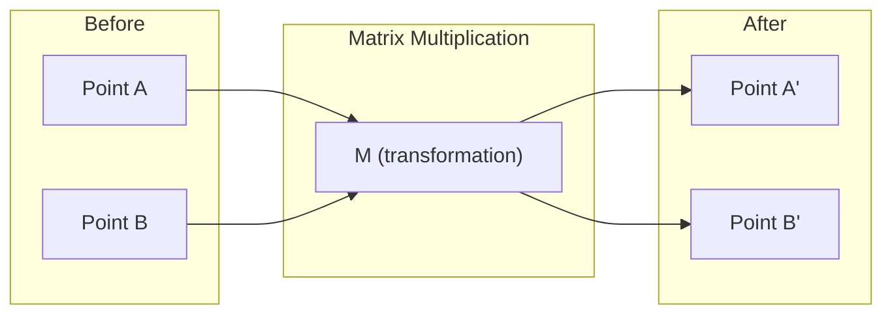
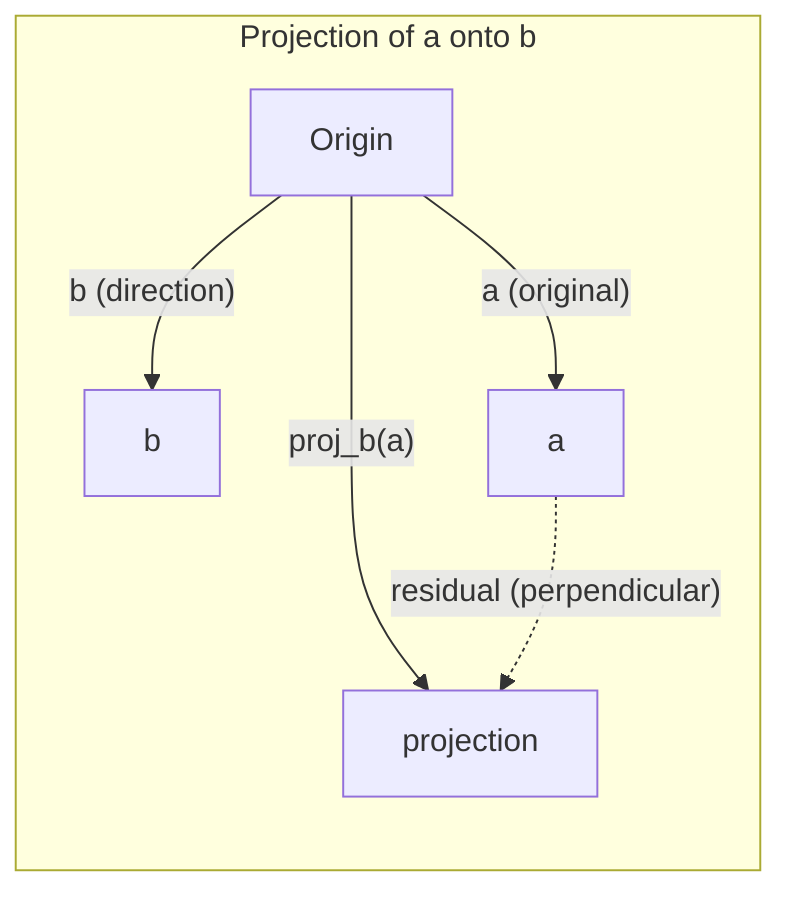

# Lịch lý đại số tuyến tính

> Mỗi mô hình AI chỉ là toán tử mặc mũ đẹp.

**Type:** Learn
**Languages:** Python, Julia
**Prerequisites:** Phase 0
**Time:** ~60 minutes

## Mục tiêu học tập

- Thực hiện các hoạt động vector và matrix (tổ số, sản phẩm chấm, nhân matrix) từ đầu trong Python
- Giải thích hình học những gì sản phẩm chấm, chiếu và quy trình Gram-Schmidt làm
- Xác định độc lập tuyến tính, cấp độ và cơ sở của một tập hợp vector bằng cách sử dụng giảm hàng
- Kết nối các khái niệm đại số tuyến tính với các ứng dụng AI của họ: nhúng, điểm chú ý và LoRA

## Vấn đề

Mở bất kỳ giấy ML nào. Trong trang đầu tiên, bạn sẽ thấy các vector, matrix, sản phẩm chấm và chuyển đổi. Không có trực giác đại số tuyến tính, đây chỉ là biểu tượng. Với nó, bạn có thể thấy một mạng thần kinh thực sự làm gì - di chuyển các điểm trong không gian.

Bạn không cần phải là một nhà toán học, bạn cần phải xem những hoạt động này có nghĩa là gì theo hình học, và sau đó tự lập mã chúng.

## Khái niệm

### Các vector là điểm (và hướng)

Một vector chỉ là một danh sách số. Nhưng những số đó có ý nghĩa gì đó -- chúng là các phối hợp trong không gian.

**2D vector [3, 2]:**

| x | y | Point |
|---|---|-------|
| 3 | 2 | The vector points from origin (0,0) to (3, 2) on the plane |

Dòng vector có độ lớn vuông ((3^2 + 2^2) = vuông ((13) và chỉ lên và về phía bên phải.

Trong AI, các vector đại diện cho mọi thứ:
- Một từ → một vector của 768 số (tên của nó trong không gian nhúng)
- Một hình ảnh → một vector có giá trị hàng triệu pixel
- Một người dùng → một vector của sở thích

### Các matrix là sự biến đổi

Một matrix biến đổi một vector thành một vector khác. nó có thể xoay, quy mô, kéo dài hoặc chiếu.



Trong AI, các matrix là mô hình:
- Năng lượng mạng thần kinh → các matrices chuyển đổi đầu vào thành đầu ra
- Điểm chú ý → các matrices quyết định những gì để tập trung vào
- Các nhúng → các matrix mà lập bản đồ từ cho các vector

### Các biện pháp sản phẩm điểm tương tự

Kết quả điểm của hai vector cho bạn biết chúng tương tự như thế nào.

```
a · b = a₁×b₁ + a₂×b₂ + ... + aₙ×bₙ

Same direction:      a · b > 0  (similar)
Perpendicular:       a · b = 0  (unrelated)
Opposite direction:  a · b < 0  (dissimilar)
```

Đây là cách mà các công cụ tìm kiếm, hệ thống khuyến nghị và RAG hoạt động -- tìm ra các vector với các sản phẩm điểm cao.

### Tự do tuyến tính

Các vector là tuyến tính độc lập nếu không có vector trong tập thể có thể được viết là sự kết hợp của những người khác. Nếu v1, v2, v3 độc lập, chúng trải dài một không gian 3D. Nếu một là sự kết hợp của những người khác, chúng chỉ trải dài một máy bay.

Tại sao nó quan trọng cho AI: các tính năng của bạn nên có cột độc lập tuyến tính. Nếu hai tính năng tương quan hoàn hảo (thay thuộc tuyến tính), mô hình không thể phân biệt các hiệu ứng của chúng. Điều này gây ra sự đa tuyến tính trong sự hồi quy - các khối lượng của matrix trở nên bất ổn, và những thay đổi đầu vào nhỏ tạo ra các biến động đầu ra hoang dã.

**Concrete example:**

```
v1 = [1, 0, 0]
v2 = [0, 1, 0]
v3 = [2, 1, 0]   # v3 = 2*v1 + v2
```

v1 và v2 là độc lập - không phải là một nhân số scalar hoặc sự kết hợp của các khác. Nhưng v3 = 2 * v1 + v2, vì vậy {v1, v2, v3} là một tập phụ thuộc. Ba vector này đều nằm trong phẳng xy. Cho dù bạn kết hợp chúng như thế nào, bạn không thể đạt được [0, 0, 1]. Bạn có ba vector nhưng chỉ có hai chiều tự do.

Trong một tập dữ liệu: nếu feature_3 = 2*feature_1 + feature_2, thêm feature_3 sẽ cung cấp cho mô hình không có thông tin mới.

### Nguồn gốc và cấp độ

Một cơ sở là một tập hợp tối thiểu của các vector độc lập tuyến tính trải dài toàn bộ không gian.

Cơ sở tiêu chuẩn cho không gian 3D là {[1,0,0], [0,1,0], [0,0,1]}. Nhưng bất kỳ ba vector độc lập nào trong 3D tạo thành cơ sở hợp lệ.

Đường độ của một matrix = số lượng cột độc lập tuyến tính = số lượng hàng độc lập tuyến tính. Nếu xếp hạng < m ((những hàng, hàng), các matrix là thiếu xếp hạng. Điều này có nghĩa là:
- Hệ thống có vô số giải pháp (hoặc không có)
- Thông tin bị mất trong quá trình chuyển đổi
- Matrix không thể đảo ngược

| Situation | Rank | What it means for ML |
|-----------|------|---------------------|
| Full rank (rank = min(m, n)) | Maximum possible | Unique least-squares solution exists. Model is well-conditioned. |
| Rank deficient (rank < min(m, n)) | Below maximum | Features are redundant. Infinitely many weight solutions. Regularization needed. |
| Rank 1 | 1 | Every column is a scaled copy of one vector. All data lies on a line. |
| Near rank-deficient (small singular values) | Numerically low | Matrix is ill-conditioned. Tiny input noise causes large output changes. Use SVD truncation or ridge regression. |

### Dự án

Vêctơ dự án **a**trên vector **b**cho thành phần của **a**hướng tới **b**- Có thể là:

```
proj_b(a) = (a dot b / b dot b) * b
```

Số dư (a - proj_b(a)) là thẳng đứng với b. Sự phân hủy trực giác này là nền tảng của các bộ sơn vuông nhỏ nhất.

Đánh chiếu là ở khắp mọi nơi trong ML:
- Lịch chiếu tuyến tính giảm thiểu khoảng cách từ quan sát đến không gian cột -- giải pháp là một dự đoán
- PCA dự báo dữ liệu về hướng biến động tối đa
- Sự chú ý trong các bộ biến tính toán các dự đoán của các truy vấn trên các phím



**Example:**a = [3, 4], b = [1, 0]

Proj_b(a) = (3*1 + 4*0) / (1*1 + 0*0) * [1, 0] = 3 * [1, 0] = [3, 0]

Dự án làm giảm thành phần y. Đây là sự giảm chiều kích trong hình thức đơn giản nhất của nó - ném đi những hướng bạn không quan tâm.

### Quá trình Gram-Schmidt

Chuyển đổi bất kỳ bộ các vector độc lập nào thành một cơ sở hoặc.

Khóa toán:
1. Hãy lấy vector đầu tiên, bình thường hóa nó
2. Hãy lấy vector thứ hai, trừ đi sự chiếu của nó lên đầu tiên, bình thường hóa
3. Hãy lấy vector thứ ba, trừ ra các dự đoán của nó lên tất cả các vector trước đó, bình thường hóa
4. Lặp lại cho các vector còn lại

```
Input:  v1, v2, v3, ... (linearly independent)

u1 = v1 / |v1|

w2 = v2 - (v2 dot u1) * u1
u2 = w2 / |w2|

w3 = v3 - (v3 dot u1) * u1 - (v3 dot u2) * u2
u3 = w3 / |w3|

Output: u1, u2, u3, ... (orthonormal basis)
```

Đây là cách phân hủy QR hoạt động bên trong. Q là cơ sở thông thường, R nắm bắt các hệ số chiếu.
- Giải quyết hệ thống tuyến tính (thực tế hơn việc loại bỏ Gaussian)
- Tính toán giá trị riêng (QR algorithm)
- Trình ngược vuông tối thiểu (chương pháp số tiêu chuẩn)

```figure
eigen-directions
```

## Hãy xây dựng nó

### Bước 1: Các vector từ đầu (Python)

```python
class Vector:
    def __init__(self, components):
        self.components = list(components)
        self.dim = len(self.components)

    def __add__(self, other):
        return Vector([a + b for a, b in zip(self.components, other.components)])

    def __sub__(self, other):
        return Vector([a - b for a, b in zip(self.components, other.components)])

    def dot(self, other):
        return sum(a * b for a, b in zip(self.components, other.components))

    def magnitude(self):
        return sum(x**2 for x in self.components) ** 0.5

    def normalize(self):
        mag = self.magnitude()
        return Vector([x / mag for x in self.components])

    def cosine_similarity(self, other):
        return self.dot(other) / (self.magnitude() * other.magnitude())

    def __repr__(self):
        return f"Vector({self.components})"


a = Vector([1, 2, 3])
b = Vector([4, 5, 6])

print(f"a + b = {a + b}")
print(f"a · b = {a.dot(b)}")
print(f"|a| = {a.magnitude():.4f}")
print(f"cosine similarity = {a.cosine_similarity(b):.4f}")
```

### Bước 2: Matrix từ đầu (Python)

```python
class Matrix:
    def __init__(self, rows):
        self.rows = [list(row) for row in rows]
        self.shape = (len(self.rows), len(self.rows[0]))

    def __matmul__(self, other):
        if isinstance(other, Vector):
            return Vector([
                sum(self.rows[i][j] * other.components[j] for j in range(self.shape[1]))
                for i in range(self.shape[0])
            ])
        rows = []
        for i in range(self.shape[0]):
            row = []
            for j in range(other.shape[1]):
                row.append(sum(
                    self.rows[i][k] * other.rows[k][j]
                    for k in range(self.shape[1])
                ))
            rows.append(row)
        return Matrix(rows)

    def transpose(self):
        return Matrix([
            [self.rows[j][i] for j in range(self.shape[0])]
            for i in range(self.shape[1])
        ])

    def __repr__(self):
        return f"Matrix({self.rows})"


rotation_90 = Matrix([[0, -1], [1, 0]])
point = Vector([3, 1])

rotated = rotation_90 @ point
print(f"Original: {point}")
print(f"Rotated 90°: {rotated}")
```

### Bước 3: Tại sao điều này quan trọng đối với AI

```python
import random

random.seed(42)
weights = Matrix([[random.gauss(0, 0.1) for _ in range(3)] for _ in range(2)])
input_vector = Vector([1.0, 0.5, -0.3])

output = weights @ input_vector
print(f"Input (3D): {input_vector}")
print(f"Output (2D): {output}")
print("This is what a neural network layer does -- matrix multiplication.")
```

### Bước 4: Phiên bản Julia

```julia
a = [1.0, 2.0, 3.0]
b = [4.0, 5.0, 6.0]

println("a + b = ", a + b)
println("a · b = ", a ⋅ b)       # Julia supports unicode operators
println("|a| = ", √(a ⋅ a))
println("cosine = ", (a ⋅ b) / (√(a ⋅ a) * √(b ⋅ b)))

# Matrix-vector multiplication
W = [0.1 -0.2 0.3; 0.4 0.5 -0.1]
x = [1.0, 0.5, -0.3]
println("Wx = ", W * x)
println("This is a neural network layer.")
```

### Bước 5: Tự độc lập tuyến tính và chiếu từ đầu (Python)

```python
def is_linearly_independent(vectors):
    n = len(vectors)
    dim = len(vectors[0].components)
    mat = Matrix([v.components[:] for v in vectors])
    rows = [row[:] for row in mat.rows]
    rank = 0
    for col in range(dim):
        pivot = None
        for row in range(rank, len(rows)):
            if abs(rows[row][col]) > 1e-10:
                pivot = row
                break
        if pivot is None:
            continue
        rows[rank], rows[pivot] = rows[pivot], rows[rank]
        scale = rows[rank][col]
        rows[rank] = [x / scale for x in rows[rank]]
        for row in range(len(rows)):
            if row != rank and abs(rows[row][col]) > 1e-10:
                factor = rows[row][col]
                rows[row] = [rows[row][j] - factor * rows[rank][j] for j in range(dim)]
        rank += 1
    return rank == n


def project(a, b):
    scalar = a.dot(b) / b.dot(b)
    return Vector([scalar * x for x in b.components])


def gram_schmidt(vectors):
    orthonormal = []
    for v in vectors:
        w = v
        for u in orthonormal:
            proj = project(w, u)
            w = w - proj
        if w.magnitude() < 1e-10:
            continue
        orthonormal.append(w.normalize())
    return orthonormal


v1 = Vector([1, 0, 0])
v2 = Vector([1, 1, 0])
v3 = Vector([1, 1, 1])
basis = gram_schmidt([v1, v2, v3])
for i, u in enumerate(basis):
    print(f"u{i+1} = {u}")
    print(f"  |u{i+1}| = {u.magnitude():.6f}")

print(f"u1 · u2 = {basis[0].dot(basis[1]):.6f}")
print(f"u1 · u3 = {basis[0].dot(basis[2]):.6f}")
print(f"u2 · u3 = {basis[1].dot(basis[2]):.6f}")
```

## Sử dụng nó

Bây giờ điều tương tự với NumPy -- những gì bạn thực sự sẽ sử dụng trong thực tế:

```python
import numpy as np

a = np.array([1, 2, 3], dtype=float)
b = np.array([4, 5, 6], dtype=float)

print(f"a + b = {a + b}")
print(f"a · b = {np.dot(a, b)}")
print(f"|a| = {np.linalg.norm(a):.4f}")
print(f"cosine = {np.dot(a, b) / (np.linalg.norm(a) * np.linalg.norm(b)):.4f}")

W = np.random.randn(2, 3) * 0.1
x = np.array([1.0, 0.5, -0.3])
print(f"Wx = {W @ x}")
```

### Đơn vị, chiếu và QR với NumPy

```python
import numpy as np

A = np.array([[1, 2], [2, 4]])
print(f"Rank: {np.linalg.matrix_rank(A)}")

a = np.array([3, 4])
b = np.array([1, 0])
proj = (np.dot(a, b) / np.dot(b, b)) * b
print(f"Projection of {a} onto {b}: {proj}")

Q, R = np.linalg.qr(np.random.randn(3, 3))
print(f"Q is orthogonal: {np.allclose(Q @ Q.T, np.eye(3))}")
print(f"R is upper triangular: {np.allclose(R, np.triu(R))}")
```

### PyTorch - Tensor là vector với Autodiff

```python
import torch

x = torch.randn(3, requires_grad=True)
y = torch.tensor([1.0, 0.0, 0.0])

similarity = torch.dot(x, y)
similarity.backward()

print(f"x = {x.data}")
print(f"y = {y.data}")
print(f"dot product = {similarity.item():.4f}")
print(f"d(dot)/dx = {x.grad}")
```

Phong độ của sản phẩm chấm đối với x chỉ là y. PyTorch tính toán tự động. Mỗi hoạt động trong một mạng thần kinh được xây dựng từ các hoạt động như thế này - nhân tử, sản phẩm chấm, dự đoán - và tự động theo dõi gradient thông qua tất cả chúng.

Anh vừa xây dựng từ đầu những gì NumPy làm trong một dòng.

## Chuyển nó

Bài học này mang lại:
- `outputs/prompt-linear-algebra-tutor.md`-- một lời nhắc nhở cho các trợ lý AI để dạy đại số tuyến tính thông qua trực giác hình học

## Kết nối

Mọi thứ trong bài học này liên kết với các phần cụ thể của AI hiện đại:

| Concept | Where it shows up |
|---------|------------------|
| Dot product | Attention scores in transformers, cosine similarity in RAG |
| Matrix multiply | Every neural network layer, every linear transformation |
| Linear independence | Feature selection, avoiding multicollinearity |
| Rank | Determining if a system is solvable, LoRA (low-rank adaptation) |
| Projection | Linear regression (projecting onto column space), PCA |
| Gram-Schmidt / QR | Numerical solvers, eigenvalue computation |
| Orthonormal basis | Stable numerical computation, whitening transforms |

LoRA xứng đáng được nhắc đến đặc biệt. Nó tinh chỉnh các mô hình ngôn ngữ lớn bằng cách phân hủy các bản cập nhật trọng lượng thành các matrix hạng thấp. Thay vì cập nhật một số liệu khối lượng 4096x4096 (16M tham số), LoRA cập nhật hai số liệu kích thước 4096x16 và 16x4096 (131K tham số). Khắt khe cấp 16 có nghĩa là LoRA cho rằng việc cập nhật trọng lượng sống trong một không gian phụ 16 chiều của không gian 4096 chiều đầy đủ. Đó là toán vi tính làm việc thực sự.

## Các bài tập

1. Thực hiện`Vector.angle_between(other)`trả lại góc bằng độ giữa hai vector
2. Tạo một matrix quy mô 2D làm tăng hai lần các điều phối x và ba lần các điều phối y, sau đó áp dụng nó cho các vector [1, 1]
3. Với 5 vector giống như từ ngẫu nhiên (dimension 50), tìm hai giống nhau nhất bằng cách sử dụng sự tương đồng cosine
4. Kiểm tra xem liệu lượng Gram-Schmidt thực sự là orthonormal: kiểm tra rằng mỗi cặp có điểm sản phẩm 0 và mỗi vector có độ lớn 1
5. Tạo một số liệu 3x3 với cấp 2.`rank()`sau đó giải thích các vật lý hình học mà các cột trải dài.
6. Đặt đường dẫn [1, 2, 3] lên [1, 1, 1].

## Các điều khoản chính

| Term | What people say | What it actually means |
|------|----------------|----------------------|
| Vector | "An arrow" | A list of numbers representing a point or direction in n-dimensional space |
| Matrix | "A table of numbers" | A transformation that maps vectors from one space to another |
| Dot product | "Multiply and sum" | A measure of how aligned two vectors are -- the core of similarity search |
| Embedding | "Some AI magic" | A vector that represents the meaning of something (word, image, user) |
| Linear independence | "They don't overlap" | No vector in the set can be written as a combination of the others |
| Rank | "How many dimensions" | The number of linearly independent columns (or rows) in a matrix |
| Projection | "The shadow" | The component of one vector in the direction of another |
| Basis | "The coordinate axes" | A minimal set of independent vectors that span the space |
| Orthonormal | "Perpendicular unit vectors" | Vectors that are mutually perpendicular and each have length 1 |
