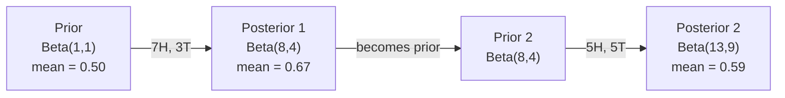

# Lý thuyết Bayes

> Thiếu khả năng là về những gì bạn mong đợi. Lý thuyết Bayes là về những gì bạn học được.

**Type:** Build
**Language:**Python
**Prerequisites:** Phase 1, Lesson 06 (Probability Fundamentals)
**Time:** ~75 minutes

## Mục tiêu học tập

- Sử dụng định lý Bayes để tính toán xác suất sau từ trước, xác suất và bằng chứng
- Xây dựng một phân loại văn bản Bayes ngây thơ từ đầu với Laplace làm mượt mà và tính toán log-space
- So sánh ước tính MLE và MAP và giải thích cách MAP tương ứng với L2
- Thực hiện cập nhật Bayesian theo trình tự bằng cách sử dụng các kết hợp trước Beta-Binomial cho thử nghiệm A / B

## Vấn đề

Một xét nghiệm y tế chính xác 99%. Bạn kiểm tra dương tính.

Hầu hết mọi người nói 99% câu trả lời thực sự phụ thuộc vào sự hiếm hoi của bệnh. Nếu 1 trong 10.000 người bị bệnh, kết quả tích cực chỉ cho bạn cơ hội 1% bị bệnh. 99% kết quả tích cực còn lại là báo động sai lầm từ những người khỏe mạnh.

Đây không phải là câu hỏi lừa đảo. Đó là định lý Bayes. Mỗi bộ lọc spam, mỗi chẩn đoán y tế, mỗi mô hình học máy đo lường sự không chắc chắn đều sử dụng lý luận chính xác này. Bạn bắt đầu với một niềm tin. Bạn thấy bằng chứng. Bạn cập nhật.

Nếu bạn xây dựng các hệ thống ML mà không hiểu điều này, bạn sẽ hiểu sai các sản phẩm mô hình, đặt ngưỡng xấu, và đưa ra dự đoán quá tự tin.

## Khái niệm

### Từ xác suất chung đến Bayes

Bạn đã biết từ bài học 06 rằng xác suất có điều kiện là:

```
P(A|B) = P(A and B) / P(B)
```

Và đối xứng:

```
P(B|A) = P(A and B) / P(A)
```

Cả hai biểu hiện đều có cùng số liệu: P(A và B). Đặt chúng bằng nhau và sắp xếp lại:

```
P(A and B) = P(A|B) * P(B) = P(B|A) * P(A)

Therefore:

P(A|B) = P(B|A) * P(A) / P(B)
```

Đó là định lý Bayes. 4 số lượng, 1 phương trình.

### Bốn phần

| Part | Name | What it means |
|------|------|---------------|
| P(A\|B) | Posterior | Your updated belief about A after seeing evidence B |
| P(B\|A) | Likelihood | How probable the evidence B is if A is true |
| P(A) | Prior | Your belief about A before seeing any evidence |
| P(B) | Evidence | Total probability of seeing B under all possibilities |

Thuật ngữ bằng chứng P(B) hoạt động như một chất bình thường hóa. Bạn có thể mở rộng nó bằng cách sử dụng luật xác suất tổng thể:

```
P(B) = P(B|A) * P(A) + P(B|not A) * P(not A)
```

### Ví dụ về xét nghiệm y tế

Một bệnh ảnh hưởng đến 1 trong 10.000 người.

```
P(sick)          = 0.0001     (prior: disease is rare)
P(positive|sick) = 0.99       (likelihood: test catches it)
P(positive|healthy) = 0.01    (false positive rate)

P(positive) = P(positive|sick) * P(sick) + P(positive|healthy) * P(healthy)
            = 0.99 * 0.0001 + 0.01 * 0.9999
            = 0.000099 + 0.009999
            = 0.010098

P(sick|positive) = P(positive|sick) * P(sick) / P(positive)
                 = 0.99 * 0.0001 / 0.010098
                 = 0.0098
                 = 0.98%
```

Khi một tình trạng hiếm, ngay cả xét nghiệm chính xác cũng có kết quả dương tính hầu hết là sai.

### Ví dụ về bộ lọc spam

Bạn nhận được một email có chứa từ "nhà cờ bạc".

```
P(spam)                = 0.3      (30% of email is spam)
P("lottery"|spam)      = 0.05     (5% of spam emails contain "lottery")
P("lottery"|not spam)  = 0.001    (0.1% of legitimate emails contain "lottery")

P("lottery") = 0.05 * 0.3 + 0.001 * 0.7
             = 0.015 + 0.0007
             = 0.0157

P(spam|"lottery") = 0.05 * 0.3 / 0.0157
                  = 0.955
                  = 95.5%
```

Một từ thay đổi xác suất từ 30% lên 95,5%. Một bộ lọc spam thực sự áp dụng Bayes trên hàng trăm từ cùng một lúc.

### Bayes ngây thơ: giả định độc lập

Bayes ngây thơ mở rộng điều này đến nhiều tính năng bằng cách giả định tất cả các tính năng đều độc lập theo điều kiện khi xem xét lớp học:

```
P(class | feature_1, feature_2, ..., feature_n)
  = P(class) * P(feature_1|class) * P(feature_2|class) * ... * P(feature_n|class)
    / P(feature_1, feature_2, ..., feature_n)
```

Phần "tâm nhiên" là giả định độc lập. Trong văn bản, các sự xuất hiện của từ không độc lập ("New" và "York" có liên quan). Nhưng giả định hoạt động rất tốt trong thực tế bởi vì trình phân loại chỉ cần xếp hạng các lớp, không tạo ra xác suất được chuẩn bị.

Vì tên gọi là giống nhau cho tất cả các lớp học, bạn có thể bỏ qua nó và chỉ cần so sánh số:

```
score(class) = P(class) * product of P(feature_i | class)
```

Chọn lớp có điểm cao nhất.

### Đánh giá xác suất tối đa (MLE)

Làm thế nào bạn có được P n tính năng (Figure) từ dữ liệu đào tạo?

```
P("free"|spam) = (number of spam emails containing "free") / (total spam emails)
```

Đây là MLE: chọn các giá trị tham số làm cho dữ liệu quan sát có khả năng cao nhất. Bạn đang tối đa hóa hàm xác suất, mà cho các đếm riêng lẻ giảm xuống tần số tương đối.

Vấn đề: nếu một từ không bao giờ xuất hiện trong spam trong quá trình đào tạo, MLE cho nó xác suất bằng không. Một từ không được nhìn thấy sẽ giết chết toàn bộ sản phẩm.

```
P(word|class) = (count(word, class) + 1) / (total_words_in_class + vocabulary_size)
```

Thêm 1 vào mỗi con số đảm bảo không có khả năng nào là không.

### Tối đa a posteriori (MAP)

MLE hỏi: những tham số nào tối đa hóa các tham số dữ liệu P(?

MAP hỏi: những tham số nào tối đa hóa các tham số P(nơi dữ liệu)?

Theo định lý Bayes:

```
P(parameters|data) proportional to P(data|parameters) * P(parameters)
```

MAP thêm một tiền lệ trên các tham số. Nếu bạn tin rằng các tham số nên nhỏ, bạn mã hóa nó như một tiền lệ phạt các giá trị lớn. Điều này giống như việc điều chỉnh L2 trong ML.

| Estimation | Optimizes | ML equivalent |
|------------|-----------|---------------|
| MLE | P(data\|params) | Unregularized training |
| MAP | P(data\|params) * P(params) | L2 / L1 regularization |

### Bayesian vs frequentist: sự khác biệt thực tế

Những người thường xuyên học xem các thông số như là những điều không thể biết được. Họ hỏi: "Nếu tôi lặp lại thí nghiệm này nhiều lần, sẽ xảy ra gì?"

Người Bayesian coi các tham số như là phân bố. Họ hỏi: "Vì những gì tôi đã quan sát, tôi tin về các tham số là gì?"

Đối với các hệ thống ML xây dựng, sự khác biệt thực tế:

| Aspect | Frequentist | Bayesian |
|--------|-------------|----------|
| Output | Point estimate | Distribution over values |
| Uncertainty | Confidence intervals (about procedure) | Credible intervals (about parameter) |
| Small data | Can overfit | Prior acts as regularization |
| Computation | Usually faster | Often requires sampling (MCMC) |

Hầu hết các phương pháp ML sản xuất là thường xuyên (SGD, ước tính điểm). phương pháp Bayesian sáng khi bạn cần sự không chắc chắn được cân bằng (phác định y tế, hệ thống an toàn quan trọng) hoặc khi dữ liệu là hiếm (làm học ít, bắt đầu lạnh).

### Tại sao tư duy Bayesian quan trọng cho ML

Sự kết nối sâu sắc hơn cả sự tương tự:

**Priors are regularization.**Một Gaussian trước trên trọng lượng là L2 thường xuyên. một Laplace trước là L1. Mỗi khi bạn thêm một thuật ngữ thường xuyên, bạn đang làm cho một tuyên bố Bayesian về các giá trị tham số bạn mong đợi.

**Posteriors are uncertainty.**Một xác suất dự đoán duy nhất không cho bạn biết mô hình có thể tự tin như thế nào trong ước tính đó. phương pháp Bayesian cho bạn một phân phối: "Tôi nghĩ P(spam) là giữa 0,8 và 0,95. "

**Bayes updates are online learning.**Khi mô hình của bạn nhìn thấy dữ liệu mới, nó sẽ cập nhật niềm tin của mình theo từng bước thay vì tái tập từ đầu.

**Model comparison is Bayesian.**Kiểm soạn thông tin Bayesian (BIC), xác suất biên và các yếu tố Bayes đều sử dụng lý luận Bayesian để lựa chọn giữa các mô hình mà không quá phù hợp.

```figure
bayes-update
```

## Hãy xây dựng nó

### Bước 1: hàm định lý Bayes

```python
def bayes(prior, likelihood, false_positive_rate):
    evidence = likelihood * prior + false_positive_rate * (1 - prior)
    posterior = likelihood * prior / evidence
    return posterior

result = bayes(prior=0.0001, likelihood=0.99, false_positive_rate=0.01)
print(f"P(sick|positive) = {result:.4f}")
```

### Bước 2: Cân loại Bayes ngây thơ

```python
import math
from collections import defaultdict

class NaiveBayes:
    def __init__(self, smoothing=1.0):
        self.smoothing = smoothing
        self.class_counts = defaultdict(int)
        self.word_counts = defaultdict(lambda: defaultdict(int))
        self.class_word_totals = defaultdict(int)
        self.vocab = set()

    def train(self, documents, labels):
        for doc, label in zip(documents, labels):
            self.class_counts[label] += 1
            words = doc.lower().split()
            for word in words:
                self.word_counts[label][word] += 1
                self.class_word_totals[label] += 1
                self.vocab.add(word)

    def predict(self, document):
        words = document.lower().split()
        total_docs = sum(self.class_counts.values())
        vocab_size = len(self.vocab)
        best_class = None
        best_score = float("-inf")
        for cls in self.class_counts:
            score = math.log(self.class_counts[cls] / total_docs)
            for word in words:
                count = self.word_counts[cls].get(word, 0)
                total = self.class_word_totals[cls]
                score += math.log((count + self.smoothing) / (total + self.smoothing * vocab_size))
            if score > best_score:
                best_score = score
                best_class = cls
        return best_class
```

Các xác suất log ngăn chặn dòng chảy thấp. Bội số nhiều xác suất nhỏ tạo ra các con số quá nhỏ cho điểm nổi. Kết hợp xác suất log ổn định về mặt số và tương đương về mặt toán học.

### Bước 3: Đào tạo dữ liệu spam

```python
train_docs = [
    "win free money now",
    "free lottery ticket winner",
    "claim your prize today free",
    "urgent offer free cash",
    "congratulations you won free",
    "meeting tomorrow at noon",
    "project update attached",
    "can we schedule a call",
    "quarterly report review",
    "lunch on thursday sounds good",
    "team standup notes attached",
    "please review the pull request",
]

train_labels = [
    "spam", "spam", "spam", "spam", "spam",
    "ham", "ham", "ham", "ham", "ham", "ham", "ham",
]

classifier = NaiveBayes()
classifier.train(train_docs, train_labels)

test_messages = [
    "free money waiting for you",
    "meeting rescheduled to friday",
    "you won a free prize",
    "please review the attached report",
]

for msg in test_messages:
    print(f"  '{msg}' -> {classifier.predict(msg)}")
```

### Bước 4: Kiểm tra xác suất được học

```python
def show_top_words(classifier, cls, n=5):
    vocab_size = len(classifier.vocab)
    total = classifier.class_word_totals[cls]
    probs = {}
    for word in classifier.vocab:
        count = classifier.word_counts[cls].get(word, 0)
        probs[word] = (count + classifier.smoothing) / (total + classifier.smoothing * vocab_size)
    sorted_words = sorted(probs.items(), key=lambda x: x[1], reverse=True)
    for word, prob in sorted_words[:n]:
        print(f"    {word}: {prob:.4f}")

print("\nTop spam words:")
show_top_words(classifier, "spam")
print("\nTop ham words:")
show_top_words(classifier, "ham")
```

## Sử dụng nó

Tàu học Scikit sẵn sàng sản xuất Bayes thực hiện ngây thơ:

```python
from sklearn.feature_extraction.text import CountVectorizer
from sklearn.naive_bayes import MultinomialNB
from sklearn.metrics import classification_report

vectorizer = CountVectorizer()
X_train = vectorizer.fit_transform(train_docs)
clf = MultinomialNB()
clf.fit(X_train, train_labels)

X_test = vectorizer.transform(test_messages)
predictions = clf.predict(X_test)
for msg, pred in zip(test_messages, predictions):
    print(f"  '{msg}' -> {pred}")
```

Same algorithm. CountVectorizer xử lý tokenization và xây dựng từ vựng. MultinomialNB xử lý smoothing và log-probabilities nội bộ. phiên bản của bạn từ đầu làm điều tương tự trong 40 dòng.

## Chuyển nó

Các lớp NaiveBayes được xây dựng ở đây cho thấy toàn bộ đường ống: tokenization, ước tính xác suất với Laplace smoothing, dự đoán log-space.`code/bayes.py`chạy từ đầu đến cuối mà không có phụ thuộc ngoài thư viện tiêu chuẩn của Python.

### Những người trước tiên kết hợp

Khi trước và sau thuộc cùng một gia đình phân phối, trước được gọi là "cùng". Điều này làm cho việc cập nhật Bayesian về mặt đại số sạch - bạn có được một hình thức đóng sau mà không có sự tích hợp số.

| Likelihood | Conjugate Prior | Posterior | Example |
|-----------|----------------|-----------|---------|
| Bernoulli | Beta(a, b) | Beta(a + successes, b + failures) | Coin flip bias estimation |
| Normal (known variance) | Normal(mu_0, sigma_0) | Normal(weighted mean, smaller variance) | Sensor calibration |
| Poisson | Gamma(a, b) | Gamma(a + sum of counts, b + n) | Modeling arrival rates |
| Multinomial | Dirichlet(alpha) | Dirichlet(alpha + counts) | Topic modeling, language models |

Tại sao điều này quan trọng: không có con số trước kết hợp, bạn cần lấy mẫu Monte Carlo hoặc suy luận biến số để gần gũi với con số sau.

Phân bố Beta là con số kết hợp trước phổ biến nhất trong thực tế. Beta(a, b) đại diện cho niềm tin của bạn về một tham số xác suất.

Các trường hợp đặc biệt của Beta trước:
- Beta ((1, 1) = đồng nhất. Bạn không có ý kiến về tham số.
- Beta ((10, 10) = đạt đỉnh ở 0,5. Bạn tin rằng tham số gần 0,5.
- Beta ((1, 10) = bị khuếch tán về phía 0. Bạn tin rằng tham số là nhỏ.

Quy tắc cập nhật là rất đơn giản:

```
Prior:     Beta(a, b)
Data:      s successes, f failures
Posterior: Beta(a + s, b + f)
```

Không có tích hợp, không lấy mẫu, chỉ là cộng.

### Việc cập nhật theo trình Bayesian

Bayesian inference tự nhiên là theo trình tự. ngày hôm nay trở thành ngày mai trước. Đây là cách các hệ thống thực học dần mà không cần xử lý lại tất cả dữ liệu lịch sử.

Ví dụ cụ thể: ước tính xem một đồng xu có công bằng hay không.

**Day 1: No data yet.**
Bắt đầu với Beta ((1, 1) -- một tiền nhiệm đồng bộ.
- Tỷ lệ trung bình trước: 0,5
- Prior là phẳng trên [0, 1]

**Day 2: Observe 7 heads, 3 tails.**
Sau = Beta(1 + 7, 1 + 3) = Beta(8, 4)
- Tỷ lệ trung bình sau: 8/12 = 0,667
- Bằng chứng cho thấy đồng xu này có khuynh hướng hướng hướng về đầu

**Day 3: Observe 5 more heads, 5 more tails.**
Sử dụng hình hậu của hôm qua như hình trước của hôm nay.
Sau = Beta(8 + 5, 4 + 5) = Beta(13, 9)
- Tỷ lệ trung bình sau: 13/22 = 0,591
- Các dữ liệu mới cân bằng kéo ước tính trở lại phía 0.5



Dòng quan sát không quan trọng. Beta(1,1) được cập nhật với tất cả 12 đầu và 8 đuôi cùng một lúc cho Beta(13, 9) - kết quả tương tự. Cập nhật theo trình và cập nhật hàng loạt tương đương về mặt toán học. Nhưng cập nhật theo trình cho phép bạn đưa ra quyết định tại mỗi bước mà không cần lưu trữ dữ liệu thô.

Đây là nền tảng của việc học trực tuyến trong các hệ thống ML sản xuất. Thompson lấy mẫu cho tên cướp, hệ thống khuyến nghị tăng và các máy dò biến chứng phát sóng đều sử dụng mô hình này.

### Kết nối với thử nghiệm A/B

Kiểm tra A/B là suy luận Bayesian trong mờ.

Thiết lập: bạn đang thử nghiệm hai màu nút: biến thể A (màu xanh) và biến thể B (màu xanh). Bạn muốn biết có cái nào được nhấp nhiều hơn.

Thử nghiệm A/B Bayesian:

1. **Prior.**Bắt đầu với Beta(1, 1) cho cả hai biến thể. Không có ưu tiên trước.
2. **Data.**Phân biến A: 50 lần nhấp trên 1000 lượt xem. Phân biến B: 65 lần nhấp trên 1000 lượt xem.
3. **Posteriors.**
   - A: Beta(1 + 50, 1 + 950) = Beta(51, 951).
   - B: Beta(1 + 65, 1 + 935) = Beta(66, 936).
4. **Decision.**Xét P ((B > A) -- xác suất rằng tỷ lệ chuyển đổi thực của B cao hơn A.

Xét toán P ((B > A) về mặt phân tích là khó khăn. Nhưng Monte Carlo làm cho nó tầm thường:

```
1. Draw 100,000 samples from Beta(51, 951)  -> samples_A
2. Draw 100,000 samples from Beta(66, 936)  -> samples_B
3. P(B > A) = fraction of samples where B > A
```

Nếu P(B > A) > 0,95, bạn gửi biến thể B. Nếu nó là giữa 0,05 và 0,95, bạn tiếp tục thu thập dữ liệu. Nếu P(B > A) < 0,05, bạn gửi biến thể A.

Lợi ích so với thử nghiệm A/B thường xuyên:
- Bạn nhận được một tuyên bố xác suất trực tiếp: "có 97% cơ hội B tốt hơn"
- Không có sự nhầm lẫn về giá trị p, không có việc "không thể từ chối giả thuyết không"
- Bạn có thể kiểm tra kết quả bất cứ lúc nào mà không làm tăng tỷ lệ dương tính sai (không có "vấn đề tìm kiếm")
- Bạn có thể kết hợp kiến thức trước đó (ví dụ, các thử nghiệm trước đây cho thấy tỷ lệ chuyển đổi thường là 3-8%)

| Aspect | Frequentist A/B | Bayesian A/B |
|--------|----------------|--------------|
| Output | p-value | P(B > A) |
| Interpretation | "How surprising is this data if A=B?" | "How likely is B better than A?" |
| Early stopping | Inflates false positives | Safe at any point (given a well-chosen prior and correctly specified model) |
| Prior knowledge | Not used | Encoded as Beta prior |
| Decision rule | p < 0.05 | P(B > A) > threshold |

## Các bài tập

1. **Multiple tests.**Một bệnh nhân kiểm tra dương tính hai lần trên các xét nghiệm độc lập (cả hai đều chính xác 99%, tỷ lệ mắc bệnh là 1 trong 10.000).

2. **Smoothing impact.**Hãy chạy phân loại spam với giá trị làm trơn bằng 0,01, 0,1, 1.0 và 10.0.

3. **Add features.**Lớn thêm lớp NaiveBayes để cũng sử dụng chiều dài thông điệp (cắn/dáu) như một tính năng bên cạnh số lượng từ. ước tính P(short dizerspam) và P(short dizerham) từ dữ liệu đào tạo và gấp nó vào điểm số dự đoán.

4. **MAP by hand.**Với dữ liệu quan sát (7 đầu trong 10 lần ném đồng xu), tính toán ước tính MAP của sự thiên vị bằng cách sử dụng một Beta(2,2) trước. So sánh nó với ước tính MLE (7/10).

## Các điều khoản chính

| Term | What people say | What it actually means |
|------|----------------|----------------------|
| Prior | "My initial guess" | P(hypothesis) before observing evidence. In ML: the regularization term. |
| Likelihood | "How well the data fits" | P(evidence\|hypothesis). How probable the observed data is under a specific hypothesis. |
| Posterior | "My updated belief" | P(hypothesis\|evidence). The prior multiplied by the likelihood, then normalized. |
| Evidence | "The normalizing constant" | P(data) across all hypotheses. Ensures the posterior sums to 1. |
| Naive Bayes | "That simple text classifier" | A classifier that assumes features are independent given the class. Works well despite the false assumption. |
| Laplace smoothing | "Add-one smoothing" | Adding a small count to every feature to prevent zero probabilities from unseen data. |
| MLE | "Just use the frequencies" | Choose parameters that maximize P(data\|parameters). No prior. Can overfit with small data. |
| MAP | "MLE with a prior" | Choose parameters that maximize P(data\|parameters) * P(parameters). Equivalent to regularized MLE. |
| Log-probability | "Work in log space" | Using log(P) instead of P to avoid floating-point underflow when multiplying many small numbers. |
| False positive | "A wrong alarm" | The test says positive, but the true state is negative. Drives the base rate fallacy. |

## Đọc thêm

- [3Blue1Brown: Bayes' theorem](https://www.youtube.com/watch?v=HZGCoVF3YvM)- giải thích trực quan với ví dụ xét nghiệm y tế
- [Stanford CS229: Generative Learning Algorithms](https://cs229.stanford.edu/notes2022fall/cs229-notes2.pdf)- Bayes ngây thơ và mối liên hệ của nó với các mô hình phân biệt đối xử
- [Think Bayes](https://greenteapress.com/wp/think-bayes/)- sách miễn phí, thống kê Bayesian với mã Python
- [scikit-learn Naive Bayes](https://scikit-learn.org/stable/modules/naive_bayes.html)- các hoạt động sản xuất và khi nào sử dụng mỗi biến thể
