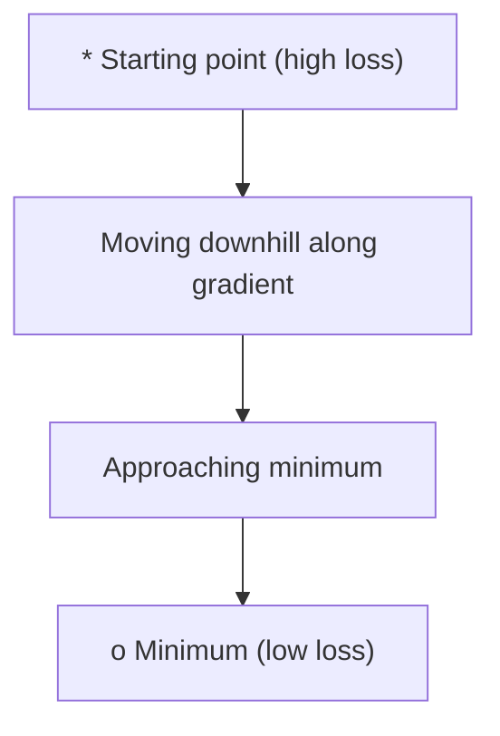
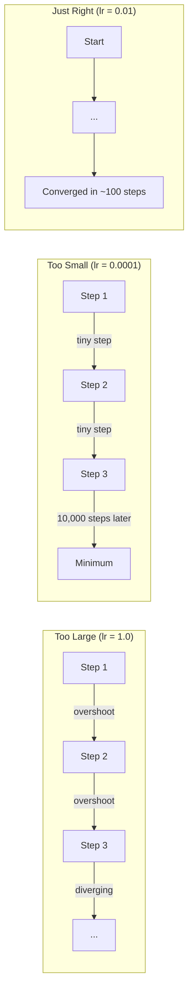
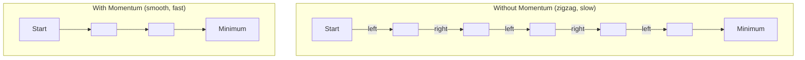
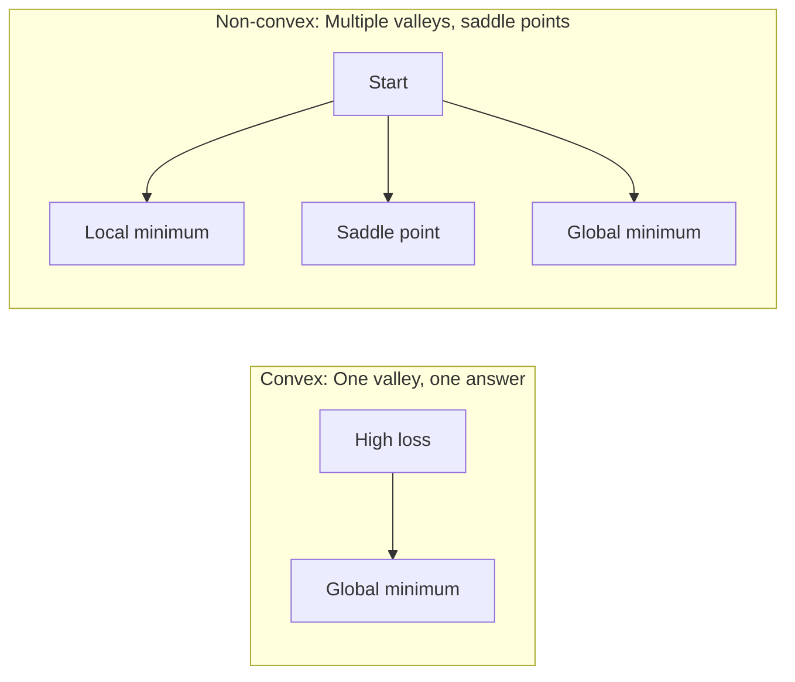
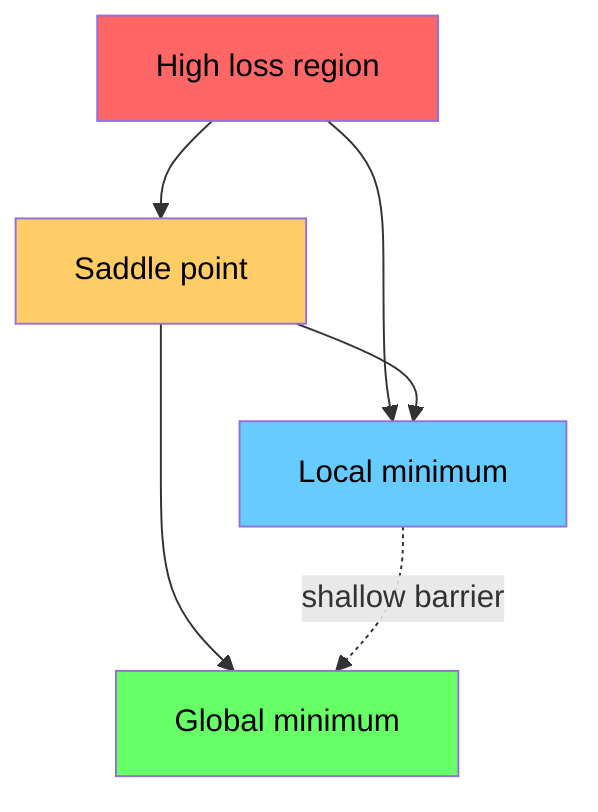

# Tối ưu hóa

> Việc đào tạo mạng lưới thần kinh không còn gì ngoài việc tìm ra đáy của một thung lũng.

**Type:** Build
**Language:**Python
**Prerequisites:** Phase 1, Lessons 04-05 (Derivatives, Gradients)
**Time:** ~75 minutes

## Mục tiêu học tập

- Thực hiện giảm độ sốc vanilla, SGD với động lực, và Adam từ đầu
- So sánh sự hội tụ tối ưu hóa trên hàm Rosenbrock và giải thích tại sao Adam thích nghi với tỷ lệ học tập theo trọng lượng
- Hóa ra sự khác biệt giữa các cảnh thất lạc và không và giải thích vai trò của các điểm sườn ở các chiều cao
- Thiết lập các lịch trình tốc độ học tập (phân tích bước, khôi phục cosine, ấm lên) để ổn định đào tạo

## Vấn đề

Bạn có hàm mất, nó cho bạn biết mô hình của bạn sai như thế nào, bạn có gradient, nó cho bạn biết hướng nào làm cho mất nặng hơn.

Cách tiếp cận ngây thơ đơn giản: di chuyển đối diện với gradient. Đánh giá bước bằng một số gọi là tốc độ học tập. Lặp lại. Đây là sự giảm gradient, và nó hoạt động. Nhưng "các công việc" có những cảnh báo. Tốc độ học tập quá cao và bạn vượt qua thung lũng hoàn toàn, nhảy giữa các bức tường. Quá nhỏ và bạn sẽ trượt tới câu trả lời qua hàng ngàn bước không cần thiết. Nhấn vào một điểm saddle và bạn ngừng di chuyển ngay cả khi bạn không tìm thấy một tối thiểu.

Mỗi người tối ưu hóa trong học sâu là câu trả lời cho cùng một câu hỏi: làm thế nào để bạn đi đến đáy thung lũng nhanh hơn và đáng tin cậy hơn?

## Khái niệm

### Điều gì là tối ưu hóa

Tối ưu hóa là tìm ra các giá trị đầu vào giảm thiểu (hoặc tối đa hóa) một chức năng. Trong học máy, chức năng là mất mát. Các đầu vào là trọng lượng của mô hình.

```
minimize L(w) where:
  L = loss function
  w = model weights (could be millions of parameters)
```

### Tăng dần (vanilla)

Các phương pháp tối ưu hóa đơn giản nhất: tính toán gradient của sự mất mát đối với mỗi trọng lượng.

```
w = w - lr * gradient
```

Đó là toàn bộ thuật toán.



### Tốc độ học tập: siêu tham số quan trọng nhất

Tốc độ học tập kiểm soát kích thước bước. Nó xác định mọi thứ về sự hội tụ.



Không có công thức cho tốc độ học tập đúng. Bạn tìm thấy nó bằng thí nghiệm. Điểm khởi đầu chung: 0,001 cho Adam, 0,01 cho SGD với động lực.

### SGD vs lô hàng vs lô nhỏ

Giảm độ vanilla tính toán độ trên toàn bộ bộ bộ dữ liệu trước khi thực hiện một bước.

Thấp độ gradient Stochastic (SGD) tính toán gradient trên một mẫu ngẫu nhiên và bước ngay lập tức.

Giảm độ gradient mini-batch chia khác biệt. tính toán gradient trên một loạt nhỏ (32, 64, 128, 256 mẫu), sau đó bước. Đây là những gì mọi người thực sự sử dụng.

| Variant | Batch size | Gradient quality | Speed per step | Noise |
|---------|-----------|-----------------|---------------|-------|
| Batch GD | Entire dataset | Exact | Slow | None |
| SGD | 1 sample | Very noisy | Fast | High |
| Mini-batch | 32-256 | Good estimate | Balanced | Moderate |

Âm thanh trong SGD và mini-batch không phải là một lỗi. Nó giúp thoát khỏi tối thiểu địa phương nông và các điểm saddle.

### Tốc độ: quả bóng xoay xuống đồi

Giảm độ vanilla chỉ nhìn vào độ nghiêng hiện tại. Nếu độ nghiêng (thường xảy ra ở các thung lũng hẹp), tiến độ là chậm.

```
v = beta * v + gradient
w = w - lr * v
```

Tương tự như một quả bóng đang lăn xuống đồi. Nó không dừng lại và khởi động lại ở mỗi đập. Nó tăng tốc độ theo hướng nhất quán và làm giảm dao động.



`beta`(thường là 0.9) kiểm soát bao nhiêu lịch sử để giữ. Beta cao hơn có nghĩa là nhiều động lực hơn, đường đi trơn tru hơn, nhưng phản ứng chậm hơn với thay đổi hướng.

### Adam: Tỷ lệ học tập thích nghi

Một trọng lượng hiếm khi có gradient lớn nên thực hiện các bước lớn hơn khi cuối cùng nó thực hiện. Một trọng lượng mà liên tục có gradient lớn nên thực hiện các bước nhỏ hơn.

Adam (Tín tích thời điểm thích ứng) theo dõi hai thứ cho trọng lượng:

1. Khoảnh khắc đầu tiên (m): trung bình chạy của các gradient (như động lực)
2. Khoảnh khắc thứ hai (v): trung bình chạy của các gradient vuông (tốc độ gradient)

```
m = beta1 * m + (1 - beta1) * gradient
v = beta2 * v + (1 - beta2) * gradient^2

m_hat = m / (1 - beta1^t)    bias correction
v_hat = v / (1 - beta2^t)    bias correction

w = w - lr * m_hat / (sqrt(v_hat) + epsilon)
```

Sự phân chia của `sqrt(v_hat)`là thông tin quan trọng. trọng lượng với gradient lớn được chia bằng một số lớn (phát hiệu quả nhỏ). trọng lượng với gradient nhỏ được chia bằng một số nhỏ (phát hiệu quả lớn).

Các siêu tham số mặc định: `lr=0.001, beta1=0.9, beta2=0.999, epsilon=1e-8`Những mặc định này hoạt động tốt cho hầu hết các vấn đề.

### Các lịch trình học tập

Một tốc độ học tập cố định là một sự thỏa hiệp. Đầu tiên trong đào tạo, bạn muốn có những bước lớn để tiến bộ nhanh chóng.

Các lịch trình chung:

| Schedule | Formula | Use case |
|----------|---------|----------|
| Step decay | lr = lr * factor every N epochs | Simple, manual control |
| Exponential decay | lr = lr_0 * decay^t | Smooth reduction |
| Cosine annealing | lr = lr_min + 0.5 * (lr_max - lr_min) * (1 + cos(pi * t / T)) | Transformers, modern training |
| Warmup + decay | Linear ramp up, then decay | Large models, prevents early instability |

### Phép trục trặc đối với không trục trặc

Một hàm ngọc có một tối thiểu.`f(x) = x^2`là tròn.

Các chức năng mất mạng thần kinh không phải ngọc. Chúng có nhiều mức tối thiểu địa phương, điểm saddle và khu vực phẳng.



Trong thực tế, các mức tối thiểu địa phương trong các mạng thần kinh chiều cao hiếm khi là một vấn đề. Hầu hết các mức tối thiểu địa phương có giá trị mất gần mức tối thiểu toàn cầu. Các điểm lúa (vượt bằng một số hướng, cong trong những hướng khác) là trở ngại thực sự. Tốc độ và tiếng ồn từ các loạt nhỏ giúp thoát khỏi chúng.

### Hình ảnh mất cảnh quan

Loss là một chức năng của tất cả các trọng lượng. Đối với một mô hình với 1 triệu trọng lượng, cảnh quan mất mát sống trong không gian 1.000,001 chiều. Chúng tôi hình dung nó bằng cách chọn hai hướng ngẫu nhiên trong không gian trọng lượng và vẽ mất mát dọc theo những hướng đó, tạo ra một bề mặt 2D.



Các mức độ tối thiểu sắc nét phổ biến kém. mức độ tối thiểu phẳng phổ biến tốt. Đây là một lý do SGD với động lực thường vượt trội hơn Adam về độ chính xác thử nghiệm cuối cùng: tiếng ồn của nó ngăn chặn việc định cư vào mức độ tối thiểu sắc nét.

```figure
gradient-descent
```

## Hãy xây dựng nó

### Bước 1: Định nghĩa chức năng thử nghiệm

Hàm Rosenbrock là một chuẩn tối ưu hóa cổ điển. Điểm tối thiểu của nó là (1, 1) bên trong một thung lũng cong hẹp dễ tìm thấy nhưng khó theo dõi.

```
f(x, y) = (1 - x)^2 + 100 * (y - x^2)^2
```

```python
def rosenbrock(params):
    x, y = params
    return (1 - x) ** 2 + 100 * (y - x ** 2) ** 2

def rosenbrock_gradient(params):
    x, y = params
    df_dx = -2 * (1 - x) + 200 * (y - x ** 2) * (-2 * x)
    df_dy = 200 * (y - x ** 2)
    return [df_dx, df_dy]
```

### Bước 2: Giảm độ vanilla

```python
class GradientDescent:
    def __init__(self, lr=0.001):
        self.lr = lr

    def step(self, params, grads):
        return [p - self.lr * g for p, g in zip(params, grads)]
```

### Bước 3: SGD với động lực

```python
class SGDMomentum:
    def __init__(self, lr=0.001, momentum=0.9):
        self.lr = lr
        self.momentum = momentum
        self.velocity = None

    def step(self, params, grads):
        if self.velocity is None:
            self.velocity = [0.0] * len(params)
        self.velocity = [
            self.momentum * v + g
            for v, g in zip(self.velocity, grads)
        ]
        return [p - self.lr * v for p, v in zip(params, self.velocity)]
```

### Bước 4: Adam

```python
class Adam:
    def __init__(self, lr=0.001, beta1=0.9, beta2=0.999, epsilon=1e-8):
        self.lr = lr
        self.beta1 = beta1
        self.beta2 = beta2
        self.epsilon = epsilon
        self.m = None
        self.v = None
        self.t = 0

    def step(self, params, grads):
        if self.m is None:
            self.m = [0.0] * len(params)
            self.v = [0.0] * len(params)

        self.t += 1

        self.m = [
            self.beta1 * m + (1 - self.beta1) * g
            for m, g in zip(self.m, grads)
        ]
        self.v = [
            self.beta2 * v + (1 - self.beta2) * g ** 2
            for v, g in zip(self.v, grads)
        ]

        m_hat = [m / (1 - self.beta1 ** self.t) for m in self.m]
        v_hat = [v / (1 - self.beta2 ** self.t) for v in self.v]

        return [
            p - self.lr * mh / (vh ** 0.5 + self.epsilon)
            for p, mh, vh in zip(params, m_hat, v_hat)
        ]
```

### Bước 5: Đi và so sánh

```python
def optimize(optimizer, func, grad_func, start, steps=5000):
    params = list(start)
    history = [params[:]]
    for _ in range(steps):
        grads = grad_func(params)
        params = optimizer.step(params, grads)
        history.append(params[:])
    return history

start = [-1.0, 1.0]

gd_history = optimize(GradientDescent(lr=0.0005), rosenbrock, rosenbrock_gradient, start)
sgd_history = optimize(SGDMomentum(lr=0.0001, momentum=0.9), rosenbrock, rosenbrock_gradient, start)
adam_history = optimize(Adam(lr=0.01), rosenbrock, rosenbrock_gradient, start)

for name, history in [("GD", gd_history), ("SGD+M", sgd_history), ("Adam", adam_history)]:
    final = history[-1]
    loss = rosenbrock(final)
    print(f"{name:6s} -> x={final[0]:.6f}, y={final[1]:.6f}, loss={loss:.8f}")
```

Tạo ra dự kiến: Adam hội tụ nhanh nhất. SGD với động lực theo một con đường mượt mà hơn. Vanilla GD tiến chậm dọc theo thung lũng hẹp.

## Sử dụng nó

Trong thực tế, sử dụng máy tối ưu hóa PyTorch hoặc JAX. Chúng xử lý các nhóm tham số, suy giảm trọng lượng, cắt gradient và tăng tốc GPU.

```python
import torch

model = torch.nn.Linear(784, 10)

sgd = torch.optim.SGD(model.parameters(), lr=0.01, momentum=0.9)
adam = torch.optim.Adam(model.parameters(), lr=0.001)
adamw = torch.optim.AdamW(model.parameters(), lr=0.001, weight_decay=0.01)

scheduler = torch.optim.lr_scheduler.CosineAnnealingLR(adam, T_max=100)
```

Quy tắc của ngón tay:

- Bắt đầu với Adam (lr=0.001). Nó hoạt động cho hầu hết các vấn đề mà không cần điều chỉnh.
- Chuyển sang SGD với động lực (lr=0,01, động lực=0,9) khi bạn cần độ chính xác cuối cùng tốt nhất và có thể đủ khả năng điều chỉnh nhiều hơn.
- Sử dụng AdamW (Adam với sự suy giảm trọng lượng tách rời) cho các bộ biến đổi.
- Luôn sử dụng một lịch trình học tập tốc độ cho đào tạo kéo dài hơn một vài thời kỳ.
- Nếu đào tạo không ổn định, hãy giảm tốc độ học tập.

## Chuyển nó

Bài học này tạo ra một lời nhắc để chọn máy tối ưu hóa phù hợp.`outputs/prompt-optimizer-guide.md`- Tôi không biết.

Các lớp tối ưu hóa được xây dựng ở đây xuất hiện lại trong giai đoạn 3 khi chúng ta đào tạo một mạng lưới thần kinh từ đầu.

## Các bài tập

1. **Learning rate sweep.**Thực hiện giảm gradient vanilla trên hàm Rosenbrock với tỷ lệ học tập [0.0001, 0.0005, 0.001, 0.005, 0.01].

2. **Momentum comparison.**Thực hiện SGD với giá trị động lực [0,0,0,5,0,9,0,99] trên hàm Rosenbrock. Theo dõi sự mất mát ở mỗi bước. giá trị động lực hội tụ nhanh nhất?

3. **Saddle point escape.**Định nghĩa chức năng `f(x, y) = x^2 - y^2`Hãy so sánh cách vanilla GD, SGD với động lực, và Adam cư xử.

4. **Implement learning rate decay.**Thêm một lịch trình phân rã theo hàm số cao vào lớp GradientDescent: `lr = lr_0 * 0.999^step`So sánh sự hội tụ với và không phân rã trên hàm Rosenbrock.

## Các điều khoản chính

| Term | What people say | What it actually means |
|------|----------------|----------------------|
| Gradient descent | "Go downhill" | Update weights by subtracting the gradient scaled by the learning rate. The most basic optimizer. |
| Learning rate | "Step size" | A scalar that controls how far each update moves the weights. Too large causes divergence. Too small wastes compute. |
| Momentum | "Keep rolling" | Accumulate past gradients into a velocity vector. Dampens oscillations and accelerates movement through consistent directions. |
| SGD | "Random sampling" | Stochastic gradient descent. Compute gradient on a random subset instead of the full dataset. Almost always means mini-batch SGD in practice. |
| Mini-batch | "A chunk of data" | A small subset of training data (32-256 samples) used to estimate the gradient. Balances speed and gradient accuracy. |
| Adam | "The default optimizer" | Adaptive Moment Estimation. Tracks per-weight running averages of gradients and squared gradients to give each weight its own learning rate. |
| Bias correction | "Fix the cold start" | Adam's first and second moments are initialized to zero. Bias correction divides by (1 - beta^t) to compensate during early steps. |
| Learning rate schedule | "Change lr over time" | A function that adjusts the learning rate during training. Large steps early, small steps late. |
| Convex function | "One valley" | A function where any local minimum is the global minimum. Gradient descent always finds it. Neural network losses are not convex. |
| Saddle point | "Flat but not a minimum" | A point where the gradient is zero but it is a minimum in some directions and a maximum in others. Common in high dimensions. |
| Loss landscape | "The terrain" | The loss function plotted over weight space. Visualized by slicing along two random directions. |
| Convergence | "Getting there" | The optimizer has reached a point where further steps do not meaningfully reduce the loss. |

## Đọc thêm

- [Sebastian Ruder: An overview of gradient descent optimization algorithms](https://ruder.io/optimizing-gradient-descent/)- khảo sát toàn diện của tất cả các nhà tối ưu hóa chính
- [Why Momentum Really Works (Distill)](https://distill.pub/2017/momentum/)- hình ảnh tương tác của động lực động lực
- [Adam: A Method for Stochastic Optimization (Kingma & Ba, 2014)](https://arxiv.org/abs/1412.6980)- giấy Adam gốc, có thể đọc được và ngắn gọn
- [Visualizing the Loss Landscape of Neural Nets (Li et al., 2018)](https://arxiv.org/abs/1712.09913)- tờ báo cho thấy mức tối thiểu sắc nét vs. phẳng
