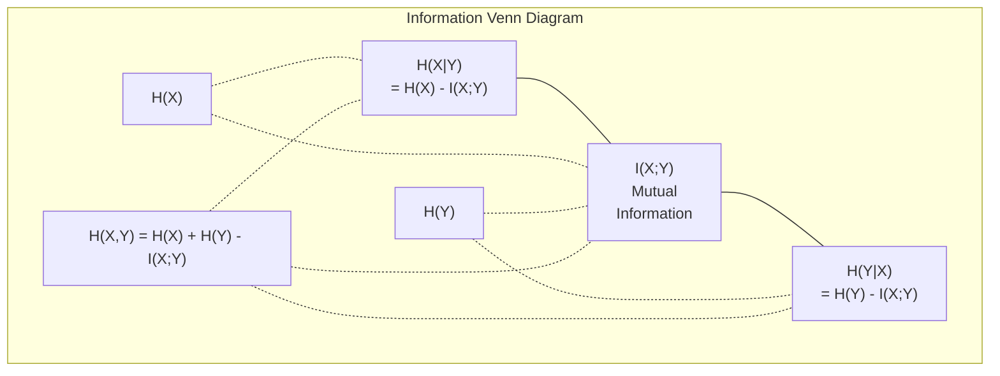

# Lý thuyết thông tin

> Lý thuyết thông tin đo lường sự ngạc nhiên.

**Type:** Learn
**Language:**Python
**Prerequisites:** Phase 1, Lesson 06 (Probability)
**Time:** ~60 minutes

## Mục tiêu học tập

- Xét entropy, cross-entropy, và KL divergence từ đầu và giải thích mối quan hệ của họ
- Kết luận tại sao giảm thiểu tổn thất entropy chéo tương đương với tối đa hóa xác suất log
- Xét thông tin lẫn nhau giữa các tính năng và mục tiêu để xếp hạng tầm quan trọng của tính năng
- Giải thích sự phức tạp như kích thước từ vựng hiệu quả mà mô hình ngôn ngữ chọn từ

## Vấn đề

Anh gọi`CrossEntropyLoss()`bạn thấy "sự phức tạp" trong mỗi bài báo về ngôn ngữ. bạn đọc về sự khác biệt KL trong VAE, chưng cất, và RLHF.

Lý thuyết thông tin cho bạn ngôn ngữ để lý luận về sự không chắc chắn, nén và dự đoán. Claude Shannon phát minh ra nó vào năm 1948 để giải quyết các vấn đề giao tiếp.

Bài học này xây dựng mọi công thức từ đầu để bạn thấy chúng đến từ đâu và tại sao chúng hoạt động.

## Khái niệm

### Nội dung thông tin (Sự ngạc nhiên)

Khi một điều gì đó không có khả năng xảy ra, nó mang lại nhiều thông tin hơn.

Nội dung thông tin của một sự kiện có khả năng p là:

```
I(x) = -log(p(x))
```

Sử dụng log base 2 cho bạn bit, sử dụng log tự nhiên cho bạn nats, cùng một ý tưởng, đơn vị khác nhau.

```
Event              Probability    Surprise (bits)
Fair coin heads    0.5            1.0
Rolling a 6        0.167          2.58
1-in-1000 event    0.001          9.97
Certain event      1.0            0.0
```

Một số sự kiện không có thông tin nào, bạn đã biết chúng sẽ xảy ra.

### Entropy (Tầm ngạc nhiên trung bình)

Entropy là sự bất ngờ mong đợi trên tất cả các kết quả có thể của một phân phối.

```
H(P) = -sum( p(x) * log(p(x)) )  for all x
```

Một đồng xu công bằng có entropy tối đa cho một biến nhị phân: 1 bit. Một đồng xu thiên vị (99% đầu) có entropy thấp: 0,08 bit. Bạn đã biết điều gì sẽ xảy ra, vì vậy mỗi lần lùi cho bạn biết hầu như không có gì.

```
Fair coin:    H = -(0.5 * log2(0.5) + 0.5 * log2(0.5)) = 1.0 bit
Biased coin:  H = -(0.99 * log2(0.99) + 0.01 * log2(0.01)) = 0.08 bits
```

Entropy đo lường sự không chắc chắn không thể giảm trong phân bố.

### Cross-Entropy (Tức năng mất mát bạn sử dụng hàng ngày)

Cross-entropy đo lường sự ngạc nhiên trung bình khi bạn sử dụng phân phối Q để mã hóa các sự kiện thực sự đến từ phân phối P.

```
H(P, Q) = -sum( p(x) * log(q(x)) )  for all x
```

P là phân bố thực (chữ liệu). Q là dự đoán của mô hình của bạn. Nếu Q phù hợp hoàn hảo với P, sự thấu trăng bằng entropy. Bất kỳ sự không phù hợp nào sẽ làm cho nó lớn hơn.

Trong phân loại, P là một vector nóng (tầng thực có xác suất 1, mọi thứ khác là 0). Điều này đơn giản hóa sự chéo entropy thành:

```
H(P, Q) = -log(q(true_class))
```

Đó là toàn bộ công thức mất lượng trần trần để phân loại.

### KL Sự khác biệt (trái cách giữa các phân phối)

KL khác biệt đo lường mức độ bất ngờ thêm bạn nhận được khi sử dụng Q thay vì P.

```
D_KL(P || Q) = sum( p(x) * log(p(x) / q(x)) )  for all x
             = H(P, Q) - H(P)
```

Cross-entropy là entropy cộng với sự phân chia KL. Vì entropy của sự phân bố thực là không đổi trong quá trình tập luyện, giảm thiểu cross-entropy là giống như giảm thiểu sự phân chia KL. Bạn đang đẩy phân bố mô hình của bạn về phía sự phân bố thực.

KL divergence không đối xứng: D_KL(P  Q) != D_KL(Q  P). Nó không phải là một thước đo khoảng cách thực.

### Thông tin lẫn nhau

Thông tin lẫn nhau đo lường biết một biến cho bạn biết bao nhiêu về một biến khác.

```
I(X; Y) = H(X) - H(X|Y)
        = H(X) + H(Y) - H(X, Y)
```

Nếu X và Y độc lập, thông tin chung là không. Biết một không nói gì về người khác. Nếu chúng tương quan hoàn hảo, thông tin chung bằng entropi của bất kỳ biến nào.

Trong việc lựa chọn tính năng, thông tin lẫn nhau cao giữa một tính năng và mục tiêu có nghĩa là tính năng đó hữu ích.

### Entropy có điều kiện

H(Y trong X) đo mức độ không chắc chắn về Y sau khi bạn quan sát X.

```
H(Y|X) = H(X,Y) - H(X)
```

Hai cực đoan:
- Nếu X hoàn toàn xác định Y, thì H(Y ≠X) = 0. Biết X loại bỏ tất cả sự không chắc chắn về Y. Ví dụ: X = nhiệt độ ở độ C, Y = nhiệt độ ở độ Fahrenheit.
- Nếu X không nói gì với bạn về Y, thì H(YX ải) = H(Y). Biết X không làm giảm sự không chắc chắn của bạn. Ví dụ: X = đánh đồng, Y = thời tiết ngày mai.

Entropy có điều kiện luôn không âm và không bao giờ vượt quá H(Y):

```
0 <= H(Y|X) <= H(Y)
```

Trong máy học, entropy có điều kiện xuất hiện trong các cây quyết định. Tại mỗi chia, thuật toán chọn tính năng X làm giảm thiểu H(Y) - tính năng loại bỏ sự không chắc chắn nhất về nhãn Y.

### Nhóm nhôm

H ((X,Y) là entropy của phân phối chung của X và Y cùng nhau.

```
H(X,Y) = -sum sum p(x,y) * log(p(x,y))   for all x, y
```

Cất lượng chính:

```
H(X,Y) <= H(X) + H(Y)
```

Sự bình đẳng tồn tại khi X và Y độc lập. Nếu họ chia sẻ thông tin, entropy chung là ít hơn tổng của entropy riêng lẻ. entropy "không còn" chính xác là thông tin lẫn nhau.



Các mối quan hệ:
- H(X,Y) = H(X) + H(Y
- (X;Y) = H(X) - H(IX
- H(X,Y) = H(X) + H(Y) - I(X;Y)

### Thông tin lẫn nhau (Thâm sâu)

Thông tin lẫn nhau I(X;Y) định lượng mức độ biết một biến làm giảm sự không chắc chắn về biến khác.

```
I(X;Y) = H(X) - H(X|Y)
       = H(Y) - H(Y|X)
       = H(X) + H(Y) - H(X,Y)
       = sum sum p(x,y) * log(p(x,y) / (p(x) * p(y)))
```

Các tính chất:
- I ((X;Y) >= 0 luôn luôn. Bạn không bao giờ mất thông tin bằng cách quan sát một cái gì đó.
- I(X;Y) = 0 nếu và chỉ khi X và Y độc lập.
- I(X;Y) = I(Y;X). Nó là đối xứng, không giống như sự phân biệt KL.
- I ((X;X) = H ((X). Một biến chia sẻ tất cả thông tin của nó với chính nó.

**Mutual information for feature selection.**Trong ML, bạn muốn các tính năng có thông tin về mục tiêu. Thông tin chung cho bạn một cách định nghĩa để xếp hạng các tính năng:

1. Đối với mỗi tính năng X_i, tính toán I(X_i; Y) nơi Y là biến mục tiêu.
2. Các tính năng xếp hạng theo điểm MI.
3. Giữ các tính năng k trên.

Điều này hoạt động cho bất kỳ mối quan hệ nào giữa tính năng và mục tiêu -- tuyến tính, không tuyến tính, đơn điệu, hay không. Sự tương quan chỉ bắt được mối quan hệ tuyến tính. MI bắt được mọi thứ.

| Method | Detects | Computational cost | Handles categorical? |
|--------|---------|-------------------|---------------------|
| Pearson correlation | Linear relationships | O(n) | No |
| Spearman correlation | Monotonic relationships | O(n log n) | No |
| Mutual information | Any statistical dependency | O(n log n) with binning | Yes |

### Đánh nhẹ nhãn và phân khúc chéo

Phân loại tiêu chuẩn sử dụng các mục tiêu cứng: [0, 0, 1, 0].

```
soft_target = (1 - epsilon) * hard_target + epsilon / num_classes
```

Với epsilon = 0,1 và 4 lớp:
- Mục tiêu cứng: [0, 0, 1, 0]
- Mục tiêu mềm: [0,025, 0,025, 0,925, 0,025]

Từ quan điểm lý thuyết thông tin, thanh trơn nhãn làm tăng sự phân phối mục tiêu. Các mục tiêu cứng một nóng có entropy 0 - không có sự không chắc chắn. Các mục tiêu mềm có entropy tích cực.

Tại sao điều này giúp ích:
- Thiết lập các mô hình từ việc dẫn các logit đến các giá trị cực đoan (những logit vô hạn sẽ cần thiết để phù hợp hoàn hảo với một mục tiêu nóng trong khi giao hợp entropy)
- Hành động như một sự thường xuyên hóa: mô hình không thể 100% tự tin
- Cải thiện hiệu chuẩn: xác suất dự đoán phản ánh tốt hơn sự không chắc chắn thực sự
- Giảm khoảng cách giữa việc đào tạo và hành vi suy luận

Sự mất entropy chéo với thanh thản nhãn trở thành:

```
L = (1 - epsilon) * CE(hard_target, prediction) + epsilon * H_uniform(prediction)
```

Thuật ngữ thứ hai trừng phạt những dự đoán không đồng nhất -- một sự điều chỉnh trực tiếp về sự tin tưởng.

### Tại sao sự phân loại qua nhau là sự mất mát

Ba quan điểm, cùng kết luận.

**Information theory view.**Cross-entropy đo số lượng bit bạn lãng phí bằng cách sử dụng phân phối của mô hình thay vì phân phối thực sự.

**Maximum likelihood view.**Đối với các mẫu đào tạo N với lớp y_i thực:

```
Likelihood     = product( q(y_i) )
Log-likelihood = sum( log(q(y_i)) )
Negative log-likelihood = -sum( log(q(y_i)) )
```

Dòng cuối là mất đi entropy chéo. Giảm thiểu entropy chéo = tối đa hóa khả năng dữ liệu đào tạo theo mô hình của bạn.

**Gradient view.**Độ nghiêng của sự hòa trộn liên quan đến các logit đơn giản (được dự đoán - đúng). sạch, ổn định và nhanh chóng tính toán.

### Bits vs Nats

Sự khác biệt duy nhất là cơ sở log.

```
log base 2   -> bits      (information theory tradition)
log base e   -> nats      (machine learning convention)
log base 10  -> hartleys  (rarely used)
```

1 nat = 1/ln(2) bit = 1,4427 bit. PyTorch và TensorFlow sử dụng log tự nhiên (nats) theo mặc định.

### Sự bối rối

Sự bối rối là số lượng biểu thức của sự phân cực. Nó cho bạn biết số lượng thực tế của các lựa chọn tương tự khả năng mô hình không chắc chắn giữa.

```
Perplexity = 2^H(P,Q)   (if using bits)
Perplexity = e^H(P,Q)   (if using nats)
```

Một mô hình ngôn ngữ với độ phức tạp 50 trung bình là nhầm lẫn như thể nó phải chọn một cách đồng đều từ 50 mã thông báo tiếp theo có thể.

GPT-2 đạt được độ phức tạp ~ 30 trên các tiêu chuẩn chung.

```figure
entropy-kl
```

## Hãy xây dựng nó

### Bước 1: Nội dung thông tin và entropy

```python
import math

def information_content(p, base=2):
    if p <= 0 or p > 1:
        return float('inf') if p <= 0 else 0.0
    return -math.log(p) / math.log(base)

def entropy(probs, base=2):
    return sum(
        p * information_content(p, base)
        for p in probs if p > 0
    )

fair_coin = [0.5, 0.5]
biased_coin = [0.99, 0.01]
fair_die = [1/6] * 6

print(f"Fair coin entropy:   {entropy(fair_coin):.4f} bits")
print(f"Biased coin entropy: {entropy(biased_coin):.4f} bits")
print(f"Fair die entropy:    {entropy(fair_die):.4f} bits")
```

### Bước 2: Sự phân biệt giữa entropy chéo và KL

```python
def cross_entropy(p, q, base=2):
    total = 0.0
    for pi, qi in zip(p, q):
        if pi > 0:
            if qi <= 0:
                return float('inf')
            total += pi * (-math.log(qi) / math.log(base))
    return total

def kl_divergence(p, q, base=2):
    return cross_entropy(p, q, base) - entropy(p, base)

true_dist = [0.7, 0.2, 0.1]
good_model = [0.6, 0.25, 0.15]
bad_model = [0.1, 0.1, 0.8]

print(f"Entropy of true dist:     {entropy(true_dist):.4f} bits")
print(f"CE (good model):          {cross_entropy(true_dist, good_model):.4f} bits")
print(f"CE (bad model):           {cross_entropy(true_dist, bad_model):.4f} bits")
print(f"KL divergence (good):     {kl_divergence(true_dist, good_model):.4f} bits")
print(f"KL divergence (bad):      {kl_divergence(true_dist, bad_model):.4f} bits")
```

### Bước 3: Cross-entropy như mất phân loại

```python
def softmax(logits):
    max_logit = max(logits)
    exps = [math.exp(z - max_logit) for z in logits]
    total = sum(exps)
    return [e / total for e in exps]

def cross_entropy_loss(true_class, logits):
    probs = softmax(logits)
    return -math.log(probs[true_class])

logits = [2.0, 1.0, 0.1]
true_class = 0

probs = softmax(logits)
loss = cross_entropy_loss(true_class, logits)

print(f"Logits:      {logits}")
print(f"Softmax:     {[f'{p:.4f}' for p in probs]}")
print(f"True class:  {true_class}")
print(f"Loss:        {loss:.4f} nats")
print(f"Perplexity:  {math.exp(loss):.2f}")
```

### Bước 4: Cross-entropy bằng với xác suất log âm

```python
import random

random.seed(42)

n_samples = 1000
n_classes = 3
true_labels = [random.randint(0, n_classes - 1) for _ in range(n_samples)]
model_logits = [[random.gauss(0, 1) for _ in range(n_classes)] for _ in range(n_samples)]

ce_loss = sum(
    cross_entropy_loss(label, logits)
    for label, logits in zip(true_labels, model_logits)
) / n_samples

nll = -sum(
    math.log(softmax(logits)[label])
    for label, logits in zip(true_labels, model_logits)
) / n_samples

print(f"Cross-entropy loss:      {ce_loss:.6f}")
print(f"Negative log-likelihood: {nll:.6f}")
print(f"Difference:              {abs(ce_loss - nll):.2e}")
```

### Bước 5: Thông tin lẫn nhau

```python
def mutual_information(joint_probs, base=2):
    rows = len(joint_probs)
    cols = len(joint_probs[0])

    margin_x = [sum(joint_probs[i][j] for j in range(cols)) for i in range(rows)]
    margin_y = [sum(joint_probs[i][j] for i in range(rows)) for j in range(cols)]

    mi = 0.0
    for i in range(rows):
        for j in range(cols):
            pxy = joint_probs[i][j]
            if pxy > 0:
                mi += pxy * math.log(pxy / (margin_x[i] * margin_y[j])) / math.log(base)
    return mi

independent = [[0.25, 0.25], [0.25, 0.25]]
dependent = [[0.45, 0.05], [0.05, 0.45]]

print(f"MI (independent): {mutual_information(independent):.4f} bits")
print(f"MI (dependent):   {mutual_information(dependent):.4f} bits")
```

## Sử dụng nó

Các khái niệm tương tự sử dụng NumPy, cách bạn sẽ sử dụng chúng trong thực tế:

```python
import numpy as np

def np_entropy(p):
    p = np.asarray(p, dtype=float)
    mask = p > 0
    result = np.zeros_like(p)
    result[mask] = p[mask] * np.log(p[mask])
    return -result.sum()

def np_cross_entropy(p, q):
    p, q = np.asarray(p, dtype=float), np.asarray(q, dtype=float)
    mask = p > 0
    return -(p[mask] * np.log(q[mask])).sum()

def np_kl_divergence(p, q):
    return np_cross_entropy(p, q) - np_entropy(p)

true = np.array([0.7, 0.2, 0.1])
pred = np.array([0.6, 0.25, 0.15])
print(f"Entropy:    {np_entropy(true):.4f} nats")
print(f"Cross-ent:  {np_cross_entropy(true, pred):.4f} nats")
print(f"KL div:     {np_kl_divergence(true, pred):.4f} nats")
```

Anh đã xây dựng từ đầu cái gì?`torch.nn.CrossEntropyLoss()`Bây giờ bạn biết tại sao mất mát giảm trong quá trình đào tạo: phân bố dự đoán của mô hình của bạn đang gần hơn với phân bố thực sự, được đo bằng các nât của thông tin lãng phí.

## Các bài tập

1. Xét số lượng chữ cái của bảng chữ cái tiếng Anh bằng cách giả định phân bố đồng nhất (26 chữ cái).

2. Một mô hình xuất logits [5.0, 2.0, 0.5] cho một mẫu với lớp thực 1. tính toán mất tích entropy chéo bằng tay, sau đó xác minh bằng cách của bạn `cross_entropy_loss`- Phương thức nào sẽ tạo ra lỗ không?

3. Hãy cho thấy sự phân biệt KL không đối xứng. Chọn hai phân bố P và Q và tính toán D_KL_P_K khi Q) và DL(Q khi P). Giải thích lý do tại sao chúng khác nhau.

4. Xây dựng một hàm tính toán sự phức tạp cho một chuỗi dự đoán token. Với danh sách các cặp (true_token_index, predicted_logits), trả lại sự phức tạp của chuỗi.

## Các điều khoản chính

| Term | What people say | What it actually means |
|------|----------------|----------------------|
| Information content | "Surprise" | The number of bits (or nats) needed to encode an event: -log(p) |
| Entropy | "Randomness" | The average surprise across all outcomes of a distribution. Measures irreducible uncertainty. |
| Cross-entropy | "The loss function" | Average surprise when using model distribution Q to encode events from true distribution P. |
| KL divergence | "Distance between distributions" | Extra bits wasted by using Q instead of P. Equals cross-entropy minus entropy. Not symmetric. |
| Mutual information | "How related are X and Y" | Reduction in uncertainty about X from knowing Y. Zero means independent. |
| Softmax | "Turn logits into probabilities" | Exponentiate and normalize. Maps any real-valued vector to a valid probability distribution. |
| Perplexity | "How confused the model is" | Exponential of cross-entropy. The effective vocabulary size the model is choosing from at each step. |
| Bits | "Shannon's unit" | Information measured with log base 2. One bit resolves one fair coin flip. |
| Nats | "ML's unit" | Information measured with natural log. Used by PyTorch and TensorFlow by default. |
| Negative log-likelihood | "NLL loss" | Identical to cross-entropy loss for one-hot labels. Minimizing it maximizes the probability of correct predictions. |

## Đọc thêm

- [Shannon 1948: A Mathematical Theory of Communication](https://people.math.harvard.edu/~ctm/home/text/others/shannon/entropy/entropy.pdf)- giấy gốc, vẫn có thể đọc được
- [Visual Information Theory (Chris Olah)](https://colah.github.io/posts/2015-09-Visual-Information/)- giải thích trực quan tốt nhất về sự phân biệt entropy và KL
- [PyTorch CrossEntropyLoss docs](https://pytorch.org/docs/stable/generated/torch.nn.CrossEntropyLoss.html)- làm thế nào khung thực hiện những gì bạn vừa xây dựng
