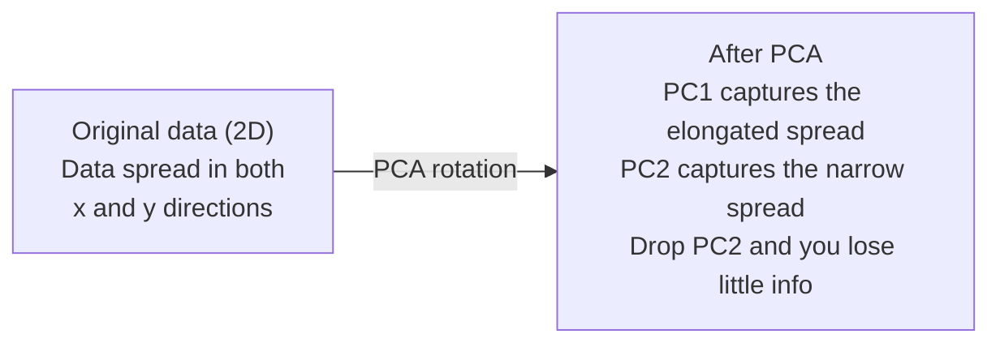

# Giảm kích thước

> Dữ liệu chiều cao có cấu trúc. Bạn tìm thấy nó bằng cách nhìn từ góc độ đúng.

**Type:** Build
**Language:**Python
**Prerequisites:** Phase 1, Lessons 01 (Linear Algebra Intuition), 02 (Vectors, Matrices & Operations), 03 (Eigenvalues & Eigenvectors), 06 (Probability & Distributions)
**Time:** ~90 minutes

## Mục tiêu học tập

- Thực hiện PCA từ đầu: dữ liệu trung tâm, tính toán matrix covariance, eigendecompose và dự án
- Sử dụng tỷ lệ biến động giải thích và phương pháp khuỷu tay để chọn số lượng các thành phần chính
- So sánh PCA, t-SNE và UMAP để hình dung các con số MNIST trong 2D và giải thích sự thỏa hiệp của chúng
- Sử dụng PCA hạt nhân với một hạt nhân RBF để tách các cấu trúc dữ liệu không tuyến tính mà PCA tiêu chuẩn không thể xử lý

## Vấn đề

Bạn có một bộ dữ liệu với 784 tính năng mỗi mẫu. Có thể đó là giá trị pixel của chữ số viết tay. Có thể đó là mức độ biểu hiện gen. Có thể đó là tín hiệu hành vi của người dùng. Bạn không thể hình dung được 784 chiều. Bạn không thể vẽ chúng. Bạn thậm chí không thể nghĩ về chúng.

Nhưng hầu hết các tính năng 784 này là quá mức. Thông tin thực tế sống trên bề mặt nhỏ hơn nhiều. Một chữ "7" được viết bằng tay không cần 784 số độc lập để mô tả nó. Nó cần một vài: góc của đường viêm, chiều dài của thanh chéo, bao nhiêu nó nghiêng.

Giảm kích thước tìm thấy bề mặt nhỏ hơn. Nó lấy dữ liệu 784 chiều của bạn và nén nó thành 2, 10, hoặc 50 chiều trong khi giữ lại cấu trúc quan trọng.

## Khái niệm

### Lời nguyền của chiều kích

Không gian chiều cao không trực giác, ba thứ bị phá vỡ khi chiều cao tăng lên.

**Distance becomes meaningless.**Trong các chiều cao, khoảng cách giữa hai điểm ngẫu nhiên nào cũng hội tụ đến cùng một giá trị. Nếu mỗi điểm là khoảng cách tương đương với mọi điểm khác, tìm kiếm hàng xóm gần nhất sẽ ngừng hoạt động.

```
Dimension    Avg distance ratio (max/min between random points)
2            ~5.0
10           ~1.8
100          ~1.2
1000         ~1.02
```

**Volume concentrates in corners.**Một khối siêu khối đơn vị ở kích thước d có góc 2^d. Trong 100 kích thước, gần như toàn bộ khối lượng là ở góc, xa từ trung tâm.

**You need exponentially more data.**Để duy trì mật độ mẫu trong không gian, từ 2D đến 20D có nghĩa là bạn cần 10^18 lần nhiều dữ liệu. Bạn không bao giờ có đủ. Giảm kích thước mang lại mật độ dữ liệu trở lại một cái gì đó có thể làm việc.

### PCA: tìm các hướng dẫn quan trọng

Phân tích thành phần chính (PCA) tìm ra các trục dọc theo mà dữ liệu của bạn thay đổi nhiều nhất. Nó xoay hệ thống phối hợp của bạn để trục đầu tiên nắm bắt sự thay đổi nhiều nhất, trục thứ hai nắm bắt nhiều nhất tiếp theo, và như vậy.

Khóa toán:

```
1. Center the data        (subtract the mean from each feature)
2. Compute covariance     (how features move together)
3. Eigendecomposition     (find the principal directions)
4. Sort by eigenvalue     (biggest variance first)
5. Project               (keep top k eigenvectors, drop the rest)
```

Tại sao có cấu trúc riêng? Các matrix tính toán là đối xứng và tích cực bán xác định. Các phương tiện riêng của nó là các hướng thẳng thắn trong không gian tính năng. Các giá trị riêng cho bạn biết mỗi hướng nắm bắt sự khác biệt bao nhiêu.



- **Before PCA:**Mây dữ liệu được trải rộng theo đường hình trên cả hai trục x và y
- **After PCA:**Hệ thống phối hợp được xoay để PC1 phù hợp với hướng biến động tối đa (sự trôi kéo dài) và PC2 phù hợp với hướng biến động tối thiểu (sự trôi hẹp).
- **Dimensionality reduction:**Thả PC2 chiếu dữ liệu vào PC1, mất rất ít thông tin

### Tỷ lệ biến động giải thích

Mỗi thành phần chính nắm bắt một phần nhỏ của tổng sự biến động.

```
Component    Eigenvalue    Explained ratio    Cumulative
PC1          4.73          0.473              0.473
PC2          2.51          0.251              0.724
PC3          1.12          0.112              0.836
PC4          0.89          0.089              0.925
...
```

Khi sự biến động được giải thích tích lũy đạt 0,95, bạn biết rằng nhiều thành phần nắm bắt 95% thông tin.

### Chọn số lượng thành phần

Ba chiến lược:

1. **Threshold.**Giữ đủ thành phần để giải thích 90-95% sự khác biệt.
2. **Elbow method.**- Đọc về sự khác biệt của mỗi thành phần.
3. **Downstream performance.**Sử dụng PCA như là xử lý trước. quét k và đo độ chính xác của mô hình của bạn.

### T-SNE: bảo vệ các khu phố

t-Distributed Stochastic Neighbor Embedding (t-SNE) được thiết kế để hình dung. Nó lập bản đồ dữ liệu chiều cao đến 2D (hoặc 3D) trong khi bảo tồn các điểm gần nhau.

Trong không gian ban đầu, tính toán phân phối xác suất trên các cặp điểm dựa trên khoảng cách của chúng. Điểm gần có xác suất cao. Điểm xa có xác suất thấp. Sau đó tìm một sự sắp xếp 2D nơi phân phối xác suất tương tự. Điểm là hàng xóm trong 784 chiều vẫn là hàng xóm trong 2D.

Các tính chất chính của t-SNE:
- Không tuyến tính, nó có thể phát triển các đa dạng phức tạp mà PCA không thể.
- Stochastic, các chạy khác nhau tạo ra các bố cục khác nhau.
- Các tham số phức tạp kiểm soát số lượng hàng xóm cần xem xét (các phạm vi điển hình: 5-50).
- Khoảng cách giữa các cụm trong đầu ra không có ý nghĩa. Chỉ có các cụm chính là có ý nghĩa.
- chậm trên tập dữ liệu lớn. O ((n^2) theo mặc định.

### UMAP: cấu trúc toàn cầu nhanh hơn, tốt hơn

Phương pháp Phương trình và Dự án Tương tự Tương tự (UMAP) hoạt động tương tự như t-SNE nhưng có hai lợi thế:
- Nó sử dụng đồ thị gần nhất của hàng xóm thay vì tính toán tất cả các khoảng cách đôi.
- Cấu trúc toàn cầu tốt hơn. Các vị trí tương đối của các nhóm trong sản lượng có xu hướng có ý nghĩa hơn so với trong t-SNE.

UMAP xây dựng một biểu đồ có trọng lượng trong không gian chiều cao (the "sự đại diện topological mờ mờ") và sau đó tìm thấy một bố cục chiều thấp mà bảo tồn biểu đồ này tốt nhất có thể.

Các tham số chính:
- `n_neighbors`: bao nhiêu hàng xóm xác định cấu trúc địa phương (tương tự như sự phức tạp).
- `min_dist`Các giá trị thấp hơn tạo ra các cụm dày đặc hơn.

### Khi nào sử dụng

| Method | Use case | Preserves | Speed |
|--------|----------|-----------|-------|
| PCA | Preprocessing before training | Global variance | Fast (exact), works on millions of samples |
| PCA | Quick exploratory visualization | Linear structure | Fast |
| t-SNE | Publication-quality 2D plots | Local neighborhoods | Slow (< 10k samples ideal) |
| UMAP | 2D visualization at scale | Local + some global structure | Medium (handles millions) |
| PCA | Feature reduction for models | Variance-ranked features | Fast |
| t-SNE / UMAP | Understanding cluster structure | Cluster separation | Medium to slow |

Quy tắc: sử dụng PCA để xử lý trước và nén dữ liệu. Sử dụng t-SNE hoặc UMAP khi bạn cần hình dung cấu trúc trong 2D.

### PCA lõi

PCA tiêu chuẩn tìm thấy các vùng phụ tuyến tính. Nó xoay hệ thống phối hợp của bạn và giảm trục. Nhưng nếu dữ liệu nằm trên một đa dạng không tuyến tính thì sao? Một vòng tròn trong 2D không thể tách ra bởi bất kỳ đường nào. PCA tiêu chuẩn sẽ không giúp.

Kernel PCA áp dụng PCA trong một không gian tính năng chiều cao được kích hoạt bởi một chức năng kernel, mà không tính toán rõ ràng các tọa độ trong không gian đó. Đây là thủ thuật kernel - cùng một ý tưởng đằng sau SVM.

Khóa toán:
1. Xét toán các khối lượng hạt nhân K nơi K_ij = k(x_i, x_j)
2. Trung tâm các mã nguồn trong không gian tính năng
3. Eigendecompose các tập trung hạt nhân matrix
4. Các vector tự trị trên cùng (được quy mô bằng 1/sqrt(quý trị tự trị)) là các dự đoán

Các chức năng hạt nhân chung:

| Kernel | Formula | Good for |
|--------|---------|----------|
| RBF (Gaussian) | exp(-gamma * \|\|x - y\|\|^2) | Most nonlinear data, smooth manifolds |
| Polynomial | (x . y + c)^d | Polynomial relationships |
| Sigmoid | tanh(alpha * x . y + c) | Neural network-like mappings |

Khi nào sử dụng PCA hạt nhân so với PCA tiêu chuẩn:

| Criterion | Standard PCA | Kernel PCA |
|-----------|-------------|------------|
| Data structure | Linear subspace | Nonlinear manifold |
| Speed | O(min(n^2 d, d^2 n)) | O(n^2 d + n^3) |
| Interpretability | Components are linear combinations of features | Components lack direct feature interpretation |
| Scalability | Works on millions of samples | Kernel matrix is n x n, memory-limited |
| Reconstruction | Direct inverse transform | Requires pre-image approximation |

Ví dụ điển hình: vòng tròn tập trung 2D. Hai vòng tròn điểm, một bên trong nhau. PCA tiêu chuẩn chiếu cả hai trên cùng một đường - vô dụng cho phân loại. Kernel PCA với một hạt nhân RBF vẽ bản đồ vòng tròn bên trong và vòng tròn bên ngoài đến các khu vực khác nhau, làm cho chúng có thể tách ra tuyến tính.

### Hầm lầm tái thiết

Bạn đã nén 784 chiều thành 50.

Mức độ lỗi tái thiết:
1. Dữ liệu dự án đến k kích thước: X_reduced = X @ W_k
2. Tái tạo: X_hat = X_reduced @ W_k^T
3. MSE tính toán: trung bình (X - X_hat) ^2)

Đối với PCA, lỗi tái thiết có mối quan hệ sạch với sự biến động giải thích:

```
Reconstruction error = sum of eigenvalues NOT included
Total variance = sum of ALL eigenvalues
Fraction lost = (sum of dropped eigenvalues) / (sum of all eigenvalues)
```

Tỷ lệ biến số giải thích cho mỗi thành phần là:

```
explained_ratio_k = eigenvalue_k / sum(all eigenvalues)
```

Chụp biểu đồ sự biến động được giải thích tích lũy đối với số lượng các thành phần cho bạn đường cong "công tay".
- Lập phẳng ra (tái suất giảm)
- Sự biến động tích lũy vượt qua ngưỡng của bạn (thường là 0,90 hoặc 0,95)
- Các đồng bằng về hiệu suất nhiệm vụ

Hầm lẫn tái thiết có ích hơn là chọn k. Bạn có thể sử dụng nó để phát hiện bất thường: các mẫu có lỗi tái thiết cao là các điểm ngoại lệ không phù hợp với không gian phụ được học. Đây là cơ sở phát hiện bất thường dựa trên PCA trong các hệ thống sản xuất.

```figure
pca-axes
```

## Hãy xây dựng nó

### Bước 1: PCA từ đầu

```python
import numpy as np

class PCA:
    def __init__(self, n_components):
        self.n_components = n_components
        self.components = None
        self.mean = None
        self.eigenvalues = None
        self.explained_variance_ratio_ = None

    def fit(self, X):
        self.mean = np.mean(X, axis=0)
        X_centered = X - self.mean

        cov_matrix = np.cov(X_centered, rowvar=False)

        eigenvalues, eigenvectors = np.linalg.eigh(cov_matrix)

        sorted_idx = np.argsort(eigenvalues)[::-1]
        eigenvalues = eigenvalues[sorted_idx]
        eigenvectors = eigenvectors[:, sorted_idx]

        self.components = eigenvectors[:, :self.n_components].T
        self.eigenvalues = eigenvalues[:self.n_components]
        total_var = np.sum(eigenvalues)
        self.explained_variance_ratio_ = self.eigenvalues / total_var

        return self

    def transform(self, X):
        X_centered = X - self.mean
        return X_centered @ self.components.T

    def fit_transform(self, X):
        self.fit(X)
        return self.transform(X)
```

### Bước 2: Kiểm tra trên dữ liệu tổng hợp

```python
np.random.seed(42)
n_samples = 500

t = np.random.uniform(0, 2 * np.pi, n_samples)
x1 = 3 * np.cos(t) + np.random.normal(0, 0.2, n_samples)
x2 = 3 * np.sin(t) + np.random.normal(0, 0.2, n_samples)
x3 = 0.5 * x1 + 0.3 * x2 + np.random.normal(0, 0.1, n_samples)

X_synthetic = np.column_stack([x1, x2, x3])

pca = PCA(n_components=2)
X_reduced = pca.fit_transform(X_synthetic)

print(f"Original shape: {X_synthetic.shape}")
print(f"Reduced shape:  {X_reduced.shape}")
print(f"Explained variance ratios: {pca.explained_variance_ratio_}")
print(f"Total variance captured: {sum(pca.explained_variance_ratio_):.4f}")
```

### Bước 3: Các chữ số MNIST trong 2D

```python
from sklearn.datasets import fetch_openml

mnist = fetch_openml("mnist_784", version=1, as_frame=False, parser="auto")
X_mnist = mnist.data[:5000].astype(float)
y_mnist = mnist.target[:5000].astype(int)

pca_mnist = PCA(n_components=50)
X_pca50 = pca_mnist.fit_transform(X_mnist)
print(f"50 components capture {sum(pca_mnist.explained_variance_ratio_):.2%} of variance")

pca_2d = PCA(n_components=2)
X_pca2d = pca_2d.fit_transform(X_mnist)
print(f"2 components capture {sum(pca_2d.explained_variance_ratio_):.2%} of variance")
```

### Bước 4: So sánh với sklearn

```python
from sklearn.decomposition import PCA as SklearnPCA
from sklearn.manifold import TSNE

sklearn_pca = SklearnPCA(n_components=2)
X_sklearn_pca = sklearn_pca.fit_transform(X_mnist)

print(f"\nOur PCA explained variance:     {pca_2d.explained_variance_ratio_}")
print(f"Sklearn PCA explained variance: {sklearn_pca.explained_variance_ratio_}")

diff = np.abs(np.abs(X_pca2d) - np.abs(X_sklearn_pca))
print(f"Max absolute difference: {diff.max():.10f}")

tsne = TSNE(n_components=2, perplexity=30, random_state=42)
X_tsne = tsne.fit_transform(X_mnist)
print(f"\nt-SNE output shape: {X_tsne.shape}")
```

### Bước 5: So sánh UMAP

```python
try:
    from umap import UMAP

    reducer = UMAP(n_components=2, n_neighbors=15, min_dist=0.1, random_state=42)
    X_umap = reducer.fit_transform(X_mnist)
    print(f"UMAP output shape: {X_umap.shape}")
except ImportError:
    print("Install umap-learn: pip install umap-learn")
```

## Sử dụng nó

PCA như là chế biến trước khi phân loại:

```python
from sklearn.decomposition import PCA as SklearnPCA
from sklearn.linear_model import LogisticRegression
from sklearn.model_selection import train_test_split
from sklearn.metrics import accuracy_score

X_train, X_test, y_train, y_test = train_test_split(
    X_mnist, y_mnist, test_size=0.2, random_state=42
)

results = {}
for k in [10, 30, 50, 100, 200]:
    pca_k = SklearnPCA(n_components=k)
    X_tr = pca_k.fit_transform(X_train)
    X_te = pca_k.transform(X_test)

    clf = LogisticRegression(max_iter=1000, random_state=42)
    clf.fit(X_tr, y_train)
    acc = accuracy_score(y_test, clf.predict(X_te))
    var_captured = sum(pca_k.explained_variance_ratio_)
    results[k] = (acc, var_captured)
    print(f"k={k:>3d}  accuracy={acc:.4f}  variance={var_captured:.4f}")
```

Địa điểm cao cấp hoạt động của bạn là địa điểm cao cấp đó.

## Chuyển nó

Bài học này mang lại:
- `outputs/skill-dimensionality-reduction.md`- kỹ năng để chọn kỹ thuật giảm chiều kích phù hợp cho một nhiệm vụ nhất định

## Các bài tập

1. Thay đổi lớp PCA để hỗ trợ `inverse_transform`. Tái tạo lại các con số MNIST từ 10, 50, và 200 thành phần. In lỗi tái tạo (sự khác biệt bình phương trung bình từ nguyên bản) cho mỗi thành phần.

2. Thực hiện t-SNE trên cùng một bộ tiểu MNIST với giá trị phức tạp 5, 30 và 100. Mô tả cách thức đầu ra thay đổi. Tại sao sự phức tạp ảnh hưởng đến độ chặt của cluster?

3. Hãy lấy một bộ dữ liệu với 50 tính năng mà chỉ có 5 tính năng thông tin (tạo ra một với `sklearn.datasets.make_classification`). Sử dụng PCA và kiểm tra xem đường cong biến số được giải thích có xác định chính xác dữ liệu có hiệu quả là 5 chiều không.

## Các điều khoản chính

| Term | What people say | What it actually means |
|------|----------------|----------------------|
| Curse of dimensionality | "Too many features" | Distances, volumes, and data density all behave counterintuitively as dimensions grow. Models need exponentially more data to compensate. |
| PCA | "Reduce dimensions" | Rotate your coordinate system so the axes align with the directions of maximum variance, then drop the low-variance axes. |
| Principal component | "An important direction" | An eigenvector of the covariance matrix. The direction in feature space along which the data varies most. |
| Explained variance ratio | "How much info this component has" | The fraction of total variance captured by one principal component. Sum the top k ratios to see how much k components preserve. |
| Covariance matrix | "How features correlate" | A symmetric matrix where entry (i,j) measures how feature i and feature j move together. Diagonal entries are individual variances. |
| t-SNE | "That cluster plot" | A nonlinear method that maps high-dimensional data to 2D by preserving pairwise neighborhood probabilities. Good for visualization, not for preprocessing. |
| UMAP | "Faster t-SNE" | A nonlinear method based on topological data analysis. Preserves both local and some global structure. Scales better than t-SNE. |
| Perplexity | "A t-SNE knob" | Controls the effective number of neighbors each point considers. Low perplexity focuses on very local structure. High perplexity captures broader patterns. |
| Manifold | "The surface the data lives on" | A lower-dimensional surface embedded in a higher-dimensional space. A sheet of paper crumpled in 3D is a 2D manifold. |

## Đọc thêm

- [A Tutorial on Principal Component Analysis](https://arxiv.org/abs/1404.1100)(Shlens) - dẫn xuất rõ ràng của PCA từ cục bộ
- [How to Use t-SNE Effectively](https://distill.pub/2016/misread-tsne/)(Wattenberg et al.) - hướng dẫn tương tác về các rào cản và lựa chọn tham số t-SNE
- [UMAP documentation](https://umap-learn.readthedocs.io/)- lý thuyết và hướng dẫn thực tế từ các tác giả của UMAP
