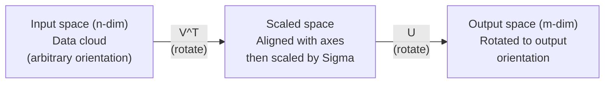
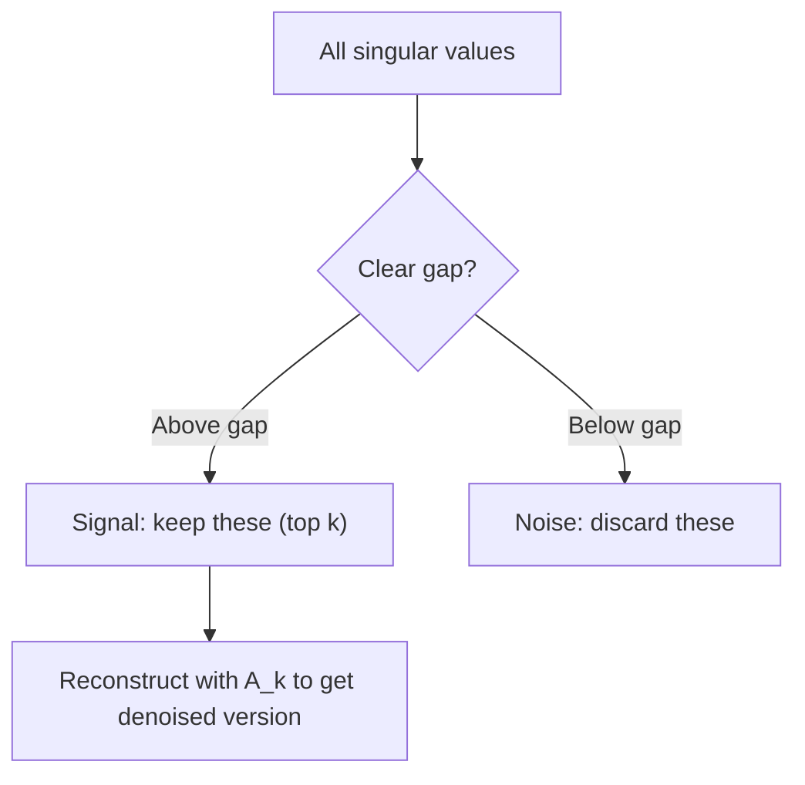

# Sự phân hủy giá trị độc đáo

> SVD là dao quân đội Thụy Sĩ của toán học tuyến tính. Mỗi matrix đều có một cái.

**Type:** Build
**Languages:** Python, Julia
**Prerequisites:** Phase 1, Lessons 01 (Linear Algebra Intuition), 02 (Vectors & Matrices Operations), 03 (Matrix Transformations)
**Time:** ~120 minutes

## Mục tiêu học tập

- Thực hiện SVD thông qua lặp lại năng lượng và giải thích ý nghĩa hình học của U, Sigma và V^T
- Sử dụng SVD cắt giảm để nén hình ảnh và đo tỷ lệ nén vs lỗi tái tạo
- Xét toán Moore-Penrose pseudoinverse thông qua SVD để giải quyết các hệ thống số lượng nhỏ nhất được xác định quá cao
- Kết nối SVD với PCA, hệ thống khuyến nghị (chất tố tiềm ẩn) và Phân tích ngữ nghĩa tiềm ẩn trong NLP

## Vấn đề

Bạn có một matrix 1000x2000. Có lẽ đó là xếp hạng phim người dùng. Có lẽ đó là một bảng tần số theo thời gian tài liệu. Có lẽ đó là các giá trị pixel của một hình ảnh. Bạn cần phải nén nó, từ chối nó, tìm thấy cấu trúc ẩn trong nó, hoặc giải quyết một hệ thống ít hình vuông với nó. Eigendecomposition chỉ hoạt động trên các matrix vuông. ngay cả khi đó, nó đòi hỏi matrix có một bộ đầy đủ của các eigenvector tự lập tuyến tính độc lập.

SVD hoạt động trên bất kỳ hình thức nào, bất kỳ thứ hạng nào, không có điều kiện nào, nó phân hủy các matrix thành ba yếu tố cho thấy hình học của những gì mà matrix làm cho không gian.

## Khái niệm

### SVD làm gì theo hình học

Mỗi matrix, bất kể hình dạng, thực hiện ba hoạt động theo trình tự: xoay, quy mô, xoay.

```
A = U * Sigma * V^T

      m x n     m x m    m x n    n x n
     (any)    (rotate)  (scale)  (rotate)
```

Với bất kỳ matrix A nào, SVD tính toán nó thành:
- V^T xoay các vector trong không gian đầu vào (n-dimensional)
- Scales Sigma dọc theo mỗi trục (trình kéo hoặc nén)
- U xoay kết quả vào không gian đầu ra (m-dimensional)



Hãy nghĩ về nó theo cách này. Bạn trao cho SVD một số liệu. Nó nói với bạn: "Thế liệu này lấy một quả bóng đầu vào, đầu tiên xoay nó bằng V^T, sau đó kéo dài nó thành một hình elipsoid bằng Sigma, sau đó xoay hình elipsoid bằng U". Các giá trị đơn lẻ là chiều dài của trục elipsoid.

### Sự phân hủy đầy đủ

Đối với một trục A có hình m x n:

```
A = U * Sigma * V^T

where:
  U     is m x m, orthogonal (U^T U = I)
  Sigma is m x n, diagonal (singular values on the diagonal)
  V     is n x n, orthogonal (V^T V = I)

The singular values sigma_1 >= sigma_2 >= ... >= sigma_r > 0
where r = rank(A)
```

Các cột của U được gọi là vector đơn phương bên trái. Cột của V được gọi là vector đơn phương bên phải. Các mục chéo của Sigma được gọi là giá trị đơn vị. Chúng luôn không âm và theo quy định quy định được sắp xếp theo thứ tự giảm.

### Các vector đơn bên trái, giá trị đơn bên phải, vector đơn bên phải

Mỗi thành phần của SVD có ý nghĩa hình học riêng biệt.

**Right singular vectors (columns of V):**Chúng tạo thành một cơ sở hoặcthông thường cho không gian đầu vào (R^n). Chúng là các hướng trong không gian đầu vào mà các mãtres lập bản đồ đến các hướng trực giác trong không gian đầu ra. Hãy nghĩ về chúng như hệ thống phối hợp tự nhiên cho lĩnh vực.

**Singular values (diagonal of Sigma):**Đây là các yếu tố quy mô. giá trị đơn vị thứ i cho bạn biết số lượng mà trục kéo dài các vector dọc theo vector đơn vị thứ i bên phải. giá trị đơn vị của 0 có nghĩa là trục phá hoàn toàn hướng đó.

**Left singular vectors (columns of U):**Những hình thức này tạo thành một cơ sở hợp lý cho không gian đầu ra (R^m).

Mối quan hệ giữa họ:

```
A * v_i = sigma_i * u_i

The matrix A takes the i-th right singular vector v_i,
scales it by sigma_i, and maps it to the i-th left singular vector u_i.
```

Điều này cho bạn một hình ảnh phối hợp theo phối hợp của bất kỳ matrix nào làm gì.

### Phương thức sản phẩm bên ngoài

SVD có thể được viết như là tổng số các matrices cấp-1:

```
A = sigma_1 * u_1 * v_1^T + sigma_2 * u_2 * v_2^T + ... + sigma_r * u_r * v_r^T

Each term sigma_i * u_i * v_i^T is a rank-1 matrix (an outer product).
The full matrix is the sum of r such matrices, where r is the rank.
```

Các thuật ngữ này là nền tảng của sự gần gũi cấp thấp. Mỗi thuật ngữ thêm một lớp cấu trúc. thuật ngữ đầu tiên nắm bắt mô hình quan trọng nhất duy nhất. thuật ngữ thứ hai nắm bắt mô hình quan trọng nhất tiếp theo.

```
Rank-1 approx:    A_1 = sigma_1 * u_1 * v_1^T
                  (captures the dominant pattern)

Rank-2 approx:    A_2 = sigma_1 * u_1 * v_1^T + sigma_2 * u_2 * v_2^T
                  (captures the two most important patterns)

Rank-k approx:    A_k = sum of top k terms
                  (optimal by the Eckart-Young theorem)
```

### Mối quan hệ với sự kết hợp của riêng mình

SVD và cấu trúc riêng có liên quan sâu sắc. Các giá trị đơn lẻ và các vector của A đến trực tiếp từ các giá trị riêng và các vector riêng của A^T A và A^T.

```
A^T A = V * Sigma^T * U^T * U * Sigma * V^T
      = V * Sigma^T * Sigma * V^T
      = V * D * V^T

where D = Sigma^T * Sigma is a diagonal matrix with sigma_i^2 on the diagonal.

So:
- The right singular vectors (V) are eigenvectors of A^T A
- The singular values squared (sigma_i^2) are eigenvalues of A^T A

Similarly:
A A^T = U * Sigma * V^T * V * Sigma^T * U^T
      = U * Sigma * Sigma^T * U^T

So:
- The left singular vectors (U) are eigenvectors of A A^T
- The eigenvalues of A A^T are also sigma_i^2
```

Sự kết nối này cho bạn biết ba điều:
1. Các giá trị đơn vị luôn là thực và không âm (bạn là gốc vuông của các giá trị riêng của một matrix bán xác định tích cực).
2. Bạn có thể tính toán SVD bằng cách tự tạo A^T A, nhưng điều này làm bình phương số điều kiện và mất độ chính xác số.
3. Khi A là hình vuông và đối xứng tích cực bán xác định, SVD và eigendecomposition là cùng một thứ.

### SVD cắt giảm: gần gũi cấp thấp

Định lý Eckart-Young-Mirsky nói rằng sự gần gũi hàng bậc-k tốt nhất với A (từ cả Frobenius và tiêu chuẩn quang phổ) được đạt được bằng cách chỉ giữ các giá trị đơn vị k trên cùng và các vector tương ứng của chúng:

```
A_k = U_k * Sigma_k * V_k^T

where:
  U_k     is m x k  (first k columns of U)
  Sigma_k is k x k  (top-left k x k block of Sigma)
  V_k     is n x k  (first k columns of V)

Approximation error = sigma_{k+1}  (in spectral norm)
                    = sqrt(sigma_{k+1}^2 + ... + sigma_r^2)  (in Frobenius norm)
```

Đây không chỉ là một "một sự gần gũi" tốt. Nó có thể được chứng minh là sự gần gũi tốt nhất có thể của bậc k. Không có matrix bậc k nào khác gần hơn với A.

| Component | Relative magnitude | Kept in rank-3 approx? |
|-----------|-------------------|------------------------|
| sigma_1 | Largest | Yes |
| sigma_2 | Large | Yes |
| sigma_3 | Medium-large | Yes |
| sigma_4 | Medium | No (error) |
| sigma_5 | Medium-small | No (error) |
| sigma_6 | Small | No (error) |
| sigma_7 | Very small | No (error) |
| sigma_8 | Tiny | No (error) |

Keep top 3: A_3 nắm bắt ba giá trị đơn nhất lớn nhất. lỗi = giá trị còn lại (sigma_4 qua sigma_8).

Nếu các giá trị đơn lẻ phân hủy nhanh chóng, một k nhỏ chiếm hầu hết các matrix. Nếu chúng phân hủy chậm, matrix không có cấu trúc hạng thấp.

### Nhiết ảnh với SVD

Một hình ảnh thang xám là một matrix của cường độ pixel. Một hình ảnh 800x600 có 480.000 giá trị. SVD cho phép bạn gần gũi với nó với ít hơn nhiều.

```
Original image: 800 x 600 = 480,000 values

SVD with rank k:
  U_k:      800 x k values
  Sigma_k:  k values
  V_k:      600 x k values
  Total:    k * (800 + 600 + 1) = k * 1401 values

  k=10:   14,010 values   (2.9% of original)
  k=50:   70,050 values  (14.6% of original)
  k=100: 140,100 values  (29.2% of original)

  The compression ratio improves as k gets smaller,
  but visual quality degrades.
```

Những hình ảnh tự nhiên có giá trị đơn lẻ suy yếu nhanh chóng. Những giá trị đơn lẻ đầu tiên nắm bắt cấu trúc rộng (hình dạng, độ nghiêng). Những hình ảnh sau đó nắm bắt chi tiết tinh tế và tiếng ồn.

### SVD cho các hệ thống khuyến nghị

Giải thưởng Netflix đã làm cho nó nổi tiếng. Bạn có một số lượng người dùng mà hầu hết các mục bị thiếu.

```
             Movie1  Movie2  Movie3  Movie4  Movie5
  User1      [  5      ?       3       ?       1  ]
  User2      [  ?      4       ?       2       ?  ]
  User3      [  3      ?       5       ?       ?  ]
  User4      [  ?      ?       ?       4       3  ]

  ? = unknown rating
```

Ý tưởng: các bảng xếp hạng này có thứ hạng thấp. Người dùng không có sở thích độc lập hoàn toàn. Có một số yếu tố ẩn (các hành động so với kịch bản, cũ so với mới, não so với nội tạng) giải thích hầu hết các sở thích.

SVD trên các mã số (đã được lấp vào) phân hủy nó thành:
- U: hồ sơ người dùng trong không gian nhân tố ẩn
- Sigma: tầm quan trọng của mỗi yếu tố ẩn
- V^T: hồ sơ phim trong không gian nhân tố ẩn

Điểm đánh giá dự đoán của người dùng cho một bộ phim là sản phẩm điểm của hồ sơ người dùng của họ với hồ sơ của bộ phim (được cân bằng bằng các giá trị đơn lẻ).

Trong thực tế, bạn sử dụng các biến thể như SVD tăng trưởng của Simon Funk hoặc ALS (đổi thay các vuông tối thiểu) mà xử lý dữ liệu thiếu trực tiếp. Nhưng ý tưởng cốt lõi là giống nhau: phân hủy nhân tố ẩn thông qua SVD.

### SVD trong NLP: Phân tích ngữ nghĩa tiềm ẩn

Phân tích ngữ nghĩa trần gian (LSA), còn được gọi là Chỉ số ngữ nghĩa trần gian (LSI), áp dụng SVD cho một matrix tài liệu thuật ngữ.

```
             Doc1   Doc2   Doc3   Doc4
  "cat"      [  3      0      1      0  ]
  "dog"      [  2      0      0      1  ]
  "fish"     [  0      4      1      0  ]
  "pet"      [  1      1      1      1  ]
  "ocean"    [  0      3      0      0  ]

After SVD with rank k=2:

  Each document becomes a point in 2D "concept space."
  Each term becomes a point in the same 2D space.
  Documents about similar topics cluster together.
  Terms with similar meanings cluster together.

  "cat" and "dog" end up near each other (land pets).
  "fish" and "ocean" end up near each other (water concepts).
  Doc1 and Doc3 cluster if they share similar topics.
```

LSA là một trong những phương pháp thành công đầu tiên để nắm bắt sự tương đồng ngữ nghĩa từ văn bản thô. Nó hoạt động bởi vì các thuật ngữ đồng nghĩa có xu hướng xuất hiện trong các tài liệu tương tự, vì vậy SVD nhóm chúng thành cùng một chiều sâu ẩn.

### SVD để giảm tiếng ồn

Dữ liệu tiếng ồn có tín hiệu tập trung vào các giá trị đơn nhất và tiếng ồn lan rộng trên tất cả các giá trị đơn.

**Clean signal singular values:**

| Component | Magnitude | Type |
|-----------|-----------|------|
| sigma_1 | Very large | Signal |
| sigma_2 | Large | Signal |
| sigma_3 | Medium | Signal |
| sigma_4 | Near zero | Negligible |
| sigma_5 | Near zero | Negligible |

**Noisy signal singular values (noise adds to all):**

| Component | Magnitude | Type |
|-----------|-----------|------|
| sigma_1 | Very large | Signal |
| sigma_2 | Large | Signal |
| sigma_3 | Medium | Signal |
| sigma_4 | Small | Noise |
| sigma_5 | Small | Noise |
| sigma_6 | Small | Noise |
| sigma_7 | Small | Noise |



Điều này được sử dụng trong xử lý tín hiệu, đo lường khoa học và làm sạch dữ liệu. Bất cứ khi nào bạn có một matrix bị hư hại bởi tiếng ồn phụ gia, SVD bị cắt ngắn là một cách nguyên tắc để tách tín hiệu khỏi tiếng ồn.

### Phép đảo ngược qua SVD

Moore-Penrose pseudoinverse A + tổng hợp đảo ngược matrix thành các matrix không bình phương và đơn vị. SVD làm cho việc tính toán nó tầm thường.

```
If A = U * Sigma * V^T, then:

A+ = V * Sigma+ * U^T

where Sigma+ is formed by:
  1. Transpose Sigma (swap rows and columns)
  2. Replace each non-zero diagonal entry sigma_i with 1/sigma_i
  3. Leave zeros as zeros

For A (m x n):      A+ is (n x m)
For Sigma (m x n):  Sigma+ is (n x m)
```

Phépduinverse giải quyết các vấn đề khối lượng nhỏ nhất. Nếu Ax = b không có giải pháp chính xác (hệ thống xác định quá cao), thì x = A + b là giải pháp khối lượng nhỏ nhất (giảm thiểu các số lượng của các khối lượng nhỏ nhất).

```
Overdetermined system (more equations than unknowns):

  [1  1]         [3]
  [2  1] x   =   [5]       No exact solution exists.
  [3  1]         [6]

  x_ls = A+ b = V * Sigma+ * U^T * b

  This gives the x that minimizes the sum of squared residuals.
  Same result as the normal equations (A^T A)^(-1) A^T b,
  but numerically more stable.
```

### Lợi ích ổn định số

Xét tính tính cách riêng của A^T A bình phương các giá trị đơn lẻ (quý vị của A^T A là sigma_i^2).

```
Example:
  A has singular values [1000, 1, 0.001]
  Condition number of A: 1000 / 0.001 = 10^6

  A^T A has eigenvalues [10^6, 1, 10^{-6}]
  Condition number of A^T A: 10^6 / 10^{-6} = 10^{12}

  Computing SVD directly: works with condition number 10^6
  Computing via A^T A:     works with condition number 10^{12}
                           (6 extra digits of precision lost)
```

Các thuật toán SVD hiện đại (Golub-Kahan bidiagonalization) hoạt động trực tiếp trên A, không bao giờ tạo ra A^T A. Đây là lý do tại sao bạn nên luôn thích `np.linalg.svd(A)`- Đúng rồi.`np.linalg.eig(A.T @ A)`- Tôi không biết.

### Kết nối với PCA

PCA là SVD trên dữ liệu tập trung. Đây không phải là một phép tính.

```
Given data matrix X (n_samples x n_features), centered (mean subtracted):

Covariance matrix: C = (1/(n-1)) * X^T X

PCA finds eigenvectors of C. But:

  X = U * Sigma * V^T    (SVD of X)

  X^T X = V * Sigma^2 * V^T

  C = (1/(n-1)) * V * Sigma^2 * V^T

So the principal components are exactly the right singular vectors V.
The explained variance for each component is sigma_i^2 / (n-1).

In sklearn, PCA is implemented using SVD, not eigendecomposition.
It is faster and more numerically stable.
```

Điều này có nghĩa là tất cả những gì bạn đã học về việc giảm chiều kích trong Bài học 10 là SVD dưới nắp. PCA là ứng dụng phổ biến nhất của SVD trong học máy.

```figure
svd-rank-reconstruction
```

## Hãy xây dựng nó

### Bước 1: SVD từ đầu sử dụng lặp lại năng lượng

Ý tưởng: để tìm ra giá trị đơn nhất và các vector của nó, sử dụng lặp lại năng lượng trên A^T A (hoặc A A^T). Sau đó làm giảm giá trị của matrix và lặp lại giá trị đơn tiếp theo.

```python
import numpy as np

def power_iteration(M, num_iters=100):
    n = M.shape[1]
    v = np.random.randn(n)
    v = v / np.linalg.norm(v)

    for _ in range(num_iters):
        Mv = M @ v
        v = Mv / np.linalg.norm(Mv)

    eigenvalue = v @ M @ v
    return eigenvalue, v

def svd_from_scratch(A, k=None):
    m, n = A.shape
    if k is None:
        k = min(m, n)

    sigmas = []
    us = []
    vs = []

    A_residual = A.copy().astype(float)

    for _ in range(k):
        AtA = A_residual.T @ A_residual
        eigenvalue, v = power_iteration(AtA, num_iters=200)

        if eigenvalue < 1e-10:
            break

        sigma = np.sqrt(eigenvalue)
        u = A_residual @ v / sigma

        sigmas.append(sigma)
        us.append(u)
        vs.append(v)

        A_residual = A_residual - sigma * np.outer(u, v)

    U = np.column_stack(us) if us else np.empty((m, 0))
    S = np.array(sigmas)
    V = np.column_stack(vs) if vs else np.empty((n, 0))

    return U, S, V
```

### Bước 2: Kiểm tra và so sánh với NumPy

```python
np.random.seed(42)
A = np.random.randn(5, 4)

U_ours, S_ours, V_ours = svd_from_scratch(A)
U_np, S_np, Vt_np = np.linalg.svd(A, full_matrices=False)

print("Our singular values:", np.round(S_ours, 4))
print("NumPy singular values:", np.round(S_np, 4))

A_reconstructed = U_ours @ np.diag(S_ours) @ V_ours.T
print(f"Reconstruction error: {np.linalg.norm(A - A_reconstructed):.8f}")
```

### Bước 3: Demo nén hình ảnh

```python
def compress_image_svd(image_matrix, k):
    U, S, Vt = np.linalg.svd(image_matrix, full_matrices=False)
    compressed = U[:, :k] @ np.diag(S[:k]) @ Vt[:k, :]
    return compressed

image = np.random.seed(42)
rows, cols = 200, 300
image = np.random.randn(rows, cols)

for k in [1, 5, 10, 20, 50]:
    compressed = compress_image_svd(image, k)
    error = np.linalg.norm(image - compressed) / np.linalg.norm(image)
    original_size = rows * cols
    compressed_size = k * (rows + cols + 1)
    ratio = compressed_size / original_size
    print(f"k={k:>3d}  error={error:.4f}  storage={ratio:.1%}")
```

### Bước 4: Giảm tiếng ồn

```python
np.random.seed(42)
clean = np.outer(np.sin(np.linspace(0, 4*np.pi, 100)),
                 np.cos(np.linspace(0, 2*np.pi, 80)))
noise = 0.3 * np.random.randn(100, 80)
noisy = clean + noise

U, S, Vt = np.linalg.svd(noisy, full_matrices=False)
denoised = U[:, :5] @ np.diag(S[:5]) @ Vt[:5, :]

print(f"Noisy error:    {np.linalg.norm(noisy - clean):.4f}")
print(f"Denoised error: {np.linalg.norm(denoised - clean):.4f}")
print(f"Improvement:    {(1 - np.linalg.norm(denoised - clean) / np.linalg.norm(noisy - clean)):.1%}")
```

### Bước 5: Phép đảo ngược

```python
A = np.array([[1, 1], [2, 1], [3, 1]], dtype=float)
b = np.array([3, 5, 6], dtype=float)

U, S, Vt = np.linalg.svd(A, full_matrices=False)
S_inv = np.diag(1.0 / S)
A_pinv = Vt.T @ S_inv @ U.T

x_svd = A_pinv @ b
x_lstsq = np.linalg.lstsq(A, b, rcond=None)[0]
x_pinv = np.linalg.pinv(A) @ b

print(f"SVD pseudoinverse solution:  {x_svd}")
print(f"np.linalg.lstsq solution:   {x_lstsq}")
print(f"np.linalg.pinv solution:    {x_pinv}")
```

## Sử dụng nó

Những màn trình diễn đầy đủ đang diễn ra.`code/svd.py`. chạy nó để xem SVD được áp dụng cho nén hình ảnh, hệ thống khuyến nghị, phân tích ngữ nghĩa ẩn và giảm tiếng ồn.

```bash
python svd.py
```

Phiên bản Julia trong `code/svd.jl`cho thấy cùng một khái niệm sử dụng bản địa của Julia `svd()`chức năng và`LinearAlgebra`gói.

```bash
julia svd.jl
```

## Chuyển nó

Bài học này mang lại:
- `outputs/skill-svd.md`- kỹ năng biết khi nào và làm thế nào để áp dụng SVD trong các dự án thực

## Các bài tập

1. Thực hiện toàn bộ SVD từ đầu mà không sử dụng lặp lại năng lượng. Thay vào đó, tính toán cấu trúc riêng của A^T A để có được V và các giá trị đơn lẻ, sau đó tính toán U = A V Sigma^{-1}. So sánh độ chính xác số với phiên bản lặp lại năng lượng của bạn và với NumPy.

2. Lắp đặt một hình ảnh màu xám thực tế (hoặc chuyển đổi một hình ảnh thành màu xám). Nút nó ở các bậc 1, 5, 10, 25, 50, 100. Đối với mỗi bậc, tính toán tỷ lệ nén và lỗi tương đối. Tìm ra bậc mà hình ảnh trở nên chấp nhận được.

3. Xây dựng một hệ thống khuyến nghị nhỏ. Tạo ra một số mục được biết đến với một số mục 10x8 đánh giá người dùng phim. Sửa các mục thiếu bằng phương tiện hàng. Xét SVD và tái cấu trúc một sự gần gũi cấp 3. Sử dụng các số liệu tái cấu trúc để dự đoán các đánh giá thiếu. Kiểm tra xem các dự đoán là hợp lý.

4. Tạo một matrix tài liệu dài hạn 100x50 với 3 chủ đề tổng hợp. Mỗi chủ đề có 5 thuật ngữ liên quan. Thêm tiếng ồn. Sử dụng SVD và xác minh rằng 3 giá trị đơn vị hàng đầu lớn hơn nhiều so với phần còn lại. Dự án tài liệu vào không gian ẩn 3D và kiểm tra tài liệu từ cùng một cụm chủ đề cùng nhau.

5. Tạo một matrix xếp hạng thấp sạch ( xếp hạng 3, kích thước 50x40) và thêm tiếng ồn Gaussian ở các cấp độ khác nhau (sigma = 0.1, 0.5, 1.0, 2.0). Đối với mỗi mức tiếng ồn, tìm ra mức cắt giảm tối ưu bằng cách lau k từ 1 đến 40 và đo lỗi tái tạo so với matrix sạch.

## Các điều khoản chính

| Term | What people say | What it actually means |
|------|----------------|----------------------|
| SVD | "Factor any matrix" | Decompose A into U Sigma V^T where U and V are orthogonal and Sigma is diagonal with non-negative entries. Works for any matrix of any shape. |
| Singular value | "How important this component is" | The i-th diagonal entry of Sigma. Measures how much the matrix stretches along the i-th principal direction. Always non-negative, sorted in decreasing order. |
| Left singular vector | "Output direction" | A column of U. The direction in output space that the i-th right singular vector maps to (after scaling by sigma_i). |
| Right singular vector | "Input direction" | A column of V. The direction in input space that the matrix maps to the i-th left singular vector (after scaling by sigma_i). |
| Truncated SVD | "Low-rank approximation" | Keep only the top k singular values and their vectors. Produces the provably best rank-k approximation to the original matrix (Eckart-Young theorem). |
| Rank | "True dimensionality" | The number of non-zero singular values. Tells you how many independent directions the matrix actually uses. |
| Pseudoinverse | "Generalized inverse" | V Sigma+ U^T. Inverts non-zero singular values, leaves zeros as zeros. Solves least-squares problems for non-square or singular matrices. |
| Condition number | "How sensitive to errors" | sigma_max / sigma_min. A large condition number means small input changes cause large output changes. SVD reveals this directly. |
| Latent factor | "Hidden variable" | A dimension in the low-rank space discovered by SVD. In recommendations, a latent factor might correspond to genre preference. In NLP, it might correspond to a topic. |
| Frobenius norm | "Total matrix size" | Square root of the sum of squared entries. Equals the square root of the sum of squared singular values. Used to measure approximation error. |
| Eckart-Young theorem | "SVD gives the best compression" | For any target rank k, the truncated SVD minimizes the approximation error over all possible rank-k matrices. |
| Power iteration | "Find the biggest eigenvector" | Repeatedly multiply a random vector by the matrix and normalize. Converges to the eigenvector with the largest eigenvalue. The building block of many SVD algorithms. |

## Đọc thêm

- [Gilbert Strang: Linear Algebra and Its Applications, Chapter 7](https://math.mit.edu/~gs/linearalgebra/)- điều trị kỹ lưỡng SVD với các ứng dụng
- [3Blue1Brown: But what is the SVD?](https://www.youtube.com/watch?v=vSczTbgc8Rc)- Nhận thức hình học cho SVD
- [We Recommend a Singular Value Decomposition](https://www.ams.org/publicoutreach/feature-column/fcarc-svd)- tổng quan có thể truy cập được từ Hiệp hội toán học Mỹ
- [Netflix Prize and Matrix Factorization](https://sifter.org/~simon/journal/20061211.html)- Bài đăng trên blog ban đầu của Simon Funk về SVD để đưa ra khuyến nghị
- [Latent Semantic Analysis](https://en.wikipedia.org/wiki/Latent_semantic_analysis)- ứng dụng NLP ban đầu của SVD
- [Numerical Linear Algebra by Trefethen and Bau](https://people.maths.ox.ac.uk/trefethen/text.html)- tiêu chuẩn vàng để hiểu các thuật toán SVD và các tính chất số của chúng
